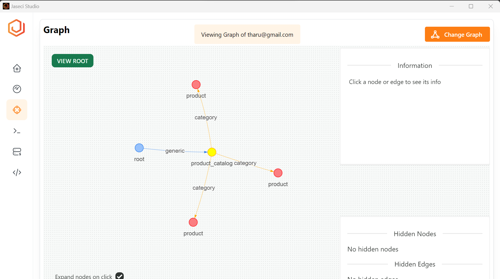

Welcome to Jaseci First App tutorial, where we will guide you through the creation of a simple inventory management system for a shop. Throughout this tutorial, we will utilize the Jac language, along with the Jaseci server and Jaseci studio. To begin, let's take the first step in our Jac program by constructing an initial version graph for the shop.

### Nodes

Nodes can be thought of as the representation of an entity.
Nodes are the fundamental unit of  a graph. These can be considered to be the steps in which the Walker can take.

* Nodes are composed of Context and executable actions.
* Nodes execute a set of actions upon entry and exit.


The shop graph will have nodes named `product`, `product_catalog`. Let's define them. The has keyword is used to declare a variable for the node. The `product` node has two variables named `name` and `stock`. The default value of `stock` is 0 where the `product_catalog` doesn't have any variables defined yet.

```jac
node product {
    has name;
    has stock = 0;
}

node product_catalog;
```
You can get more information about nodes [here](../../development/abstractions/graphs#nodes).

### Edges

Edges are the link between nodes. They walker will use these edges to determine the next node to traverse to.
The has key word is used to declare the variable "intent". This "intent" is what the Walker will use to to determine which node to go to next. More information about edges can be found [here](../../development/abstractions/graphs#edges)


The shop graph has one type of edges named `category`. We can define that as follows;

```
edge category {
    has name;
}
```

### Connecting nodes and edges to create a graph

The nodes of are connected to each other with edges to create a graph.

The `graph` is a collection of initialized nodes.
The `has anchor` key word is used to identify the root node. The Root node is the node where the walker's traversal begins.
The has anchor key word is used to state the root node. The Root node is the node where the walker's traversal begins.

`spawn` is used to create to create child nodes, which is used to design flow of the conversational experience.
We are able to create additional edges to connect nodes which which do not share a parent -child relationship.

```jac
graph shop {
    has anchor catalog;
    spawn {
        catalog = spawn node::product_catalog;

        apple = spawn node::product(name="apple");
        catalog +[category(name="fruit")]+> apple;

        banana = spawn node::product(name="banana");
        catalog +[category(name="fruit")]+> banana;

        notebook = spawn node::product(name="notebook");
        catalog +[category(name="supplies")]+> notebook;
    }
}

walker init {
    root: spawn here ++> graph::shop;
}
```

## Walker

Walkers traverse the nodes of the graph triggering execution at the node level. To get more information about walkers you can go [here](../../development/abstractions/walkers)

The `init` walker works as the main method of the Jac program. Let's create the `init` walker to `spawn` the graph.

```
walker init {
    root: spawn here ++> graph::shop;
}
```

## View Graph with Jaseci Studio

Jaseci Studio plays a crucial role in the Jaseci ecosystem, providing valuable functionalities such as graph visualization and execution. In this section, we will delve into the utilization of Jaseci Studio to view the graph of the shop and enhance the inventory management system. It is assumed that you have already completed the setup process for the Jaseci server and have installed the latest version of Jaseci Studio.

First let's build the jac program we created with following command.

```bash
jaseci > jac build shop.jac
Build of shop.jir complete!
```

If the build succeeds, a file called `shop.jir` will be created in your current working directory. Register the built jac program with Sentinel using the following command.

```bash
jaseci > sentinel register shop.jir -set_active true -mode ir
[
  {
    "version": null,
    "name": "shop.jir",
    "kind": "generic",
    "jid": "urn:uuid:936dec51-c6b1-45c7-ae5e-176301d5f124",
    "j_timestamp": "2023-05-17T13:05:55.622831",
    "j_type": "sentinel",
    "code_sig": "887752e8b6d2a763166cd94306110aaf"
  }
]
```

Sentinel is the overseer of walkers, nodes and edges. It is the abstraction Jaseci uses to encapsulate compiled walkers and archetype nodes and edges. The key operation with respect to sentinel is "register" a sentinel. You can think of registering a sentinel as a compiling your jac program. The walkers of a given sentinel can then be invoked and run on arbitrary nodes of any graph.

Three things are happening with above sentinel command:

1. We registered the `jir` we compiled earlier to new sentinel. This means this new sentinel now has access to all of our walkers, nodes and edges. `-mode ir` option specifies a `ji`r program is registered instead of a jac program.

2. With `-set_active true` we set this new sentinel to be the active sentinel. In other words, this sentinel is the default one to be used when requests hit the Jac APIs, if no specific sentinels are specified.

3. Sentinel register has automatically creates a new graph (if no currently active graph) and run the init walker on that graph. This behavior can be customized with the options `-auto_run` and `-auto_create_graph`.

After registering the sentinel you can see the `jid` in the output or run following command to get the sentinel ID.

```bash
jaseci > sentinel get
{
  "version": null,
  "name": "shop.jir",
  "kind": "generic",
  "jid": "urn:uuid:936dec51-c6b1-45c7-ae5e-176301d5f124",
  "j_timestamp": "2023-05-17T13:05:55.622831",
  "j_type": "sentinel",
  "code_sig": "887752e8b6d2a763166cd94306110aaf"
}
```

The `jid` field is the ID for the sentinel. (`jid` stands for jaseci ID). So, now you got the Jaseci ID, and sentinel got registered now you can update it's jac program with following command.

```bash
sentinel set -snt JID -mode ir shop.jir
```

If successful, the output will resemble the following;

```bash
jaseci > sentinel set -snt urn:uuid:f710c843-f284-4782-9bfe-c50710d4907f -mode ir shop.jir
{
  "response": "sentinel:generic:summarization.jir:urn:uuid:f710c843-f284-4782-9bfe-c50710d4907f registered and active!",
  "success": true
}
```
Now you have to log in the Jaseci Server from jsctl terminal with the credentials you have created while you creating super user with the following command in jsctl terminal.

```bash
login http://localhost:8000/
```

It will ask you for your username and password. You will see the following after a successful login.

```bash
jaseci > login http://localhost:8000/
Username: email@gmail.com
Password: password
Login successful!
```

> **Note**
>
> Notice the @ symbol in front of the @jaseci > command line prompt. This indicates that your jsctl session is now logged into a jsserv instance, while jaseci > indicates it is in a local session.
>

While logged into the jsserv instance, you can register a sentinel on it with sentinel register command, just like how you were running it before in the local jsctl session

```
sentinel register shop.jir -set_active true -mode ir
```

Now open the Jaseci Studio and logging with the credentials of the super user which you just created.

Go to the graph tab in the left side bar and select the `uuid` from the Select Graph drop down. You will see a graph like this.


Double click on the yellow color product catalog node to view all attached product nodes.



Now you have created a shop graph in Jaseci Studio, in next sections we will do basic operations like checking the inventory, purchasing and selling items from product catalogue.


You can access all the archetypes you created in the jac program through the Archetype tab in the left sidebar of Jaseci Studio as in below image.

