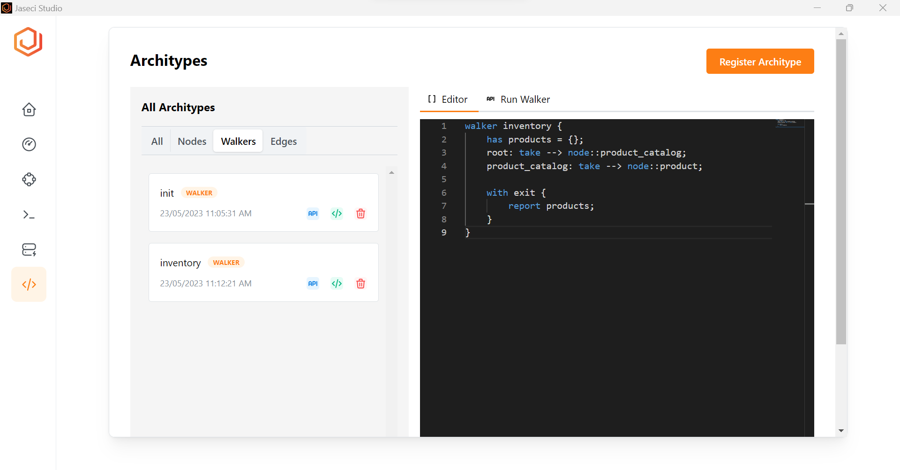
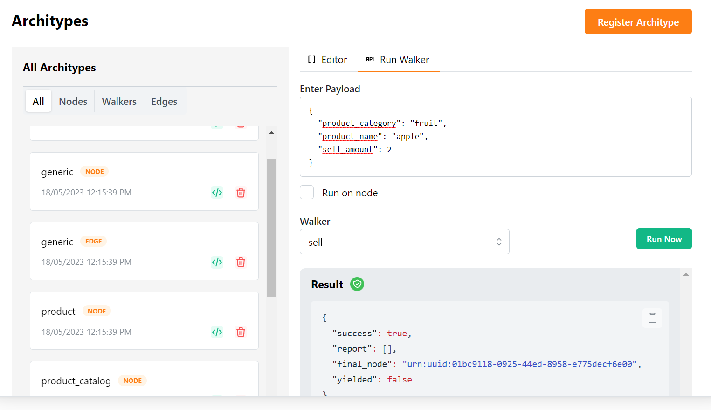

# Playing with Walkers and Abilities

## Checks the inventory

Walkers are "robots" that can traverse the graph and process data stored in the graph. Here is an example walker to get the current inventory of items in the shop.

In this step, we will introduce a new `walker` archetype named `inventory` and execute it to check the inventory. Simply copy and paste the following code into the code editor in the archetype tab, and then click on the "Register Archetype" button. Then you can observe that a new archetype has been created under walker tab as in the image.

```jac
walker inventory {
    has products = {};
    root: take --> node::product_catalog;
    product_catalog: take --> node::product;

    with exit {
        report products;
    }
}
```



- `has products = {}` This defines empty variable for products. This is a dictionary.
- `root: take --> node::product_catalog` This line says walker to traverse through `product_catalog` nodes.
- `product_catalog: take --> node::product` This line says walker to traverse through `product` nodes;
- `with exit {report products;}` This reports(returns) the return value from product nodes when exists from the product node.

In order to retrieve the inventory from the product node, we need to modify the existing product node archetype in our Jac program. To perform this, click on the "view code" icon of the product node archetype and replace the existing code with the following code snippet. Once done, click on the "register archetype" button again to save the changes.

```jac
node product {
    has name;
    has stock = 0;

    can check with inventory entry {
        visitor.products[here.name] = here.stock;
    }

}
```


Breaking down the walker code:
-  `check` is an ability of the product node. Which gives an ability to return current stock of the product node.
- `can check with inventory entry` This lines define `check` ability to executes only when inventory walker enters into product node.
- `visitor.products[here.name] = here.stock;` Here the `here.name` represents the name of the current node and `here.stock` represents the stock of the current node. To get more context of the `here` keyword go to [here].

To execute this newly created walker in the Jaseci Studio click on the "run walker" and select inventory walker from the drop down list. Then click on "Run Now". Then the inventory walker will run on the product node and will return the output in the result box as follows;.


- `report` represents the return value from the walker, but here you will see an empty dictionary as the output because we haven't add any stocks yet.

## Purchasing items

Now to add items into the stocks we have to purchase items. In this section we are going to add that part into our Jac program.

### Walker to Purchase items

To purchase items to stock we will define another walker named `purchase`; As in the previous step register the `purchase` walker archetype in Jaseci studio.

```jac
walker purchase {
    has product_category, product_name, purchase_amount;
    root: take --> node::product_catalog;
    product_catalog {
        take -[category(name==product_category)]-> node::product(name==product_name) else {
            new_product = spawn node::product(name=product_name);
            here +[category(name=product_category)]+> new_product;
            take new_product;
            std.log("New product: " + product_name);
        }
    }
}
```

- `has product_category, product_name, purchase_amount` this line is defining 3 variables in `purchase` walker. These variables are `product_category`, `product_name` and `purchase_amount`.
- `root: take --> node::product_catalog` This line makes the walker to traverse the walker from root node to `product_catalog`.
- Rest of the code snippet is to add number of purchasing items if a product already exists. If not it will spawn a new product node from `product_category`.

### Node ability to increase the inventory with purchase

As of in the above example we will have to modify the `product` node to execute with the `purchase` walker entry.

```jac
node product {
    has name;
    has stock = 0;

    can check with inventory entry {
        visitor.products[here.name] = here.stock;
    }

    can stock_up with purchase entry {
        here.stock += visitor.purchase_amount;
        std.log("Stock for " + here.name + " up to " + (here.stock).str);
    }
}
```

- `here.stock += visitor.purchase_amount;` This will increase the stock by `purchase` amount. In this line `here` represents the current node while `visitor` represents the walker which is visiting the node at the moment.
- `std.log("Stock for " + here.name + " up to " + (here.stock).str);` This is a log statement. Logging in Jaseci can be done with `std.log`.

Update the product node architype by replacing the current code for that node in studio and use `Register Architype`.

To execute the purchase walker, we need to perform a few additional steps. The purchase walker requires a list of parameters. In Jaseci Studio, we can provide these parameters as a json object. Follow these instructions:

1. Click on the "run walker" tab.
2. Copy the following json into the "Enter Payload" box.
3. Select the product node and the purchase walker.
4. Click the "Run Now" button to initiate the execution.

```json
{
    "product_category": "fruit",
    "product_name": "apple",
    "purchase_amount":2
}
```


You will see the output in the result box as in the above image.


```json
{
  "success": true,
  "report": [
    {
      "apple": 2,
      "banana": 0,
      "notebook": 0
    }
  ],
  "final_node": "urn:uuid:198fa33e-ece8-4642-9800-8c902acdb081",
  "yielded": false
}
```
Alternatively, you can go to the graph viewer, select the corresponding product node and use the `Run Walker` section on the right side to spawn the walker on that node.

Now run the `purchase` walker with different parameter values and observe the inventory.

## Sell products

Now lets see how to sell products using our `shop` application.  As in the above two examples here also we have to create a walker and a node ability to perform sell operations.

### Walker to sell a product to a customer

Let's understand the `sell` walker created to sell items.

```jac
walker sell {
    has product_category, product_name, sell_amount;
    root: take --> node::product_catalog;
    product_catalog {
        take -[category(name==product_category)]-> node::product(name==product_name) else {
            std.log("Sorry. We don't sell this product.");
        }
    }
}
```

- `has product_category, product_name, sell_amount;` This line defines 3 variable for `sell` walker named `product_category`, `product_name` and `sell_amount`.
- `root: take --> node::product_catalog;` This makes `sell` walker to traverse from root node to `product_catalog` node.
- Rest of the code snippet is to reduce the number of product items from `product_catalog` if the product is available and log a statement if product is not available.

### Node ability to reduce inventory with item sell

As in above all examples here we have to add a node ability to the `product` node. Here is the updated node with `stock_down` node ability.

We need to update the node architype one more time via `Register Architype`.
```jac
node product {
    has name;
    has stock = 0;

    can check with inventory entry {
        visitor.products[here.name] = here.stock;
    }

    can stock_up with purchase entry {
        here.stock += visitor.purchase_amount;
        std.log("Stock for " + here.name + " up to " + (here.stock).str);
    }

    can stock_down with sell entry {
        if(here.stock >= visitor.sell_amount) {
            here.stock -= visitor.sell_amount;
            std.log("Selling " + here.name + ": " + (visitor.sell_amount).str);
            std.log("Remaining stock: " + (here.stock).str);
        } else {
            std.log("Not enough stock for " + here.name);
        }
    }

}
```
`stock_down` node ability executes with `sell` walker entry.

- `if(here.stock >= visitor.sell_amount)` this if statement execute if the current product stock is grater that the `sell_amount` of the `sell` walker visiting the product node.

You can execute the `sell` walker and play with the Shop inventory management application which we just built.
Similar to above purchase example you can tryout the sell walker in Jaseci Studio, here is an example snapshot.

```json
{
  "product_category": "fruit",
  "product_name": "apple",
  "sell_amount": 2
}
```
