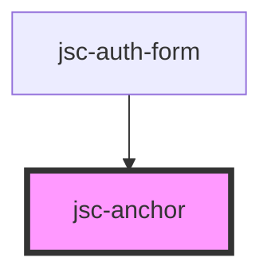

# my-component

<!-- Auto Generated Below -->

## Properties

| Property     | Attribute    | Description | Type                                                | Default              |
| ------------ | ------------ | ----------- | --------------------------------------------------- | -------------------- |
| `css`        | `css`        |             | `string`                                            | `JSON.stringify({})` |
| `events`     | `events`     |             | `string`                                            | `undefined`          |
| `hover`      | `hover`      |             | `"false" \| "true"`                                 | `'false'`            |
| `href`       | `href`       |             | `string`                                            | `undefined`          |
| `label`      | `label`      |             | `string`                                            | `undefined`          |
| `name`       | `name`       |             | `string`                                            | `undefined`          |
| `operations` | `operations` |             | `string`                                            | `undefined`          |
| `palette`    | `palette`    |             | `"accent" \| "neutral" \| "primary" \| "secondary"` | `undefined`          |
| `target`     | `target`     |             | `string`                                            | `undefined`          |

## Dependencies

### Used by

 - [jsc-auth-form](../jsc-auth-form)

### Graph

----------------------------------------------

*Built with [StencilJS](https://stenciljs.com/)*
