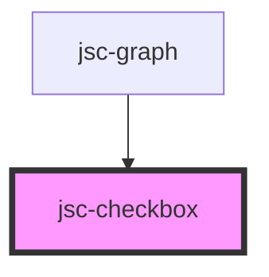

# my-component

<!-- Auto Generated Below -->

## Properties

| Property      | Attribute     | Description | Type                                   | Default              |
| ------------- | ------------- | ----------- | -------------------------------------- | -------------------- |
| `css`         | `css`         |             | `string`                               | `JSON.stringify({})` |
| `events`      | `events`      |             | `string`                               | `undefined`          |
| `fullwidth`   | `fullwidth`   |             | `string`                               | `undefined`          |
| `label`       | `label`       |             | `string`                               | `undefined`          |
| `name`        | `name`        |             | `string`                               | `undefined`          |
| `operations`  | `operations`  |             | `string`                               | `undefined`          |
| `palette`     | `palette`     |             | `"accent" \| "primary" \| "secondary"` | `undefined`          |
| `placeholder` | `placeholder` |             | `string`                               | `undefined`          |
| `size`        | `size`        |             | `"lg" \| "md" \| "sm" \| "xs"`         | `undefined`          |
| `type`        | `type`        |             | `string`                               | `'text'`             |
| `value`       | `value`       |             | `string`                               | `undefined`          |

## Events

| Event          | Description | Type                  |
| -------------- | ----------- | --------------------- |
| `valueChanged` |             | `CustomEvent<string>` |

## Dependencies

### Used by

 - [jsc-graph](../jsc-graph)

### Graph

----------------------------------------------

*Built with [StencilJS](https://stenciljs.com/)*
