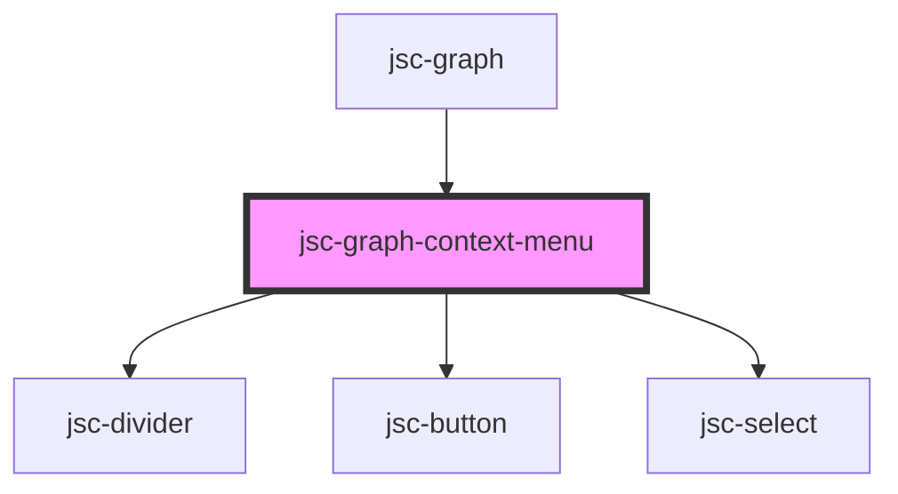

# my-component

<!-- Auto Generated Below -->

## Events

| Event                   | Description | Type                                                                               |
| ----------------------- | ----------- | ---------------------------------------------------------------------------------- |
| `disableZoom`           |             | `CustomEvent<any>`                                                                 |
| `enableZoom`            |             | `CustomEvent<any>`                                                                 |
| `expandNode`            |             | `CustomEvent<Node & { context: {}; info: {}; details: {}; group: string; }>`       |
| `expandNodeRecursively` |             | `CustomEvent<Node & { context: {}; info: {}; details: {}; group: string; }>`       |
| `hideEdgeGroup`         |             | `CustomEvent<Edge & { context: {}; info: {}; details: {}; group: string; }>`       |
| `hideNodeGroup`         |             | `CustomEvent<Node & { context: {}; info: {}; details: {}; group: string; }>`       |
| `nodeGroupConfigChange` |             | `CustomEvent<{ [groupName: string]: { color?: string; displayedVar: string; }; }>` |

## Methods

### `hide() => Promise<void>`

#### Returns

Type: `Promise<void>`

### `setClickedItem({ clickedNode, clickedEdge }: { clickedNode?: GraphNode; clickedEdge?: GraphEdge; }) => Promise<void>`

#### Returns

Type: `Promise<void>`

### `setNodeGroupConfig(groupName: string, key: keyof NodeGroupConfig[string], value: string) => Promise<void>`

#### Returns

Type: `Promise<void>`

### `setPos(x: number, y: number) => Promise<void>`

#### Returns

Type: `Promise<void>`

### `show() => Promise<void>`

#### Returns

Type: `Promise<void>`

## Dependencies

### Used by

 - [jsc-graph](.)

### Depends on

- [jsc-divider](../jsc-divider)
- [jsc-button](../jsc-button)
- [jsc-select](../jsc-select)

### Graph

----------------------------------------------

*Built with [StencilJS](https://stenciljs.com/)*
