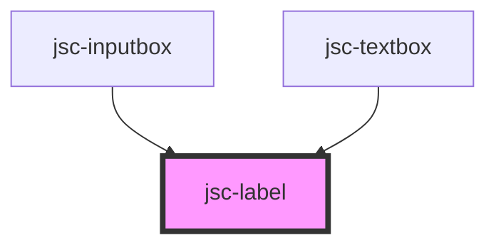

# my-component

<!-- Auto Generated Below -->

## Properties

| Property  | Attribute  | Description | Type     | Default     |
| --------- | ---------- | ----------- | -------- | ----------- |
| `htmlFor` | `html-for` |             | `string` | `undefined` |
| `label`   | `label`    |             | `string` | `undefined` |

## Dependencies

### Used by

 - [jsc-inputbox](../jsc-input)
 - [jsc-textbox](../jsc-textbox)

### Graph

----------------------------------------------

*Built with [StencilJS](https://stenciljs.com/)*
