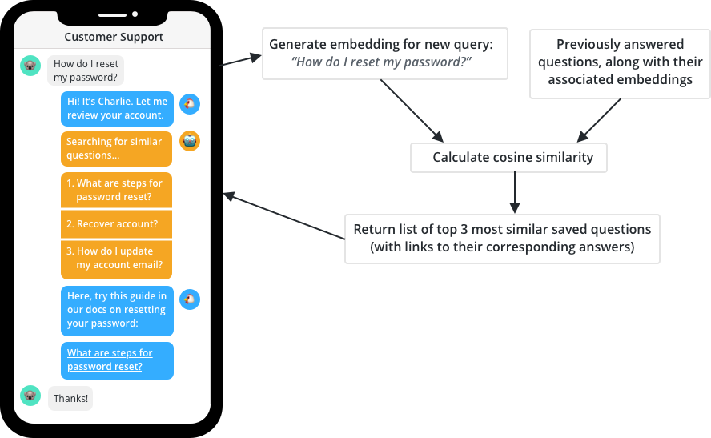

# Build a conversational AI system in Jaseci

# Chapter 1

## What are we building?
We are building a Conversational AI.

### What is a Conversational AI agent?
Conversational AI is a type of artificial intelligence that enables consumers to interact with computer applications the way they would with other humans.

### Real world examples of conversational AI
* Amazon Alexa (Voice) 

* Example of a text-based chatbot ( Website )

## What AI will be used
### We will use the following AI capabilities:

### Intent Classification
#### What is Intent Classification?
Intent classification (Text classification) is the process of assigning tags or categories to text according to its content. It's one of the fundamental tasks in Natural Language Processing (NLP) with broad applications such as sentiment analysis, topic labeling, spam detection, and intent detection.

#### A (simple) diagram illustrating the input and output of Intent Classification

Explanation Of The Current Nodes:
* **Input** Text: This is the text from the user. 
* **Classes**: A groups of intent labels that helps an AI Model to make conversations.
* **Output Class**: A single intent label that makes the meaning of a user 

When a user inputs a query either via speech or text it goes to the intent classification AI model alongside with the classes of intent. These together when gets processed by the AI model it will generate an output class of one single intent. I promise you in the real example you will understand this flow and you will walk out knowing what this intent classification state actually do.

#### A new version of the diagram with the real example

In this section, We will explain in real life how the flow works. Let's start with the current user. The user asked "Is it cold outside?" and keep in mind that a there will also be predefined classes that will also be fed to the Conversation AI and these classes of user intent are weather, fruits, music and greeting. What these classes are, its like, one word that would translate the meaning of an entire query a user may ask. So for example if the user asked "These bananas look very green", this statement belongs to the intent class **fruits**, and the word fruit translated the entire meaning of that statement the user asked. So the goal of the intent classification model is to look at classes of predefined words and based on the user input, try to figure out which class belongs to, or would suit the meaning of the user input. So, when the user input and the classes of intent get passed to the intent classification model it will figure out based on probability which intent belongs to that user query in this real example case that would be **weather**.

### Entity extraction
#### What is Entity extraction?
Entity extraction is a text analysis technique that uses Natural Language Processing (NLP) to automatically pull out specific data from unstructured text, and classifies it according to predefined categories. Entity extraction, also known as named entity extraction (NER), enables machines to automatically identify or extract entities, like product name, event, and location. It’s used by search engines to understand queries, chatbots to interact with humans, and teams to automate tedious tasks like data entry.

#### A (simple) diagram illustrating the input and output of Entity extraction

Explanation Of The Current Nodes:
* **Input Text**: This is the text from the user. 
* **Feature Dataset**: A lot of training data on where certain keywords would usually be located in a sentence.
* **Extract Features**: A process of picking out keywords and mapping a meaning to that keyword
* **Output Feature Set**: The result of defining the keyword and what class it belongs to.

Let's disect this diagram. Let's start from the input text (user input), that's being passed directly to the entity extraction model to extract the features. There is also a feature dataset that hosts all the training data where keywords are usually located in a sentence alongside with the class attached to the keyword. These two nodes combined will allow the AI model to use certain algorithms to extract all the necessary information from the user input and as a result it will output the feature set. This might be a bit confusing but I promise you after the example below you will come out with extensive knowledge of what this entity extraction model is all about.

#### A new version of the diagram with the real example

Great, let's explain this. Let's say we are talking to a bot that interviews people and the bot asks "tell me about your best friend next to you, what's his name, the company he worked at, and where does he reside" and you proceed to answer like "Jemmott from Guyana is a developer that works at V75 Inc". How can the bot use this information and find exactly where the name, company, location at and makes sense of it and how the hell would the bot know what are important in that statement you provided. That is where entity extraction comes into place. The bot beforehand would be taught where certain words would be located in a large dataset prior and what class it belongs to. So that's where the feature dataset comes in. This is a large training data of similar sentences that is trained to know what are the important keywords in a sentence and map a class to it. So when the user ask that question it will go the the extract feature node and based on the feature dataset extract relavant keywords from the user input. It would then output, Jemmott is a name, Guyana is a location, V75 is a company based on what it been taught. That's entity extraction. We as human go through the exact process in many conversation overtime when we request certain things from one another. Hopefully, you understand now what is entity extraction and how it works.

#### Real example

This is another example of the AI figuring out based on the training data where certain keywords are located and mapping it to a class.

### Sentence Encoding
#### What is Sentence Encoding?
The Sentence Encoder encodes text into high dimensional vectors that can be used for text classification, semantic similarity, clustering, and other natural language tasks. The sentence embeddings can then be trivially used to compute sentence-level meaning similarity as well as to enable better performance on downstream classification tasks using less supervised training data.

#### A (simple) diagram illustrating the input and output of Sentence Encoding

Explanation Of The Current Nodes:
* **input**: A string or body of text
* **sentence encoding**: An encoding of the body of text provided from the input.
* **cosine similarity**: From 0-1, based on the two body of text how similar it is in meaning.The number closer to 1 is very similar in meaning.

Let's explain the flow, So in this model it requires two input. Each input is passed into a sentence encoding AI model which will use certain algorithm to encode a large body of text into vector which will then feed into the cosine similarity function which will compare the two vectors and find how similar the two input is from a score of 0-1. Take into consideration this score could be 0.002, 0.12, 0.08 and etc. The one closer to 1 is the highest in similarity. In the real example below you will understand it in more detail but keep this flow in mind.

#### A new version of the diagram with the real example

From this example, we are using the sentence encoder to look at the user input "Good morning"
and see how similar it is to a class "greeting" so when we pass the both to seperate sentence encoder which it will then vectorize it and pass it to the cosine similarity function which is will look deeper into to the vectors and find a score from 0-1, to see how similar it is in meaning, 0 from lowest and 1 as the highest. So why would we use this, let's say we are building a classifier what if we had like greeting, bye, fruits, and we want to know what "Good morning" is closest to in meaning. We can use this sentence encoder to find the similarity in each of the words greetings bye and fruits and the one that have the highest score, is similar in meaning. Let's say the results in greeting is 0.9, fruits is 0.0023, and bye is 0.02. Therefore greetings is similar to the user input "Good morning" because it ranks high from the scale 0-1 and the bye class would rank second. We can use the sentence encoder in many other application but in this example we used the sentence encoder to build a intent classification model, we can build a whole lot of other applications using sentence encoder. With that said, enjoying showing off your knowledge to others who don't know about sentence encoder.

#### Real example

This is a real life example where it applies from a day to day basis in our lives. Sentence encoder is widely used in many modern AI applications across the world.

### The AI models we will use in this tutorial

| Name                  | AI Model                                        | Links                                                                                            |
| --------------------- | ----------------------------------------------- | ------------------------------------------------------------------------------------------------ |
| Intent classification | biencoder                                       | [link](https://arxiv.org/abs/2103.06523)                                                         |
| Entity extraction     | Transformer-based token classification          | [link](https://huggingface.co/docs/transformers/tasks/token_classification#token-classification) |
| Sentence encoding     | Universal Sentence Encoder (USE_ENC and USE_QA) | [link](https://arxiv.org/abs/1803.11175)                                                         |