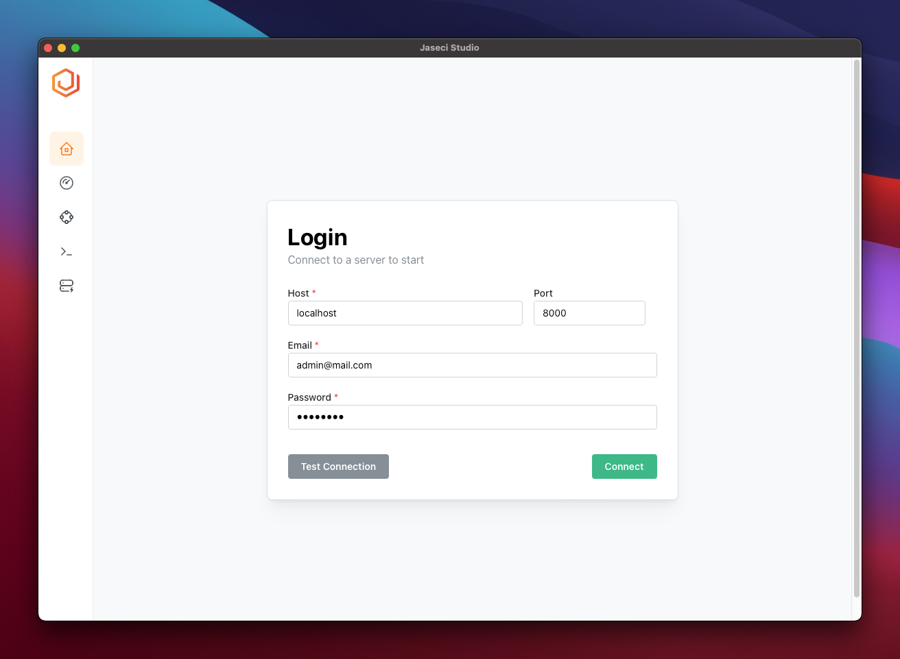

# Build a conversational AI system in Jaseci

# Chapter 6

## Bringing your application to production

### Managing your application with Jaseci Studio

Jaseci Studio provides a UI for easily managing and visualising changes to your Jaseci project.

We will install Jaseci studio by going to the [latest jaseci release](https://github.com/Jaseci-Labs/jaseci/releases/latest) where we can download the binary that is relevant to our operating system.

Once we have the application installed and when we launch it, we are first greeted with a login screen. We then enter our server endpoint in the `host` and `port` fields. Then, we enter the login credentials for the account we created earlier with `jsserv`.

We can verify that the information we entered is correct by clicking "Test Connection". If there is an error, check that your server is still running and ensure that there is no typo in any of the fields.

Click connect once you have verified that all is good.

_Jaseci Studio Login Screen_

For a summary of the features Jaseci Studio currently has, [click here](https://github.com/Jaseci-Labs/jaseci/blob/main/jaseci_studio/features.md).

### Register and update your jac code on a remote instance

In this section, we will walk you through on how to register and update your jac code on a remote instance. The steps are as follows:

#### Register jac code on a remote instance

First you have to login to jaseci control from the terminal.

```
jsctl -m
```

Then you will login into your remote instance by using the following. It will require you to pass in the username and password.

```
login [link here]
```

Terminal View

```
> Username:
test
> Password:
password
```

Next step is to load all jaseci actions that the application requires. One of the earlier chapter we explained the ways of loading the actions and how to.

```
actions load remote [link to jaseci actions on remote]
```

We move on to registering the sentinel.

```
sentinel register -set_active true -mode ir [jir main file of the jaseci application]
```

After registering the sentinel we will have to create the graph for application and this goes as follows.

```
graph create -set_active true
```

If you have to delete the graph however, incase of a mistake you can do that using the following command and then you can recreate.

```
graph delete active:graph
```

Next step, you will have to run the init walker

```
walker run init
```

Great, and that's how you register jac code on a remote instance.

#### Updating jac code on a remote instance

Let us walk you through on how to update jac code on the remote instance. After you make your edits to the main jac file and build it. Run the following command each time you make an update to the jac code.

```
sentinel set -snt active:sentinel -mode ir [main jir file of the application]
```

### Interact with your jac application through restful API endpoints

In this section, we will be walking you through on how to interact with your jac application through restful API endpoints, if you notice we have been running all the walker commands on the terminal, let's run it through the API. The steps to interact through the API is as follows:

```
pip install jaseci-serv
```

We will be using jaseci serve to run the application on the webserver

```
jsserv makemigrations base
```

Here we will be making the migrations for the default base module in our jaseci program. This will create a database that will be used to run a jaseci instance of our application. It creates a mydatabase file in your working directory.

```
jsserv migrate
```

This will install the schema and database.

```
jsserv createsuperuser
```

This will allow you to create the account for the server and you will be prompted to enter an email and password.

```
jsserv runserver 0.0.0.0:8000
```

This will start your Jaseci Server to run your application. Visit localhost:8000/docs to check if the webserver is up and running.

```
REQUEST [POST]: http://localhost:8000/user/token/

PAYLOAD: {
"email" : "email@gmail",
"password" : "passsword"
}

RESPONSE: {
"expiry": null,
"token": "2b4824cd3136616aa5380580578b2f5d1fccd3cad669f78029911e239300d3c0"
}
```

We will send a POST request to /user/token and get a token response now you can now make API calls to your JAC program once you copy token returned. Add it to the authorization header with the word "token" before sending any request.

```
REQUEST [POST]: http://localhost:8000/js/sentinel_register

PAYLOAD: {
    "name": "some string",
    "code": "some string",
    "code_dir": "some string",
    "mode": "some string",
    "encoded": false,
    "auto_run": "some string",
    "auto_run_ctx": {},
    "auto_create_graph": false,
    "set_active": false
}
```

This will allow you to register the sentinel for the application.

```
REQUEST [POST]: http://localhost:8000/js/graph_create

PAYLOAD: {
    "set_active": false
}
```

This will allow you to create a graph instance and return root node graph object

```
REQUEST [POST]: http://localhost:8000/js/walker_run

PAYLOAD: {
    "name": "init",
    "ctx": {},
    "snt": "urn:uuid:d32de620-27cd-4920-a31e-2e2f41bc2a9d",
    "detailed": false
}
```

This request will run the init walker which will spawn the graph and the AI models in the application.

```
REQUEST [POST]: http://localhost:8000/js/walker_run

PAYLOAD: {
    "name": "talk",
    "ctx": {
        "question": "i would like to test drive."
    },
    "snt": "urn:uuid:d32de620-27cd-4920-a31e-2e2f41bc2a9d",
    "detailed": false
}
```

For the payload sent to the /js/walker_run, the name (name of walker to be called), ctx (information sent to the walker), snt (sentinel ID of the program ), detailed (returns additional information for the walker), nd (node walker will be set to, if not included will go to the root node). This is how we interact with jac application through restful API endpoints. In this example we ran the talk walker.

## Bringing in the AI models for the dialogue

In this section, we will explain how we added the AI model into this application. We have added two AI models the bi-encoder and tfm ner model. Before we explain the code implementation for both models, we will explain the top inheritance AI model they inherit.

**Explanation of the ai_model node**

```
    can train with train entry {}
```

This allows you to train the ai model and it also inherits the train walker which accepts certain parameters.

```
    can test_model with test_model entry {}
```

This allow you to test the ai model, it inherits the test_model walker.

```
    can eval with eval entry {
        ::train;
        ::test_model;
    }
```

this node ability enables you to evaluate the ai model by training it and testing it when the eval walker is called.

```
    can infer with infer entry {}
```

This node ability allows you to pass query and get a response.

```
walker train {
    has train_file, num_train_epochs, from_scratch;
    has batch_size, learning_rate;
}
```

This walker takes in a few parameters: **train_file** (where the training file is located in the repository). **num_train_epochs** (amount of time you want the ai model to learn from the dataset), **from_scratch** (if you want to train the model from scratch or not), **batch_size** (the number of training examples utilized in one iteration) and **learning_rate** (The amount that the weights are updated during training).

```
walker test_model {
    has eval_file;
}
```

This walker allows you to test the model using the file location you provided in it's parameter.

```
walker eval {
    has train_file, eval_file, num_train_epochs, from_scratch;
}
```

Allows you to evaluate the model.

```
walker infer {
    has input;
}
```

This walker allows you to pass an input (user query) to the parameter and receive the necessary information for that ai model based on the input.

**Explanation of the bi_enc node**
In the last section we explained the ai_model node and in this section we integrated the ai_model node into the bi-encoder ai model which is called bi_enc. The explanation of each code input is as follows:

```
can bi_enc.train, bi_enc.infer, bi_enc.save_model;
```

This logic enables you to import functions from the jaseci kit modules imported from actions.

```
can train {
        train_data = file.load_json(visitor.train_file);
        bi_enc.train(
            dataset=train_data,
            from_scratch=visitor.train_from_scratch,
            training_parameters={
                "num_train_epochs": visitor.num_train_epochs
            }
        );
        if (visitor.model_name):
            bi_enc.save_model(model_path=visitor.model_name);
    }
```

This node ability allows you to train the bi_encoder (bi_enc) model, as you can see it overrides the train function from ai_mode node and it also requires some parameter and these parameter are presented from the walker.

```
can infer {
        res = bi_enc.infer(
            contexts=[visitor.query],
            candidates=here.candidates,
            context_type="text",
            candidate_type="text"
        )[0];

        max_score = 0;
        max_intent = "";
        for i=0 to i<res["candidate"].length by i+=1 {
            if (res["score"][i] > max_score){
                max_intent = res["candidate"][i];
                max_score = res["score"][i];
            }
        }
        report [max_intent, max_score];
    }
```

The infer function in the bi_enc module allows you to query the model and receive the intent of the user utterance.

```
can test_model {
        eval_set = file.load_json(visitor.eval_file);
        candidates = eval_set.dict::keys;

        correct = [];
        failure = [];
        for intent in candidates {
            preds = bi_enc.infer(
                contexts=eval_set[intent],
                candidates=candidates,
                context_type="text",
                candidate_type="text"
            );
            for i=0 to i<preds.length by i+=1 {
                pred = preds[i];
                max_score = 0;
                max_intent = "";
                for j=0 to j<pred["candidate"].length by j+=1 {
                    if (pred["score"][j] > max_score){
                        max_intent = pred["candidate"][j];
                        max_score = pred["score"][j];
                    }
                }
                if (intent == max_intent): correct.l::append(eval_set[intent][i]);
                else {
                    failure.l::append({
                        "sent": eval_set[intent][i],
                        "ground truth": intent,
                        "prediction": max_intent
                    });
                }
            }
        }
        report {
            "accuracy": correct.length/(correct.length+failure.length),
            "correct": correct.length,
            "failure": failure.length,
            "failed_sents": failure
        };
    }
```

This node ability allows you to test the model for the bi-encoder.

**Explanation of the ent_ext node**
In this section we will explain each functions for the entity extraction model for ent_ext node. The explanation goes as follows:

```
can ent_ext.entity_detection, ent_ext.train, ent_ext.save_model, ent_ext.load_model;
```

This is how we import all the functionalities for the jaseci kit module called ent_ext.

```
can train {
        train_data = file.load_json(visitor.train_file);

        if(visitor.from_scratch) {
            ent_ext.load_model({"default": true});
            here.labels = [];
        }
        for item in train_data {
            for ent in item["entities"] {
                ent_label = ent["entity_type"];
                if (ent_label not in here.labels): here.labels.l::append(ent_label);
            }
        }
        ent_ext.train(
            train_data=train_data,
            val_data=val_data,
            test_data=test_data,
            train_params={
                "num_epoch": (visitor.num_train_epochs).int,
                "batch_size": (visitor.batch_size).int,
                "LR": (visitor.learning_rate).float
            }
        );
        if (visitor.model_name):
            ent_ext.save_model(model_path=visitor.model_name);
    }
```

This is how we train the model, it requires training data, test data, val data, the number of train epochs, batch size and learning rate which was briefly explained in a earlier section.

```
can infer {
        report ent_ext.entity_detection(
            text=input["text"],
            ner_labels=input["labels"]
        );
    }
```

This is the node ability which allows you to query (user input) and get back the entity extracted from the user.

**Updates to the va_state node**
In this section we will explain the changes made to the va state.

```
can classify_intent {

        train_data = file.load_json("data/clf_train.json");
        candidates = train_data.d::keys;

        res = bi_enc.infer(
            contexts=[visitor.question],
            candidates= candidates,
            context_type="text",
            candidate_type="text"
        );

        for pred in res.list{
            # Sort result
            max_score = 0;
            max_intent = "";

            for i=0 to i < pred["candidate"].length by i+=1 {
                if (pred["score"][i] > max_score){
                    max_intent = pred["candidate"][i];
                    max_score = pred["score"][i];
                }
            }
        }

        visitor.predicted_intent = max_intent;
    }
```

At first we had hardcoded data here but it was changed after we brought in the ai models. For the classify intent node we use the bi encoder to do our intent classification. Based on the training data it will generate candidates (intent in this case) and the user query will be passed to the bi encoder model which will return the predicted intent.

```
can extract_entities {
        labels = [];

        train_data = file.load_json("data/flair_ner.json");

        for item in train_data {
            for ent in item["entities"] {
                ent_label = ent["entity_type"];
                if (ent_label not in labels): labels.l::append(ent_label);
            }
        }

        entity_result = ent_ext.entity_detection(
            text=visitor.question.str,
            ner_labels=labels.list
        );

        for ent in entity_result['entities'] {
            if (ent["conf_score"] > 0.4){
                entity_label = ent["entity_value"];
                entity_text = ent["entity_text"];
                if (entity_text not in visitor.extracted_entities ) {
                    visitor.extracted_entities[entity_label] = [];
                }
                    visitor.extracted_entities[entity_label] += [entity_text];
            }
            std.out(visitor.extracted_entities);
        }
    }
```

This also had hardcoded data however we drafted the ent_ext model into the extract_entities node ability. Which will extract all the required slot data based on the training data provided. When users query it will extract all the features and will be presented for the rest of application to work on.
