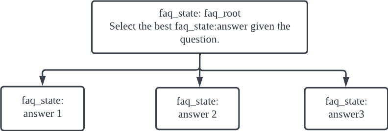
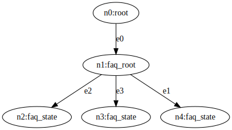
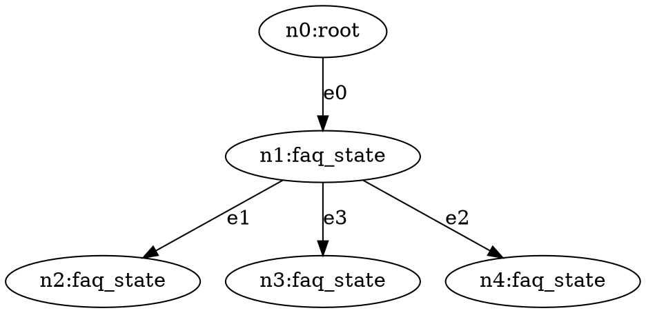

# Build a Conversational AI System with Jaseci

In this tutorial, you are going to learn how to build a state-of-the-art conversational AI system with Jaseci.
You will learn the basics of Jaseci, training state-of-the-art AI models, and everything between, in order to create an end-to-end fully-functional conversational AI system.

Excited? Hell yeah! Let's jump in.

## Preparation

To install jaseci, run in your development environment

```
pip install jaseci
```

To test the installation is successful, run

```
jsctl -- help
```

`jsctl` stands for the Jaseci Command Line Interface.
If the command above displays the help menu for `jsctl`, then you have succssfully installed jaseci.

> **Note**
>
> Take a look and get familiarized with these commands while you are at it. `jsctl` will be frequently used throughout this journey.

## Background

A few essential concepts to get familiar with.

### Graph, nodes, edges

Link to bible sections.

### Walker

Link to bible sections.

# Automated FAQ answering chatbot

Our conversational AI system will consists of multiple components.
To start, we are going to build a chatbot that can answer FAQ questions without any custom training, using zeroshot NLP models.
At the end of this section, you will have a chatbot that, when given a question, searches in its knowledge base the most relevant answer and return that answer.

The use case here is a Tesla FAQ chatbot.
We will be using the list of FAQs from https://www.tesla.com/en_SG/support/faq.

> **Note**
>
> This architecture works for any FAQ topics and use case. Feel free to pick another product/website/company's FAQ if you'd like!

## Define the Nodes

We have 3 different type of nodes:

- `root`: This is the root node of the graph. It is a built-in node type and each graph has one root node only.
- `faq_root`: This is the entry point of the FAQ handler. We will make the decision on the most relevant answer at this node.
- `faq_state`: This node represents a FAQ entry. It contains a candidate answer from the knowledge base.

Now let's define the custom node types.

```js
node faq_root;
node faq_state {
    has question;
    has answer;
}
```

The `has` keyword defines nodes variables. In this case, each `faq_state` has a `question` and `answer`.

> **Warning**
>
> The `root` node does not need explicit definition. It is a built-in node type. Avoid using `root` as a custom node type.

To spawn a node of a specific type, use the `spawn` keyword:

```js
faq_answer_1 = spawn node::faq_state(
    question="How do I configure my order?",
    answer="To configure your order, log into your Tesla account.",
);
```

In the above example, we just spawned a `faq_state` node called `faq_answer_1` and initialized its `question` and `answer` variables.

> **Note**
>
> The `spawn` keyword can be used to spawn many different jaseci objects, such as nodes, graphs and walkers.

## Build the Graph

For this FAQ chatbot, we will build a graph like illustrated here:



The idea here is that we will decide which FAQ entry is the most relevant to the incoming question at the `faq_root` node and then we will traverse to that node to fetch the corresponding answer.

To define this graph architecture:

```js
// Static graph definition
graph faq {
    has anchor faq_root;
    spawn {
        // Spawning the nodes
        faq_root = spawn node::faq_root;
        faq_answer_1 = spawn node::faq_state(
            question="How do I configure my order?",
            answer="To configure your order, log into your Tesla account."
        );
        faq_answer_2 = spawn node::faq_state(
            question="How do I order a tesla",
            answer="Visit our design studio to place your order."
        );
        faq_answer_3 = spawn node::faq_state(
            question="Can I request a test drive",
            answer="Yes. You must be a minimum of 25 years of age."
        );

        // Connecting the nodes together
        faq_root --> faq_answer_1;
        faq_root --> faq_answer_2;
        faq_root --> faq_answer_3;
    }
}
```

Let's break down this piece of code.

- We spawn 4 nodes, one of the type `faq_root` and three are of the type `faq_state`.
- We connect each of the faq answer state to the faq root with `faq_root --> faq_answer_*`.
- We set the `faq_root` as the anchor node of the graph. Spawning a graph will return its anchor node.

> **Warning**
>
> An anchor node is required for a graph block. It must be spawned inside the spawn block of the graph definition.

## Initialize the Graph

Similar to nodes, in order to create the graph, we will use the `spawn` keyword.

```js
walker init {
    root {
        spawn here --> graph::faq;
    }
}
```

This is the first walker we have introduced so let's break it down.

- The walker is called `init`.
- It contains logic specifically for the `root` node, meaning that the code inside the `root {}` block will run **only** on the `root` node. This syntax applies for any node types, as you will see very soon.
- `spawn here --> graph::faq` creates an instance of the `faq` graph and connect its anchor node to `here` which is the node the walker is currently on.

> **Note**
>
> `init` is a built-in walker type. It is the default walker to run when no specific walkers are specified for a `jac run` command.
>
> `here` is a very powerful keyword. It always evaluates to the specific node the walker is currently on. You will be using `here` a lot throughout this tutorial.

## Run the `init` Walker

Now, let's run the init walker to initialize the graph.
First put all the above code snippet in a single jac file and name it `main.jac`, including

- nodes defintion
- graph definition
- init walker

Run `jsctl` to get into the jaseci shell environment:

```bash
jsctl
```

Inside the `jsctl` shell,

```bash
jaseci > jac dot main.jac
```

This command runs the `init` walker of the `main.jac` program and return the state of its graph in DOT format after the walker has finished.
[The DOT language](https://graphviz.org/doc/info/lang.html) is a popular graph description language widely used for representing complex graphs.

The output should look something like this




> **Note**
>
> We are not going to cover the DOT syntax. There are many resources online if you are interested, e.g., https://graphviz.org/doc/info/lang.html

> **Note**
>
> There are tools available to render a graph in DOT format. For example, https://dreampuf.github.io/GraphvizOnline has as WSIWYG editor to render dot graph in real time.

Congratulations! 🎉 You have just created your first functional jac program!

## Ask the Question

Alright, we have initialized the graph.
Now it's time to create the code for the question-answering.
We will start with a simple string matching for the answer selection algorithm.
For this, we will create a new walker called `ask`.

```js
walker ask {
    has question;
    root {
        question = std.input(">");
        take --> node::faq_root;
    }
    faq_root {
        take --> node::faq_state(question=question);
    }
    faq_state {
        std.out(here.answer);
    }
}
```

This walker is more complex than the `init` one and introduces a few new concepts so let's break it down!

- Similar to nodes, walker can also contain `has` variables. They define variables of the walker. They can also be passed as parameters when calling the walker.
- `std.input` and `std.out` read and write to the command line.
- This walker has logic for three types of node: `root`, `faq_root` and `faq_state`.
  - `root`: It simply traverse to the `faq_root` node.
  - `faq_root`: This is where the answer selection algorim is. We will find the most relevant `faq_state` and then traverse to that node via a `take` statement. In this code snippet, we are using a very simple (and limited) string matching approach to try to match the predefined FAQ question with the user question.
  - `faq_state`: Print the answer to the terminal

Before we run this walker, we are going to update the `init` walker to speed up our development process

```js
walker init {
    root {
        spawn here --> graph::faq;
        spawn here walker::ask;
    }
}
```

This serves as a shorthand so that we can initialize the graph and ask question in one command.

> **Note**
>
> This demonstrates how one walker can spawn another walker using the `spawn` keyword.

Time to run the walker!

```bash
jaseci > jac run main.jac
```

`jac run` functions very similarly to `jac dot`, with the only difference being that it doesn't return the graph in DOT format.
Try giving it one of the three questions we have predefined and it should respond with the corresponding answer.

## Introducing Universal Sentence Encoder

Now, obvisouly, what we have now is not very "AI" and we need to fix that.
We are using the Universal Sentence Encoder QA model as the answer selection algorithm.
Universal Sentence Encoder is a language encoder model that is pre-trained on large corpus of natural language data and have been shown to be effective in many NLP tasks.
In our application, we are using it for zero-shot question-answering, i.e. no custom training required.

Jaseci has a set of built-in libraries or packages that are called Jaseci actions.
These actions cover a wide-range of state-of-the-art AI models across many different NLP tasks.
These actions are packaged in a python module called `jaseci_kit`.

To install `jaseci_kit`:

```bash
pip install jaseci_kit
```

Now we load the action we need into our jaseci environment

```bash
jaseci > actions load module jaseci_kit.use_qa
```

Let's update our walker logic to use the USE QA model:

```js
walker ask {
    has question;
    root {
        question = std.input(">");
        take --> node::faq_state;
    }
    faq_root {
        answers = -->.answer;
        best_answer = use.qa_classify(
            text = question,
            classes = answers
        );
        take --> node::faq_state(answer==best_answer["matched"]);
    }
    faq_state {
        std.out(here.answer);
    }
}
```

Even though there are only 5 lines of new code, there are many interesting aspects so let's break it down!

- `-->.answer` collects the `answer` variable of all of the nodes that are connected to `here`/`faq_root` with a `-->` connection.
- `use.qa_classify` is one of the action supported by the USE QA action set. It takes in a question and a list of candidate answers and return the most relevant one.

Now let's run this new walker and you can now ask questions that are relevant to the answers beyond just the predefined ones.

## Scale it Out

So far we have created a FAQ bot that is capble of provide answer in three topics.
To make this useful beyond just a prototype, we are now going to expand its database of answers.
Instead of manually spawning and connecting a node for each FAQ entry, we are going to write a walker that automatically expand our graph:

```js
walker ingest_faq {
    has kb_file;
    root: take --> node::faq_root;
    faq_root {
        kb = file.load_json(kb_file);
        for faq in kb {
            answer = faq["answer"];
            spawn here --> node::faq_state(answer=answer);
        }
    }
}
```

> **Note**
>
> If are curious (and adventurous), try visualizes this new graph via DOT!


# A Multi-turn Action-oriented Dialogue System
* In the previous section, we have built a FAQ system.
* In this section, we are going to build a different type of conversational AI, a multi-turn action-oriented dialogue system.
* Explain differences of this vs FAQ.
* Mention we will start a new jac file. but it will come together with the FAQ at the end.

## State Graph Architecture
* Explain what is a state graph.
* Each node represent a conversationial state.
* The transition/edge represents possible transition between conversational state based on users input and NLU.
* Add a diagram

## Define the Node
We will start with just intent classification.

```js
node dialogue_root;

node dialogue_state {
    has name;
    has response;
}
```
* Start with only intent classification.
* One root connected with two intents (schedule a test drive, help)
* Use string matching for the intent classification

```js
edge intent_transition {
    has intent;
}
```
* Introduce custom edge.
* Edge can have has variables and it can be used for filtering

## Build the graph

```js
graph dialogue_system {
    has anchor dialogue_root;
    spawn {
        dialogue_root = spawn node::dialogue_root;
        test_drive_state = spawn node::dialogue_state(
            name = "test_drive",
            response = "Your test drive is scheduled for Jan 1st, 2023."
        );
        help_state = spawn node::dialogue_state {
            name = "help",
            response = "I can help you schedule a test drive"
        };

        dialogue_root -[intent_transition(intent="test drive")]-> test_drive_state;
        dialogue_root -[intent_transition(intent="help")]-> help_state;
    }
}
```
* `-[intent_transition(intent="")]->` connects two nodes with a custom edge type and initializes the edge variables.

## Initialize the graph
```js
walker init {
    root {
        spawn here --> graph::dialogue_system;
    }
}
```
* Same as the last section.
* Show the DOT and the graph

## Build the Walker Logic
```js
walker talk {
    // Simple string matching for intent classification
    // use std.in and std.out
}
```
* This will be a simple walker.
* Run this

## Intent classificaiton with Bi-encoder
* A quick primer on intent classification

We first need to load the biencoder action library
```bash
jaseci > actions load module jaseci_kit.bi_enc
```

Let's setup a biencoder training jac program.
* Just give them the jac file and show how to run it to train the model.
* Treat it as a blackbox model.

```js
node ai_model {

}
node biencoder {

}
walker train {

}
walker infer {

}
```
* Link to example training data file to a github link or shared google drive.
```js
> jaseci jac run biencoder.jac -wlk train -ctx {}
```
* Explain `-wlk` and `-ctx`


```bash
EXPECTED TRAINING OUTPUT
```
* Mention that the model needs to be saved with `save_model`

Use infer to test the model after training
```js
> jaseci jac run biencoder.jac -wlk infer -ctx {}
```
```bash
Expected output
```

## Integrating the intent classification model in the walker logic
```js
walker ask {
    // update the code to use biencoder for inference
}
```

Run the new walker

## Introduce multi-turn dialogue
* Some actions will require multiple turns to finish. Just like if you are talking to a person
* We will expand the test_drive capability to a multi-turn dialogue
* Explain slots/entities and how they are used in dialogue system
* Give examples of messy language and give information in different order.
* We need to update our graph architecture

* Show new graph diagram, with new states (update, confirmation, confirmed, cancelled) and entity transition
* Explain the graph

## Build the multi-turn dialogue graph

```js
edge entity_transition {
    has entities;
}
```
NOTE: is there a better way to match entities here? Need both lists to be sorted.

Expand the graph with new states and transitions
```js
graph dialogue_system {
    has anchor dialogue_root;
    spawn {

    }
}
```
* show DOT visualization

## Update the walker to navigate the multi-turn dialogue graph
```js
walker ask {
    take -[entity_transition]-> else {
        take -[intent_transition]-> else {

        }
    }
}
```
* With simple string matching as the entity extraction algorithm.

## Introduce entity extraction AI model
* Similar to biencoder, give them the jac file and teach them how to train the model as a black box

Load action
```bash
jaseci > actions load module jaseci_kit.ent_ext
```

NER training jac program
```js
node ner {

}
walker train {

}

walker infer {

}
```
* Provide example training data file

Train the model
```bash
jaseci > walker run ner.jac -wlk train -ctx {}
```

Test the model
```js
jaseci > walker run ner.jac -wlk infer -ctx {}
```

## Integrate the NER model with walker logic

Update the walker code to use the NER action
```js
walker ask {

}
```

Run the walker again, now with both AI model in place.

Congratulations! You now have a fully functional multi-turn dialogue system.

# Inheritance in Jaseci
* A quick section/module explaining how inheritance work in jaseci and jac

# Unifying the two conversational AI systems
* FAQ and Dialogue system, while relying on different AI models, share many of the same development and processing pattern.
* NLU to analyze the question and NLG to compose a repsonse.
* Add diagram to demonstrate the shared pattern.
* We are going to use inheritance to unify the two system and simplify our logic

* Explain the inheritance relationship
* cai_state --> va_state --> individual dialogue states
* cai_state --> faq_state --> individual FAQ answer states

Introduce the cai_state parent node
```js
node cai_state {

}
```
* Introduce node abilities
* data spatial programming concept and principles

## Update dialogue system program with inheritance
```js
node dialogue_state:cai_state {
    can nlu {
    }
    can nlg {

    }
    can classify_intent {

    }
    can extract_entities {

    }
}
```
* Overwrites abilities from cai_state
* Move logic from walker into node abilities

Then each dialogue state will inherit from `dialogue_state` and specify custom logic for that state
```js
node collect_info:dialogue_state {

}
node confirmation:dialogue_state {

}
node
node
node
```

Let's update the graph for dialogue system
```js
graph dialogue_system {
    // updated graph with new inheritance structure
}
```

Now that we have updated our node following the principle of data spacial programming, let's see what our walker logic now looks like
```js
walker ask {
    // Updated and simplified with most of the code moved to node abilities
}
```

Let's run the new walker with the new graph. It should work just like before.

## Update the FAQ program with the new inheritance structure
```js
node faq_state:cai_state {

}
```

Update the graph
```
graph faq {
    // updated graph with new inheritance structure
}
```

Update the faq walker
```js
walker ask_faq {

}
```
Let's run the new walker with the new grpah.

# Combining FAQ and Dialogue into one system
Now that we have unified the data structure, let's see how we can combine these two into one unified conversational AI system.
The unified code architecture makes this much easier than before.

* We will introduce a node at the root level that categorize request into FAQ or Dialogue System request
* Add diagram here

Here is the node
```js
node cai_root:cai_state {

}
```
* Use USE encoder to categorize the request

Update the graph with both sides combined
```js
graph conv_ai {
    has anchor cai_root;
    graph {
        // Connect dialogue system to cai_root
        // Connect FAQ to cai_root
    }
}
```

We are also going to unify the two walkers.

```js
walker talk {
    // Final form of the talk walker
}
```
* Explain the state tracking logic of the walker.
* It generalizes to both cai_root, faq_state and dialogue_state.

We also need to update the `init` walker;
```js
walker init {

}
```

## Multi-file Jac Program
We have a new challenge, our jac program consists of multiple jac files now.
We will compile them into one program in the format of `jir`.

Let's create a `main.jac`
<h5 a><strong><code>main.jac</code></strong></h5>

```js
import {*} with "./faq.jac";
import {*} with "./dialogue.jac";
...
```

To compile a multi-file jac program,
```bash
jaseci > jac build main.jac
```

A `main.jir` should be generated.
To run a walker from a jir file,
```bash
jaseci > jac run main.jir -wlk WALKER_NAME -ctx {}
```

> **Note**
>
> The jir format is what you will use to deploy your jac program to a production jaseci instance.

## Initialize the Latest Graph
Use jac dot