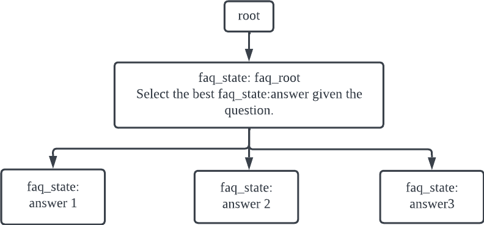
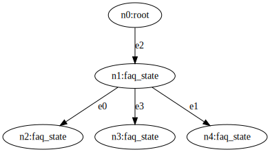

# Build a Conversational AI System with Jaseci
In this tutorial, you are going to learn how to build a state-of-the-art conversational AI system with Jaseci.
You will learn the basics of Jaseci, training state-of-the-art AI models, and everything between, in order to create an end-to-end fully-functional conversational AI system.

Excited? Hell yeah! Let's jump in.

## Preparation
To install jaseci, run in your development environment
```
pip install jaseci
```

To test the installation is successful, run
```
jsctl -- help
```
`jsctl` stands for the Jaseci Command Line Interface.
If the command above displays the help menu for `jsctl`, then you have succssfully installed jaseci.
> **Note**
> Take a quick look through these commands while you are at it. `jsctl` will be frequently used throughout this journey.

## Background
A few essential concepts to get familiar with.

### Graph, nodes, edges
Link to bible sections.

### Walker
Link to bible sections.

# Automated FAQ answering chatbot
Our conversational AI system will consists of multiple components.
To start, we are going to build a chatbot that can answer FAQ questions without any custom training, using zeroshot NLP models.
At the end of this section, you will have a chatbot that, when given a question, searches in its knowledge base the most relevant answer and return that answer.

The use case here is a Tesla FAQ chatbot.
We will be using the list of FAQs from https://www.tesla.com/en_SG/support/faq.

## Graph architecture
Our target
The graph structure is as follows:


Starting with a simple FAQ node. We are going to first use string matching on question to find the right answer.

To define a node:
```js
node faq_root;
node faq_state {
    has question;
    has answer;
}
```
`has` defines nodes variables. In this case, each `faq_state` has a question and answer;

To spawn/create an node:
```js
faq_answer_1 = spawn node::faq_state(
    question="How do I configure my order?",
    answer="To configure your order, log into your Tesla account.",
);
```
The `spawn` keyword can span a Jaseci object. In the above example, we just spawned a `faq_state` node called `faq_answer_1` and initialized its `question` and `answer` variables.

The `spawn` keyword can also be used inside a `graph` block to define a static graph:
```js
// This is a comment
graph faq {
    has anchor faq_root;
    spawn {
        faq_root = spawn node::faq_root;
        faq_answer_1 = spawn node::faq_state(
            question="How do I configure my order?",
            answer="To configure your order, log into your Tesla account."
        );
        faq_answer_2 = spawn node::faq_state(
            question="How do I order a tesla",
            answer="Visit our design studio to place your order."
        );
        faq_answer_3 = spawn node::faq_state(
            question="Can I request a test drive",
            answer="Yes. You must be a minimum of 25 years of age."
        );
    }
}
```

To create this graph, we will create an `init` walker.
```js
walker init {
    root {
        spawn here --> graph::faq;
    }
}
```
`spawn here --> graph::faq` creates an instance of the `faq` graph and connect its anchor node to `here` with an edge `-->`.

Now our graph looks like this:



Now, let's run the walker. First put all the above code snippet in a single jac file and name it `main.jac`

Run `jsctl` to get into its shell environment:
```bash
jsctl
```
While inside the `jsctl` shell,
```bash
jaseci > sentinel register main.jac
jaseci > walker run init
```

`sentinel register` activate and register your code.
`walker run` executes a walker.

TODO: jac dot FILE

Now let's check what the graph looks like
```bash
jaseci > graph get -detailed true
```

`graph get` returns details of a given graph, including all of its consitutent objects. You can see this is not very readable. Alternatively,

```bash
jaseci > graph get -mode dot
```
The `-mode dot` argument will return the graph in the popular `dot` language format.

You can use a dot visualizer tool to easily visualize your graph. For example, https://dreampuf.github.io/GraphvizOnline has as WSIWYG editor to render dot graph in real time.

Your dot graph should look something like this


You might wonder "Okay...I created 4 faq_state nodes, how come there is only one???"

This is because only one of the 4 nodes are actually connected, (root --> faq_root). So the other three are currently detached. So let's connect them by adding the following lines to the graph spawn block

```js
graph faq {
    ...
    spawn {
        ...
        faq_root --> faq_answer_1;
        faq_root --> faq_answer_2;
        faq_root --> faq_answer_3;
    }
}
```

Now run the `init` walker and read the graph in dot format, and you should see something like this

NOTE: This flow has an issue too because it will just keep adding to the existing default graph.



Note: Below are just outline. I wrote the text up until this point.

Now let's add a walker to ask question.

```js
walker ask {
    has question;
    has ready;
    root {
        take --> node::faq_state;
    }
    faq_state {
        take --> node::faq_state(question=question);
    }
    faq_answer {
        report here.answer;
    }
}
```

Explain what is happening within the walker.
We are using simple string matching to find the right answer.

Now let's run this walker
```bash
jaseci > walker run ask -ctx "{\"question\": \"How do I configure my order?\"}"
```
Replace this with `jac run`.

Introduce USE_QA to replace the simple string matching.

Primer on jaseci actions

Load actions

Update the walker code to use use_qa instead of string matching

introduce std.input and std.output here.
```js
walker ask {
    has question;
    has ready;
    root {
        take --> node::faq_state;
    }
    faq_state {
        # USE USE_QA HERE
    }
    faq_answer {
        report here.answer;
    }
}
```

Run the new walker with use_qa

Initialize your bot from a knowledge base of FAQ entries.
```js
walker ingest_faq {
    has kb_file;
    root: take --> node::faq_root;
    faq_root {
        kb = file.load_json(kb_file);
        for faq in kb {
            answer = faq["answer"];
            spawn here --> node::faq_state(answer=answer);
        }
    }
}
```
Visualize the graph using dot, see many more `faq_state` nodes.

Run the walker again, now with hundreds of answers initialized via the `ingest_faq` walker.