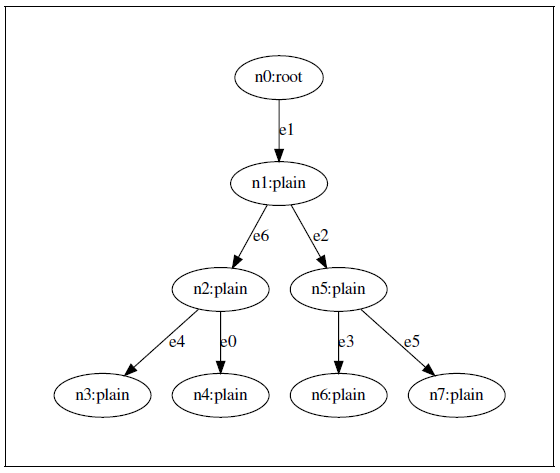
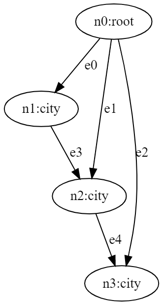

# Abstractions of Jaseci

There are a number of abstractions and concepts in Jac that is distinct from most (all?) other languages. These would be a good place to begin understanding for a seasoned / semi-seasoned programmer.

## Graphs

It is strange to see how our programming languages have evolved over the years, and yet, one fundamental data structure has been left behind. **Almost every data structure used by programmers to solve problems can be represented as a graph or a special case of a graph, except for hash tables**. This means that structures such as stacks, lists, queues, trees, heaps, and even graphs can be modeled with graphs. But, despite this, no programming language uses graph semantics as its first order data abstraction.

The graph semantic is incredibly rich and intuitive for humans to understand and is particularly well suited for conceptualizing and solving computational problems, especially in the field of AI. However, some may argue that there are graph libraries available in their preferred language and that a language forcing the concept is not necessary. To this, I argue that core design languages are based on their inherent abstractions, and with graphs not being one of them, the language is not optimized to allow programmers to easily utilize the rich semantics that graphs offer.

Another argument against using graphs as a first-order abstraction is that it might slow down the language. However, modern programming languages have absurd abstractions, such as dynamic typing, which have a higher runtime complexity than what would be needed to support graph semantics. Jaseci aims to revolutionize how we perceive data and memory by making graphs, with their intuitive and rich semantics, the foundational primitive for memory representation.

In Jaseci, we elect to assume the following semantics for the graphs in Jaseci:

1. Graphs are directed with a special case of a doubly directed edge
type which can be utilized practically as an undirected edge.
2. Both nodes and edges have their own distinct identities (i,e. an edge isn’t representable
as a pairing of two nodes). This point is important as both nodes and edges can have
contexts.
3. Multigraphs (i.e., parallel edges) are allowed, including self-loop edges.
4. Graphs are not required to be acyclic.
5. No hypergraphs, as I wouldn’t want Jaseci programmers heads to explode.

Refer to [Wikipedia description of graphs](https://en.wikipedia.org/wiki/Graph_(discrete_mathematics)) to learn more about graphs.

### Nodes
In Jaseci, nodes are a crucial concept. There are two types of nodes:

- **Root node**: It is the starting point of the graph and is a built-in node type. Each graph can have only one root node.
- **Generic node**: It is a built-in node type that can be used throughout the Jaseci application. You can customize the name and properties of this node type as well.

Here's an example code snippet to create and spawn a node:

```jac
node person{
    has name, age, birthday, profession;
}
```

### Edges

In Jaseci, edges are an essential component of the graph structure, and they allow for more complex relationships between nodes. As stated above, just like nodes, you can define custom edge types with variables, allowing for more versatility in creating the structure of the graph.

Edges can have specific behaviors or conditions attached to them that trigger a specific action or behavior in the program. For example, in the custom edge provided above, the intent_transition edge type is defined to transition between states based on a user's input intent. This kind of edge behavior is incredibly useful in creating natural language processing (NLP) applications where the system must be able to understand and interpret user input.

By using custom edge types with specific behaviors, you can make your code more modular, easier to read and maintain, and add more functionality to your applications. Additionally, by using edges, you can create more complex relationships between nodes, which can be used to create more complex traversal patterns through the graph structure.

Overall, edges in Jaseci are a powerful tool that can be used to create more complex, intelligent, and versatile applications.

Here is a example of creating a edge in Jac Language.

```jac
edge relationship{
    has relationship_type;
}
```

### Operators for connecting nodes

In Jaseci, specific operators are used to connect nodes and edges to form graphs;

-  **`++>`** : This operator is used to connect two nodes in a forward direction. For example, **`node1 ++> node2`** will connect node1 to node2.
- **`<++>`** : This operator is used to connect two nodes in a backward direction. For example, **`node2 <++> node1`** will connect node2 to node1.
- **`<+[name_of_edge]+>`** : This operator is used to connect two nodes in a backward direction with a custom edge type. For example, **`node2 <+[custom_edge]+> node1`** will connect node2 to node1 with a custom edge type named custom_edge.
- **`+[name_of_edge]+>`** : This operator is used to connect two nodes in a forward direction with a custom edge type. For example, **`node1 +[custom_edge]+> node2`** will connect node1 to node2 with a custom edge type named custom_edge.
- **`<+[name_of_edge(variable_declared = some_value)]+>`** : This operator is used to connect two nodes in a backward direction with a custom edge type that has a variable declared with a specific value. For example, **`node2 <+[custom_edge(my_var = 42)]+> node1`** will connect node2 to node1 with a custom edge type named custom_edge and a variable my_var declared with the value 42.
- **`+[name_of_edge(variable_declared = some_value)]+>`** : This operator is used to connect two nodes in a forward direction with a custom edge type that has a variable declared with a specific value. For example, **`node1 +[custom_edge(my_var = "hello")]+> node2`** will connect node1 to node2 with a custom edge type named custom_edge and a variable my_var declared with the value "hello".

These operators allow you to create complex graphs with customized edge types that can hold specific values. By using these operators, you can create a network of nodes that can represent complex data structures, such as trees or graphs. The use of customized edge types also allows you to define specific behavior for different types of connections between nodes.

### Creating Graphs Examples

Graphs can be created by connecting multiple nodes with edges. This is done using the connect operator `++>` `<++>`.

```jac
walker init {
    node1 = spawn here node::person(name = "Josh", age = 32);
    node2 = spawn here node::person(name = "Jane", age = 30);
    node1 <++> node2;
    here ++> node1;
    node2 <++ here
}
```

The code shown above generates a graph. You can visualize this graph using Jaseci Studios or the Graphviz graph viewer.
<!-- Need to add links to Jaseci Studio docs and Graphviz docs -->

**Statically Creating Graphs**

Statically creating graphs means creating a graph that is already fixed and doesn't change. The code below shows an example of how to do that in Jaseci.

```jac
graph assistant_graph {
 has anchor graph_root;
    spawn {
        graph_root = spawn node::state(name="root_state");
        user_node = spawn node::user;

        state_home_price_inquiry = spawn node::state(name="home_price_inquiry");
        state_prob_of_approval = spawn node::state(name="prob_of_approval");
        graph_root +[user]+> user_node;
        graph_root +[transition(intent_label = "home price inquiry")]+>state_home_price_inquiry;
        graph_root +[transition(intent_label = "probability of loan approval")]+> state_prob_of_approval;
        state_home_price_inquiry +[transition(intent_label = "specifying location")]+> state_home_price_inquiry;
        state_home_price_inquiry +[transition(intent_label = "home price inquiry")]+> state_home_price_inquiry;
        state_home_price_inquiry +[transition(intent_label = "probability of loan approval")]+> state_prob_of_approval;
        state_prob_of_approval +[transition(intent_label = "home price inquiry")]+> state_home_price_inquiry;
    }
}
```

The graph keyword is used to indicate that a new graph is being created, followed by the name of the graph. The {} are used to wrap everything related to the graph. An anchor named graph_root is declared using the has anchor keyword to identify the starting point of the graph.

After that, the `spawn` keyword is used to begin the creation of nodes and edges, by using `spawn node::` followed by the type of node you want to create (e.g. user or state). You can also specify a name for each node using the name property. Nodes and edges can be connected together using the `++>`  operator.

The transition keyword is used to create an edge with a specific intent label. In the example above, the graph has three states: root_state, home_price_inquiry, and prob_of_approval, and a user node. These states and the user node are connected to each other through transitions with intent labels such as "home price inquiry" or "probability of loan approval".


### Referencing and Dereferencing Nodes and Edges

<!-- Is this is related to nodes and edges??? or is this only for edges or is this is for all of the objects in Jaseci, need clarifications -->

In Jaseci language, referencing and dereferencing of nodes and edges are similar to the references in many programming languages, and they adopt the syntax of pointers in C/C++. The symbol & is used to retrieve the reference of an object, while the symbol * is used for dereferencing. Unlike C/C++, Jaseci references use a unique identifier in UUID format instead of memory locations.

When an object is dereferenced, it is represented as a string in UUID format that corresponds to the unique identifier of the object. This UUID is equivalent to the jid in the object's .info. These referencing and dereferencing operations are useful for input and output of node locations to the client-side, among other applications.

It is important to note that an instance of an archetype is internally represented as a string composed of a UUID that starts with "jac:uuid:". Although this may change in the future, if you assign such a string to a variable in a Jaseci program, the program will treat it like an object.

```jac
node simple: has name;

 walker ref_deref {
    with entry {
        for i=0 to i<3 by i+=1:
        spawn here ++> node::simple(name="node"+i.str);
    }
    var = &(++>[0]);
    std.out('ref:', var);
    std.out('obj:', *var);
    std.out('info:',(*var).info);
}
```

The code snippet creates a simple node with an attribute named name. It then initializes a walker named ref_deref, which creates three new nodes named node0, node1, and node2 and assigns them to the simple node.

The code then assigns the reference of the first node node0 to the var variable using the & operator. The `std.out()` function is used to print out the reference, object, and information related to the var variable.

Observe the following output generated by the above code snippet.

```
ref: urn:uuid:04295f7f-a5bf-4db3-87ce-e13653a81b25
obj: jac:uuid:04295f7f-a5bf-4db3-87ce-e13653a81b25
info: {
    "context": {
        "name": "node0"
        },
    "anchor": null,
    "name": "simple",
    "kind": "node",
    "jid": "urn:uuid:04295f7f-a5bf-4db3-87ce-e13653a81b25",
    "j_timestamp": "2022-08-10T15:57:00.577287",
    "j_type": "node"
}
```

When executed, the code will output the reference and information related to the node0 object. The obj output shows the UUID of the node0 object, while the info output shows the complete information related to the simple node, including its context, anchor, name, kind, and other attributes.

### Plucking values from nodes and edges

In Jaseci, you can easily extract information from nodes and edges by using the pluck feature. Edges in Jaseci have a unique feature that allows you to pluck values from neighboring nodes and edges themselves. By using the syntax **`-->`**, you can extract the value of a specific variable from a neighboring node. This will return a list of the values of that variable from all connected nodes. If you want to filter the results and only extract information from specific nodes, you can specify the name of the edge connected to the node and further specify what value the edge has by using the syntax **`-[name_of_edge(variable = value)]->.name_of_variable_needed`**.

To pluck values from edges, you can simply use the syntax **`-->`** and specify the edge and variable name like this: **`--> .edge.name_of_variable_needed`**.

Here is an example of plucking values from nodes and edges in Jaseci:

```jac
node person {
    has name, age, profession;
}
edge society{
    has location;
}

graph  people_in_society{
    has anchor community;
    spawn{
        professions = ["lawyer", "doctor", "teacher", "athlete", "entrepreneur"];
        community = spawn node::person(name = rand.word(), age = rand.integer(34, 56), profession = rand.choice(professions));
        for i in professions{
            spawn community +[society(location = rand.word())]+> node::person(name = rand.word(), age = rand.integer(34, 56), profession = rand.choice(professions));
        }
    }
}
walker print_names {
    community = -[society]->;
    people = -[society]->.name;
    report {"Plucking people from edge": people};
    location = -[society]->.edge.location;
    report {"Plucking location from edges": location};
}

walker init{
    spawn here ++> graph::people_in_society;
    spawn here walker::print_names;
    root{
        take-->[0];
    }
}
 ```

 In this example, we create a graph called people_in_society that contains nodes representing people and an edge called society that connects the nodes. The society edge has a location variable. The print_names walker plucks the names of the people and their locations from the society edge and reports them.

The pluck feature in Jaseci allows for easy extraction of information from nodes and edges, which can be useful in many different scenarios.

## Walkers

One of other major innovations in Jaseci is the concept of walkers. This abstraction has never been seen in any programming language before and offers a new perspective on programmatic execution.

In a nutshell, a walker is a unit of execution that retains state (its local scope) as it travels
over a graphs. Walkers *walk* from node to node in the graph and executing its body.
The walker’s body is specified with an opening and closing braces ( `{` `}` ) and is executed to
completion on each node it lands on. In this sense a walker iterates while spooling through a
sequence of nodes that it ‘takes’ using the take keyword. We call each of these iterations
node-bound iterations.

Variables in a walker's body are divided into two categories: context variables, which retain their values as the walker moves through the graph, and local variables, which are reinitialized for each node-bound iteration.

Walkers offer a different approach to programmatic execution, distinct from the common function-based model used in other languages. Instead of a function's scope being temporarily pushed onto a growing stack as functions call other functions, scopes in Jaseci can be laid out spatially on a graph and walkers can traverse the graph, carrying their scope with them. This new model introduces data-spatial problem solving, where walkers can access any scope at any time in a modular manner, unlike in the function-based model where scopes become inaccessible after a function is called until it returns.

When solving problems with walkers, a developer can think of that walker as a little self-contained robot or agent that can retain context as it spatially moves about a graph, interacting with the context in nodes and edges of that graph.

### Init Walker with Examples

When we run a jac code, by default it's executing the `init` walker. Basically the `walker init` works as the main method in other programming language. save following code as `main.jac` and run the code in `jsctl` shell with `jac run main.jac`

**Example 1:**
```jac
walker init{
    std.out("This is from init walker \n");
}
```

**Output 1:**

```
    This is from init walker
```
As you can see, this code has executed the `init` walker. Now let's create another walker;


**Example 2:**
```jac
walker second_walker{
    std.out("This is from second walker \n");
}

walker init{
    std.out("This is from init walker");
    root{
        spawn here walker::second_walker;
    }
}

```

**Output 2:**
```
    This is from init walker
    This is from second walker
```

The statements from `second walker` and `init` are printed in the jac shell, and we may run just `second_walker` directly by using the command `jac run main.jac -walk second_walker`. Here, the `-walk` parameter instructs the `jsctl` to execute a certain walker.

### Walkers Navigating Graphs Examples

As mentioned earlier the walkers can traverse(walk) through the nodes of the graph in breadth first search (BFS) or depth first search(DFS) approaches.

> **Note**
>
> BFS is a traversal approach in which begins from root node and walk through all nodes on the same level before moving on to the next level. DFS is also a traversal approach in which the traverse begins at the root node and proceeds through the nodes as far as possible until we reach the node with no unvisited nearby nodes.

We are creating the following graph to demonstrate traversing of walkers in the coming sections;

 

Jaseci introduces the handy command called "take" to instruct walker to navigate through nodes. See how that works in following example;

**Example 1:**
```jac
node plain: has number;

## defining the graph
graph example {
    has anchor head;
    spawn {
        n=[];
        for i=0 to i<7 by i+=1 {
            n.l::append(spawn node::plain(number=i+1));
        }

        n[0] --> n[1] --> n[2];
        n[1] --> n[3];
        n[0] --> n[4] --> n[5];
        n[4] --> n[6];
        head=n[0];
        }
    }

#init walker traversing
walker init {
    root {
        start = spawn here ++> graph::example;
        take-->;
        }
    plain {
        std.out(here.number);
        take-->;
    }
}
```

**Output 1:**
```
1
2
5
3
4
6
7
```
`take` command lets the walker traverse through graph nodes. You may notice by default, a walker traverse with `take` command using the breadth first search approach. But the `take` command is flexible hence you can indicate whether the take command should use a depth first or a breadth first traversal to navigate. Look at the following example; More information about `take` command and keywords to operate walkers can be found [here](2_operations.md#take)

In addition to the introduction of the `take` command to support new types of control flow for node-bound iterations. The keywords and semantics of `disengage`, `skip`, and `ignore` are also introduced. These instruct walkers to stop walking the graph, skip over a node for execution, and ignore certain paths of the graph. More information about these can be found in [here](2_operations.md#skip)

<!-- Is it neccessary to have bfs,dfs traversals and skip, disengage traversals in the operators sections. I need feedback on this-->

### Walker Spawning Examples

Jaseci walkers act like little robots traversing graphs, with a unique ability to spawn other walkers that can also walk the graph and return a value to the parent walker. This powerful feature is achieved by specifying the variable to receive the returned value using the **`has anchor some_variable`** syntax.

Here's a simple example of how to use walker spawning in Jaseci:

**Example 1**
```jac
walker parent {
    has result;

    result = spawn here walker::child;

    std.out("Child walker returned: ", result);
}

walker child {
    has anchor return_value;

    return_value = "Hello, I am the child walker!";
}
```

In this example, the parent walker spawns the child walker and sets the return_value anchor to a string. The parent walker then assigns its result variable to the value returned by the child walker, and finally outputs the returned value using std.out.

With this feature, you can easily create dynamic traversal patterns that adapt to changing data and requirements, making Jaseci a powerful tool for developing complex applications.

### Walker Callback
Walker callback is used for running a walker to a specific node using `public key` instead of authorization token.

#### Use Case
Generating public URL that can be used as callback API for 3rd party Webhook API.
You may also use this as a public endpoint just to run a specific walker to a specific node.

#### Structure

**POST** /js_public/walker_callback/`{node uuid}`/`{spawned walker uuid}`?key=`{public key}`

#### **Steps to Generate**

**1. Jac Code**

```js
walker sample_walker: anyone {
    has fieldOne;
    with entry {
        report 1;
    }
}
```

**2. Register Sentinel**

```bash
curl --request POST \
  --url http://localhost:8000/js/sentinel_register \
  --header 'Authorization: token {yourToken}' \
  --header 'Content-Type: application/json' \
  --data '{ "name": "sentinel1", "code": "walker sample_walker: anyone {\r\n\thas fieldOne;\r\n\twith entry {\r\n\t\treport 1;\r\n\t}\r\n}" }'
```
```json
// RESPONSE
[
	{
		"version": "3.5.7",
		"name": "zsb",
		"kind": "generic",
		"jid": "urn:uuid:b4786c7a-cf24-49a4-8c2c-755c75a35043",
		"j_timestamp": "2022-05-11T05:57:07.849673",
		"j_type": "sentinel"
	}
]
```

**3. Spawn Public Walker** (sample_walker)

```bash
curl --request POST \
  --url http://localhost:8000/js/walker_spawn_create \
  --header 'Authorization: token {yourToken}' \
  --header 'Content-Type: application/json' \
  --data '{ "name": "sample_walker", "snt":"active:sentinel" }'
```
```json
// RESPONSE
{
	"context": {},
	"anchor": null,
	"name": "sample_walker",
	"kind": "walker",
	// this is the spawned walker uuid to be used
	"jid": "urn:uuid:2cf6d0dc-e7eb-4fc8-8564-1bbdb48baad3",
	"j_timestamp": "2022-06-07T09:45:22.101017",
	"j_type": "walker"
}
```

**4. Getting Public Key**

```bash
curl --request POST \
  --url http://localhost:8000/js/walker_get \
  --header 'Authorization: token {yourToken}' \
  --header 'Content-Type: application/json' \
  --data '{ "mode": "keys", "wlk": "spawned:walker:sample_walker", "detailed": false }'
```
```json
// RESPONSE
{
	// this is the public key used for walker callback
	"anyone": "97ca941e6bf1f43c3a4e531e40b2ad5a"
}
```

**5. Construct the URL**
*Assuming there's a node with uuid of `aa1bb26e-238b-40a0-8e39-333ec363ace7`*
*this endpoint can now be accessible by anyone*

>**POST** /js_public/walker_callback/`aa1bb26e-238b-40a0-8e39-333ec363ace7`/`2cf6d0dc-e7eb-4fc8-8564-1bbdb48baad3`?key=`97ca941e6bf1f43c3a4e531e40b2ad5a`

## Abilities

Nodes, edges, and walkers can have **abilities**. The body of an ability is specified with an
opening and closing braces ( `{` `}` ) within the specification of a node, edge, or walker and
specify a unit of execution.

Abilities are most closely analogous to methods in a traditional object oriented program,
however they do not have the same semantics of a traditional function. An ability can only
interact within the scope of context and local variables of the node/edge/walker for which it
is affixed and do not have a return semantic. (Though it is important to note, that abilities
can always access the scope of the executing walker using the visitor special variable as
described below)

When using abilities, a developer can think of these as self-contained in-memory/in-data
compute operations.

> **Note:**
>
> You can think of abilities as `methods` in traditional programming but however they are not similar in semantics;
> -   Abilities can be in nodes, edges or walkers
> -   Abilities cannot interact outside of the context and local variables of the attached node, edge, or walker, and does not have a return meaning.
>

To see node abilities in advance let's define the following graph, which represent cities and the connection between them.



### Node Abilities Example

This is a very basic example of a node ability.

**Example 1:**
```jac
node city{
    has name;
    can set_name{ #also can use "with activity"
        name = "c1";
        std.out("Setting city name:", here.context);
    }
}

walker build_example{
    node1 = spawn here ++> node::city;
}

walker init{
    root{
        spawn here walker::build_example;
        take-->;
    }
    city{
        here::set_name;
        std.out(here.name);
    }
}
```

`set_name` is the ability defined inside the `city` node. This ability will set a name to the city node. `here::set_name` is the syntax of triggering the node ability from the `walker init`.

**Output 1:**
```
Setting city name: {"name": "c1"}
c1
```


The code defines a node called city which has a property called name and an ability called set_name. set_name sets the name property to "c1" and prints a message to the console using std.out().

The code also defines a walker called build_example which spawns a new city node.

In the init walker, the root node spawns the build_example walker and then moves to the next node using take-->. The city node is the next node, and the walker triggers the set_name ability on this node using the syntax here::set_name. The std.out() function is then called to print the name property of the city node.

The output of this code is "Setting city name: {"name": "c1"} c1", which indicates that the set_name ability successfully set the name property to "c1" and printed the message to the console.


> **Note**
>
> To generate random integer values we can use `rand.integer` action from the rand action library;  `rand.integer(15,100)` will output a integer value between 15 and 100. More information about Jaseci standard actions can be found under the Jaseci [Actions](#actions) section;
>

The following jac program extends the above example to set tourists in each city nodes.

**Example 2:**

```jac
node city{
    has name;
    has tourists;

    can set_tourists{ #also can use "with activity"
        tourists = rand.integer(15,100);
        std.out("Setting number of tourists in", here.context.name,"city", "to",tourists);
    }
}

walker build_example{
    node1 = spawn here ++> node::city(name="c1");
    node2 = spawn node1 --> node::city(name="c2");
    node3 = spawn node2 --> node::city(name="c3");
    here --> node2;
    node1 --> node3;
}

walker init{

    root{
        spawn here walker::build_example;
        take-->;
    }

    city{
        here::set_tourists;
        take-->;
    }
}
```

`set_tourists` is the node ability in city node. `here::set_tourists` triggers the node ability inside the `init` walker.  To get the variable value from the current context `here.context.{variable_name}` has been used. Look at the `std.out` statement inside the `set_tourist` node ability. The node ability can also defined as `can set_tourists with activity {}`. The both definitions works similarly.

Run the example 2 code to obtain following output.

**Output 2:**
```
Setting number of tourists in c1 city to 47
Setting number of tourists in c2 city to 15
Setting number of tourists in c2 city to 69
Setting number of tourists in c3 city to 89
Setting number of tourists in c3 city to 51
Setting number of tourists in c3 city to 44
```
The `init` walker visits `c2` and `c3` edges multiple times as you can observe in the graph visualization `c2` and `c3` has multiple paths. to avoid resetting the number of tourists in each visit let's replace the `set_tourists` ability with following code snippet;

```jac
can set_tourists{ #also can use "with activity"
    if(here.tourists==null){
        tourists = rand.integer(15,100);
        std.out("Setting number of tourists in", here.context.name,"city", "to",tourists);
    }
}
```

In the following example adds another walker named `traveler`. To collect the value of a variable which is inside a walker we are using `visitor` keyword. See how it has been used inside the code snippet;

> **Note**
> `here` refers to the current node scope pertinent to the program's execution point and `visitor` refers to the pertinent walker scope pertinent to that particular point of execution. All variables, built-in characteristics, and operations of the linked object instance are fully accessible through these references. More information about here and visitor can be found in [here](#here-and-visitor)

A more advance example of node ability is discussed in example 3;

**Example 3:**

```jac
node city{
    has name;
    has tourists;

    can set_tourists{ #also can use "with activity"
        if(here.tourists==null){
            tourists = rand.integer(15,100);
            std.out("Setting number of tourists in", here.context.name,"city", "to",tourists);
        }
    }

    can reset_tourists with traveler entry{
        here.tourists = here.tourists + visitor.tours;
        std.out("Total tourists in", here.context.name, "when traveler arrives:",here.tourists);
    }

}

walker build_example{
    node1 = spawn here ++> node::city(name="c1");
    node2 = spawn node1 --> node::city(name="c2");
    node3 = spawn node2 --> node::city(name="c3");
    here --> node2;
    here --> node3;
}

walker init{

    root{
        spawn here walker::build_example;
        take-->;
    }

    city{
        here::set_tourists;
        spawn here walker::traveler;
        take-->;
    }
}

walker traveler{
    has tours = 1;
}
```
**Output 3:**

```
Setting number of tourists in c1 city to 84
Total tourists in c1 when traveler arrives: 85
Setting number of tourists in c2 city to 74
Total tourists in c2 when traveler arrives: 75
Setting number of tourists in c3 city to 27
Total tourists in c3 when traveler arrives: 28
Total tourists in c2 when traveler arrives: 76
Total tourists in c3 when traveler arrives: 29
Total tourists in c3 when traveler arrives: 30
```

As you can see number of tourists has been increased by one in each city with `walker traveler` entry to each node.The code phrase `with traveler entry` instructs the node ability `reset_tourists` to only execute when the `traveler` walker enters the "city" node.

We can try resetting variable values inside a walker using a ability of a node on a visit. lets update the `walker traveler` and add `reset_walker_values` ability inside the `city` node to see if this works.

```jac
can reset_walker_value with traveler entry{
    visitor.walker_value =  1;
    std.out("Total visit of traveler is",visitor.walker_value);
}

walker traveler{
    has tours = 1;
    has walker_value = 0;
    std.out(walker_value);
}
```

You might observe that while using a node's ability, the walkers' state remains unchanged.

### Walker Abilities Example

Let's call a walker ability from a node in the following example;

**Example 4:**

```jac
node city{
    has name;
    has tourists;

    can set_tourists{ #also can use "with activity"
        if(here.tourists==null){
            tourists = rand.integer(15,100);
            std.out("Setting number of tourists in", here.context.name,"city", "to",tourists);
        }
    }
    can reset_tourists with traveler entry{
        here.tourists = here.tourists + visitor.tours;
        std.out("When traveler visits:",here.tourists, " tourists are in the city", here.context.name );
        visitor::print;
    }

}

walker build_example{
    node1 = spawn here ++> node::city(name="c1");
    node2 = spawn node1 --> node::city(name="c2");
    node3 = spawn node2 --> node::city(name="c3");
    here --> node2;
    here --> node3;
}

walker init{

    root{
        spawn here walker::build_example;
        take-->;
    }
    city{
        here::set_tourists;
        spawn here walker::traveler;
        take-->;
    }
}

walker traveler{
    has tours = 1;
    can print{
        std.out("Traveler enters the city");
    }
}
```

**Output 4:**
```
Setting number of tourists in c1 city to 33
When traveler visits: 34  tourists are in the city c1
Traveler enters the city
Setting number of tourists in c2 city to 99
When traveler visits: 100  tourists are in the city c2
Traveler enters the city
Setting number of tourists in c3 city to 16
When traveler visits: 17  tourists are in the city c3
Traveler enters the city
When traveler visits: 101  tourists are in the city c2
Traveler enters the city
When traveler visits: 18  tourists are in the city c3
Traveler enters the city
When traveler visits: 19  tourists are in the city c3
Traveler enters the city
```

Observe that the print statement "Traveler enters the city" comes from the `walker traveler` and triggers to executed when enters to a `city` node.

### Edge Abilities Example
<!-- Have to add an example here-->

### A Complete Example

Lets try adding following node ability inside city node;

**Example 5**

```jac
can reset_tourists_1 with traveler exit{
    here.tourists = here.tourists - visitor.tours;
    std.out("When traveler leaves:",here.tourists, "tourists are in the city", here.context.name);
}
```
**Output 5**
```
Setting number of tourists in c1 city to 76
When traveler visits: 77  tourists are in the city c1
When traveler leaves: 76 tourists are in the city c1
Setting number of tourists in c2 city to 84
When traveler visits: 85  tourists are in the city c2
When traveler leaves: 84 tourists are in the city c2
Setting number of tourists in c3 city to 60
When traveler visits: 61  tourists are in the city c3
When traveler leaves: 60 tourists are in the city c3
When traveler visits: 85  tourists are in the city c2
When traveler leaves: 84 tourists are in the city c2
When traveler visits: 61  tourists are in the city c3
When traveler leaves: 60 tourists are in the city c3
When traveler visits: 61  tourists are in the city c3
When traveler leaves: 60 tourists are in the city c3
```
`reset_tourists_1` executes when the `walker traveler` leaves the `city` node.

### Here and Visitor

At every execution point in a Jac/Jaseci program there are two scopes visible, that of the
walker, and that of the node it is executing on. These contexts can be referenced with the
special variables `here` and `visitor` respectively. Walkers use `here` to refer to the context of
the node it is currently executing on, and abilities can use `visitor` to refer to the context of
the current walker executing. Think of these are special `this` references.


**Example:**
```
node person {
    has name;
    has byear;

    #this sets the birth year from the setter
    can date.quantize_to_year::visitor.year::>byear with setter entry;

    #this executes upon exit of the walker from node
    can std.out::byear," from ", visitor.info:: with exit;

}

walker init {

    #collect the current time
    has year=std.time_now();
    root {
        person1 = spawn here ++> node::person(name="Josh", byear="1992-01-01");
        take --> ;
    }

    person {
        spawn here walker::setter;
    }
}

walker setter {
    has year="1995-01-01";
    }
```

**Output:**
```
1995-01-01T00:00:00  from  {"name": "setter", "kind": "walker", "jid": "urn:uuid:a3e5f4b6-aeda-4cd0-9552-506cb3b7c693", "j_timestamp": "2022-11-09T09:10:05.134836", "j_type": "walker", "context": {"year": "1995-01-01"}}
1995-01-01T00:00:00  from  {"name": "init", "kind": "walker", "jid": "urn:uuid:47f1e467-a0e6-4772-a06a-204f6a1b69c3", "j_timestamp": "2022-11-09T09:10:05.129720", "j_type": "walker", "context": {"year": "2022-11-09T09:10:05.131397"}}
```

## Actions


Actions share the semantics as traditional function calls with returns, however these primarily serve to enable bindings to the functionality described outside of Jac/Jaseci (ie in a python module). These are comparable to library calls in conventional programming languages. Actions are essentially bindings to external functionality takes the form of a Jaseci action library’s direct connection to Python implementations.

> **Note**
>
> This action interface is the abstraction that allows Jaseci to do it's sophisticated serverless inter-machine optimizations, auto-scaling, auto-componentization etc.

### Jaseci Standard Actions

Jaseci has set of inbuilt actions. Also you can load and unload actions in `jsctl` shell. to see the available actions in jaseci session try running `actions list`. Here is a basic example of jaseci `date` actions.

**Example:**

```jac
node person {
    has name;
    has birthday;
}

walker init {
    can date.quantize_to_year;
    can date.quantize_to_month;
    can date.quantize_to_week;

    person1 = spawn here ++> node::person(name="Josh", birthday="1995-05-20");

    birthyear = date.quantize_to_year(person1.birthday);
    birthmonth = date.quantize_to_month(person1.birthday);
    birthweek = date.quantize_to_week(person1.birthday);

    std.out("Date ", person1.birthday);
    std.out("Quantized date to year ", birthyear);
    std.out("Quantized date to month ", birthmonth);
    std.out("Quantized date to week ", birthweek);
}
```
**Output:**
```
Date  1995-05-20
Quantized date to year  1995-01-01T00:00:00
Quantized date to month  1995-05-01T00:00:00
Quantized date to week  1995-05-15T00:00:00
```


