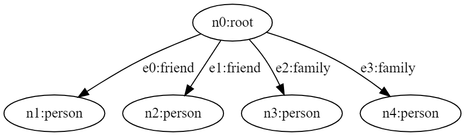

# Operators of Jaseci

## Spawn

<!--need to add more context on this topic-->

## Info and Context

In Jac, you can use the `info` and `context` commands to view the content of a node or edge. Although the following example demonstrates the use of these commands on nodes, the same principles can be applied to edges as well. Take a look at the example below to see how to use the `info` and `context` commands.

**Example:**
```jac
node example{
    has name = "Testing Info and Context commands";
    has result = "Success";
    has favourite_quote = "How you do anything is how you do everything therefore excellence auth to be an habit not an act";
}

walker init{
    example = spawn here node::example;
    context = example.context;
    info = example.info;
    std.out("This is the context result:", context);
    std.out("This is the info result:", info);
}
```

After executing the command above, you will observe that the `context` command displays variables such as name, result, and favourite quote, while the `info` command displays all the information related to the node.

## Take

Jaseci introduces the handy command called "take" to instruct walker to navigate through nodes. You may notice by default, a walker travers with `take` command using the breadth first search approach (refer to the example [here](1_abstractions.md#walkers-navigating-graphs-example)). But the `take` command is flexible hence you can indicate whether the take command should use a depth first or a breadth first traversal to navigate. Look at the following example;

**Example:**
```jac
node plain: has name;

## defining the graph
graph example {
    has anchor head;
    spawn {
        n=[];
        for i=0 to i<7 by i+=1 {
        n.l::append(spawn node::plain(name=i+1));
        }
        n[0] --> n[1] --> n[2];
        n[1] --> n[3];
        n[0] --> n[4] --> n[5];
        n[4] --> n[6];
        head=n[0];
        }
    }

## walker for breadth first search
walker walk_with_breadth {
    has anchor node_order = [];
    node_order.l::append(here.name);
    take:bfs -->; #can be replaced with take:b -->
    }

walker walk_with_depth {
    has anchor node_order = [];
    node_order.l::append(here.name);
    take:dfs -->; #can be replaced with take:d -->
    }

walker init {
    start = spawn here ++> graph::example;
    b_order = spawn start walker::walk_with_breadth;
    d_order = spawn start walker::walk_with_depth;
    std.out("Walk with Breadth:",b_order,"\nWalk with Depth:",d_order);
    }
```

**Output:**

```
Walk with Breadth: [1, 2, 5, 3, 4, 6, 7]
Walk with Depth: [1, 2, 3, 4, 5, 6, 7]
```

You may see in the above example `take:bfs-->` and `take:dfs --` commands instruct walker to traverse breadth first search or depth first search accordingly. Additionally, to define breadth first or depth first traversals, can use the short hand of `take:b -->` or `take:d —>`.

## Skip

The idea behind the abstraction of `skip` in the context of a walkers code block is that it tells a walker to halt and abandon any unfinished work on the current node in favor of moving to the next node (or complete computation if no nodes are queued up).

> **Note**
>
> Node/edge abilities also support the usage of the skip directive. The skip merely decides not to use the remaining steps of that `ability` itself in this context.

Lets change the `init` walker of [example](1_abstractions.md#walkers-navigating-graphs-example) to demostrate how the `skip` command works;

**Example:**

```jac
.
.
.

#init walker traversing
walker init {
    root {
        start = spawn here ++> graph::example;
        take-->;
        }
    plain {
        ## Skipping the nodes with even numbers
        if(here.number % 2==0): skip;
        std.out(here.number);
        take-->;
    }
}
```

**Output:**

```
1
5
7
```
Now it is evident when the node number is an even number, the code in the example above skips the code execution for the particular node. The line `if(here.number %2 ==): skip;` says walker to skips nodes with an even number.

The skip command "breaks" out of a walker or ability rather than a loop, but otherwise has semantics that are nearly comparable to the standard `break` command in other programming languages.

## Disengage

The command `disengage` tells the walker to stop all execution and "disengage" from the graph (i.e., stop visiting nodes anymore from here) and can only be used inside the code body of a walker.

To demonstrate how the `disengage` command functions, let's once more utilize the `init` walker from [example](1_abstractions.md#walkers-navigating-graphs-example);

**Example:**

```jac
.
.
.

#init walker traversing
walker init {
    root {
        start = spawn here ++> graph::example;
        take-->;
        }
    plain {
        ## Stoping execution from the node number equals to 5
        if(here.number==5): disengage;
        std.out(here.number);
        take-->;
    }
}
```

**Output:**

```
1
2
```
The `init` walker in this example is nearly identical to the code in example 5, but we added the condition `if(here.numer == 5): disengage;`. This caused the walker to halt execution and finish its walk, thus truncating the output array.

>**Note**
>
> In addition to a standard disengage, Jac additionally supports a disengage-report shorthand of the type disengage report "I'm disengaging";. Before the disconnect really takes place, this directive produces a final report.


**Technical Semantics of Skip and Disengage**

It's important to remember a few key semantic differences between `skip` and `disengage` commands.

    - The 'skip' statement can be used in the code bodies of walkers and abilities.
    - The 'disengage' statement can only be used in the code body of walkers.
    - 'skip' and 'disengage' statements have no effect on the block of code that ends with an 'exit'. Any code in a walker's with 'exit' block will start running as soon as the walker exit the graph.
    - An easy way to think about these semantics is as similar to the behavior of a traditional return (skip) and a return and stop walking (disengage).

## Ignore

The quite handy command `ignore` from Juseci allows you to skip(ignore) visiting nodes or edges when traversing.

**Example:**

```jac
node person: has name;
edge family;
edge friend;

walker build_example {
    spawn here -[friend]-> node::person(name="Joe");
    spawn here -[friend]-> node::person(name="Susan");
    spawn here -[family]-> node::person(name="Matt");
    spawn here -[family]-> node::person(name="Dan");
    }

walker init {
    root {
        spawn here walker::build_example;
    ignore -[family]->;
    ignore -[friend(name=="Dan")]->;
    take -->;
    }
person {
    std.out(here.name);
    take-->;
    }
}
```

## Destroy

To remove nodes or edges from the graph, Jaseci also offers the very useful command "destroy." Run the example that follows using the 'dot' command in the Jac shell. i.e. `jac dot main.jac`.

**Example:**

```jac
node person: has name;
edge family;
edge friend;

walker build_example {
    spawn here -[friend]-> node::person(name="Joe");
    spawn here -[friend]-> node::person(name="Susan");
    spawn here -[family]-> node::person(name="Matt");
    spawn here -[family]-> node::person(name="Dan");
}

walker init {
    root {
        spawn here walker::build_example;
    for i in -[friend]->: destroy i;
    take -->;
    }

person {
    std.out(here.name);
    take-->;
}
}
```
The majic line in the above code is the `for i in -[friend]->: destroy i;` it instruct walker to remove all the nodes connected by friend edges. try playing with the code by removing and adding `destroy` command.


|                 Graph before `destroy` command                  |                  Graph after `destroy` command                   |
| :-------------------------------------------------------------: | :--------------------------------------------------------------: |
|  |  |


> **Note**
>
> To visualize the dot output can use the Graphviz. An online version of it is [Here](https://dreampuf.github.io/GraphvizOnline/).

## Report

The `report` command in jac resembles a conventional programming logging function in certain ways. The state of each node the walker visits while trarsing will continue to be recorded in this way.

**Example:**
```jac
node person: has name;
edge family;
edge friend;

walker build_example {
spawn here -[friend]-> node::person(name="Joe");
spawn here -[friend]-> node::person(name="Susan");
spawn here -[family]-> node::person(name="Matt");
spawn here -[family]-> node::person(name="Dan");
}

walker init {
    root {
        spawn here walker::build_example;
        spawn -->[0] walker::build_example;
        take -->;
    }
person {
        report here; # report print back on disengage
        take -->;
    }
}
```
**Output:**
```json
{
  "success": true,
    {
      "name": "person",
      "kind": "node",
      "jid": "urn:uuid:dcec06b4-4b7f-461d-bbe1-1fbe22a0ed0c",
      "j_timestamp": "2022-11-03T10:18:08.328560",
      "j_type": "node",
      "context": {
        "name": "Matt"
      }
    },
    {
      "name": "person",
      "kind": "node",
      "jid": "urn:uuid:1dde2125-f858-401e-b0e8-fc2bdb7b38fb",
      "j_timestamp": "2022-11-03T10:18:08.330218",
      "j_type": "node",
      "context": {
        "name": "Dan"
      }
    }
}
```
A portion of the final result is shown in the sample above. As the number of nodes in the graphs grows, the output will lengthen.

**Report Custom**
Supports custom structure as response body.

Example:

```js
    report:custom = `{{ any | {} | [] }}`
```

## **Usage**
This can be combine with walker_callback as 3rd party service requires different json structure on response.
It can also be used for different scenario that doesn't require ctx structure

## Yield

We have so far examined walkers that carry variables and state as they move around a graph. Each time a walk is completed, a walker's state is cleared by default , but node/edge state is preserved. Nevertheless, there are circumstances in which you would want a walker to maintain its state across runs, or even to pause in the middle of a walk and wait to be explicitly called again, updating a subset of its dynamic state. This is where the `yield` keyword comes in.

To see an example of `yield` in action we will modify the 'init' walker from example.

**Example:**

```jac
.
.
.
node person: has name;
edge family;
edge friend;

walker build_example {
spawn here -[friend]-> node::person(name="Joe");
spawn here -[friend]-> node::person(name="Susan");
spawn here -[family]-> node::person(name="Matt");
spawn here -[family]-> node::person(name="Dan");
}

walker init {
    root {
        spawn here walker::build_example;
        spawn -->[0] walker::build_example;
        take -->;
    }
person {
        report here.context;
        take -->;
        yield;
    }
}
```
**Output:**
```json
{
  "success": true,
  "report": [
    {
      "name": "Joe"
    }
  ],
  "final_node": "urn:uuid:b7ebf434-bd90-443a-b8e2-c29589c3da57",
  "yielded": true
}
```

The yield keyword in example 9 instructs the walker simple_yield to stop walking and wait to be called again, even though the walker is instructed to `take-->` edges. In this example, a single next node location is queued up and the walker reports a single here.context each time it’s called, taking only 1 edge per call.

Also note yield can be followed by a number of operations as a shorthand. For example `take-->;` and `yield;` could be combined to a single line with `yield take -->;`. We call
this a `yield-take`. Shorthands include,
- Yield-Take: `yield take -->;`
- Yield-Report: yield `report "hi";`
- Yield-Disengage: `yield disengage; and yield disengage report "bye";`

In each of these cases, the `take`, `report`, and `disengage` executes with the `yield`.

**Technical Semantics of Yield**

There are several key semantics of `yield` to remember, including:

1. Upon a yield, a report is returned back and cleared.
2. Additional report items from further walking will be return on subsequent yields or walk completion.
3. Like the take command, the entire body of the walker will execute on the current node and actually yield at the end of this execution.
• Note: Keep in mind yield can be combined with disengage and skip commands.
4. If a start node, also known as a "prime" node, is supplied while continuing a walker after a yield, the walker will disregard this prime node and continue from where it left off on its journey if there are still other walk nodes it is planned to visit.
5. If there are no nodes scheduled for the walker to go to next, a prime node must be specified (or the walker will continue from root by default).
6. with `entry` and with `exit` code blocks in the walker are not executed upon continuing from a `yield` or executing a `yeild` respectively. Regardless of how many yields there are in between, they only execute once at the beginning and finish of a walk.
7. At the level of the master (user) abstraction, Jaseci maintains the distinction between walkers that have been yielded and need to be resumed and those that are currently being run. The semantics of walkers that are summoned as public are currently unclear. For customized yield behaviors, developers should use the more basic walker spawn and walker execute APIs.
