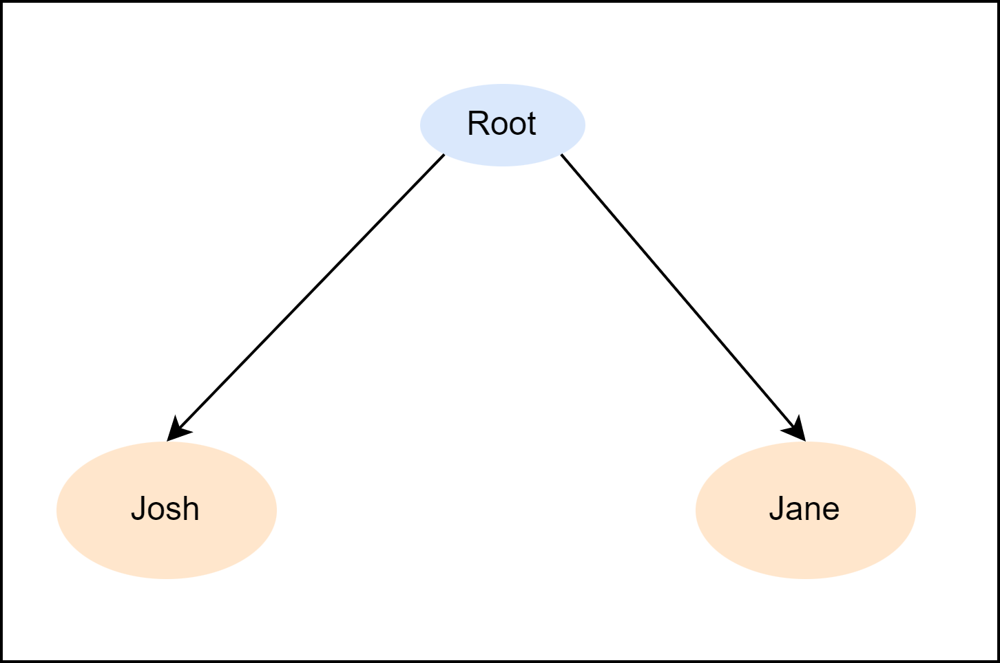
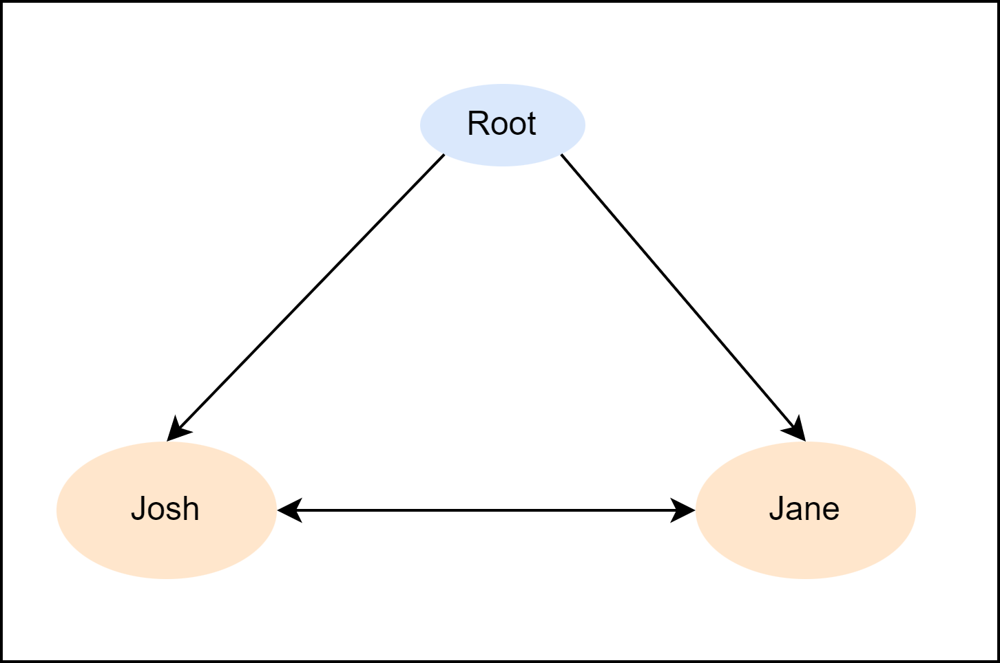
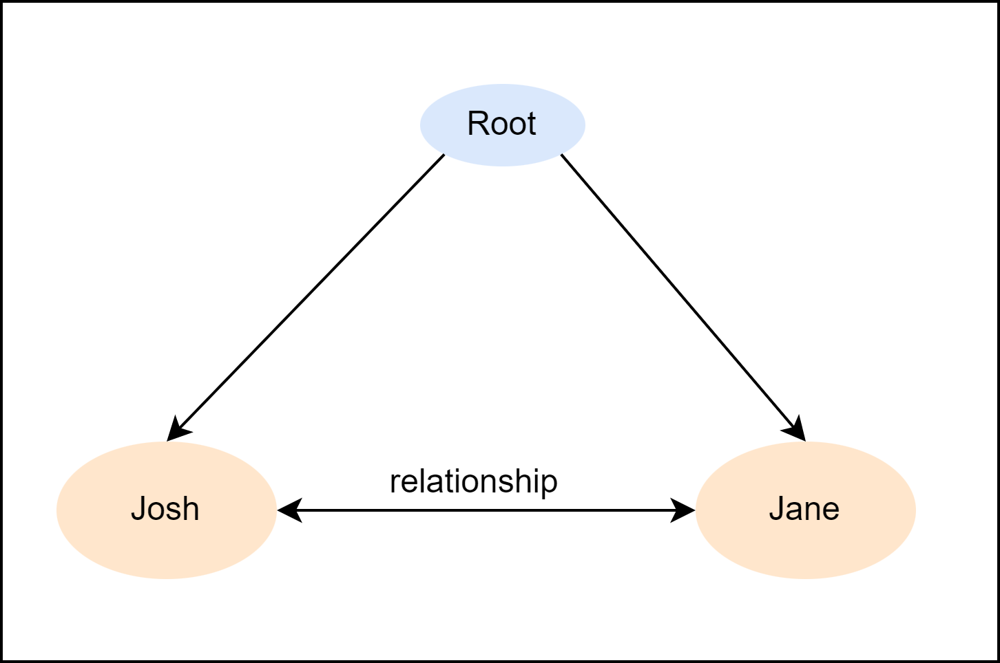
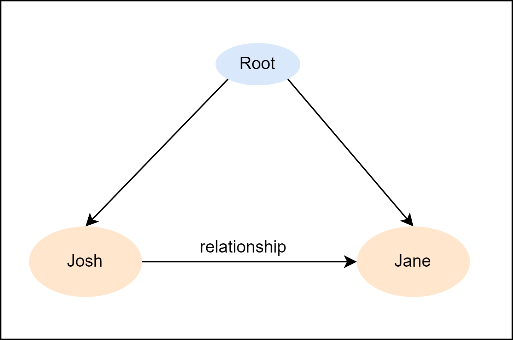
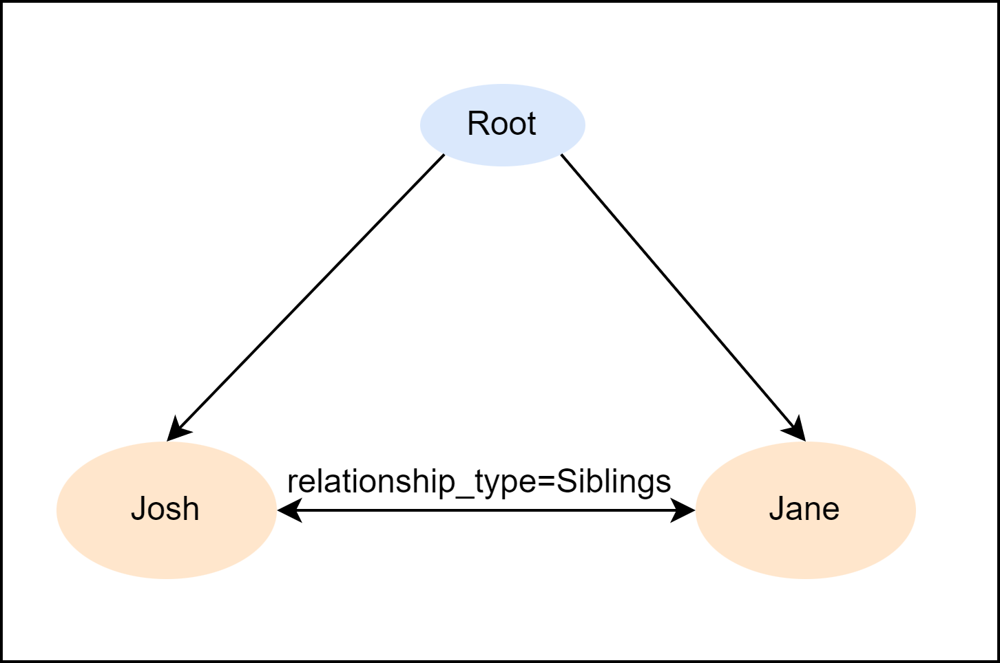
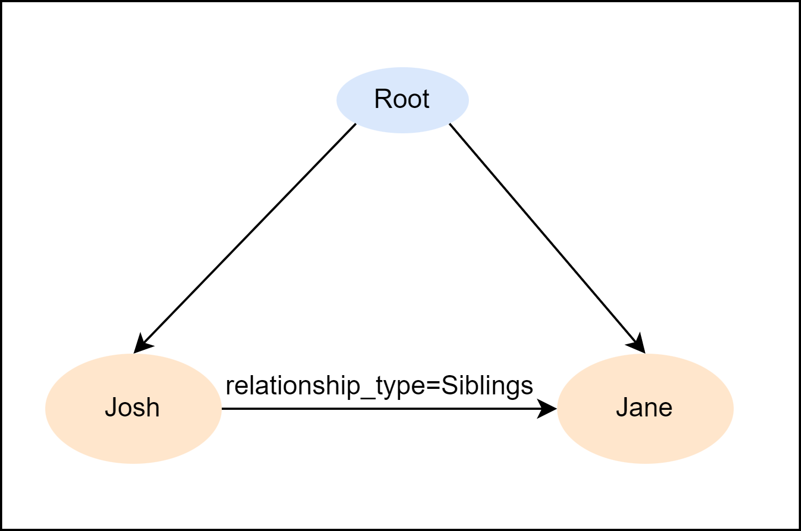
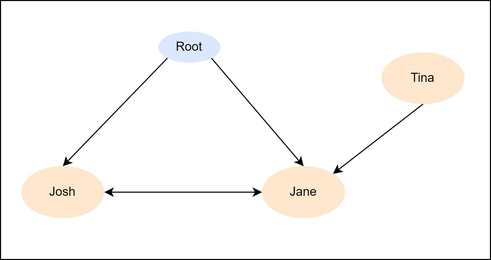

# Graphs

It is strange to see how our programming languages have evolved over the years, and yet, one fundamental data structure has been left behind. **Almost every data structure used by programmers to solve problems can be represented as a graph or a special case of a graph, except for hash tables**. This means that structures such as stacks, lists, queues, trees, heaps, and even graphs can be modeled with graphs. But, despite this, no programming language uses graph semantics as its first order data abstraction.

The graph semantic is incredibly rich and intuitive for humans to understand and is particularly well suited for conceptualizing and solving computational problems, especially in the field of AI. However, some may argue that there are graph libraries available in their preferred language and that a language forcing the concept is not necessary. To this, I argue that core design languages are based on their inherent abstractions, and with graphs not being one of them, the language is not optimized to allow programmers to easily utilize the rich semantics that graphs offer.

Another argument against using graphs as a first-order abstraction is that it might slow down the language. However, modern programming languages have absurd abstractions, such as dynamic typing, which have a higher runtime complexity than what would be needed to support graph semantics. Jaseci aims to revolutionize how we perceive data and memory by making graphs, with their intuitive and rich semantics, the foundational primitive for memory representation.

In Jaseci, we elect to assume the following semantics for the graphs in Jaseci:

1. Graphs are directed with a special case of a doubly directed edge
type which can be utilized practically as an undirected edge.
1. Both nodes and edges have their own distinct identities (i,e. an edge isn’t representable
as a pairing of two nodes). This point is important as both nodes and edges can have
contexts.
1. Multigraphs (i.e., parallel edges) are allowed, including self-loop edges.
2. Graphs are not required to be acyclic.
3. No hypergraphs, as I wouldn’t want Jaseci programmers heads to explode.

Refer to [Wikipedia description of graphs](https://en.wikipedia.org/wiki/Graph_(discrete_mathematics)) to learn more about graphs.

## Nodes
In Jaseci, nodes are a crucial concept. There are two types of nodes:

- **Root node**: It is the starting point of the graph and is a built-in node type. Each graph can have only one root node.
- **Generic node**: It is a built-in node type that can be used throughout the Jaseci application. You can customize the name and properties of this node type as well.

Here's an example code snippet to create a node:

```jac
node person{
    has name, age, birthday, profession;
}
```
In a Jac programming language, we can define variables in a person node using the `has` keyword. For instance, in the above example `name`, `age`, `birthday`, and `profession` are defined as variables. Unlike many other programming languages, we do not have to explicitly declare the variable type. Instead, Jac will automatically detect the type based on the assigned value, such as `String` or `int`.

Moreover, we can set default values for variables. For instance, we could set `profession` to have a default value of `developer` with `has profession = developer` .

## Edges

In Jaseci, edges are an essential component of the graph structure, and they allow for more complex relationships between nodes. As stated above, just like nodes, you can define custom edge types with variables, allowing for more versatility in creating the structure of the graph.

Edges can have specific behaviors or conditions attached to them that trigger a specific action or behavior in the program. For example, in the custom edge provided above, the intent_transition edge type is defined to transition between states based on a user's input intent. This kind of edge behavior is incredibly useful in creating natural language processing (NLP) applications where the system must be able to understand and interpret user input.

By using custom edge types with specific behaviors, you can make your code more modular, easier to read and maintain, and add more functionality to your applications. Additionally, by using edges, you can create more complex relationships between nodes, which can be used to create more complex traversal patterns through the graph structure.

Overall, edges in Jaseci are a powerful tool that can be used to create more complex, intelligent, and versatile applications.

Here is a example of creating a edge in Jac Language.

```jac
edge relationship{
    has relationship_type;
}
```

Like nodes, edges also can have variables. Similarly variables inside edges also treated as variables inside nodes.

## Operators for connecting nodes

In Jaseci, specific operators are used to connect nodes and edges to form graphs;

**`++>`**

This operator is used to connect two nodes in a forward direction. For example, `root ++> node1` will connect root to node1. See the code snippet and the expected graph in the following example.

```jac
walker init {
    node1 = spawn here ++> node::person(name = "Josh", age = 32);
    node2 = spawn here ++> node::person(name = "Jane", age = 30);
}
```
Expected Graph:

  

**`<++>`**

This operator is used to connect two nodes in a backward direction. For example, `node2 <++> node1` will connect node2 to node1 with a bidirectional edge.

```jac
walker init {
    node1 = spawn here ++> node::person(name = "Josh", age = 32);
    node2 = spawn here ++> node::person(name = "Jane", age = 30);
    node1 <++> node2;
}
```

**Expected Graph:**

  

**`<+[name_of_edge]+>`**

This operator is used to connect two nodes in a backward direction with a custom edge type. For example, `node2 <+[custom_edge]+> node1` will connect node2 to node1 with a custom edge type named custom_edge.

```jac
walker init {
    node1 = spawn here ++> node::person(name = "Josh", age = 32);
    node2 = spawn here ++> node::person(name = "Jane", age = 30);
    node1 <+[relationship]+> node2;
}
```
Expected Graph:

  


**`+[name_of_edge]+>`**

This operator is used to connect two nodes in a forward direction with a custom edge type. For example, `node1 +[custom_edge]+> node2` will connect node1 to node2 with a custom edge type named custom_edge.

```jac
walker init {
    node1 = spawn here ++> node::person(name = "Josh", age = 32);
    node2 = spawn here ++> node::person(name = "Jane", age = 30);
    node1 +[relationship]+> node2;
}
```

Expected Graph:

  


**`<+[name_of_edge(variable_declared = some_value)]+>`**

This operator is used to connect two nodes in a backward direction with a custom edge type that has a variable declared with a specific value. For example, `node2 <+[custom_edge(my_var = 42)]+> node1` will connect node2 to node1 with a custom edge type named custom_edge and a variable my_var declared with the value 42.

```jac
walker init {
    node1 = spawn here ++> node::person(name = "Josh", age = 32);
    node2 = spawn here ++> node::person(name = "Jane", age = 30);
    node1 <+[relationship(relationship_type="Siblings")]+> node2;
}
```
Expected Graph:



**`+[name_of_edge(variable_declared = some_value)]+>`**

This operator is used to connect two nodes in a forward direction with a custom edge type that has a variable declared with a specific value. For example, `node1 +[custom_edge(my_var = "hello")]+> node2` will connect node1 to node2 with a custom edge type named custom_edge and a variable my_var declared with the value "hello".

```jac
walker init {
    node1 = spawn here ++> node::person(name = "Josh", age = 32);
    node2 = spawn here ++> node::person(name = "Jane", age = 30);
    node1 +[relationship(relationship_type="Siblings")]+> node2;
}
```

Expected Graph:



These operators allow you to create complex graphs with customized edge types that can hold specific values. By using these operators, you can create a network of nodes that can represent complex data structures, such as trees or graphs. The use of customized edge types also allows you to define specific behavior for different types of connections between nodes.

## Creating Graphs Examples

Graphs can be created by connecting multiple nodes with edges. This is done using the connect operator `++>` `<++>`.

```jac
walker init {
    node1 = spawn here ++> node::person(name = "Josh", age = 32);
    node2 = spawn here ++> node::person(name = "Jane", age = 30);
    node3 = spawn node2 <++ node::person(name="Tina", age = 29);
    node1 <++> node2;
}
```

Expected Graph:



The code shown above generates a graph. You can visualize this graph using Jaseci Studios or the Graphviz graph viewer.
<!-- Need to add links to Jaseci Studio docs and Graphviz docs -->

**Statically Creating Graphs**

Statically creating graphs means creating a graph that is already fixed and doesn't change. The code below shows an example of how to do that in Jaseci.

Let's recreate the above graph statistically;

```jac
graph family {
 has anchor family_root;
    spawn {
        graph_root = spawn node::state(name="root_state");
        user_node = spawn node::user;

        state_home_price_inquiry = spawn node::state(name="home_price_inquiry");
        state_prob_of_approval = spawn node::state(name="prob_of_approval");
        graph_root +[user]+> user_node;
        graph_root +[transition(intent_label = "home price inquiry")]+>state_home_price_inquiry;
        graph_root +[transition(intent_label = "probability of loan approval")]+> state_prob_of_approval;
        state_home_price_inquiry +[transition(intent_label = "specifying location")]+> state_home_price_inquiry;
        state_home_price_inquiry +[transition(intent_label = "home price inquiry")]+> state_home_price_inquiry;
        state_home_price_inquiry +[transition(intent_label = "probability of loan approval")]+> state_prob_of_approval;
        state_prob_of_approval +[transition(intent_label = "home price inquiry")]+> state_home_price_inquiry;
    }
}
```

The graph keyword is used to indicate that a new graph is being created, followed by the name of the graph. The {} are used to wrap everything related to the graph. An anchor named graph_root is declared using the has anchor keyword to identify the starting point of the graph.

After that, the `spawn` keyword is used to begin the creation of nodes and edges, by using `spawn node::` followed by the type of node you want to create (e.g. user or state). You can also specify a name for each node using the name property. Nodes and edges can be connected together using the `++>`  operator.

The transition keyword is used to create an edge with a specific intent label. In the example above, the graph has three states: root_state, home_price_inquiry, and prob_of_approval, and a user node. These states and the user node are connected to each other through transitions with intent labels such as "home price inquiry" or "probability of loan approval".


## Referencing and Dereferencing Nodes and Edges

<!-- Is this is related to nodes and edges??? or is this only for edges or is this is for all of the objects in Jaseci, need clarifications -->

In Jaseci language, referencing and dereferencing of nodes and edges are similar to the references in many programming languages, and they adopt the syntax of pointers in C/C++. The symbol & is used to retrieve the reference of an object, while the symbol * is used for dereferencing. Unlike C/C++, Jaseci references use a unique identifier in UUID format instead of memory locations.

When an object is dereferenced, it is represented as a string in UUID format that corresponds to the unique identifier of the object. This UUID is equivalent to the jid in the object's .info. These referencing and dereferencing operations are useful for input and output of node locations to the client-side, among other applications.

It is important to note that an instance of an archetype is internally represented as a string composed of a UUID that starts with "jac:uuid:". Although this may change in the future, if you assign such a string to a variable in a Jaseci program, the program will treat it like an object.

```jac
node simple: has name;

 walker ref_deref {
    with entry {
        for i=0 to i<3 by i+=1:
        spawn here ++> node::simple(name="node"+i.str);
    }
    var = &(++>[0]);
    std.out('ref:', var);
    std.out('obj:', *var);
    std.out('info:',(*var).info);
}
```

The code snippet creates a simple node with an attribute named name. It then initializes a walker named ref_deref, which creates three new nodes named node0, node1, and node2 and assigns them to the simple node.

The code then assigns the reference of the first node node0 to the var variable using the & operator. The `std.out()` function is used to print out the reference, object, and information related to the var variable.

Observe the following output generated by the above code snippet.

```
ref: urn:uuid:04295f7f-a5bf-4db3-87ce-e13653a81b25
obj: jac:uuid:04295f7f-a5bf-4db3-87ce-e13653a81b25
info: {
    "context": {
        "name": "node0"
        },
    "anchor": null,
    "name": "simple",
    "kind": "node",
    "jid": "urn:uuid:04295f7f-a5bf-4db3-87ce-e13653a81b25",
    "j_timestamp": "2022-08-10T15:57:00.577287",
    "j_type": "node"
}
```

When executed, the code will output the reference and information related to the node0 object. The obj output shows the UUID of the node0 object, while the info output shows the complete information related to the simple node, including its context, anchor, name, kind, and other attributes.

## Plucking values from nodes and edges

In Jaseci, you can easily extract information from nodes and edges by using the pluck feature. Edges in Jaseci have a unique feature that allows you to pluck values from neighboring nodes and edges themselves. By using the syntax **`-->`**, you can extract the value of a specific variable from a neighboring node. This will return a list of the values of that variable from all connected nodes. If you want to filter the results and only extract information from specific nodes, you can specify the name of the edge connected to the node and further specify what value the edge has by using the syntax **`-[name_of_edge(variable = value)]->.name_of_variable_needed`**.

To pluck values from edges, you can simply use the syntax **`-->`** and specify the edge and variable name like this: **`--> .edge.name_of_variable_needed`**.

Here is an example of plucking values from nodes and edges in Jaseci:

```jac
node person {
    has name, age, profession;
}
edge society{
    has location;
}

graph  people_in_society{
    has anchor community;
    spawn{
        professions = ["lawyer", "doctor", "teacher", "athlete", "entrepreneur"];
        community = spawn node::person(name = rand.word(), age = rand.integer(34, 56), profession = rand.choice(professions));
        for i in professions{
            spawn community +[society(location = rand.word())]+> node::person(name = rand.word(), age = rand.integer(34, 56), profession = rand.choice(professions));
        }
    }
}
walker print_names {
    community = -[society]->;
    people = -[society]->.name;
    report {"Plucking people from edge": people};
    location = -[society]->.edge.location;
    report {"Plucking location from edges": location};
}

walker init{
    spawn here ++> graph::people_in_society;
    spawn here walker::print_names;
    root{
        take-->[0];
    }
}
 ```
Expected output with Jac Run:

```json
{
  "success": true,
    {
      "Plucking location from edges": []
    },
    {
      "Plucking people from edge": [
        "non",
        "est",
        "adipisci",
        "eius",
        "quia"
      ]
    },
    {
      "Plucking location from edges": [
        "est",
        "eius",
        "ipsum",
        "aliquam",
        "adipisci"
      ]
    },
  "final_node": "urn:uuid:9abb0dc4-538a-4ccb-8d90-fc9d46d845a1",
  "yielded": false
}
```

 In this example, we create a graph called people_in_society that contains nodes representing people and an edge called society that connects the nodes. The society edge has a location variable. The print_names walker plucks the names of the people and their locations from the society edge and reports them.

The pluck feature in Jaseci allows for easy extraction of information from nodes and edges, which can be useful in many different scenarios.

## Node and Edge Inheritance

JAC allows for nodes and edges  to inherit attributes and functions of the same type .

### Node Inheritance

See the examples below which demonstrate the node inheritance. The `input_state` and `output_state` nodes are inherited from the `state` node.

```jac
node state {
    has title;
    has message;
    has prompts;
}

node input_state:state {
    has input;
}

node output_state :input:state{
    has output;
}
```

### Edge Inheritance

In the following example the `transition_back` edge was inherited from the `transition` node.

```jac
edge transition {
    has transition_next ;
}

edge transition_back: transition {
    has prev_step ;
}
```
