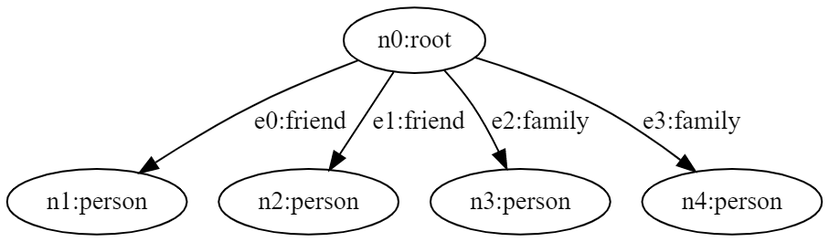
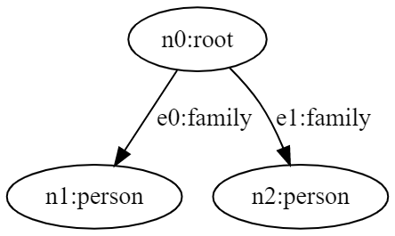

# Destroy

To remove nodes or edges from the graph, Jaseci also offers the very useful command "destroy." Run the example that follows using the 'dot' command in the Jac shell. i.e. `jac dot main.jac`.


```jac
node person: has name;
edge family;
edge friend;

walker build_example {
    spawn here +[friend]+> node::person(name="Joe");
    spawn here +[friend]+> node::person(name="Susan");
    spawn here +[family]+> node::person(name="Matt");
    spawn here +[family]+> node::person(name="Dan");
}

walker init {
    root {
        spawn here walker::build_example;
    for i in -[friend]->:
        destroy i;
    take -->;
    }

person {
    std.out(here.name);
    take-->;
}
}
```

The majic line in the above code is the `for i in -[friend]->: destroy i;` it instruct walker to remove all the nodes connected by friend edges. Try playing with the code by removing and adding `destroy` command.


|                Graph before `destroy` command                |                 Graph after `destroy` command                 |
| :----------------------------------------------------------: | :-----------------------------------------------------------: |
|  |  |


> **Note**
>
> To visualize the dot output can use the Graphviz. An online version of it is [Here](https://dreampuf.github.io/GraphvizOnline/).