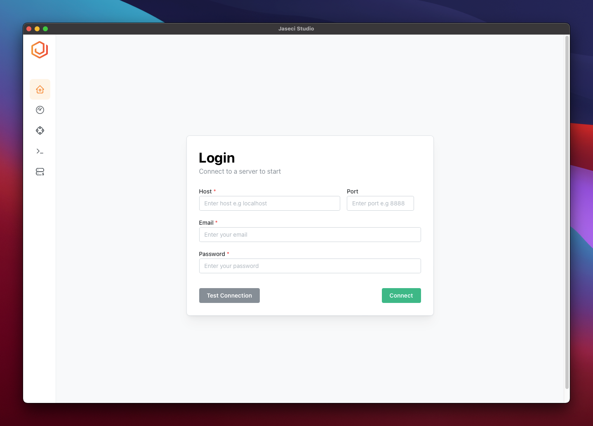
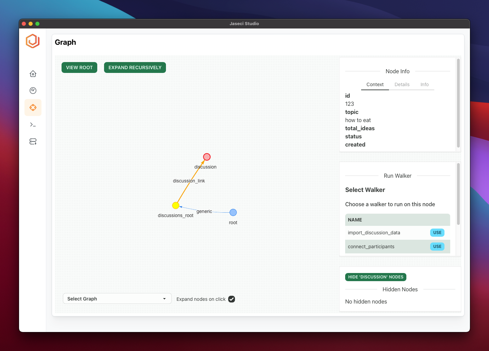

# Setting up Jaseci Studio

Managing Your Jaseci Application with Jaseci Studio

Jaseci Studio provides a user-friendly interface for managing and visualizing changes to your Jaseci project. To install Jaseci Studio, simply visit the [latest jaseci release](https://github.com/Jaseci-Labs/jaseci/releases/latest) and download the binary that is relevant to your operating system. We have executables available for macOS/iOS, Windows, and Linux.

While we will delve into the details of Jaseci Studio in a later section, it is worth noting that installing Jaseci Studio is a crucial step towards mastering Jaseci. If you are curious about the features of Jaseci Studio and how to develop applications with it, feel free to skip ahead to that section. However, for the purposes of this section, we will be developing in VS Code.

For a comprehensive list of Jaseci Studio's features, [click here](#features-summery).

## Installing For Developers

### Setup

- Install [rust](https://www.rust-lang.org/learn/get-started)

```bash
curl https://sh.rustup.rs -sSf | sh
```

- Install nodejs

```
curl -fsSL https://deb.nodesource.com/setup_16.x | sudo -E bash
sudo apt-get install -y nodejs
node -v
```

- Install [yarn](https://classic.yarnpkg.com/lang/en/docs/install/)
```
sudo npm install --global yarn
```

- Run `yarn install`
- Run `yarn setup:ui`

### Running the Dev Server

- To start the development server along with the tauri instance run `yarn tauri dev`. You will see an application window popup.

- To start only the NextJS development server run `yarn dev`. Then go to `localhost:1420` to view the website.

### Building the Application

- Run `yarn tauri build` to build the application.

- To build for linux you may need to install the following packages

```
sudo apt install libwebkit2gtk-4.0-dev \
    build-essential \
    curl \
    wget \
    libssl-dev \
    libgtk-3-dev \
    libayatana-appindicator3-dev \
    librsvg2-dev \
    pkg-config \
    libssl-dev \
    libdbus-1-dev \
```

- To build for windows you'll need to install rust for windows and node.js for windows
  - Once you have node install you might have to run `corepack enable` to activate yarn
- You can specify the target platform when building the application by running `yarn tauri build --target universal-apple-darwin`
  - Use `rustup target list` to get a list of targets

## Testing

- Run `yarn test:e2e` to run unit tests with [Playwright](https://playwright.dev/)
  - API mocks uses [msw](https://mswjs.io/)
- Run `yarn test:unit` to run unit tests with [Vitest](https://vitest.dev/)
  - Component testing uses [react-testing-library](https://testing-library.com/docs/react-testing-library/intro)

## Features Summery

1. Login
   

2. Summary View
   1. See number of distinct nodes, edges and walkers and graphs
   2. View version of jaseci instance

   

3. Graph Viewer
   1. View node and edge information (context, details, info)
   2. Run walker on node
   3. View Root
   4. Switch Graph
   5. Node Interactions
      1. Expand/Collapse
      2. Expand Node Recursively
   6. Hide groups of node and edges
   7. Expand node or view only connected nodes on click

   

4. Logs Viewer
   1. Filter logs
   2. Scroll to top / bottom / pause logs
   3. Filter by level

  

1. Managing Archetypes
   1. View archetypes and remove archetypes
   2. Write and register archetypes
   3. View archetype code