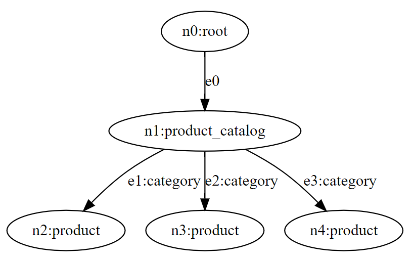

As the first step of the jac program let's build a graph to the shop.

### Nodes

Nodes can be thought of as the representation of an entity.
Nodes are the fundamental unit of  a graph. These can be considered to be the steps in which the Walker can take.

* Nodes are composed of Context and executable actions.
* Nodes execute a set of actions upon entry and exit.


The shop graph will have nodes named `product`, `product_catalog`. Let's define them. The has keyword is used to declare a variable for the node. The `product` node has two variables named `name` and `stock`. The default value of `stock` is 0 where the `product_catalog` doesn't have any variables defined yet.

```jac
node product {
    has name;
    has stock = 0;
}

node product_catalog;
```
To get more information about nodes you can go [here](../../development/abstractions/graphs#nodes)

### Edges

Edges are the link between nodes. They walker will use these edges to determine the next node to traverse to.
The has key word is used to declare the variable "intent". This "intent" is what the Walker will use to to determine which node to go to next. To get more information about edges you can go [here](../../development/abstractions/graphs#edges)


The shop graph has one type of edges named `category`. We can define that as follows;

```
edge category {
    has name;
}
```

### Connecting nodes and edges to create a graph

The nodes of are connected to each other with edges to create a graph.

The `graph` is a collection of initialized nodes.
The `has anchor` key word is used to identify the root node. The Root node is the node where the walker's traversal begins.
The has anchor key word is used to state the root node. The Root node is the node where the walker's traversal begins.

`spawn` is used to create to create child nodes, which is used to design flow of the conversational experience.
We are able to create additional edges to connect nodes which which do not share a parent -child relationship.

```jac
graph shop {
    has anchor catalog;
    spawn {
        catalog = spawn node::product_catalog;

        apple = spawn node::product(name="apple");
        catalog +[category(name="fruit")]+> apple;

        banana = spawn node::product(name="banana");
        catalog +[category(name="fruit")]+> banana;

        notebook = spawn node::product(name="notebook");
        catalog +[category(name="supplies")]+> notebook;
    }
}
```

```jac
walker init {
    root: spawn here ++> graph::shop;
}
```

## Walker

Walkers traverse the nodes of the graph triggering execution at the node level. To get more information about walkers you can go [here](../../development/abstractions/walkers)

The `init` walker works as the main method of the Jac program. Let's create the `init` walker to `spawn` the graph.

```
walker init {
    root: spawn here ++> graph::shop;
}
```

## Executing a `jac` Program

Save the above codes in a file called `shop.jac`. `.jac` is the file extension for jac program. Jac program can execute in a `jsctl` shell with `jac run` command.

```bash
jaseci> jac run shop.jac
```

And you will see an output similar to the upon execution of this code;

```json
{
  "success": true,
  "report": [],
  "final_node": "urn:uuid:79917fff-25ad-4171-a0b6-8dd46076b5c0",
  "yielded": false
}
```

To view the graph structure you can run the `shop.jac` with `jac dot` command.

```bash
jaseci> jac dot shop.jac
```

Here is the output generated by the `jac dot`.

```json
strict digraph root {
    "n0" [ label="n0:root"  ]
    "n1" [ label="n1:product_catalog"  ]
    "n2" [ label="n2:product"  ]
    "n3" [ label="n3:product"  ]
    "n4" [ label="n4:product"  ]
    "n0" -> "n1" [ label="e0" ]
    "n1" -> "n2" [ label="e1:category" ]
    "n1" -> "n3" [ label="e2:category" ]
    "n1" -> "n4" [ label="e3:category" ]
}
```

You can view the graphical view of the graph structure here at [Graphviz](https://dreampuf.github.io/GraphvizOnline/)

