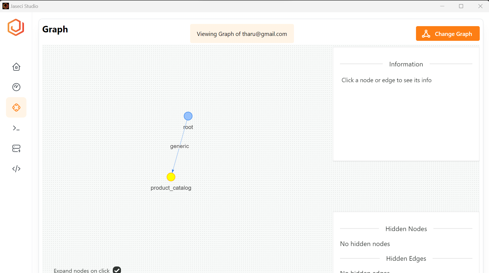
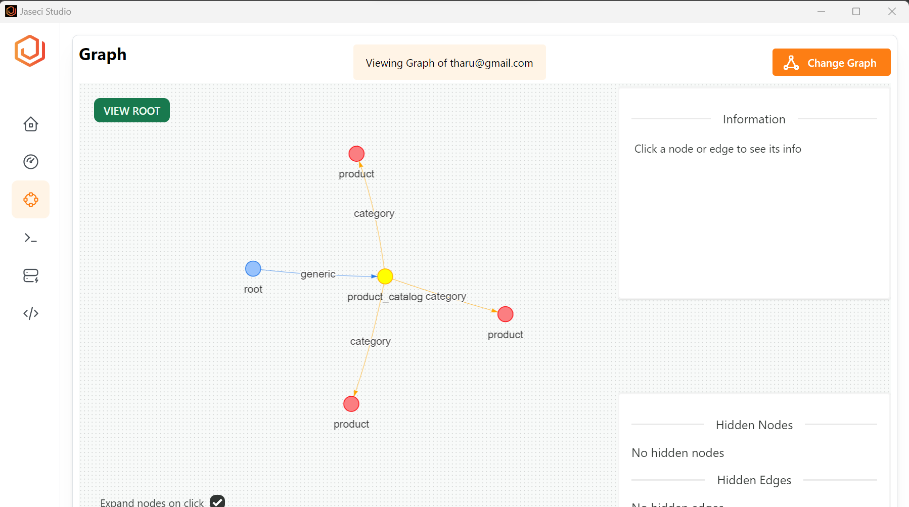
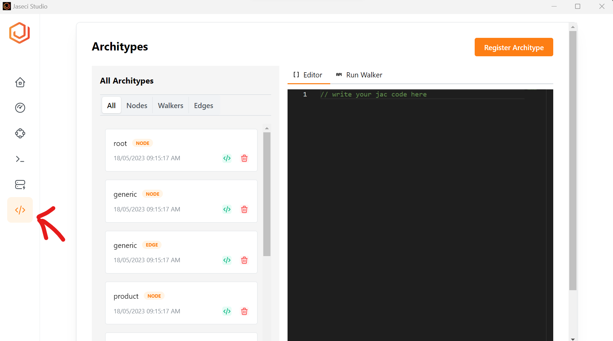

As the first step of the JAC program, let's build a graph for the shop. Throughout the entire process of building this app, we will be using Jac Language, Jaseci Server and Jaseci Studio. Therefore, make sure to set up them and ensure everything is up running before starting this tutorial.

### Nodes

Nodes can be thought of as the representation of an entity.
Nodes are the fundamental unit of  a graph. These can be considered to be the steps in which the Walker can take.

* Nodes are composed of Context and executable actions.
* Nodes execute a set of actions upon entry and exit.


The shop graph will have nodes named `product`, `product_catalog`. Let's define them. The `has` keyword is used to declare a variable for the node. The `product` node has two variables named `name` and `stock`. The default value of `stock` is 0. Open the Jaseci Studio and go to archetype section. Copy the following content into editor and click on the register archetype button. Then you will see an `node` named product has created in the list of archetype.

```jac
node product {
    has name;
    has stock = 0;
}
```


The `product_catalog` doesn't have any variables defined yet.

```jac
node product_catalog;
```
Register archetype for `product_catalog` as we have done for the `product` node.


To get more information about nodes you can go [here](../../development/abstractions/graphs#nodes)

### Edges

Edges are the link between nodes. They walker will use these edges to determine the next node to traverse to.
The has key word is used to declare the variable "intent". This "intent" is what the Walker will use to to determine which node to go to next. To get more information about edges you can go [here](../../development/abstractions/graphs#edges)


The shop graph has one type of edges named `category`. We can define that as follows;

```
edge category {
    has name;
}
```

Similarly as we did for `product` and `product_catalog` nodes, register archetype for `category` edge in the Jaseci Studio.

### Connecting nodes and edges to create a graph

The nodes of are connected to each other with edges to create a graph.

The `graph` is a collection of initialized nodes.
The `has anchor` key word is used to identify the root node. The Root node is the node where the walker's traversal begins.
The has anchor key word is used to state the root node. The Root node is the node where the walker's traversal begins.

`spawn` is used to create to create child nodes, which is used to design flow of the conversational experience.
We are able to create additional edges to connect nodes which which do not share a parent -child relationship.

```jac
graph shop {
    has anchor catalog;
    spawn {
        catalog = spawn node::product_catalog;

        apple = spawn node::product(name="apple");
        catalog +[category(name="fruit")]+> apple;

        banana = spawn node::product(name="banana");
        catalog +[category(name="fruit")]+> banana;

        notebook = spawn node::product(name="notebook");
        catalog +[category(name="supplies")]+> notebook;
    }
}
```
Copy the graph code snippet to the editor in the Jaseci Studio and register the graph archetype.

## Walker

Walkers traverse the nodes of the graph triggering execution at the node level. To get more information about walkers you can go [here](../../development/abstractions/walkers)

The `init` walker works as the main method of the Jac program. Let's create the `init` walker to `spawn` the graph. Now all you need is to create a walker to initiate the graph. Let's can do that in a similar way. Use following code to create the walker archetype in Jaseci Studio.

```jac
walker init {
    root: spawn here ++> graph::shop;
}
```

## Executing Graph with Jaseci Studio

You can execute `walker` in Jaseci Studio with just few clicks. Goto "Run Walker" tab (Next to the "Editor" tab). select the init walker from the drop down list and hit the "Run Now" button. After execution of init walker you will see following result in the results window.


Goto the graph tab in the left side bar and select the `uuid` from the Select Graph drop down. You will see a graph like this.



Double click on the yellow color product catalog node to view all attached product nodes.



Now you have created a shop graph in Jaseci Studio, in next sections we will do basic operations like checking the inventory, purchasing and selling items from product catalogue.

You can access all the archetypes you created in the jac program through the Archetype tab in the left sidebar of Jaseci Studio as in below image.



## Executing a `jac` Program in Terminal

Save the above codes in a file called `shop.jac`. `.jac` is the file extension for jac program. Jac program can execute in a `jsctl` shell with `jac run` command.

```bash
jaseci> jac run shop.jac
```

And you will see an output similar to the upon execution of this code;

```json
{
  "success": true,
  "report": [],
  "final_node": "urn:uuid:79917fff-25ad-4171-a0b6-8dd46076b5c0",
  "yielded": false
}
```

To view the graph structure you can run the `shop.jac` with `jac dot` command.

```bash
jaseci> jac dot shop.jac
```

Here is the output generated by the `jac dot`.

```json
strict digraph root {
    "n0" [ label="n0:root"  ]
    "n1" [ label="n1:product_catalog"  ]
    "n2" [ label="n2:product"  ]
    "n3" [ label="n3:product"  ]
    "n4" [ label="n4:product"  ]
    "n0" -> "n1" [ label="e0" ]
    "n1" -> "n2" [ label="e1:category" ]
    "n1" -> "n3" [ label="e2:category" ]
    "n1" -> "n4" [ label="e3:category" ]
}
```

You can view the graphical view of the graph structure here at [Graphviz](https://dreampuf.github.io/GraphvizOnline/)


