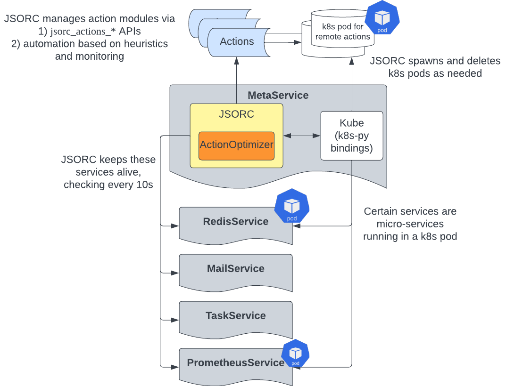

## JSORC Action Optimizer

### What is JSORC?
JSORC is short for the JaSeci ORChestrator.
It is a key component of the jaseci runtime system that oversees the various components and services of the Jaseci runtime system.

### Jaseci Actions
Jaseci actions are extension to the core Jaseci runtime.
Jaseci actions are used to introduce external libraries and functionalities to your jaseci applications.
Examples include AI models and useful python packages (such as numpy and scipy).
As a jaseci developer, one can use the standard jaseci action APIs to load and unlod actions.
Refer to the actions section of the jaseci documentation for more details.

### Why do we need JSORC?
With standard actions APIs, developers need to manually make decision on whether the action should be a local action or remote action and explictly manage any remote instances if needed.
This introduces complexity for the developers as well as potential impact on performance.
JSORC solves this by subsuming this responsibility and automatically manage actions based on its observations of the state of the runtime system.

### JSORC API details
With JSORC, we introduce a new set of APIs for loading and unloading actions:

- `jsorc_actions_load`

    Load an action module via JSORC. Different from the standard actions load API, only the action module's name and the local/remote mode are required. JSORC will locate the python module path or spawn a remote pod automatically depending on the option specified.
    ```bash
    # Load a module action
    jsorc actions load use_enc -mode module

    # Load a remote action. Note that no URL is needed.
    jsorc actions load use_enc -mode remote
    ```
- `jsorc_actions_status`

    Retrieve the current status of a particular action
    ```bash
    jsorc actions status use_enc
    ```

- `jsorc_actions_unload`

    Unload an action module.
    ```bash
    # Auto unload
    jsorc actions unload use_enc -mode auto
    ```

- `jsorc_actions_config`

    Before JSORC can manage an action, its config needed to be loaded.
    ```bash
    jsorc actions config use_enc jaseci_ai_kit.config
    ```

A set of APIs for setting a custom actions management policy

- jsorc_actionpolicy_set

    Specify an automatic action management policy for JSORC. Currently only default is supported, more policies to be added soon.
    ```bash
    jsorc actionpolicy set default
    ```
- jsorc_actionpolicy_get

    Get the current active action management policy.
    ```bash
    jsorc actionpolicy get
    ```

There are also a set of APIs for performance tracking and bench marking:

- jsorc_trackact_start/stop

    JSORC can track all action calls happen in your program. You can start and stop this tracking
    ```bash
    jsorc trackact start
    jsorc trackact stop
    ```

- jsorc_becnhmark_start/stop/report

    Activate performance benchmark mode for JSORC, where request level latency and throughput performance will be monitored and reported.
    ```bash
    jsorc benchmark start
    jsorc benchmark stop
    jsorc benchmark report
    ```

- jsorc_tracksys_start/stop/report

    Activate system status tracking mode for JSORC, where JSORC leverages prometheus to record various metrics about the cluster (e.g. CPU, memory and network utilization)

- jsorc_loadtest (for experimentation/research only)

    Execute designed performance load test.

For more examples of these APIs, check out the JSORC unit tests (https://github.com/Jaseci-Labs/jaseci/blob/main/jaseci_serv/jaseci_serv/jsorc/tests/test_jsorc_api_kube.py).

### JSORC Architecture



Above is a overview diagram of the JSORC implementation architecture.
JSORC is housed inside the MetaService.
MetaService/JSORC is responsible for keeping the other services alive at runtime.
Currently these services include Redis, Mail, Task and Prometheus, as illustrated in the diagram.
JSORC uses the `Kube` class to manage the cluster it is in.
The `Kube` class leverages the kubernetes python client to monitor the cluster and create, update and delete resources.
In addition, JSORC also manages the action modules.
It does this via two venues.
First, user can call the set of jsorc action management APIs (listed above, `jsorc_actions_*`).
These APIs provide a simpler interface to load and unload action modules as JSORC subsumes some of the responsibilities.
Second, by setting the appropriate action policy, JSORC can also automatically manage the action modules based on certain heuristics (more details on this to be added).

### Activate JSORC
JSORC is currently turned off by default.
The activation of JSORC is controlled by the field `automation` in `jaseci_core/jaseci/svc/config.py`.
So to activate JSORC, you can do one of the following two things:

1. For an existing jaseci instance, you need to make two API calls to activate JSORC (you can also do these via the equivalent commands in jsctl):
    1. Update the jsorc config to set automation as True
    ```bash
    POST request to /config_set/ with payload
    {
        "name": "META_CONFIG",
        "value": "{\"automation\": true, \"backoff_interval\": 10, \"namespace\": \"default\", \"keep_alive\": [\"promon\", \"redis\", \"task\", \"mail\"], \"kubernetes\": {\"in_cluster\": true, \"config\": null}}"
        }
    ```
    Note that the `value` field here is a string that can be parsed as JSON.
    There is also a `config_get` API that you can use to get the current value of the `META_CONFIG`

    2. Refresh the service
    ```bash
    POST request to /service_refresh/ with payload
    {
        "name": "meta"
    }
    ```
    This will restart the meta service which controls JSORC.

    If the requests are successful, you should see JSORC checks if the services are alive and create them if not in the pod logs of jaseci.

2. If (and only if) you are starting a jaseci instance with a fresh DB and redis stack, you can set the `automation` field to be `True` in the source code (config.py) and then stand up the jaseci instance.

Note: use this manifest (https://github.com/Jaseci-Labs/jaseci/blob/main/scripts/jsorc/jaseci.yaml) if you wish to have JSORC spawn redis.

### Relevant Source Code (for contributors)
* jaseci/svc/common.py
* jaseci/svc/meta.py
* jaseci/svc/config.py

### Todos
* Include jaseci-db in JSORC's purview.
* Expose prometheus dashboard (potentially grafana) at a fixed url.

# JsOrc Development

#### **SETTINGS** ([JsOrcSettings](../../../jaseci_core/jaseci/jsorc_settings.py))
- this will holds default configuration for services and it's manifest

#### **CONFIG** ([JsOrcSettings](../../../jaseci_core/jaseci/jsorc_settings.py).`JSORC_CONFIG`)
```python
# JsOrc is always enabled
{
    # this will be the interval for regeneration
    "backoff_interval": 10,

    # preloaded services is included on initial JsOrc regenerate
    "pre_loaded_services": ["kube", "redis", "prome", "mail", "task", "elastic"],
}
```

#### **REGENERATION**
- JsOrc are now always enabled and will try to regenerate.
    - Initial regen sequence
        - trigger after build up
        - will check for db connection (if enabled in [JsOrcSettings](../../../jaseci_core/jaseci/jsorc_settings.py).`DB_REGEN_CONFIG`)
            - connected: skip the spawing of `jaseci-db`
            - not connected: will try to spawn `jaseci-db` using [JsOrcSettings](../../../jaseci_core/jaseci/jsorc_settings.py).`DB_REGEN_MANIFEST`
            - recheck again if it can establish the connection (loop until connection is established)
                - once connected: `raise SystemExit`
                - this is to restart the pod and be able to process makemigrations/migrate
        - jaseci should now have a proper db connection
        - JsOrc will now try to load every pre_loaded_services
            - if failure occured on service initialization
                - try to apply manifest and spawn the needed pods
                - retry to initialize
                    - failed: tagged it again for regeneration
        - JsOrc should now have all pre_loaded_services loaded
    - Interval regen
        - every `{{backoff_interval}}` seconds
        - it will ignore additional trigger if previous regeneration is still happening


---

# **`Pillars`**

## **`Service`**
#### **Features**
- Lazy Loading
    - it will only initialized when needed unless it was tagged as automated in config
- Automation
    - if enabled: it will be included on the regeneration process once error occured

#### **Prerequisite**
    - class should be decorated as service and extend from JsOrc.CommonService

#### **Syntax**
- **`Declaration`**
```python
from jaseci.jsorc.jsorc import JsOrc

@JsOrc.service(
    # name of the service
    name="redis",

    # service config
    config="REDIS_CONFIG",

    # nullable
    # used for regeneration and spawning kube
    # from JsOrcSettings as default then db/redis later on
    manifest="REDIS_MANIFEST",

    # when you have multiple version of the class and have the same name
    # highest value will be used
    priority=0, # defaults to zero

    # allow to use proxy (Fake not running service) when trying to build a hook
    # this is to avoid error on startup since django are not yet fully initialized
    proxy=True,
)
class RedisService(JsOrc.CommonService):
    # your implementation
```
- **`Accessing`**
```python
from jaseci.jsorc.jsorc import JsOrc

def any_method():
    redis = JsOrc.svc("redis")
```

#### **Common Attributes**

| Attribute | Description                                                                                                  |
| --------- | ------------------------------------------------------------------------------------------------------------ |
| app       | Attribute for the actual library used in service. For example in TaskService is Celery                       |
| enabled   | If service is enabled in config. The service can be available (upon building) but not enabled (from config)  |
| automated | If service is automated in config. The service will be part of regeneration if it can't initialized properly |
| state     | For `service life cycle`                                                                                     |
| quiet     | For log control and avoid uncessary logs                                                                     |

#### **Common Methods**
| Methods            | Arguments                          | Description                                                                                                                                                                                                                                                              | Example                                               |
| ------------------ | ---------------------------------- | ------------------------------------------------------------------------------------------------------------------------------------------------------------------------------------------------------------------------------------------------------------------------ | ----------------------------------------------------- |
| `poke`             | `cast`= nullable, `msg` = nullable | poke will try to check if the service is running. Throw the error `msg` (else default mesesage) if not running. `cast` is for casting the returned value of poke. if casted to the current service class, it will return the service instance instead of the service.app | `JsOrc.svc("redis").poke()`                           |
| `is_ready`         |                                    | check if state is `NOT_STARTED` and app is not yet set                                                                                                                                                                                                                   |                                                       |
| `is_running`       |                                    | check if state is `RUNNING` and app is set                                                                                                                                                                                                                               |                                                       |
| `has_failed`       |                                    | check if state is `FAILED`                                                                                                                                                                                                                                               |                                                       |
| `spawn_daemon`     | name_of_daemon=targe_method        | spawn daemon threads for background process                                                                                                                                                                                                                              | `self.spawn_daemon(jsorc=self.interval_check)`        |
| `terminate_daemon` | name_of_daemon_to_terminate...     | terminate daemon threads                                                                                                                                                                                                                                                 | `self.terminate_daemon("jsorc", "other_daemon_name")` |

#### **Service Life Cycle** (can be overriden)
- **\_\_init\_\_** ()
    - this is optional to be overriden if you have additional fields to be use
    - initial state would be `NOT_STARTED`
```python
    def __init__(self, config: dict, manifest: dict):
        super().__init__(config, manifest) # run CommonService init
        # ... your other code here ...
```

- **run** (required to be overriden)
    - triggered upon `service.start()`
    - upon trigger `start` it still need to check if it's enabled and on ready state (`NOT_STARTED`)
    - if service is not enabled this method will be ignored
    - if service is enabled but state is not equal to `NOT_STARTED` run method will also be ignored
    - if all requirements were met, state will be updated to `STARTED` before running run method
    - if run method raised some exception, state will update to `FAILED` and `failed` method will be called
    - if run method is executed without error state will be updated to `RUNNING`

```python
    # redis_svc.py
    def run(self):
        self.app = Redis(**self.config, decode_responses=True)
        self.app.ping()
```

- **post_run** (optional)
    - triggered after `run` method and if state is already set to `RUNNING`

```python
    # task_svc.py
    def post_run(self):
        self.spawn_daemon(
            worker=self.app.Worker(quiet=self.quiet).start,
            scheduler=self.app.Beat(socket_timeout=None, quiet=self.quiet).run,
        ) # spawn some threads for Celery worker and scheduler
```

- **failed** (optional)
    - this will be used if you have other process that needs to be executed upon start failure
```python
    # task_svc.py
    def failed(self):
        super().failed()
        self.terminate_daemon("worker", "scheduler") # close some thread when error occurs (task.py example)
```

- **on_delete** (optional)
    - this will be used if you have other process that needs to be executed upon resetting
```python
    # task_svc.py
    def on_delete(self): # will be trigger once garbage collected
        self.terminate_daemon("worker", "scheduler")
```

---
## **`Repository`**
#### **Features**
- targetted class should be related on any datasource such as database, redis and etc
- to handle class overriding even on lower build
> ex: jaseci_serv's orm_hook
>
> If you want to initialize hook on jaseci_core you may only use RedisHook/MemoryHook class.
> If you try to run it with jaseci_serv, you may still need to cast it to OrmHook before you may be able to use it.
> JsOrc will try to handle it for you. If you try to get repository class, it will try to get the highest priority class even the source code doesn't have access on it.
> Let say you have `MemoryHook` [prio 0] / `RedisHook` [prio 1] / `OrmHook` [prio 2] classes and tagged as `hook`. `JsOrc.src("hook") or JsOrc.hook()` will always return `OrmHook` even you initialized it on jaseci_core as long as `OrmHook` class is loaded

#### **Syntax**
- **`Declaration`**
```python
from jaseci.jsorc.jsorc import JsOrc

@JsOrc.repository(
    name="hook",
    priority=0
)
class MemoryHook():
    # your implementation

@JsOrc.repository(
    name="hook",
    priority=1
)
class RedisHook():
    # your implementation

@JsOrc.repository(
    name="hook",
    priority=2
)
class OrmHook():
    # your implementation
```
- **`Accessing`**
```python
from jaseci.jsorc.jsorc import JsOrc

def anywhere_any_method():
    hook = JsOrc.src("hook") # or JsOrc.hook()
    hook # == OrmHook instance as long as it's class is loaded
```

## **`Context`**

#### **Features**
- no restriction on class but similar to repository

#### **Syntax**
- **`Declaration`**
```python
from jaseci.jsorc.jsorc import JsOrc

@JsOrc.context(
    name="master",
    priority=0
)
class Master():
    # your implementation

@JsOrc.context(
    name="master",
    priority=1
)
class Master2():
    # your implementation

@JsOrc.context(
    name="master",
    priority=2
)
class Master3():
    # your implementation
```
- **`Accessing`**
```python
from jaseci.jsorc.jsorc import JsOrc

def anywhere_any_method():
    master1 = JsOrc.ctx("master") # always new instance
    master1 # == Master3 instance as long as it's class is loaded

    master2 = JsOrc.get("master") # will use persisting instance
    master1 != master2 # True
    master2 == JsOrc.get("master") # True
    JsOrc.destroy("master") # destroy persisting instance
    JsOrc.renew("master") # destroy if existing then create another persisting instance
```

# **`Additional Feature`** (preferably for testing)

```python
from jaseci.jsorc.jsorc import JsOrc

@JsOrc.inject(
    services = [
        "mail", # mail service
        ("task", "task_alias") # task service with alias
    ],
    repositories = [
        "hook", # OrmHook and always new instance
        ("hook", "any_alias") # OrmHook but with alias
    ],
    context = [
        "master", # always new instance
    ]
)
def anywhere_any_method(mail, task_alias, hook, any_alias, master):
    # your testing or implementation
```

# JsOrc Development

#### **SETTINGS** ([JsOrcSettings](../../../jaseci_core/jaseci/jsorc_settings.py))
- this will holds default configuration for services and it's manifest

#### **CONFIG** ([JsOrcSettings](../../../jaseci_core/jaseci/jsorc_settings.py).`JSORC_CONFIG`)
```python
# JsOrc is always enabled
{
    # this will be the interval for regeneration
    "backoff_interval": 10,

    # preloaded services is included on initial JsOrc regenerate
    "pre_loaded_services": ["kube", "redis", "prome", "mail", "task", "elastic"],
}
```

#### **REGENERATION**
- JsOrc are now always enabled and will try to regenerate.
    - Initial regen sequence
        - trigger after build up
        - will check for db connection (if enabled in [JsOrcSettings](../../../jaseci_core/jaseci/jsorc_settings.py).`DB_REGEN_CONFIG`)
            - connected: skip the spawing of `jaseci-db`
            - not connected: will try to spawn `jaseci-db` using [JsOrcSettings](../../../jaseci_core/jaseci/jsorc_settings.py).`DB_REGEN_MANIFEST`
            - recheck again if it can establish the connection (loop until connection is established)
                - once connected: `raise SystemExit`
                - this is to restart the pod and be able to process makemigrations/migrate
        - jaseci should now have a proper db connection
        - JsOrc will now try to load every pre_loaded_services
            - if failure occured on service initialization
                - try to apply manifest and spawn the needed pods
                - retry to initialize
                    - failed: tagged it again for regeneration
        - JsOrc should now have all pre_loaded_services loaded
    - Interval regen
        - every `{{backoff_interval}}` seconds
        - it will ignore additional trigger if previous regeneration is still happening


---

# **`Pillars`**

## **`Service`**
#### **Features**
- Lazy Loading
    - it will only initialized when needed unless it was tagged as automated in config
- Automation
    - if enabled: it will be included on the regeneration process once error occured

#### **Prerequisite**
    - class should be decorated as service and extend from JsOrc.CommonService

#### **Syntax**
- **`Declaration`**
```python
from jaseci.jsorc.jsorc import JsOrc

@JsOrc.service(
    # name of the service
    name="redis",

    # service config
    config="REDIS_CONFIG",

    # nullable
    # used for regeneration and spawning kube
    # from JsOrcSettings as default then db/redis later on
    manifest="REDIS_MANIFEST",

    # when you have multiple version of the class and have the same name
    # highest value will be used
    priority=0, # defaults to zero

    # allow to use proxy (Fake not running service) when trying to build a hook
    # this is to avoid error on startup since django are not yet fully initialized
    proxy=True,
)
class RedisService(JsOrc.CommonService):
    # your implementation
```
- **`Accessing`**
```python
from jaseci.jsorc.jsorc import JsOrc

def any_method():
    redis = JsOrc.svc("redis")
```

#### **Common Attributes**

| Attribute | Description                                                                                                  |
| --------- | ------------------------------------------------------------------------------------------------------------ |
| app       | Attribute for the actual library used in service. For example in TaskService is Celery                       |
| enabled   | If service is enabled in config. The service can be available (upon building) but not enabled (from config)  |
| automated | If service is automated in config. The service will be part of regeneration if it can't initialized properly |
| state     | For `service life cycle`                                                                                     |
| quiet     | For log control and avoid uncessary logs                                                                     |

#### **Common Methods**
| Methods            | Arguments                          | Description                                                                                                                                                                                                                                                              | Example                                               |
| ------------------ | ---------------------------------- | ------------------------------------------------------------------------------------------------------------------------------------------------------------------------------------------------------------------------------------------------------------------------ | ----------------------------------------------------- |
| `poke`             | `cast`= nullable, `msg` = nullable | poke will try to check if the service is running. Throw the error `msg` (else default mesesage) if not running. `cast` is for casting the returned value of poke. if casted to the current service class, it will return the service instance instead of the service.app | `JsOrc.svc("redis").poke()`                           |
| `is_ready`         |                                    | check if state is `NOT_STARTED` and app is not yet set                                                                                                                                                                                                                   |                                                       |
| `is_running`       |                                    | check if state is `RUNNING` and app is set                                                                                                                                                                                                                               |                                                       |
| `has_failed`       |                                    | check if state is `FAILED`                                                                                                                                                                                                                                               |                                                       |
| `spawn_daemon`     | name_of_daemon=targe_method        | spawn daemon threads for background process                                                                                                                                                                                                                              | `self.spawn_daemon(jsorc=self.interval_check)`        |
| `terminate_daemon` | name_of_daemon_to_terminate...     | terminate daemon threads                                                                                                                                                                                                                                                 | `self.terminate_daemon("jsorc", "other_daemon_name")` |

#### **Service Life Cycle** (can be overriden)
- **\_\_init\_\_** ()
    - this is optional to be overriden if you have additional fields to be use
    - initial state would be `NOT_STARTED`
```python
    def __init__(self, config: dict, manifest: dict):
        super().__init__(config, manifest) # run CommonService init
        # ... your other code here ...
```

- **run** (required to be overriden)
    - triggered upon `service.start()`
    - upon trigger `start` it still need to check if it's enabled and on ready state (`NOT_STARTED`)
    - if service is not enabled this method will be ignored
    - if service is enabled but state is not equal to `NOT_STARTED` run method will also be ignored
    - if all requirements were met, state will be updated to `STARTED` before running run method
    - if run method raised some exception, state will update to `FAILED` and `failed` method will be called
    - if run method is executed without error state will be updated to `RUNNING`

```python
    # redis_svc.py
    def run(self):
        self.app = Redis(**self.config, decode_responses=True)
        self.app.ping()
```

- **post_run** (optional)
    - triggered after `run` method and if state is already set to `RUNNING`

```python
    # task_svc.py
    def post_run(self):
        self.spawn_daemon(
            worker=self.app.Worker(quiet=self.quiet).start,
            scheduler=self.app.Beat(socket_timeout=None, quiet=self.quiet).run,
        ) # spawn some threads for Celery worker and scheduler
```

- **failed** (optional)
    - this will be used if you have other process that needs to be executed upon start failure
```python
    # task_svc.py
    def failed(self):
        super().failed()
        self.terminate_daemon("worker", "scheduler") # close some thread when error occurs (task.py example)
```

- **on_delete** (optional)
    - this will be used if you have other process that needs to be executed upon resetting
```python
    # task_svc.py
    def on_delete(self): # will be trigger once garbage collected
        self.terminate_daemon("worker", "scheduler")
```

---
## **`Repository`**
#### **Features**
- targetted class should be related on any datasource such as database, redis and etc
- to handle class overriding even on lower build
> ex: jaseci_serv's orm_hook
>
> If you want to initialize hook on jaseci_core you may only use RedisHook/MemoryHook class.
> If you try to run it with jaseci_serv, you may still need to cast it to OrmHook before you may be able to use it.
> JsOrc will try to handle it for you. If you try to get repository class, it will try to get the highest priority class even the source code doesn't have access on it.
> Let say you have `MemoryHook` [prio 0] / `RedisHook` [prio 1] / `OrmHook` [prio 2] classes and tagged as `hook`. `JsOrc.src("hook") or JsOrc.hook()` will always return `OrmHook` even you initialized it on jaseci_core as long as `OrmHook` class is loaded

#### **Syntax**
- **`Declaration`**
```python
from jaseci.jsorc.jsorc import JsOrc

@JsOrc.repository(
    name="hook",
    priority=0
)
class MemoryHook():
    # your implementation

@JsOrc.repository(
    name="hook",
    priority=1
)
class RedisHook():
    # your implementation

@JsOrc.repository(
    name="hook",
    priority=2
)
class OrmHook():
    # your implementation
```
- **`Accessing`**
```python
from jaseci.jsorc.jsorc import JsOrc

def anywhere_any_method():
    hook = JsOrc.src("hook") # or JsOrc.hook()
    hook # == OrmHook instance as long as it's class is loaded
```

## **`Context`**

#### **Features**
- no restriction on class but similar to repository

#### **Syntax**
- **`Declaration`**
```python
from jaseci.jsorc.jsorc import JsOrc

@JsOrc.context(
    name="master",
    priority=0
)
class Master():
    # your implementation

@JsOrc.context(
    name="master",
    priority=1
)
class Master2():
    # your implementation

@JsOrc.context(
    name="master",
    priority=2
)
class Master3():
    # your implementation
```
- **`Accessing`**
```python
from jaseci.jsorc.jsorc import JsOrc

def anywhere_any_method():
    master1 = JsOrc.ctx("master") # always new instance
    master1 # == Master3 instance as long as it's class is loaded

    master2 = JsOrc.get("master") # will use persisting instance
    master1 != master2 # True
    master2 == JsOrc.get("master") # True
    JsOrc.destroy("master") # destroy persisting instance
    JsOrc.renew("master") # destroy if existing then create another persisting instance
```

# **`Additional Feature`** (preferably for testing)

```python
from jaseci.jsorc.jsorc import JsOrc

@JsOrc.inject(
    services = [
        "mail", # mail service
        ("task", "task_alias") # task service with alias
    ],
    repositories = [
        "hook", # OrmHook and always new instance
        ("hook", "any_alias") # OrmHook but with alias
    ],
    context = [
        "master", # always new instance
    ]
)
def anywhere_any_method(mail, task_alias, hook, any_alias, master):
    # your testing or implementation
```