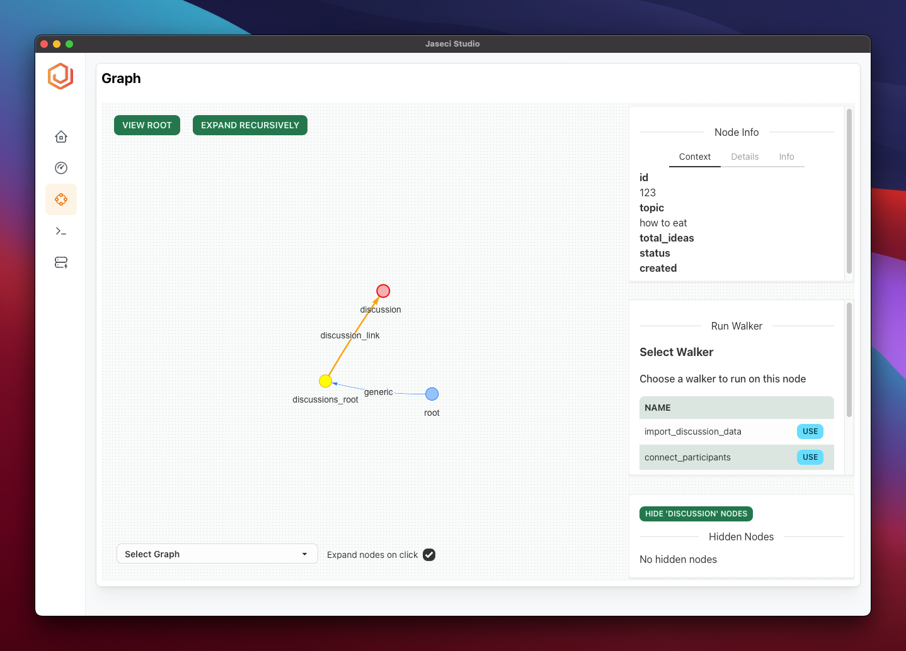
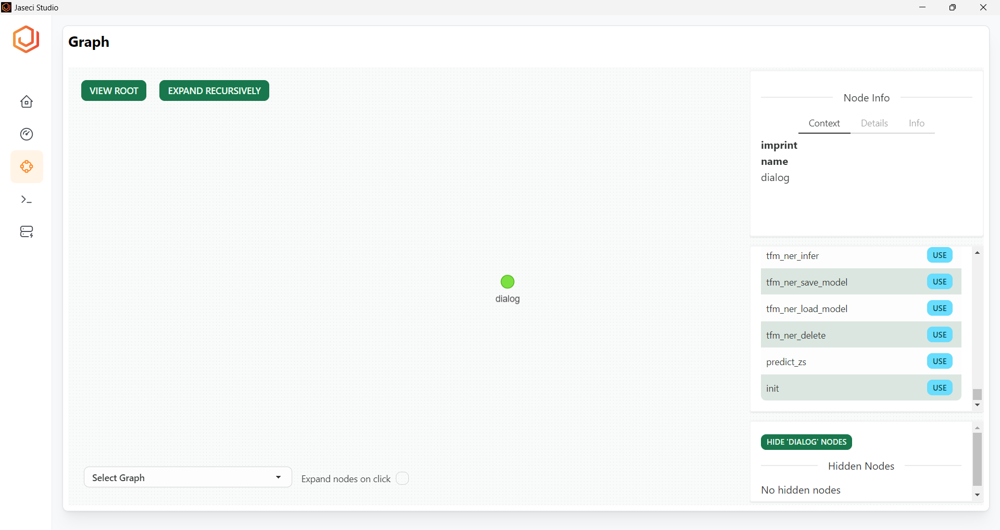
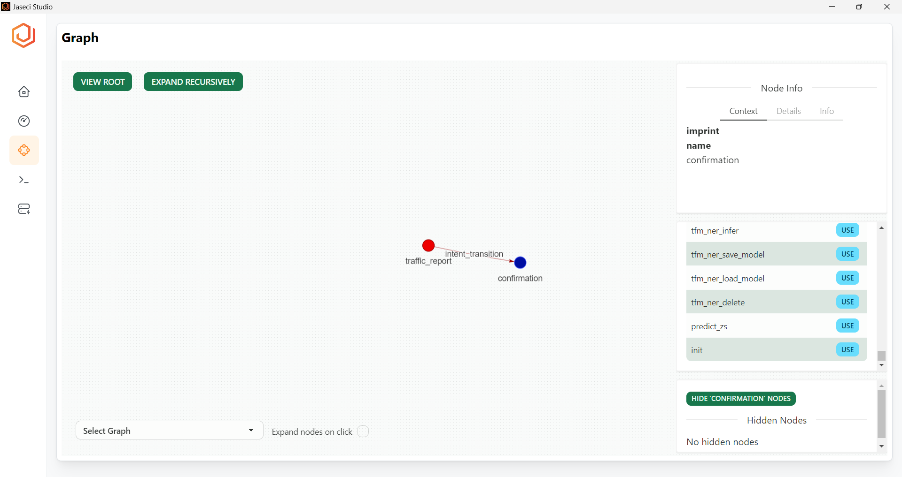
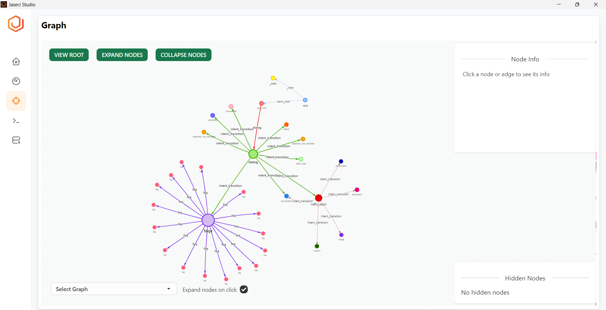
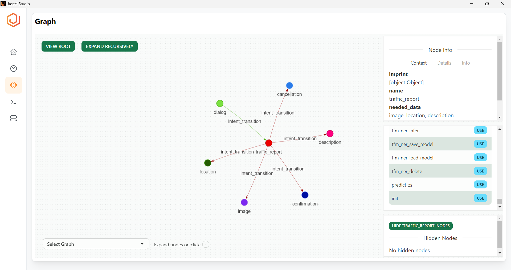
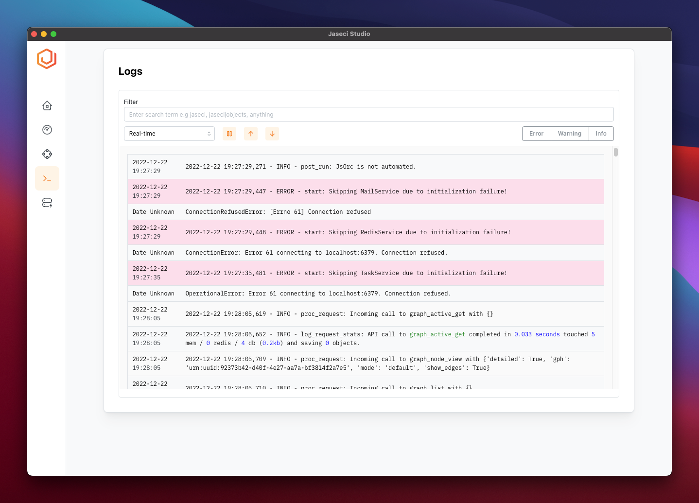
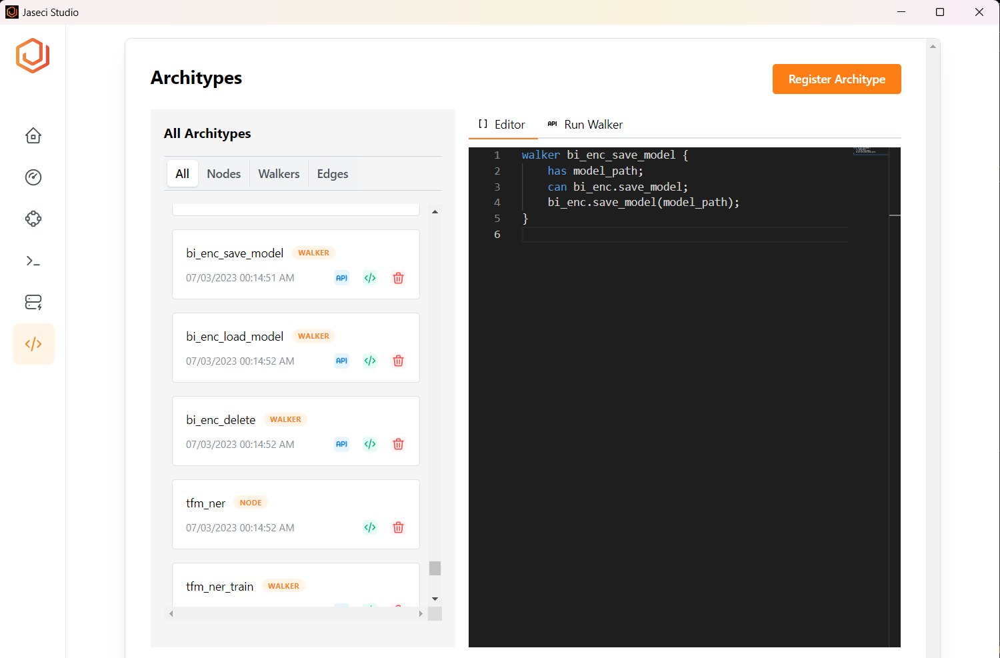
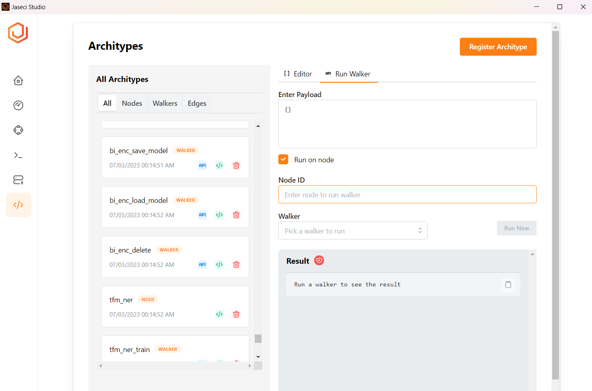

# Jaseci Studio and Features

## Login

Jaseci Studio login provides an easy way for developers to interact with their Jaseci application, offering a variety of amazing features. Unlike traditional applications that require you to create an account to login, Jaseci Studio allows you to login to any live instance of a Jaseci application worldwide using your super user credentials. It is important to note that you should never share your superuser credentials publicly on GitHub or other platforms.

To login, you must first provide the host where your application or live instance is running, for example, https://localhost, and then input the port where the live instance is running, for example, 9000. Next, enter your superuser email and password. Before clicking "OK," we highly recommend testing your connection to your specified endpoint using the "Test Connection" feature. This ensures that your endpoint is properly connected before attempting to login.

Now you can try to connect to your jaseci live instance, if the connection fails, it may be due to invalid superuser credentials, so please double-check and try again. However, if the connection is successful, you now have access to all the Jaseci Studio features for your application.

## Dashboard (Summery View)

After successfully logging in to your Jaseci live instance, you will be directed to the dashboard section in Jaseci Studio. Here, you will find a summary of important information about your Jaseci application. The summary view displays the key abstractions that Jaseci offers, including nodes, edges, graphs, and walkers. This provides you with an idea of how large your application is and the amount of abstractions utilized.

Additionally, the dashboard includes a section titled 'Server Info' which provides detailed information about the version of Jaseci currently running and other important server details.

Next, we will explore the graph view and its unique features in more detail. Let's dive in!

## Graph Viewer

Jaseci Studios offers a powerful graph viewer that enables programmers to easily visualize and analyze their code. By providing detailed information about nodes in their Jaseci application graph, this feature enhances the experience of Jaseci hackers and enables quick debugging of code.

Here are some of the amazing capabilities of the graph viewer:

- Node and Edge Information

The graph viewer allows programmers to easily access all the information about a specific node or edge in the graph, including its context, details and info. This provides a comprehensive view of the abstraction, containing the node id, context and other important information.

- Running walker on Node

With the graph viewer, programmers can run a walker on any node in the graph. This facilitates quick debugging of code and testing, which ultimately enhances the coding experience of the programmer utilizing Jaseci.

- Node interaction

For large applications with thousands of nodes, navigating the graph can be difficult. The graph viewer allows users to expand single nodes one at a time by double-tapping on the node, which shows the nodes connecting to it, not all the nodes on the graph. Additionally, users can view a single node or a single node and its parent node by unchecking the "expand nodes on click" button at the bottom of Jaseci Studios graph viewer. Furthermore, Jaseci Studios allows users to hide a particular node by clicking the "hide node" button at the bottom right corner of the graph viewer.

- Switch Graph

In Jaseci applications, there may be multiple graphs. Jaseci Studios caters for this by allowing programmers to switch between graphs and leverage all the features of Jaseci Studio.

**Default Graph Viewer**

**Single Node View**

**Child and Parent Node View**

**Complete Graph View**

**Parent Node and Children Node**

## Logs Viewer

Jaseci Studios provides a Logs Viewer that helps developers to efficiently filter, search, and view logs based on different criteria. Here are some of the key features of the Logs Viewer:

* Filter Logs: With the help of this feature, developers can easily filter logs based on time intervals. This saves developers valuable time that would otherwise be spent manually searching through logs in the built-in Jsserv terminal.

* See Errors Only: It's essential to quickly identify errors while debugging. The Logs Viewer has an "Errors" button that enables developers to view only the error logs, so they don't have to sift through irrelevant data.

* See All the Warnings: Sometimes, Jaseci warns developers about potential issues that may arise by using a specific method. To view these warnings, click on the "Warnings" button in the Logs Viewer.

* See All Info: The Logs Viewer also allows you to view all the information logs generated by your Jsserv instance. To view this information separately, click on the "Info" button.

* Search: If you can't filter logs using the above features, try using the search bar in the Logs Viewer. It helps you find specific logs quickly without wasting time.

These features enhance the Jaseci developer's programming experience and make the overall value of Jaseci more apparent. In the next section, we will cover managing archetypes.

## Managing Architypes

Archetypes are a set of abstractions offered by Jaseci, and Jaseci Studio has a powerful feature that will surprise all programmers. Jaseci Studio allows programmers to view and edit all the code related to a particular archetype, whether it be a node, edge, graph, or walker. This greatly enhances development efficiency. You are allowed to create new archetypes and write the code for them, and register them to the Jaseci application, which is amazing.

### Archetype Viewing

When you click on the Archetype section in Jaseci Studios after logging in, you will notice a section labeled "All Archetypes". Under this section, there are buttons that allow you to view a particular archetype only. Next to each individual archetype, there are buttons to delete and view the code for that archetype. In the archetype list, it will also display the archetype type, name, and a timestamp.

### Editor

The Jaseci Studio editor allows you to edit and write new code for your Jaseci application. This is a great feature, as you will be editing the built version of your code stored in the JIR file, which allows for minor tweaking of the code after deployment. Some instances where you will need to make changes are if your code is outdated and you need features of Jaseci that have updated syntax, APIs being changed, or simply a minor mistake.

### Register Archetype

In the editor, you can create a new archetype, such as a node, edge, graph, or walker, and add it to your Jaseci application. You can write the code in the editor and click the "Register Archetype" button to add it to your Jaseci application.

### Run Walker

A Walker is a key abstraction in Jaseci, and it allows users to interact with the graph of your Jaseci program. The archetype section has a button called "Run Walker." When you click on that button, you will notice a text area that asks for the payload, where you specify the data to be passed to the walker. Next, you have the option to select which node you want to run the walker on. If you select that option, you will have to provide the node JID. Else, the walker will run on the root node by default. After that, you have to select the walker you want to use from the drop-down, which also allows you to search for walkers by name. Finally, after specifying all the parameters, you can click "Run Now," and the walker result will be displayed in the results area. You have the option of copying this result by clicking the clipboard icon.

In summary, Jaseci Studio offers a variety of features, but the archetype section stands out as a unique solution for simplifying programming with Jaseci while enhancing the value of its abstractions.

**Editor**

**Run Walker**

