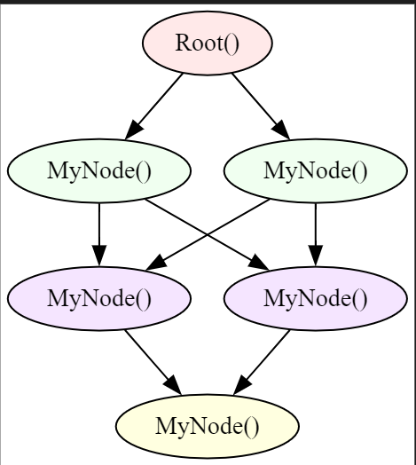

# <span style="color: orange">Nodes and Edges</span>

## Nodes
Nodes are architypes forming part of a graph, holding properties. They can be compared to custom classes in object-oriented programming (OOP).

```jac linenums="1"
      node node_name{
          has node_property: int;
      }
      node node_name{
          has node_property: int = 10;
      }
```

### Custom Node Types
- You can define custom node types to create specific instances within the graph.
- Each node can have `attributes` (like fields in a class) and `abilities` (similar to methods in OOP).

### Abilities in Nodes
- **Callable Abilities:** They are similar to standard methods in OOP. Inside any ability, the node can refer to itself using the `self` keyword, much like in OOP.

- **Visit-dependent Abilities:** These abilities are only triggered when a specific type of "walker" (discussed later) interacts with the node. This ensures that certain actions are performed only in response to a walker's visit. In these abilities, a special keyword `here` is used to reference the visiting walker. This allows you to access the walker's attributes and abilities directly during its interaction with the node.

- This is an example of defining a node.
```jac linenums="1"
    node test_node {
        has value: int;

        can log_entry with entry {
            print(f">>> Some Walker entered the node: ", self);
        }
        can log_test_walker_entry with test_walker entry {
            print(f">>> {here} entered the node {self}");
            here.callable();
        }
        can log_test_walker_exit with test_walker exit {
            print(f"<<< {here} exited the node {self}");
        }
        can log_exit with exit {
            print(f"<<< Some Walker exited the node {self}");
        }
        can callable {
            print(f"===== Callable on {self}");
        }
    }
```

### Connecting Nodes
Nodes in JacLang can establish connections in various ways, offering flexibility for building complex graphs:

- **One-to-One**: A single node connects to another single node.
- **One-to-Many**: A single node connects to multiple nodes.
- **Many-to-One**: Multiple nodes connect to a single node.
- **Many-to-Many**: A group of nodes connects to another group of nodes.

This versatility allows for creating intricate and highly interconnected graph structures, tailored to the specific needs of your application.
=== "one2one.jac"
    ```jac linenums="1"
    node MyNode{}

    with entry{
    first_node = MyNode();
    second_node = MyNode();

    root ++> first_node;
    first_node ++> second_node;

    }
    ```
    <!-- ??? example "Graph"
         -->
=== "one2many.jac"
    ```jac linenums="1"
    node MyNode{}

    with entry{
    first_node = MyNode();
    second_tier = [MyNode() for i in range(2)];

    root ++> first_node;
    first_node ++> second_tier; # one to many

    }
    ```
    <!-- ??? example "Graph"
         -->
=== "many2one.jac"
    ```jac linenums="1"
    node MyNode{}

    with entry{
    first_tier = [MyNode() for i in range(2)];
    second_node = MyNode();
    root ++> first_tier;
    first_tier ++> second_node; # many to one

    }
    ```
    <!-- ??? example "Graph"
         -->
=== "many2many.jac"
    ```jac linenums="1"
    --8<-- "examples/data_spatial/create_node.jac"
    ```
    <!-- ??? example "Graph"
         -->

## Edges
Nodes can be linked using either *default edges* (generic connections) or *custom edges*, which have specific properties as shown in the following examples.
=== "Generic Edges"
    ```jac linenums="1"
    with entry {
      node_1 ++> node_2; # uni directional edge
      node_1 <++> node_2; # bidirectional edge
    }
    ```
=== "Custom Edges"
    ```jac linenums="1"
    edge custom1 {
        has atrib1:str;
    }

    with entry {
      node_1 +:custom1:atrib1='val1':+> node_2; # uni directional edge
      node_1 <+:custom1:atrib1='val2':+> node_2; # bidirectional edge
    }
    ```

To delete an edge between two nodes the ````del``` keyword can be used as shown below.

```jac linenums="1"
node_1 del --> node_2;
```
