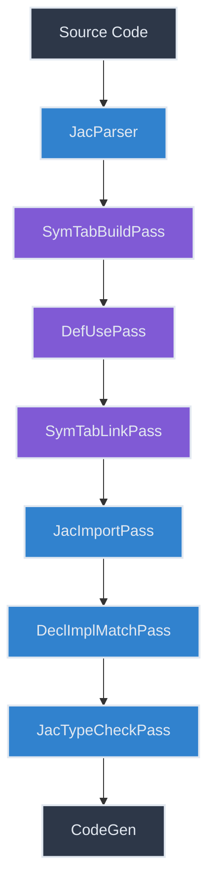

# Symbol Tables in Jaclang

Symbol tables are a fundamental part of the Jaclang compilation process, serving as the backbone for name resolution, type checking, and code generation. This documentation section provides a comprehensive guide to how symbol tables are built, organized, and used in Jaclang.

## Overview

Symbol tables in Jaclang are hierarchical structures that map identifiers (symbols) to their declarations, definitions, and uses throughout the code. They enable various compiler features such as:

- Name resolution across modules
- Type checking and inference
- Scope management
- Variable lifetime tracking
- Import handling
- Support for inheritance

## Documentation Structure

This section is organized into the following documents:

1. [**Symbol Table Structure**](./structure.md): Learn about the fundamental components of symbol tables and how they're represented in the compiler.

2. [**Symbol Table Building**](./building.md): Understand how symbol tables are constructed during the compilation process through the `SymTabBuildPass`.

3. [**Symbol Definition and Use**](./def_use.md): Discover how definitions and uses of symbols are tracked and linked through the `DefUsePass`.

4. [**Symbol Table Linking**](./linking.md): Explore how symbol tables are connected across module boundaries through the `SymTabLinkPass`.

5. [**Symbol Resolution in Practice**](./resolution.md): See examples of how symbol tables are used to resolve names in complex scenarios.

## Symbol Table in the Compilation Pipeline

The symbol table construction and usage happens through multiple passes in the compiler pipeline:

The highlighted passes (in purple) are the ones directly responsible for building and maintaining the symbol tables. Each pass builds upon the work of the previous ones to create a complete picture of the program's symbols and their relationships.

## Why Understanding Symbol Tables Matters

For contributors, a deep understanding of the symbol table system is essential for:

- Adding new language features
- Implementing type checking and inference
- Debugging name resolution issues
- Optimizing compiler performance
- Implementing IDE features like code completion and hover information

In the following sections, we'll dive deeper into each aspect of Jaclang's symbol table system.