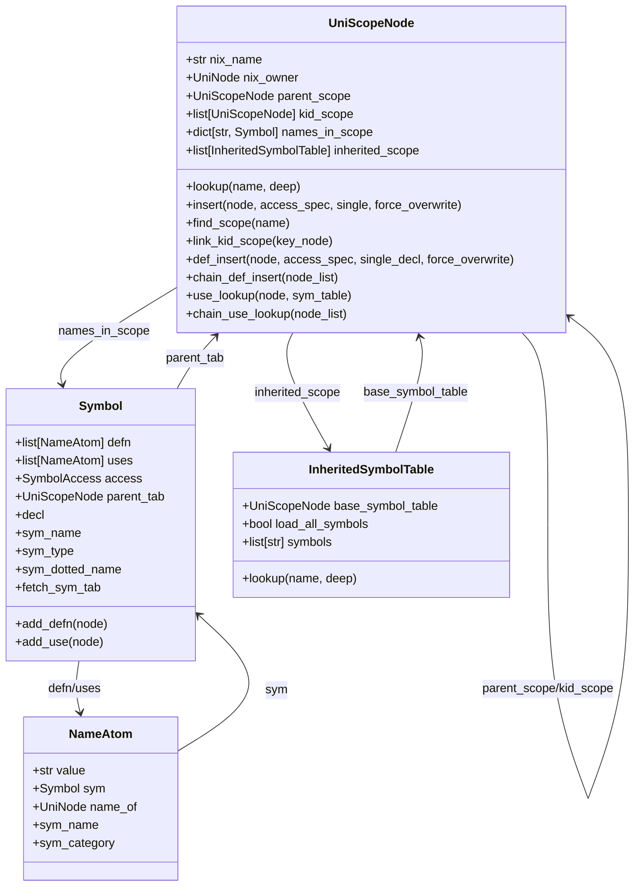
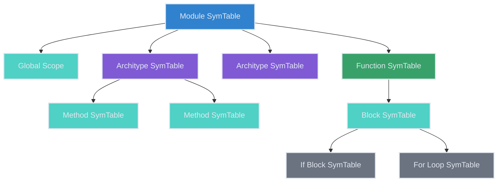
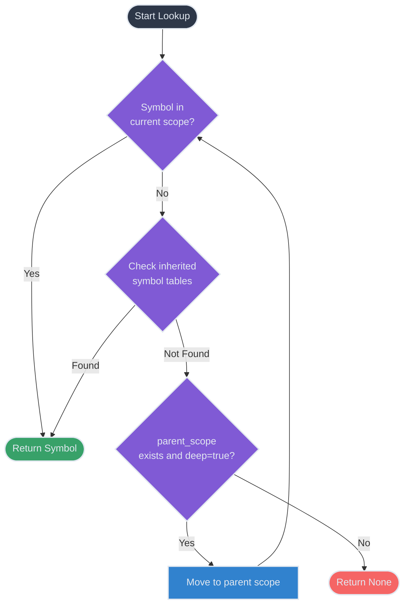
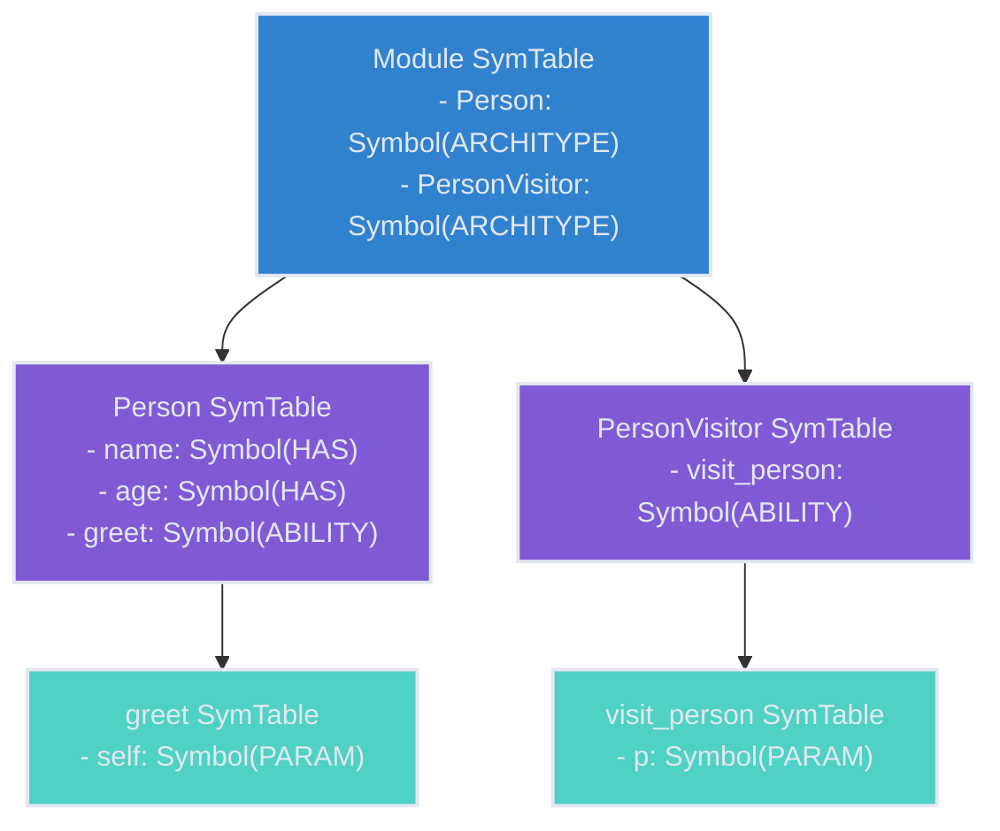

# Symbol Table Structure

Symbol tables in Jaclang are hierarchical data structures designed to track symbols (identifiers) and their relationships throughout the compilation process. This document explains the core components of the symbol table system and how they interact.

## Core Components

Jaclang's symbol table system consists of the following key classes:



### UniScopeNode

`UniScopeNode` represents a scope in the program, such as a module, function, class, or block. Each scope has its own symbol table containing the symbols defined within it.

Key attributes:
- `nix_name`: Name of the scope
- `nix_owner`: The AST node this scope belongs to
- `parent_scope`: Reference to the parent scope
- `kid_scope`: List of child scopes
- `names_in_scope`: Dictionary mapping symbol names to their `Symbol` objects
- `inherited_scope`: List of inherited symbol tables

Key methods:
- `lookup(name, deep)`: Looks up a symbol by name, optionally searching parent scopes
- `insert(node, access_spec, single, force_overwrite)`: Inserts a symbol into the scope
- `find_scope(name)`: Finds a child scope by name
- `link_kid_scope(key_node)`: Links a child scope to this scope
- `def_insert(node, access_spec, single_decl, force_overwrite)`: Inserts a symbol definition
- `chain_def_insert(node_list)`: Inserts a chain of symbols (e.g., for member access)
- `use_lookup(node, sym_table)`: Looks up a symbol use
- `chain_use_lookup(node_list)`: Looks up a chain of symbol uses

### Symbol

`Symbol` represents a symbol definition in the program, keeping track of all definitions and uses of the symbol.

Key attributes:
- `defn`: List of definition name atoms
- `uses`: List of use name atoms
- `access`: Access level of the symbol (public, private, etc.)
- `parent_tab`: The symbol table this symbol belongs to

Key properties:
- `decl`: The first definition of the symbol
- `sym_name`: The name of the symbol
- `sym_type`: The type of the symbol (var, function, class, etc.)
- `sym_dotted_name`: The fully qualified name of the symbol (including module path)
- `fetch_sym_tab`: The symbol table associated with this symbol (if applicable)

### InheritedSymbolTable

`InheritedSymbolTable` represents a symbol table that is inherited from another scope, such as when importing symbols from a module.

Key attributes:
- `base_symbol_table`: The base symbol table being inherited from
- `load_all_symbols`: Whether all symbols should be loaded (e.g., for "import *")
- `symbols`: List of specific symbols to inherit

Key methods:
- `lookup(name, deep)`: Looks up a symbol by name, respecting symbol filtering

### NameAtom

`NameAtom` represents a named reference in the code, which can be either a definition or a use of a symbol.

Key attributes:
- `value`: The actual name string
- `sym`: Reference to the associated Symbol object
- `name_of`: The AST node this name belongs to
- `sym_name`: The name of the symbol
- `sym_category`: The category of the symbol (variable, function, class, etc.)

## Symbol Table Hierarchy

Symbol tables are organized hierarchically to reflect the scope structure of the program:



- The module symbol table is at the top level
- Each architype (object, node, edge, walker) has its own symbol table
- Functions, methods, and blocks have their own nested symbol tables
- Control structures like if statements and loops have their own symbol tables

## Symbol Lookup Process

When looking up a symbol by name, the process follows these steps:



1. Check if the symbol exists in the current scope's `names_in_scope`
2. If not, check all inherited symbol tables through `inherited_scope`
3. If still not found and `deep=True`, recursively check the parent scope
4. If no symbol is found, return `None`

## Symbol Access Levels

Jaclang supports different access levels for symbols:

```python
class SymbolAccess(IntEnum):
    """Symbol access."""

    EXTERNAL = -1  # Used for builtins
    PUBLIC = 0
    PRIVATE = 1
    PROTECTED = 2
```

Access levels determine visibility of symbols across scopes and are used for enforcing access control in the language.

## Symbol Types

Symbols are categorized into different types using the `SymbolType` enum:

```python
class SymbolType(IntEnum):
    """Symbol type."""

    VAR = 0
    GLOBAL = 1
    HAS = 2
    PARAM = 3
    ARCHITYPE = 4
    ABILITY = 5
    ENUM = 6
    ENUM_VAL = 7
    MODULE = 8
    IMPORT = 9
```

This categorization helps the compiler understand the role and behavior of different symbols during compilation.

## Practical Example

Consider the following Jac code:

```jac
node Person {
    has name: str, age: int;

    can greet {
        print("Hello, my name is " + self.name);
    }
}

walker PersonVisitor {
    can visit_person(p: Person) {
        p.greet();
    }
}
```

The symbol table structure would look like:



Each symbol in the tables would contain:
- References to its definitions
- References to all uses throughout the code
- Information about its type and access level
- Links to its parent symbol table

This hierarchical structure enables efficient name resolution, type checking, and code generation during compilation.