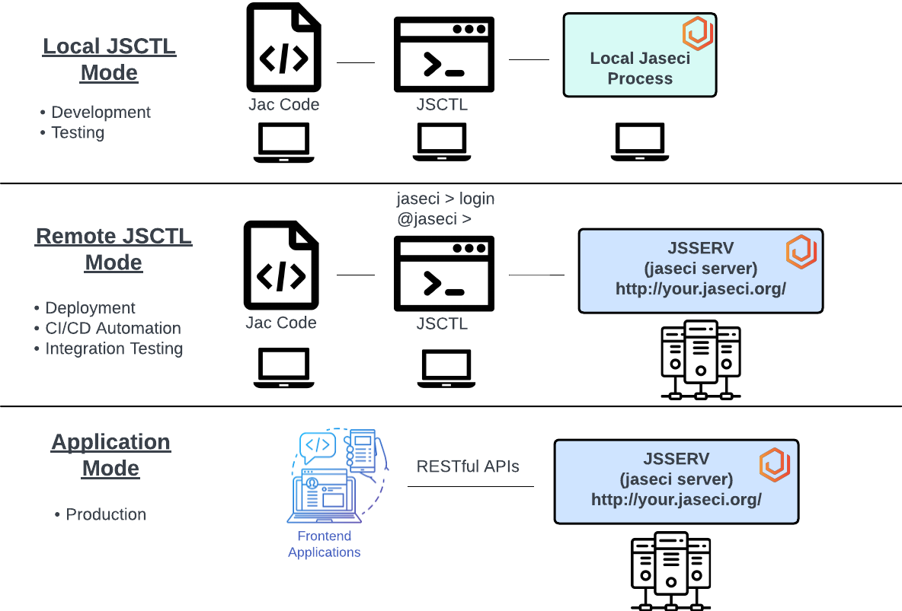

## Interacting with Jaseci

Notes:
* `sentinel` and `walker run` should be used for remote JSCTL mode and application model.
* `jac run` will **always** run in the local jaseci process of the JSCTL, even if it is logged into a jsserv server.