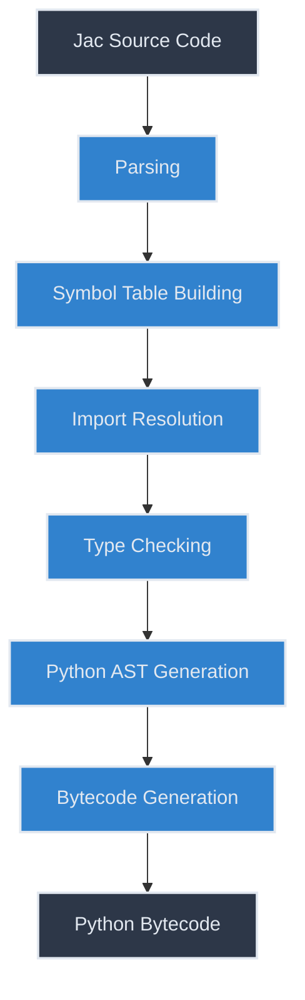
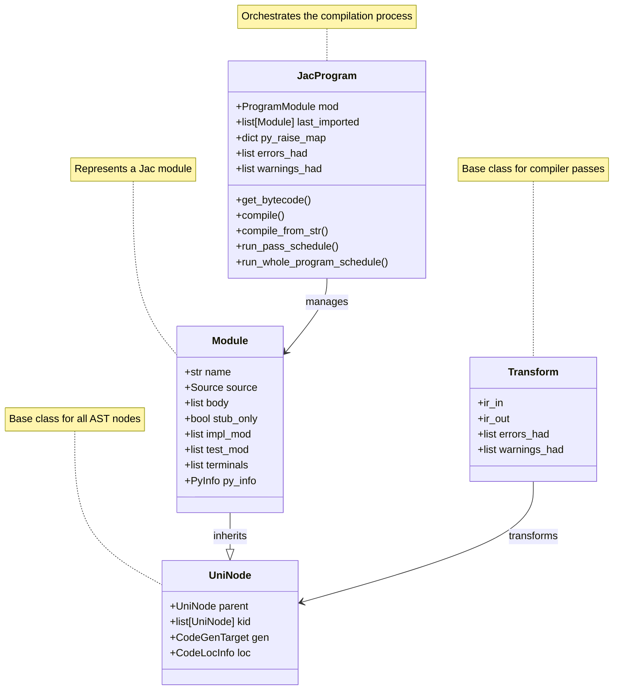
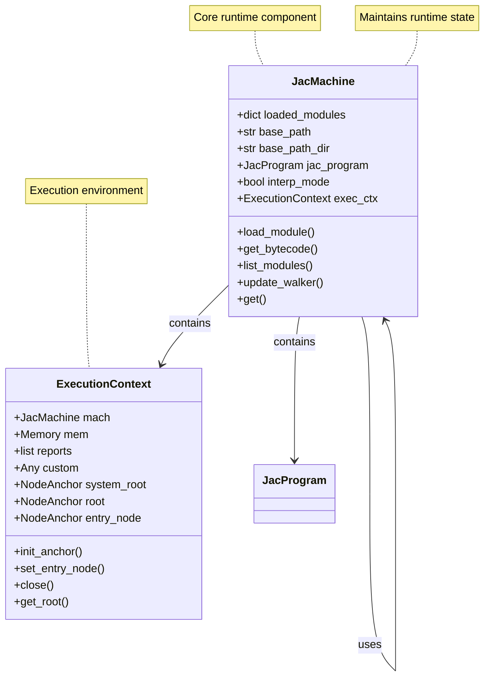
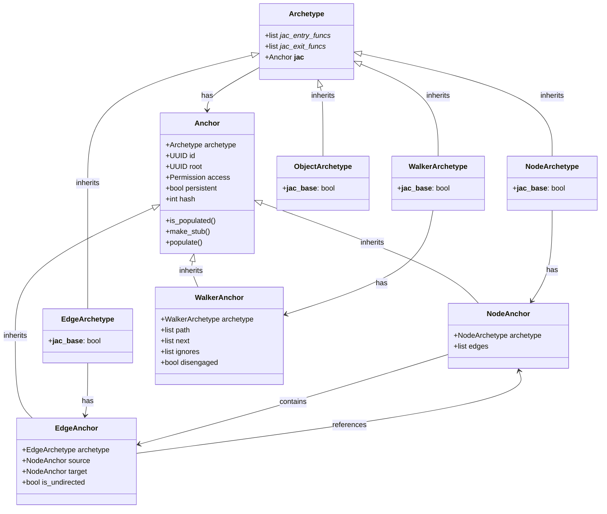
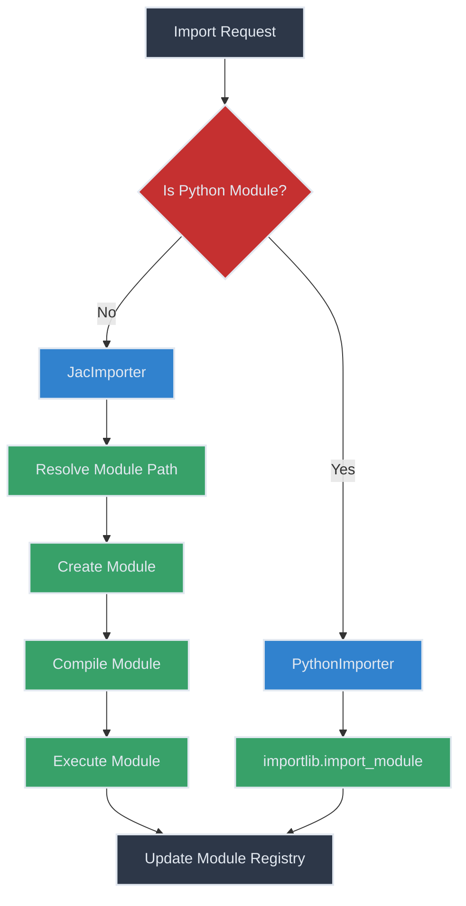
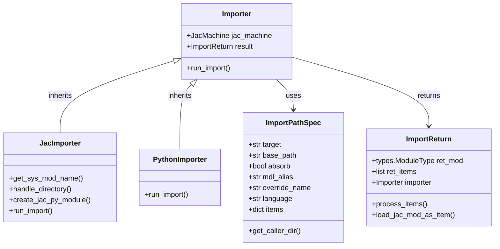
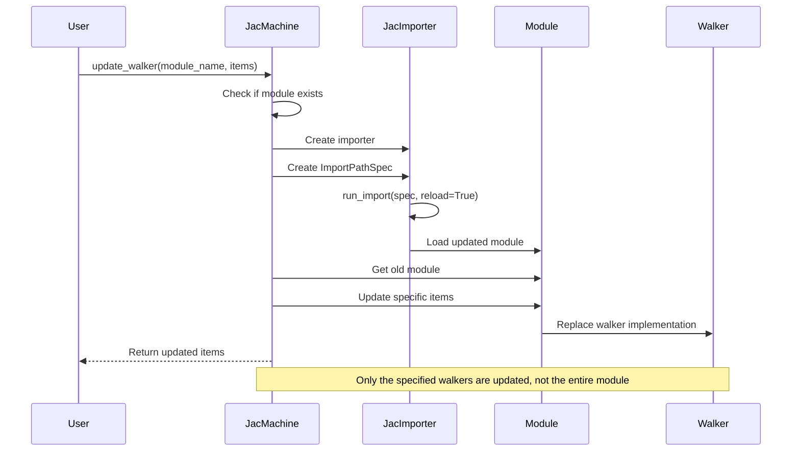
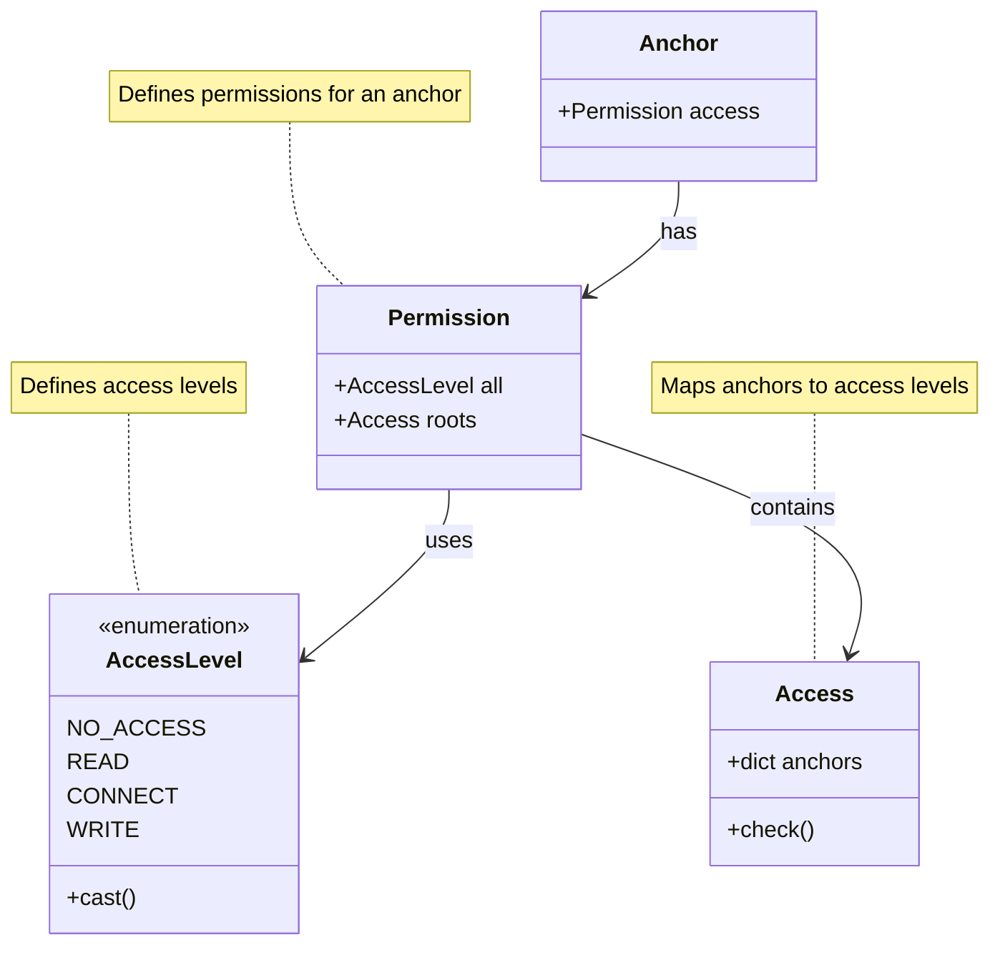
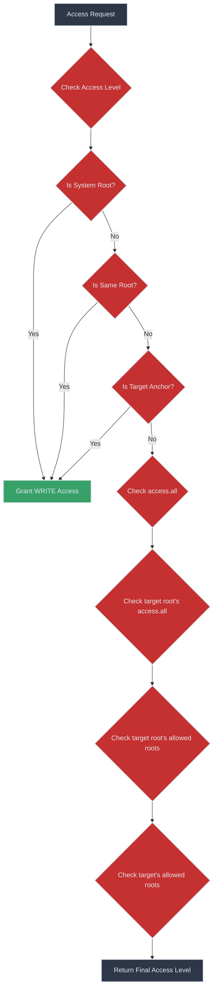
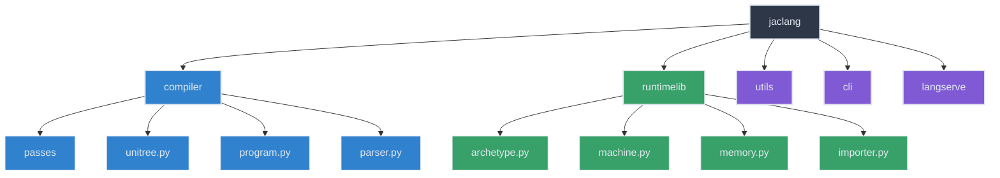

# Jaclang Internals

This document provides a comprehensive guide to the internal design and implementation of the Jaclang compiler and runtime stack. It's intended for developers who want to contribute to the Jaclang project or understand its architecture in depth.

## Architecture Overview

Jaclang is composed of two main components:

1. **Compiler**: Transforms Jac source code into Python bytecode through a series of passes
2. **Runtime**: Provides the execution environment for compiled Jac programs

The system follows a modular design that separates concerns between compilation and execution, allowing for flexibility and extensibility.


## Compiler Components

The compiler transforms Jac source code into Python bytecode through a series of passes. Each pass performs a specific transformation on the code.

### Compilation Pipeline

The compiler transforms Jac source code into Python bytecode through a series of passes:



1. **Parsing**: Converts Jac source code into an Abstract Syntax Tree (AST)
2. **Symbol Table Building**: Creates symbol tables for scopes and resolves symbols
3. **Import Resolution**: Processes import statements and loads external modules
4. **Type Checking**: Performs type checking and inference
5. **Python AST Generation**: Converts Jac AST to Python AST
6. **Bytecode Generation**: Generates Python bytecode from the Python AST

### Key Compiler Components

#### JacProgram

`JacProgram` is the central component that orchestrates the compilation process. It maintains a collection of modules and manages the compilation pipeline.

```python
class JacProgram:
    """JacProgram to handle the Jac program-related functionalities."""

    def __init__(self, main_mod: Optional[uni.ProgramModule] = None) -> None:
        """Initialize the JacProgram object."""
        self.mod: uni.ProgramModule = main_mod if main_mod else uni.ProgramModule()
        self.last_imported: list[Module] = []
        self.py_raise_map: dict[str, str] = {}
        self.errors_had: list[Alert] = []
        self.warnings_had: list[Alert] = []
```

Key methods:
- `get_bytecode()`: Retrieves bytecode for a specific module
- `compile()`: Compiles a Jac file to an AST
- `compile_from_str()`: Compiles Jac code from a string
- `run_pass_schedule()`: Executes the compilation passes on a module
- `run_whole_program_schedule()`: Runs passes that require whole-program analysis

#### Unitree

The `unitree` module defines the AST node types used in the compilation process. The AST is a hierarchical representation of the program's structure.

Key classes:
- `UniNode`: Base class for all AST nodes
- `UniScopeNode`: Represents a scope with a symbol table
- `Module`: Represents a Jac module
- `Archetype`: Represents a Jac archetype (object, node, edge, walker)
- `Ability`: Represents a Jac ability (method)

#### Compiler Components Relationship



#### Compiler Passes

Compiler passes are transformations applied to the AST. Each pass is responsible for a specific aspect of the compilation process.


Main passes:
- `JacParser`: Parses Jac source code into an AST
- `SymTabBuildPass`: Builds symbol tables for scopes
- `JacImportPass`: Resolves import statements
- `JacTypeCheckPass`: Performs type checking
- `PyastBuildPass`: Converts Jac AST to Python AST
- `PyBytecodeGenPass`: Generates Python bytecode

## Runtime Components

The runtime system executes compiled Jac programs and provides the necessary infrastructure for Jac's features.



### JacMachine

`JacMachine` is the core runtime component that manages the execution environment for Jac programs. It handles module loading, execution context, and provides the runtime API for Jac features.

```python
class JacMachine(
    JacClassReferences,
    JacAccessValidation,
    JacNode,
    JacEdge,
    JacWalker,
    JacBuiltin,
    JacCmd,
    JacBasics,
    JacUtils,
):
    """Jac Feature."""
```

Key responsibilities:
1. **Module Management**: Loads and manages Jac modules
2. **Context Management**: Maintains execution context for Jac programs
3. **Runtime API**: Provides the API for Jac features like node/edge operations, walker operations, etc.
4. **Dynamic Updates**: Enables runtime updates to components like walkers

### JacMachine

`JacMachine` maintains the state of the Jac machine during execution. It includes loaded modules, the execution context, and the Jac program.

```python
class JacMachine:
    """Jac Machine State."""

    def __init__(
        self,
        base_path: str = "",
        session: Optional[str] = None,
        root: Optional[str] = None,
        interp_mode: bool = False,
    ) -> None:
        """Initialize JacMachine."""
        self.loaded_modules: dict[str, types.ModuleType] = {}
        if not base_path:
            base_path = os.getcwd()
        # Ensure the base_path is a list rather than a string
        self.base_path = base_path
        self.base_path_dir = (
            os.path.dirname(base_path)
            if not os.path.isdir(base_path)
            else os.path.abspath(base_path)
        )
        self.jac_program: JacProgram = JacProgram()
        self.interp_mode = interp_mode
        self = ExecutionContext(session=session, root=root, mach=self)
```

### ExecutionContext

`ExecutionContext` represents the execution environment for a Jac program. It includes the memory, reports, and root nodes.

```python
class ExecutionContext:
    """Execution Context."""

    mach: JacMachine
    mem: Memory
    reports: list[Any]
    custom: Any = MISSING
    system_root: NodeAnchor
    root: NodeAnchor
    entry_node: NodeAnchor
```

## Memory Management

Jaclang uses a memory management system to store and retrieve objects during execution.

### Memory

The `Memory` class is a generic memory handler that stores objects by ID. It provides methods to find, set, and remove objects.

```python
@dataclass
class Memory(Generic[ID, TANCH]):
    """Generic Memory Handler."""

    __mem__: dict[ID, TANCH] = field(default_factory=dict)
    __gc__: set[TANCH] = field(default_factory=set)
```

### ShelfStorage

`ShelfStorage` extends `Memory` to provide persistent storage using Python's `shelve` module. It synchronizes memory with disk storage.

```python
@dataclass
class ShelfStorage(Memory[UUID, Anchor]):
    """Shelf Handler."""

    __shelf__: Shelf[Anchor] | None = None
```

## Archetypes and Anchors

Jaclang uses archetypes and anchors to represent objects in the runtime system.



### Archetype

`Archetype` is the base class for all Jac objects. It defines the common interface for all archetypes.

```python
@dataclass(eq=False, repr=False, kw_only=True)
class Archetype:
    """Archetype Protocol."""

    _jac_entry_funcs_: ClassVar[list[DataSpatialFunction]] = []
    _jac_exit_funcs_: ClassVar[list[DataSpatialFunction]] = []

    @cached_property
    def __jac__(self) -> Anchor:
        """Create default anchor."""
        return Anchor(archetype=self)
```

Specialized archetypes:
- `NodeArchetype`: Represents a node in a graph
- `EdgeArchetype`: Represents an edge in a graph
- `WalkerArchetype`: Represents a walker that traverses a graph
- `ObjectArchetype`: Represents a generic object

### Anchor

`Anchor` is a wrapper around an archetype that provides additional metadata and functionality.

```python
@dataclass(eq=False, repr=False, kw_only=True)
class Anchor:
    """Object Anchor."""

    archetype: Archetype
    id: UUID = field(default_factory=uuid4)
    root: Optional[UUID] = None
    access: Permission = field(default_factory=Permission)
    persistent: bool = False
    hash: int = 0
```

Specialized anchors:
- `NodeAnchor`: Wraps a `NodeArchetype` and maintains a list of connected edges
- `EdgeAnchor`: Wraps an `EdgeArchetype` and maintains references to source and target nodes
- `WalkerAnchor`: Wraps a `WalkerArchetype` and maintains walker state

## Module System

Jaclang has a sophisticated module system that handles importing Jac and Python modules.





### Importers

The module system uses importers to load modules:

- `JacImporter`: Loads Jac modules
- `PythonImporter`: Loads Python modules

```python
class Importer:
    """Abstract base class for all importers."""

    def __init__(self, jac_machine: JacMachine) -> None:
        """Initialize the Importer object."""
        self.jac_machine = jac_machine
        self.result: Optional[ImportReturn] = None

    def run_import(self, spec: ImportPathSpec) -> ImportReturn:
        """Run the import process."""
        raise NotImplementedError
```

### Import Process

The import process involves:

1. Resolving the module path
2. Loading the module
3. Compiling the module (for Jac modules)
4. Executing the module
5. Updating the module registry

## Dynamic Updates

One of the most powerful features of `JacMachine` is the ability to dynamically update components at runtime, particularly walkers.



### Updating Walkers

Walkers can be updated during runtime without reloading the entire module. This is useful for debugging, live code updates, and reactive programming.

```python
@staticmethod
def update_walker(
    mach: JacMachine,
    module_name: str,
    items: Optional[dict[str, Union[str, Optional[str]]]],
) -> tuple[types.ModuleType, ...]:
    """Reimport the module."""
    from .importer import JacImporter, ImportPathSpec

    if module_name in mach.loaded_modules:
        try:
            old_module = mach.loaded_modules[module_name]
            importer = JacImporter(mach)
            spec = ImportPathSpec(
                target=module_name,
                base_path=mach.base_path,
                absorb=False,
                mdl_alias=None,
                override_name=None,
                lng="jac",
                items=items,
            )
            import_result = importer.run_import(spec, reload=True)
            ret_items = []
            if items:
                for item_name in items:
                    if hasattr(old_module, item_name):
                        new_attr = getattr(import_result.ret_mod, item_name, None)
                        if new_attr:
                            ret_items.append(new_attr)
                            setattr(
                                old_module,
                                item_name,
                                new_attr,
                            )
            return (old_module,) if not items else tuple(ret_items)
        except Exception as e:
            logger.error(f"Failed to update module {module_name}: {e}")
    else:
        logger.warning(f"Module {module_name} not found in loaded modules.")
    return ()
```

## Access Control

Jaclang has a sophisticated access control system that manages permissions for objects.





### Permission

The `Permission` class defines access levels for objects:

```python
@dataclass
class Permission:
    """Anchor Access Handler."""

    all: AccessLevel = AccessLevel.NO_ACCESS
    roots: Access = field(default_factory=Access)
```

### AccessLevel

`AccessLevel` defines the levels of access:

```python
class AccessLevel(IntEnum):
    """Access level enum."""

    NO_ACCESS = -1
    READ = 0
    CONNECT = 1
    WRITE = 2
```

## Contributing to Jaclang

### Understanding the Codebase

The Jaclang codebase is organized into several key directories:



- `jaclang/compiler`: Contains the compiler components
- `jaclang/runtimelib`: Contains the runtime components
- `jaclang/utils`: Contains utility functions
- `jaclang/cli`: Contains the command-line interface
- `jaclang/langserve`: Contains the language server components

### Development Workflow


1. **Setup**: Clone the repository and install dependencies
2. **Testing**: Run tests to ensure your changes don't break existing functionality
3. **Implementation**: Make your changes following the project's coding standards
4. **Documentation**: Update documentation to reflect your changes
5. **Pull Request**: Submit a pull request with your changes
6. **Code Review**: Address feedback from reviewers
7. **Merge**: Once approved, your changes will be merged into the main codebase

### Best Practices

- Follow the existing code style and architecture
- Write tests for new functionality
- Document your code with docstrings
- Keep changes focused and minimal
- Discuss major changes with the community before implementation

## Conclusion

This document provides an overview of the Jaclang internals. For more detailed information, refer to the source code and other documentation. If you have questions or need help, feel free to reach out to the Jaclang community.
