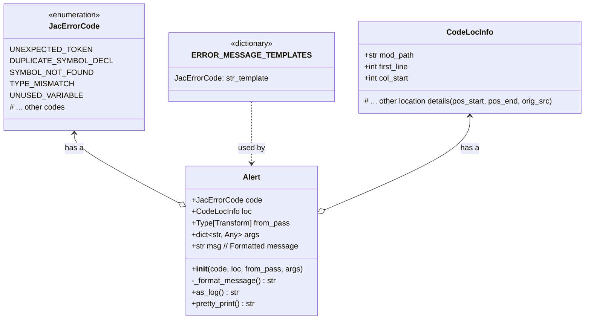
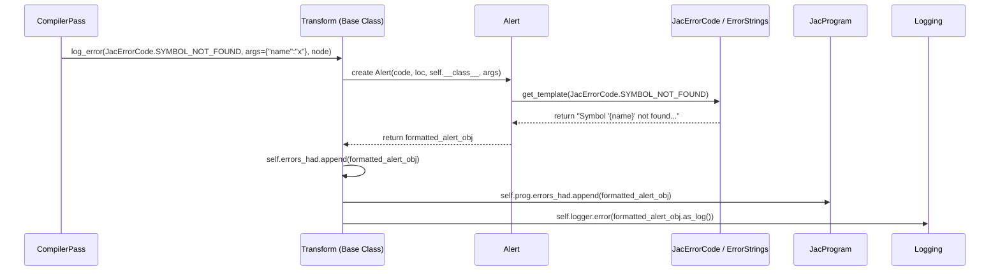
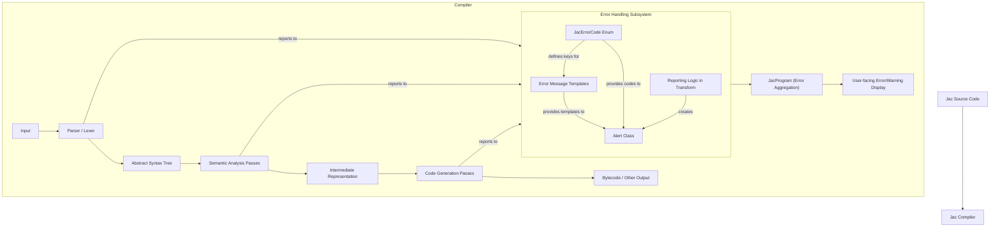

# Jac Compiler Error Handling Subsystem

## 1. Introduction

This document outlines the design for a new error handling subsystem for the Jac compiler. The goal is to create a more robust, maintainable, and developer-friendly system for reporting, managing, and diagnosing errors and warnings encountered during the various compilation phases (parsing, semantic analysis, code generation, etc.).

The key objectives are:
-   **Centralization**: A single source of truth for all error and warning definitions (codes, message templates).
-   **Clarity**: Consistent and informative error messages for the user.
-   **Maintainability**: Easier to add, modify, and track error types.
-   **Extensibility**: Ability to add richer diagnostic information (e.g., fix-it hints) in the future.
-   **Tooling Support**: Facilitate better integration with IDEs and other development tools.

## 2. Current System Overview

The existing error handling mechanism relies on an `Alert` class (`jaclang.compiler.passes.transform.Alert`).

-   Each `Transform` (base class for compiler passes) maintains its own `errors_had` and `warnings_had` lists.
-   Passes report errors using `log_error(message_string, ...)` and `log_warning(message_string, ...)`.
-   These methods create `Alert` objects, storing the raw message string, code location (`CodeLocInfo`), and the originating pass type.
-   Alerts from individual passes are also aggregated into global `errors_had` and `warnings_had` lists in the `JacProgram` instance.

While functional, this system has limitations:
-   Error messages are decentralized (defined as raw strings within each pass).
-   No standardized error codes, making it harder to categorize or programmatically handle specific errors.
-   Less flexibility for internationalization or complex message formatting.

## 3. Proposed Design

The new design introduces a centralized error registry, standardized error codes, and an enhanced error reporting structure.

### 3.1. Error Code Enumeration and Registry

We will define a central enumeration for all possible compiler errors and warnings. Each member of this enumeration will represent a unique error type.

**Location:** `jaclang.compiler.errors.JacErrorCode.py` (New File)

```python
# jaclang.compiler.errors.JacErrorCode.py
from enum import Enum, auto

class JacErrorCode(Enum):
    # Lexer/Parser Errors (L000-L999)
    UNEXPECTED_TOKEN = auto()                       # msg: "Unexpected token '{token_value}' of type {token_type}, expected {expected_tokens}."
    UNTERMINATED_STRING_LITERAL = auto()            # msg: "Unterminated string literal."
    INVALID_ESCAPE_SEQUENCE = auto()                # msg: "Invalid escape sequence '\\{char}' in string literal."
    MALFORMED_NUMERIC_LITERAL = auto()              # msg: "Malformed numeric literal: {details}."
    SYNTAX_ERROR_NEAR_TOKEN = auto()                # msg: "Syntax error near '{token}'."
    MISSING_EXPECTED_TOKEN = auto()                 # msg: "Missing expected token: {expected_token}."
    # ... more parser errors

    # Semantic Errors (S000-S999)
    DUPLICATE_SYMBOL_DECL = auto()                  # msg: "Symbol '{name}' already declared in this scope at {original_loc}."
    SYMBOL_NOT_FOUND = auto()                       # msg: "Symbol '{name}' not found in the current scope or accessible scopes."
    TYPE_MISMATCH = auto()                          # msg: "Type mismatch: Expected type '{expected_type}', but got '{actual_type}' for '{construct_name}'."
    INCOMPATIBLE_OPERANDS = auto()                  # msg: "Incompatible operands for operator '{operator}': '{left_type}' and '{right_type}'."
    ASSIGN_TO_READ_ONLY = auto()                    # msg: "Cannot assign to read-only symbol '{name}'."
    ACCESS_TO_PRIVATE_MEMBER = auto()               # msg: "Cannot access private member '{member_name}' of '{owner_name}' from this context."
    ACCESS_TO_PROTECTED_MEMBER = auto()             # msg: "Cannot access protected member '{member_name}' of '{owner_name}' from this context."
    NO_SUCH_ABILITY = auto()                        # msg: "Object of type '{type_name}' does not have ability '{ability_name}'."
    INCORRECT_ARGUMENT_COUNT = auto()               # msg: "Function/Ability '{callable_name}' expects {expected_count} arguments, but got {actual_count}."
    ARGUMENT_TYPE_MISMATCH = auto()                 # msg: "Argument '{arg_name}' of '{callable_name}' expects type '{expected_type}', but got '{actual_type}'."
    IMPORT_ERROR = auto()                           # msg: "Could not import module '{module_name}': {reason}."
    CIRCULAR_IMPORT = auto()                        # msg: "Circular import detected involving module '{module_name}'."
    # ... more semantic errors

    # Code Generation Errors (C000-C999)
    CODEGEN_UNSUPPORTED_FEATURE = auto()            # msg: "Feature '{feature_name}' is not yet supported by the code generator."
    BYTECODE_GENERATION_FAILED = auto()             # msg: "Bytecode generation failed for '{construct_name}': {details}."
    # ... more codegen errors

    # Internal Compiler Errors (I000-I999)
    ICE_UNEXPECTED_NODE_TYPE = auto()               # msg: "Internal Compiler Error: Unexpected AST node type '{node_type}' in pass '{pass_name}'."
    ICE_MISSING_SYMBOL_INFO = auto()                # msg: "Internal Compiler Error: Missing symbol information for '{name}'."
    # ... more internal errors

    # Warnings (W000-W999)
    UNUSED_VARIABLE = auto()                        # msg: "Variable '{name}' is declared but never used."
    UNUSED_IMPORT = auto()                          # msg: "Import '{module_name}' is unused."
    POTENTIAL_NULL_DEREFERENCE = auto()             # msg: "Potential null dereference of '{variable_name}'."
    DEPRECATED_FEATURE_USED = auto()                # msg: "Feature '{feature_name}' is deprecated and will be removed in a future version. {suggestion}"
    # ... more warnings

    def __str__(self) -> str:
        return self.name
```

**Location:** `jaclang.compiler.errors.JacErrorStrings.py` (New File)

```python
# jaclang.compiler.errors.JacErrorStrings.py
from jaclang.compiler.errors.JacErrorCode import JacErrorCode

# Using a dictionary to map error codes to message templates
# This allows for easier updates and potential future localization
ERROR_MESSAGE_TEMPLATES: dict[JacErrorCode, str] = {
    # Lexer/Parser Errors
    JacErrorCode.UNEXPECTED_TOKEN: "Unexpected token '{token_value}' of type {token_type}, expected {expected_tokens}.",
    JacErrorCode.UNTERMINATED_STRING_LITERAL: "Unterminated string literal.",
    JacErrorCode.INVALID_ESCAPE_SEQUENCE: "Invalid escape sequence '\\\\{char}' in string literal.",
    JacErrorCode.MALFORMED_NUMERIC_LITERAL: "Malformed numeric literal: {details}.",
    JacErrorCode.SYNTAX_ERROR_NEAR_TOKEN: "Syntax error near '{token}'.",
    JacErrorCode.MISSING_EXPECTED_TOKEN: "Missing expected token: {expected_token}.",

    # Semantic Errors
    JacErrorCode.DUPLICATE_SYMBOL_DECL: "Symbol '{name}' already declared in this scope at {original_loc}.",
    JacErrorCode.SYMBOL_NOT_FOUND: "Symbol '{name}' not found in the current scope or accessible scopes.",
    JacErrorCode.TYPE_MISMATCH: "Type mismatch: Expected type '{expected_type}', but got '{actual_type}' for '{construct_name}'.",
    JacErrorCode.INCOMPATIBLE_OPERANDS: "Incompatible operands for operator '{operator}': '{left_type}' and '{right_type}'.",
    JacErrorCode.ASSIGN_TO_READ_ONLY: "Cannot assign to read-only symbol '{name}'.",
    JacErrorCode.ACCESS_TO_PRIVATE_MEMBER: "Cannot access private member '{member_name}' of '{owner_name}' from this context.",
    JacErrorCode.ACCESS_TO_PROTECTED_MEMBER: "Cannot access protected member '{member_name}' of '{owner_name}' from this context.",
    JacErrorCode.NO_SUCH_ABILITY: "Object of type '{type_name}' does not have ability '{ability_name}'.",
    JacErrorCode.INCORRECT_ARGUMENT_COUNT: "Function/Ability '{callable_name}' expects {expected_count} arguments, but got {actual_count}.",
    JacErrorCode.ARGUMENT_TYPE_MISMATCH: "Argument '{arg_name}' of '{callable_name}' expects type '{expected_type}', but got '{actual_type}'.",
    JacErrorCode.IMPORT_ERROR: "Could not import module '{module_name}': {reason}.",
    JacErrorCode.CIRCULAR_IMPORT: "Circular import detected involving module '{module_name}'.",

    # Code Generation Errors
    JacErrorCode.CODEGEN_UNSUPPORTED_FEATURE: "Feature '{feature_name}' is not yet supported by the code generator.",
    JacErrorCode.BYTECODE_GENERATION_FAILED: "Bytecode generation failed for '{construct_name}': {details}.",

    # Internal Compiler Errors
    JacErrorCode.ICE_UNEXPECTED_NODE_TYPE: "Internal Compiler Error: Unexpected AST node type '{node_type}' in pass '{pass_name}'.",
    JacErrorCode.ICE_MISSING_SYMBOL_INFO: "Internal Compiler Error: Missing symbol information for '{name}'.",

    # Warnings
    JacErrorCode.UNUSED_VARIABLE: "Variable '{name}' is declared but never used.",
    JacErrorCode.UNUSED_IMPORT: "Import '{module_name}' is unused.",
    JacErrorCode.POTENTIAL_NULL_DEREFERENCE: "Potential null dereference of '{variable_name}'.",
    JacErrorCode.DEPRECATED_FEATURE_USED: "Feature '{feature_name}' is deprecated and will be removed in a future version. {suggestion}",
}
```

### 3.2. Enhanced Alert Structure

The `Alert` class will be modified (or a new class, e.g., `JacAlert`, will be created) to include the error code and a dictionary of contextual arguments for message formatting.

**Location:** `jaclang.compiler.passes.transform.py` (Modify existing `Alert`)

```python
# jaclang.compiler.passes.transform.py (Modified Alert class)
# ... (other imports)
from jaclang.compiler.errors.JacErrorCode import JacErrorCode
from jaclang.compiler.errors.JacErrorStrings import ERROR_MESSAGE_TEMPLATES

# ...

class Alert:
    """Alert interface for compiler errors and warnings."""

    def __init__(
        self,
        code: JacErrorCode,
        loc: CodeLocInfo,
        from_pass: Type[Transform],
        args: Optional[dict[str, Any]] = None,
    ) -> None:
        """Initialize alert."""
        self.code: JacErrorCode = code
        self.loc: CodeLocInfo = loc
        self.from_pass: Type[Transform] = from_pass
        self.args: dict[str, Any] = args if args else {}
        self.msg: str = self._format_message()

    def _format_message(self) -> str:
        """Format the message using the template and arguments."""
        template = ERROR_MESSAGE_TEMPLATES.get(self.code)
        if not template:
            return f"Internal Compiler Error: No message template for error code {self.code.name}"
        try:
            return template.format(**self.args)
        except KeyError as e:
            return f"Internal Compiler Error: Missing argument {e} for error {self.code.name} in template: '{template}'"

    # __str__, __repr__, as_log, pretty_print methods remain largely the same,
    # but will use self.msg (the formatted message) instead of an initial raw message.
    # Example modification for __str__
    def __str__(self) -> str:
        """Return string representation of alert."""
        return (
            f"[{self.code.name}] {self.loc.mod_path}, line {self.loc.first_line},"
            f" col {self.loc.col_start}: {self.msg}"
        )

    def as_log(self) -> str:
        """Return the alert as a single line log."""
        file_path: str = self.loc.mod_path
        if file_path == "":
            # There are error messages without file references.
            return f"[{self.code.name}] {self.msg}"

        line: int = self.loc.first_line
        column: int = self.loc.col_start
        return f"{file_path}:{line}:{column}: [{self.code.name}] {self.msg}"

    def pretty_print(self) -> str:
        """Pretty prints the Alert to show the alert with source location."""
        pretty_dump = pretty_print_source_location(
            self.loc.mod_path,
            self.loc.orig_src.code, # Assumes orig_src is available on CodeLocInfo
            self.loc.first_line,
            self.loc.pos_start,
            self.loc.pos_end,
        )
        if pretty_dump != "":
            pretty_dump = "\\n" + pretty_dump
        return self.as_log() + pretty_dump

# ... (rest of Transform class)
```

### 3.3. Reporting Errors/Warnings in Passes

Compiler passes will use the new system to report errors:

```python
# Example usage within a Transform subclass
# from jaclang.compiler.errors.JacErrorCode import JacErrorCode

# ... inside a pass method ...
# self.log_error(
#     JacErrorCode.SYMBOL_NOT_FOUND,
#     args={"name": "my_var"},
#     node_override=current_ast_node  # Optional: if different from self.cur_node
# )
#
# self.log_warning(
#     JacErrorCode.UNUSED_VARIABLE,
#     args={"name": "temp_var"},
#     node_override=variable_declaration_node
# )
```

The `log_error` and `log_warning` methods in `Transform` will be updated:

```python
# jaclang.compiler.passes.transform.py (Modified Transform class methods)

# ...
    def log_error(
        self,
        code: JacErrorCode,
        args: Optional[dict[str, Any]] = None,
        node_override: Optional[UniNode] = None,
    ) -> None:
        """Pass Error."""
        alrt = Alert(
            code,
            self.cur_node.loc if not node_override else node_override.loc,
            self.__class__,
            args,
        )
        self.errors_had.append(alrt)
        self.prog.errors_had.append(alrt) # JacProgram accumulates these
        self.logger.error(alrt.as_log())

    def log_warning(
        self,
        code: JacErrorCode,
        args: Optional[dict[str, Any]] = None,
        node_override: Optional[UniNode] = None,
    ) -> None:
        """Pass Warning."""
        alrt = Alert(
            code,
            self.cur_node.loc if not node_override else node_override.loc,
            self.__class__,
            args,
        )
        self.warnings_had.append(alrt)
        self.prog.warnings_had.append(alrt) # JacProgram accumulates these
        self.logger.warning(alrt.as_log())
# ...
```

### 3.4. Mermaid Diagrams

#### 3.4.1. Error Information Structure (Class Diagram)



#### 3.4.2. Error Reporting Workflow (Sequence Diagram)



#### 3.4.3. Component Interaction (Component Diagram)



## 4. Integration with Compiler Passes

-   All existing compiler passes (subclasses of `Transform`) will need to be updated to use the new `log_error` and `log_warning` signatures (i.e., passing `JacErrorCode` and `args` dictionary instead of a raw string).
-   The `JacProgram` class will continue to aggregate `Alert` objects in its `errors_had` and `warnings_had` lists. No major changes are expected here, as it already stores `Alert` objects.
-   The `CodeLocInfo` object, which is part of `UniNode.loc`, must reliably provide `orig_src.code` for the `pretty_print` functionality to work correctly. This should be ensured during AST construction and transformation.

## 5. Benefits of the New System

-   **Standardization**: Error codes provide a clear, unambiguous way to identify specific issues.
-   **Maintainability**: Error messages are centrally managed, making them easier to update, correct, or translate. Adding new errors is a structured process.
-   **Improved Diagnostics**: Formatted messages with contextual arguments can provide more precise and helpful information to users. Error codes can be looked up in documentation.
-   **Reduced Redundancy**: Eliminates scattered string literals for error messages across the codebase.
-   **Testability**: Easier to write tests that check for specific error codes rather than matching fragile message strings.
-   **Foundation for Advanced Features**: Paves the way for features like:
    -   More detailed error reports (e.g., with "fix-it" suggestions).
    -   Selective error suppression or promotion (e.g., treating certain warnings as errors).
    -   Better IDE integration for displaying errors.

## 6. Future Enhancements (Optional)

-   **Error Recovery**: Implement mechanisms for certain passes (especially the parser) to attempt recovery after an error to report multiple issues in one compilation run.
-   **Structured Diagnostic Information**: Extend `Alert` or `args` to carry more structured diagnostic data beyond simple string placeholders.
-   **Localization**: The centralized string templates make it easier to add support for multiple languages for error messages.
-   **Documentation Links**: Error messages could include URLs pointing to detailed explanations or examples for specific error codes.
-   **Fix-it Hints**: Provide concrete suggestions or code snippets to help users fix errors.
-   **Severity Levels**: Introduce more granular severity levels beyond just error/warning if needed.

This design provides a solid foundation for a more professional and manageable error handling system within the Jac compiler.