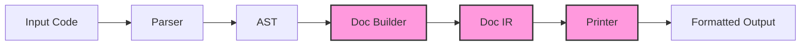
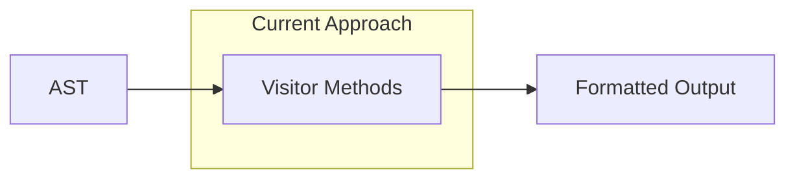
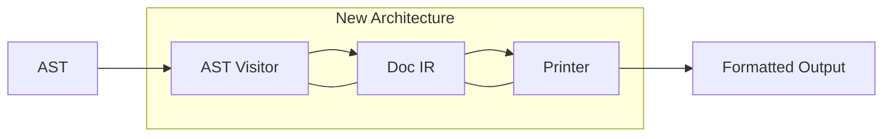
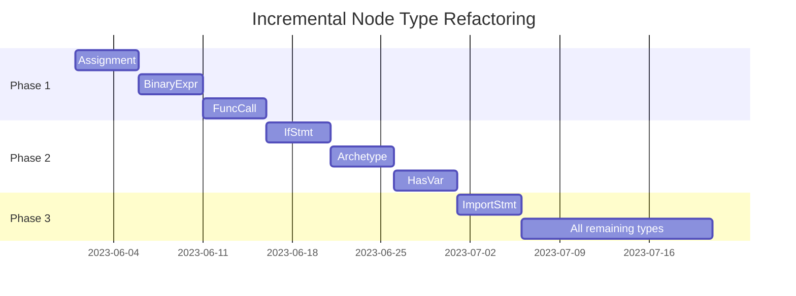

# Refactoring Your Formatter to a Prettier-Style Architecture

This document outlines a comprehensive plan for incrementally refactoring your current AST-based code formatter to a more maintainable, Prettier-style architecture. This approach preserves what works in your current implementation while introducing key architectural improvements that will make the formatter more robust, extensible, and easier to maintain.

## Table of Contents

- [Overview of Prettier's Architecture](#overview-of-prettiers-architecture)
- [Incremental Refactoring Steps](#incremental-refactoring-steps)
  - [1. Create a Three-Phase Pipeline Architecture](#1-create-a-three-phase-pipeline-architecture)
  - [2. Implement a Doc Builder Abstraction](#2-implement-a-doc-builder-abstraction)
  - [3. Refactor AST Traversal to Build Doc IR](#3-refactor-ast-traversal-to-build-doc-ir)
  - [4. Implement a Separate Printer](#4-implement-a-separate-printer)
  - [5. Decouple Comment Handling](#5-decouple-comment-handling)
  - [6. Refactor Formatting Rules](#6-refactor-formatting-rules)
  - [7. Implement Configurable Options](#7-implement-configurable-options)
  - [8. Refactor Specific Node Types Incrementally](#8-refactor-specific-node-types-incrementally)
  - [9. Implement Line Break and Indentation Logic](#9-implement-line-break-and-indentation-logic)
  - [10. Add Tests for Each Phase](#10-add-tests-for-each-phase)
- [Challenges and Considerations](#challenges-and-considerations)
- [Conclusion](#conclusion)

## Overview of Prettier's Architecture

Prettier's architecture stands out for its clean separation of concerns and its approach to formatting:



The key insight in Prettier's design is the **Doc IR (Intermediate Representation)** which sits between the AST and the final output. This IR abstracts formatting concerns from the AST structure, allowing for more flexible and powerful formatting strategies.

The Doc IR represents the _intent_ of formatting rather than the direct formatting itself. It contains elements like:

- Text segments
- Potential line breaks
- Indentation levels
- Groups that can be printed in one line or broken into multiple lines

The printer phase then uses an algorithm based on Philip Wadler's "A Prettier Printer" paper to render this IR into the final formatted code with optimal line breaks.

## Incremental Refactoring Steps

### 1. Create a Three-Phase Pipeline Architecture

**Current State:**
Your formatter currently combines AST traversal, formatting decisions, and output generation into a single pass, with methods like `exit_assignment` that both make formatting decisions and emit code.



**Target State:**
We need to separate this into distinct phases:



**Implementation Plan:**

1. Create a new `JacDocBuilder` class that will transform the AST into a Doc IR.
2. Create a new `JacPrinter` class that will format the Doc IR into the final code.
3. Modify the existing `JacFormatPass` to orchestrate these components rather than doing everything itself.

```python
class JacFormatPass(UniPass):
    """JacFormat Pass format Jac code."""

    def before_pass(self) -> None:
        """Initialize pass."""
        self.options = FormatterOptions()
        self.doc_builder = JacDocBuilder(self.options)
        self.printer = JacPrinter(self.options)

    def run_pass(self) -> None:
        """Execute the formatting pass."""
        # Phase 1: Build Doc IR
        doc = self.doc_builder.build(self.ir_in)

        # Phase 2: Print the Doc IR to formatted code
        formatted_code = self.printer.print(doc)

        # Store the result in the output IR
        self.ir_out = self.ir_in.copy()
        self.ir_out.source.content = formatted_code
```

This separation allows each component to focus on its specific responsibility, making the code more maintainable and easier to test.

### 2. Implement a Doc Builder Abstraction

The Doc IR is the cornerstone of Prettier's architecture. It provides an abstract representation of the formatting that can be rendered optimally.

**Implementation Details:**

Create a hierarchy of Doc classes to represent different formatting constructs:

```python
class Doc:
    """Base class for document parts."""
    def __str__(self):
        return self.__class__.__name__

class Text(Doc):
    """Simple text content."""
    def __init__(self, text):
        self.text = text

    def __str__(self):
        return f'Text("{self.text}")'

class Line(Doc):
    """Represents a line break that can be preserved or flattened."""
    def __init__(self, hard=False, literal=False):
        self.hard = hard      # If True, always break
        self.literal = literal  # If True, includes the literal newline in flattened output

    def __str__(self):
        attrs = []
        if self.hard:
            attrs.append("hard")
        if self.literal:
            attrs.append("literal")
        return f"Line({', '.join(attrs)})"

class Group(Doc):
    """A group that can be printed flat or broken into multiple lines."""
    def __init__(self, contents, break_contiguous=False, id=None):
        self.contents = contents
        self.break_contiguous = break_contiguous
        self.id = id

    def __str__(self):
        return f"Group({self.contents})"

class Indent(Doc):
    """Indented content."""
    def __init__(self, contents):
        self.contents = contents

    def __str__(self):
        return f"Indent({self.contents})"

class Concat(Doc):
    """A sequence of doc parts."""
    def __init__(self, parts):
        self.parts = parts

    def __str__(self):
        return f"Concat({self.parts})"

class IfBreak(Doc):
    """Content that differs based on whether the parent group is broken."""
    def __init__(self, break_contents, flat_contents):
        self.break_contents = break_contents
        self.flat_contents = flat_contents

    def __str__(self):
        return f"IfBreak({self.break_contents}, {self.flat_contents})"

class Align(Doc):
    """Alignment relative to the current indentation level."""
    def __init__(self, contents, n=None):
        self.contents = contents
        self.n = n  # Number of spaces, or null to use current indentation level

    def __str__(self):
        return f"Align({self.n}, {self.contents})"
```

Example of how these might be used together to represent formatted code:

```python
# The code: if (condition) { statement; }
doc = Group(
    Concat([
        Text("if "),
        Text("("),
        Text("condition"),
        Text(")"),
        Text(" {"),
        IfBreak(
            # If the group breaks
            Concat([
                Line(),
                Indent(
                    Concat([
                        Text("statement;"),
                        Line()
                    ])
                ),
                Text("}")
            ]),
            # If the group stays flat
            Concat([
                Text(" statement; "),
                Text("}")
            ])
        )
    ])
)
```

This Doc IR can represent both the flat and broken forms of the code, and the printer will decide which to use based on line length constraints.

### 3. Refactor AST Traversal to Build Doc IR

Instead of emitting code directly, the AST traversal will now build a Doc IR.

**Current approach:**

```python
def exit_assignment(self, node: uni.Assignment) -> None:
    prev_token = None
    for kid in node.kid:
        if isinstance(kid, uni.CommentToken):
            if kid.is_inline:
                self.emit(node, kid.gen.jac)
            else:
                self.emit_ln(node, "")
                self.emit_ln(node, "")
                self.emit_ln(node, kid.gen.jac)
        elif isinstance(kid, uni.Token) and kid.name == Tok.KW_LET:
            self.emit(node, f"{kid.gen.jac} ")
        elif isinstance(kid, uni.Token) and "=" in kid.gen.jac:
            self.emit(node, f" {kid.gen.jac} ")
        # ... more formatting logic
```

**New approach:**

```python
def build_assignment(self, node: uni.Assignment) -> Doc:
    """Build Doc IR for an assignment node."""
    parts = []

    for kid in node.kid:
        if isinstance(kid, uni.CommentToken):
            if kid.is_inline:
                parts.append(Text(" "))
                parts.append(Text(kid.value))
            else:
                parts.append(Line(hard=True))
                parts.append(Line(hard=True))
                parts.append(Text(kid.value))
                parts.append(Line(hard=True))
        elif isinstance(kid, uni.Token) and kid.name == Tok.KW_LET:
            parts.append(Text(kid.value))
            parts.append(Text(" "))
        elif isinstance(kid, uni.Token) and "=" in kid.value:
            parts.append(Text(" "))
            parts.append(Text(kid.value))
            parts.append(Text(" "))
        elif "=" in kid.gen.doc and self.is_line_break_needed(kid.gen.doc):
            # Handle long assignments with a group that allows breaking
            parts.append(
                Group(
                    Concat([
                        self.split_assignment_into_doc(kid.gen.doc)
                    ])
                )
            )
        else:
            parts.append(kid.gen.doc)

    return Group(Concat(parts))

def split_assignment_into_doc(self, assignment_text):
    """Split a long assignment into a Doc structure with potential breaks."""
    parts = re.split(r"(=)", assignment_text)
    doc_parts = []

    # Handle first part
    first_part = parts.pop(0).strip()
    doc_parts.append(Text(first_part))

    # Handle equals sign
    if parts:
        doc_parts.append(Text(" "))
        doc_parts.append(Text(parts.pop(0).strip()))
        doc_parts.append(Text(" "))

    # Handle remaining parts with potential breaks
    if parts:
        value_part = parts.pop(0).strip()
        if self.is_complex_expression(value_part):
            doc_parts.append(self.build_complex_expression_doc(value_part))
        else:
            doc_parts.append(Text(value_part))

    return Concat(doc_parts)
```

This approach separates the construction of the formatting representation from the actual output generation, allowing for more sophisticated formatting decisions.

### 4. Implement a Separate Printer

The printer's job is to convert the Doc IR into formatted text, making optimal decisions about line breaks.

```python
class JacPrinter:
    """Printer for Doc IR structures into formatted code."""

    def __init__(self, options):
        self.options = options

    def print(self, doc):
        """Print the Doc IR to a formatted string."""
        return self._print_doc(doc, 0, self.options.max_line_length)

    def _print_doc(self, doc, indent_level, width_remaining, is_broken=False):
        """Recursively print a Doc node."""
        if isinstance(doc, Text):
            return doc.text

        elif isinstance(doc, Line):
            if is_broken or doc.hard:
                return "\n" + " " * (indent_level * self.options.indent_size)
            else:
                return " " if not doc.literal else "\n"

        elif isinstance(doc, Group):
            # Try to print flat first
            flat_contents = self._print_doc(doc.contents, indent_level, width_remaining)

            # If it fits, use flat version
            if len(flat_contents.splitlines()[-1]) <= width_remaining and "\n" not in flat_contents:
                return flat_contents

            # Otherwise, print broken
            return self._print_doc(doc.contents, indent_level, width_remaining, True)

        elif isinstance(doc, Indent):
            return self._print_doc(doc.contents, indent_level + 1,
                                 width_remaining - self.options.indent_size, is_broken)

        elif isinstance(doc, Concat):
            result = ""
            current_width = width_remaining

            for part in doc.parts:
                part_str = self._print_doc(part, indent_level, current_width, is_broken)
                result += part_str

                # Update remaining width
                if "\n" in part_str:
                    lines = part_str.splitlines()
                    current_width = width_remaining - len(lines[-1])
                else:
                    current_width -= len(part_str)

            return result

        elif isinstance(doc, IfBreak):
            if is_broken:
                return self._print_doc(doc.break_contents, indent_level, width_remaining, is_broken)
            else:
                return self._print_doc(doc.flat_contents, indent_level, width_remaining, is_broken)

        elif isinstance(doc, Align):
            align_size = self.options.indent_size if doc.n is None else doc.n
            return self._print_doc(doc.contents, indent_level + align_size//self.options.indent_size,
                                 width_remaining - align_size, is_broken)

        # Default case
        return str(doc)
```

This implementation is a simplified version of Wadler's algorithm. A full implementation would include more sophisticated fitting logic, caching, and optimization.

### 5. Decouple Comment Handling

Comments are a common source of complexity in formatters. Prettier handles them by attaching comments to AST nodes before formatting.

**Implementation Plan:**

1. Create a comment attachment phase that runs before Doc IR generation.
2. Modify the Doc IR to include attached comments.
3. Update the printer to handle comments appropriately.

```python
class CommentAttacher:
    """Attaches comments to the nearest relevant AST nodes."""

    def __init__(self, ast, comments):
        self.ast = ast
        self.comments = sorted(comments, key=lambda c: c.loc.first_line)

    def run(self):
        """Attach comments to nodes and return the modified AST."""
        self.unattached_comments = list(self.comments)
        self._visit_node(self.ast)
        return self.ast

    def _visit_node(self, node):
        """Visit a node and its children, attaching comments as appropriate."""
        # Attach leading comments (before the node)
        node.leading_comments = self._get_comments_before(node)

        # Recursively visit children
        for child in node.children():
            self._visit_node(child)

        # Attach trailing comments (after the node)
        node.trailing_comments = self._get_comments_after(node)

    def _get_comments_before(self, node):
        """Get comments that appear before the node."""
        result = []

        for comment in list(self.unattached_comments):
            if comment.loc.last_line < node.loc.first_line:
                result.append(comment)
                self.unattached_comments.remove(comment)

        return result

    def _get_comments_after(self, node):
        """Get comments that appear after the node but before the next node."""
        # Implementation would depend on how to determine the "next" node
        # This is a simplified version
        result = []

        for comment in list(self.unattached_comments):
            if (comment.loc.first_line > node.loc.last_line and
                (not node.next_sibling or comment.loc.last_line < node.next_sibling.loc.first_line)):
                result.append(comment)
                self.unattached_comments.remove(comment)

        return result
```

Then in the Doc builder:

```python
def build_node_doc(self, node):
    """Build a Doc for a node including its attached comments."""
    parts = []

    # Add leading comments
    if hasattr(node, 'leading_comments') and node.leading_comments:
        for comment in node.leading_comments:
            parts.append(Text(comment.value))
            parts.append(Line(hard=True))

    # Build the node's own Doc
    node_doc = self._build_specific_node_doc(node)
    parts.append(node_doc)

    # Add trailing comments
    if hasattr(node, 'trailing_comments') and node.trailing_comments:
        for comment in node.trailing_comments:
            parts.append(Text(comment.value))
            parts.append(Line(hard=True))

    return Concat(parts)
```

This approach makes comment handling more systematic and predictable.

### 6. Refactor Formatting Rules

Currently, your formatting rules are spread across many `exit_*` methods. A cleaner approach would be to centralize these rules.

```python
class FormattingRules:
    """Central repository for formatting rules."""

    def __init__(self, options):
        self.options = options

    def format_node(self, node):
        """Format any node by dispatching to the appropriate method."""
        method_name = f"format_{node.__class__.__name__.lower()}"
        if hasattr(self, method_name):
            return getattr(self, method_name)(node)
        else:
            return self.format_default(node)

    def format_default(self, node):
        """Default formatting for nodes without specific rules."""
        # Generic formatting logic

    def format_assignment(self, node):
        """Format an assignment node."""
        # Assignment-specific formatting

    def format_binaryexpr(self, node):
        """Format a binary expression."""
        # Binary expression formatting

    # Additional formatting methods for other node types
```

This approach makes it easier to see all formatting rules in one place and reuse common patterns.

### 7. Implement Configurable Options

A clean options system makes it easier to adjust formatting behavior:

```python
class FormatterOptions:
    """Configuration options for the formatter."""

    def __init__(self,
                 indent_size=4,
                 max_line_length=80,
                 tab_width=4,
                 use_tabs=False,
                 semicolons=True,
                 bracket_spacing=True,
                 jsx_bracket_same_line=False,
                 arrow_parens='always',
                 trailing_comma='all'):
        """Initialize formatter options with defaults."""
        self.indent_size = indent_size
        self.max_line_length = max_line_length
        self.tab_width = tab_width
        self.use_tabs = use_tabs
        self.semicolons = semicolons
        self.bracket_spacing = bracket_spacing
        self.jsx_bracket_same_line = jsx_bracket_same_line
        self.arrow_parens = arrow_parens
        self.trailing_comma = trailing_comma

    @classmethod
    def from_config_file(cls, file_path):
        """Load options from a configuration file."""
        # Implementation to load from a config file

    def merge(self, overrides):
        """Create a new options object with the given overrides."""
        new_options = self.__class__()
        for key, value in vars(self).items():
            setattr(new_options, key, getattr(overrides, key, value))
        return new_options
```

You can then reference these options throughout the formatter:

```python
def build_assignment(self, node):
    parts = []
    # ...
    if self.options.semicolons:
        parts.append(Text(";"))
    # ...
    return Group(Concat(parts))
```

This makes the formatter more configurable and adaptable to different coding styles.

### 8. Refactor Specific Node Types Incrementally

Start by refactoring the most complex node types to use the new architecture, then gradually convert the rest.



For each node type:

1. Create a Doc builder method
2. Test the formatting
3. Verify that it works with the printer
4. Move on to the next node type

This phased approach allows for incremental progress while keeping the formatter functional.

### 9. Implement Line Break and Indentation Logic

The key to good formatting is intelligent line breaking and indentation. With the Doc IR, you can implement sophisticated algorithms for this:

```python
def should_break_group(self, group, flat_content, width_remaining):
    """Determine if a group should be broken based on remaining width."""
    # Simple case: if flat content fits, don't break
    if len(flat_content) <= width_remaining:
        return False

    # More complex heuristics
    # 1. Does it contain deeply nested groups that would benefit from breaking?
    nested_depth = self._get_group_nesting_depth(group)
    if nested_depth > 2:
        return True

    # 2. Does it contain specific constructs that read better when broken?
    has_break_worthy_constructs = self._has_break_worthy_constructs(group)
    if has_break_worthy_constructs:
        return True

    # 3. Would breaking save a significant amount of horizontal space?
    flat_lines = flat_content.splitlines()
    if len(flat_lines) > 1 and max(len(l) for l in flat_lines) > width_remaining * 0.8:
        return True

    return False

def _get_group_nesting_depth(self, group):
    """Get the maximum nesting depth of groups within this group."""
    # Implementation depends on your Doc IR structure

def _has_break_worthy_constructs(self, group):
    """Check if the group contains constructs that read better when broken."""
    # Check for long parameter lists, complex expressions, etc.
```

This kind of logic can significantly improve the quality of the formatting.

### 10. Add Tests for Each Phase

Comprehensive tests ensure that the refactoring doesn't break existing functionality:

```python
def test_doc_builder():
    """Test that the Doc builder creates the expected Doc IR."""
    # Arrange
    ast = parse("x = 1 + 2")
    options = FormatterOptions()
    builder = JacDocBuilder(options)

    # Act
    doc = builder.build(ast)

    # Assert
    assert isinstance(doc, Group)
    assert len(doc.contents.parts) == 3  # x, =, 1 + 2

def test_printer():
    """Test that the printer produces the expected output."""
    # Arrange
    doc = Group(Concat([
        Text("x"),
        Text(" = "),
        Text("1 + 2")
    ]))
    options = FormatterOptions()
    printer = JacPrinter(options)

    # Act
    output = printer.print(doc)

    # Assert
    assert output == "x = 1 + 2"

def test_end_to_end():
    """Test the entire formatting pipeline."""
    # Arrange
    input_code = "x=1+2"
    options = FormatterOptions()
    formatter = JacFormatter(options)

    # Act
    output = formatter.format(input_code)

    # Assert
    assert output == "x = 1 + 2"
```

These tests should cover both simple and complex cases, as well as edge cases like comments, empty blocks, and very long lines.

## Challenges and Considerations

### Handling Comments

Comments are challenging because they need to be preserved but aren't part of the AST structure. The comment attacher phase addresses this, but may need refinement for complex cases.

### Preserving Semantic Structure

It's important that the formatter doesn't change the meaning of the code. Be careful with operators and expressions where whitespace matters.

```python
def validate_semantic_preservation(self, original_ast, formatted_code):
    """Verify that formatting preserves semantic structure."""
    formatted_ast = parse(formatted_code)
    return self._ast_semantically_equivalent(original_ast, formatted_ast)

def _ast_semantically_equivalent(self, ast1, ast2):
    """Check if two ASTs are semantically equivalent."""
    # Implementation would compare structure ignoring formatting details
```

### Performance

For large files, the formatting process can be time-consuming. Consider optimizations:

1. Caching Doc IRs for unchanged parts of code
2. Parallelizing formatting of independent sections
3. Implementing the printer efficiently to avoid recomputing layouts

```python
class DocCache:
    """Cache for Doc IRs to avoid redundant computation."""

    def __init__(self):
        self.cache = {}

    def get(self, node_hash):
        """Get a cached Doc IR for a node, if available."""
        return self.cache.get(node_hash)

    def put(self, node_hash, doc):
        """Cache a Doc IR for a node."""
        self.cache[node_hash] = doc

    def invalidate(self, node_hash=None):
        """Invalidate cache entries."""
        if node_hash is None:
            self.cache.clear()
        else:
            self.cache.pop(node_hash, None)
```

### Backward Compatibility

If users are already relying on your current formatter, consider a transitional period:

```python
def format(self, code, use_new_architecture=True):
    """Format code using either the new or old architecture."""
    if use_new_architecture:
        # Use the new pipeline
        ast = parse(code)
        doc = self.doc_builder.build(ast)
        return self.printer.print(doc)
    else:
        # Use the existing formatter
        # Implementation using current approach
```

## Conclusion

Refactoring your formatter to a Prettier-style architecture provides significant benefits:

- **Cleaner separation of concerns** between parsing, formatting decisions, and output generation
- **More maintainable codebase** with centralized formatting rules
- **Better handling of line breaks** through the Doc IR abstraction
- **More predictable formatting** due to systematic algorithms

The incremental approach outlined here allows you to make progress while keeping the formatter functional. Start with the core architectural changes, then refactor node types one by one, and finally implement the more sophisticated formatting logic.

Remember that the goal is not just to mimic Prettier, but to adopt the architectural principles that make it successful, while preserving the domain-specific knowledge and formatting rules that are tailored to your language.