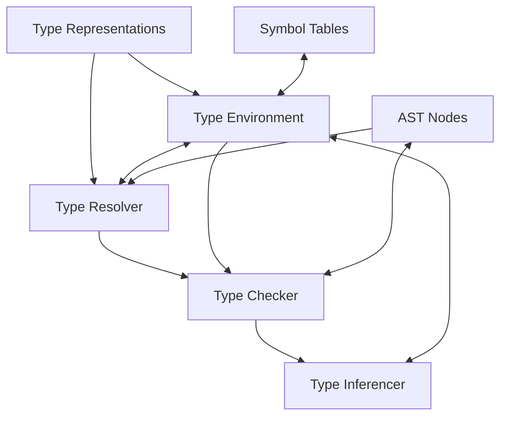
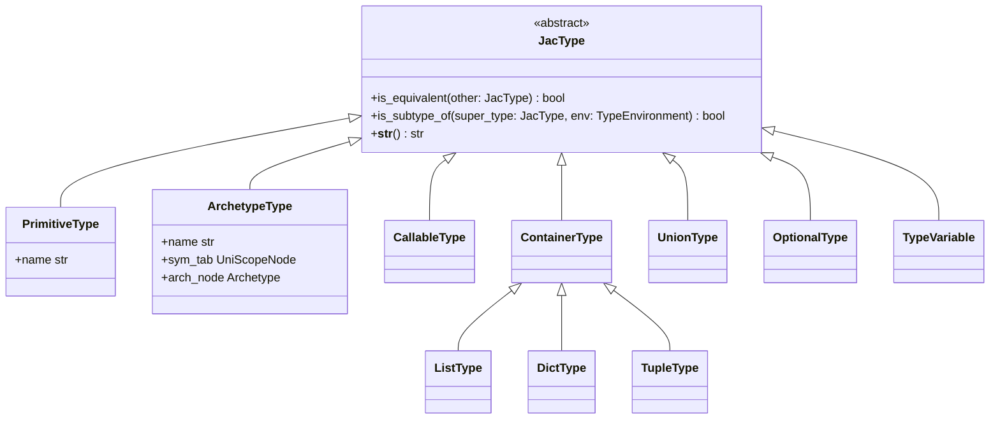
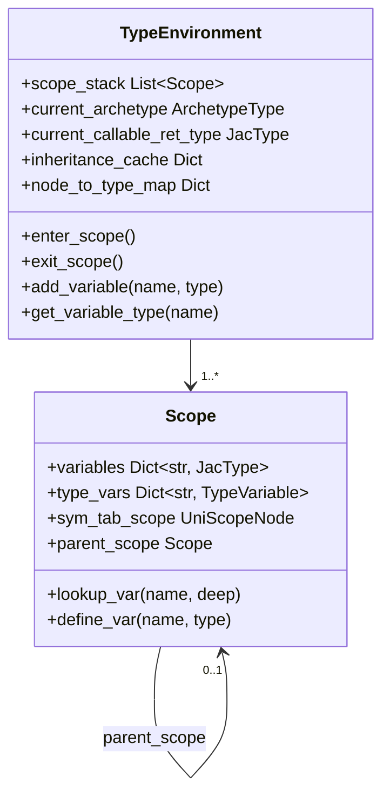
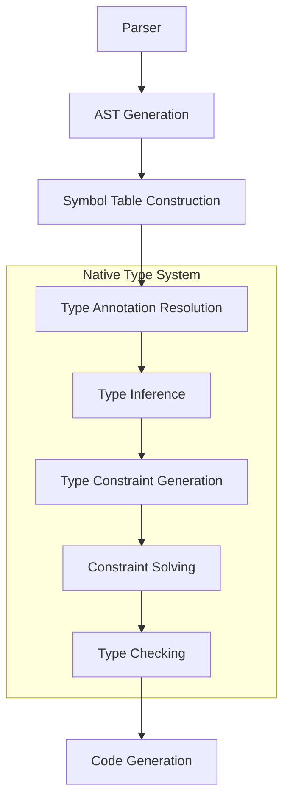

# Type System Architecture

This document outlines the high-level architecture of Jac's native type system, detailing its core components and how they interact with each other.

## Core Components

The native type system consists of several key components that work together throughout the compilation process:

### Type Representations

At the core of the system is a hierarchy of classes representing Jac types. Instead of simple strings, these classes provide rich type information that facilitates operations like:

- Type equivalence checking
- Subtyping relationships
- Type operations (like unions, intersections)
- Parameter validation for generics

### Type Environment

The Type Environment manages the typing context as the compiler processes the code. It:

- Tracks variable types within lexical scopes
- Maintains the hierarchy of scopes
- Holds contextual information (current archetype, return type expectations)
- Caches type resolutions for performance

### Type Resolver

The Type Resolver translates syntactic type representations in the AST into the structured JacType objects. It handles:

- Simple type name resolution
- Generic parameter resolution
- Union and intersection types
- Qualified name resolution (for imported types)

### Type Checker

The Type Checker applies type checking rules to validate operations, assignments, and expressions. It:

- Traverses the AST
- Validates operations against operand types
- Checks assignments for type compatibility
- Verifies function calls against signatures
- Reports type errors with meaningful messages

### Type Inferencer

The Type Inferencer determines types when they aren't explicitly annotated:

- Infers types from initializers
- Propagates type information through operations
- Uses constraint solving for complex cases
- Applies contextual typing based on expected types

## Compiler Integration

The type system is tightly integrated with the compiler:

1. After parsing and building initial symbol tables, the **Type Annotation Resolution** phase resolves explicit type annotations into JacType objects
2. Next, the **Type Inference** phase infers types for expressions and variables without explicit annotations
3. The **Type Constraint Generation** phase generates constraints from operations and control flow
4. The **Constraint Solving** phase resolves these constraints to determine concrete types
5. Finally, the **Type Checking** phase validates all expressions and statements against the resolved types

## Error Handling

Type errors are reported through the compiler's error system with:

- Precise source location information
- Clear error messages explaining the issue
- Suggestions for fixes when possible
- Categorization of errors (e.g., assignment incompatibility, invalid operation)

## Design Principles

The architecture follows these key principles:

1. **Progressive Resolution**: Types are refined in multiple passes rather than requiring everything to be determinable in a single pass
2. **Clear Separation of Concerns**: Each component has well-defined responsibilities
3. **AST Integration**: Type information is attached directly to AST nodes for easy access
4. **Performance Consideration**: Caching mechanisms minimize redundant work
5. **Extensibility**: The system can be extended with new type constructs and rules