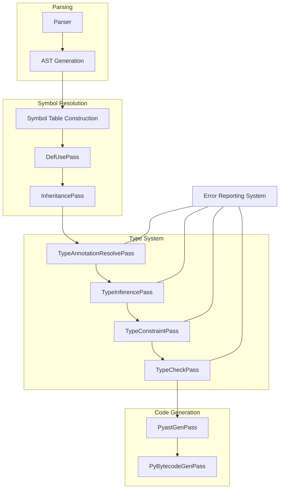
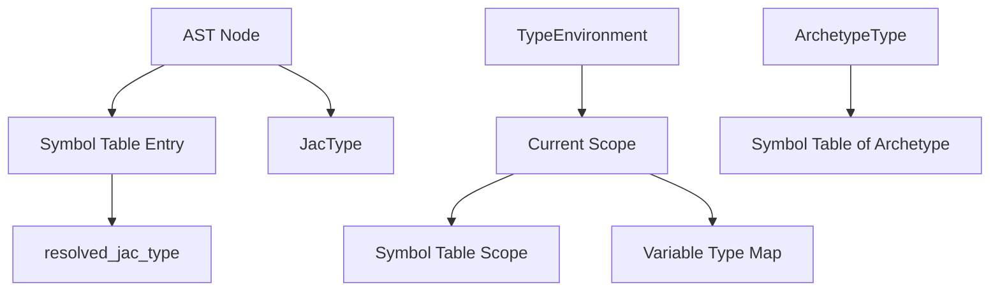

# Compiler Integration

This document explains how the native type system integrates with the Jac compiler infrastructure.

## Overview

The type system is tightly integrated with the Jac compiler through multiple passes that work together to analyze, infer, and check types throughout the compilation process.



## Compiler Passes for Type System

The type system is implemented as a series of compiler passes that execute in a specific order:

### 1. TypeAnnotationResolvePass

This pass resolves explicit type annotations in the AST:

```python
class TypeAnnotationResolvePass(Transform[Module, Module]):
    """Resolves explicit type annotations in the AST."""

    def __init__(self, ir_in: Module, prog: JacProgram) -> None:
        super().__init__(ir_in, prog)
        self.resolver = TypeResolver(self.report_error)
        self.env = TypeEnvironment(ir_in, self.resolver)

    def visit_HasVar(self, node: uni.HasVar) -> None:
        """Process a variable declaration with type annotation."""
        if node.type_tag:
            type_annotation = self.resolver.resolve_type_from_ast(node.type_tag, self.env)
            node.jac_type = type_annotation

            # Also store in symbol table if possible
            if node.name.sym_link and node.name.sym_link.decl:
                node.name.sym_link.decl.resolved_jac_type = type_annotation

        super().visit_HasVar(node)
```

The TypeAnnotationResolvePass:
- Creates a TypeResolver and TypeEnvironment
- Traverses the AST to find explicit type annotations
- Resolves annotations to JacType instances
- Attaches types to AST nodes and symbol table entries

### 2. TypeInferencePass

This pass infers types for expressions and variables without explicit annotations:

```python
class TypeInferencePass(Transform[Module, Module]):
    """Infers types for expressions and variables without explicit annotations."""

    def __init__(self, ir_in: Module, prog: JacProgram) -> None:
        super().__init__(ir_in, prog)
        self.resolver = TypeResolver(self.report_error)
        self.env = TypeEnvironment(ir_in, self.resolver)
        self.constraint_collector = TypeConstraintCollector()

    def visit_Assignment(self, node: uni.Assignment) -> None:
        """Process an assignment expression."""
        # Visit children first to collect their types
        super().visit_Assignment(node)

        # Generate a type constraint: rhs_type <: lhs_type
        if node.left.jac_type is None:
            # Infer from right side if left has no type yet
            if node.right.jac_type:
                node.left.jac_type = node.right.jac_type
        else:
            # Otherwise add a constraint
            self.constraint_collector.add_subtype_constraint(
                node.right, node.left,
                f"Assignment at {node.loc.line_no}:{node.loc.col_no}"
            )
```

The TypeInferencePass:
- Collects types already determined from annotations
- Infers types for expressions from their subexpressions
- Infers types for variables from initializers
- Generates type constraints for further solving

### 3. TypeConstraintPass

This pass collects and solves constraints to determine consistent types:

```python
class TypeConstraintPass(Transform[Module, Module]):
    """Collects and solves type constraints."""

    def __init__(self, ir_in: Module, prog: JacProgram) -> None:
        super().__init__(ir_in, prog)
        self.constraint_solver = TypeConstraintSolver(self.report_error)

    def apply(self) -> None:
        # Collect all constraints from previous passes
        constraints = self.prog.type_constraints

        # Solve the constraint system
        resolved_types = self.constraint_solver.solve(constraints)

        # Apply the resolved types to AST nodes
        for node_id, resolved_type in resolved_types.items():
            node = self.prog.ast_node_map.get(node_id)
            if node:
                node.jac_type = resolved_type
```

The TypeConstraintPass:
- Takes constraints from the TypeInferencePass
- Builds a constraint graph
- Applies constraint propagation algorithms
- Resolves type variables to concrete types
- Updates AST nodes with the resolved types

### 4. TypeCheckPass

This pass validates that operations are type-safe:

```python
class TypeCheckPass(Transform[Module, Module]):
    """Validates that operations are type-safe."""

    def __init__(self, ir_in: Module, prog: JacProgram) -> None:
        super().__init__(ir_in, prog)
        self.resolver = TypeResolver(self.report_error)
        self.env = TypeEnvironment(ir_in, self.resolver)

    def visit_BinaryExpr(self, node: uni.BinaryExpr) -> None:
        """Check a binary expression."""
        super().visit_BinaryExpr(node)

        left_type = node.left.jac_type
        right_type = node.right.jac_type

        if not left_type or not right_type:
            return  # Skip if types are missing (error reported elsewhere)

        if node.op.name == uni.Tok.PLUS:
            # Check if + operation is valid for these types
            if not self.is_valid_addition(left_type, right_type):
                self.report_error(
                    JacErrorCode.TYPE_ERROR_INVALID_OPERATION,
                    args={
                        "op": "+",
                        "left_type": str(left_type),
                        "right_type": str(right_type)
                    },
                    node_override=node
                )
            else:
                # Set the result type
                node.jac_type = self.determine_addition_result_type(left_type, right_type)
```

The TypeCheckPass:
- Validates that operations are performed on compatible types
- Checks that assignments respect the type system
- Verifies function arguments match parameter types
- Reports detailed type errors when violations occur
- Sets result types for expressions

## Integration with Symbol Tables

The type system heavily integrates with Jac's symbol table system:



Key integration points:
1. **Symbol Table Linking**: The Symbol Table helps the type system locate definitions for type names
2. **Type Storage**: Types are stored both on AST nodes and in Symbol Table entries
3. **Scope Navigation**: The TypeEnvironment uses Symbol Table scopes to resolve names
4. **Member Lookup**: ArchetypeType instances maintain links to their Symbol Tables for member lookup

## Replacing MyPy Integration

The native type system completely replaces the previous MyPy-based approach:

| Old MyPy Approach | New Native Approach |
|-------------------|---------------------|
| Convert Jac AST to Python AST | Work directly on Jac AST |
| Run MyPy on Python AST | Run native type checking passes |
| Extract type strings from MyPy | Use rich JacType instances |
| Map types back to Jac AST | Types directly attached to AST nodes |
| Limited understanding of Jac constructs | Full understanding of Jac-specific features |

```mermaid
graph TD
    subgraph "Old Approach"
        A1[Jac AST] --> B1[Python AST]
        B1 --> C1[MyPy Analysis]
        C1 --> D1[String Type Info]
        D1 --> E1[FuseTypeInfoPass]
        E1 --> F1[Type String on AST]
    end

    subgraph "New Approach"
        A2[Jac AST] --> B2[Symbol Tables]
        B2 --> C2[TypeAnnotationResolvePass]
        C2 --> D2[TypeInferencePass]
        D2 --> E2[TypeCheckPass]
        E2 --> F2[JacType Objects on AST]
    end
```



## Integration with Error Reporting

Type errors are reported through the compiler's existing error reporting system:

```python
def report_error(self, error_code: JacErrorCode, args: dict, node_override: Optional[uni.UniNode] = None) -> None:
    """Report a type error through the compiler's error system."""
    loc = node_override.loc if node_override else self.curr_node.loc if self.curr_node else None

    self.errors_had.append(
        Alert(
            error_code=error_code,
            msg_args=args,
            severity=Severity.ERROR,
            loc_override=loc
        )
    )
```

Error messages provide:
- Clear description of the type error
- Exact source location
- Expected vs. actual types
- Suggestions for fixing the error when possible

## Integration with Runtime Type Information

The native type system can also generate runtime type information when needed:

```python
class PyastGenPass(Transform[Module, Module]):
    """Generates Python AST for code generation."""

    def generate_type_annotation(self, jac_type: JacType) -> Optional[py_ast.expr]:
        """Convert a JacType to a Python type annotation."""
        if isinstance(jac_type, PrimitiveType):
            return py_ast.Name(id=jac_type.name, ctx=py_ast.Load())
        elif isinstance(jac_type, ListType):
            return py_ast.Subscript(
                value=py_ast.Name(id='list', ctx=py_ast.Load()),
                slice=py_ast.Index(value=self.generate_type_annotation(jac_type.element_type)),
                ctx=py_ast.Load()
            )
        # ... other type conversions
```

This enables:
- Generation of Python type annotations for Jac code
- Runtime type checks if desired
- IDE integration and tooling support

## Extension Points

The design allows for easy extension with new types and features:

1. **Adding New Types**: Extend the JacType hierarchy with new type classes
2. **Custom Type Rules**: Modify TypeCheckPass to handle special typing rules
3. **Language Feature Support**: Add specific handling for Jac features like walkers
4. **Optimization Hints**: Use type information for optimization
5. **IDE Integration**: Export type information for IDE tooling

## Performance Considerations

The system includes several optimizations to ensure good performance:

1. **Type Caching**: Resolved types are cached to avoid redundant computation
2. **Incremental Analysis**: Only re-analyze parts of the code that have changed
3. **Early Error Detection**: Fail fast when errors are detected
4. **Parallel Processing**: Some passes can be parallelized for large projects