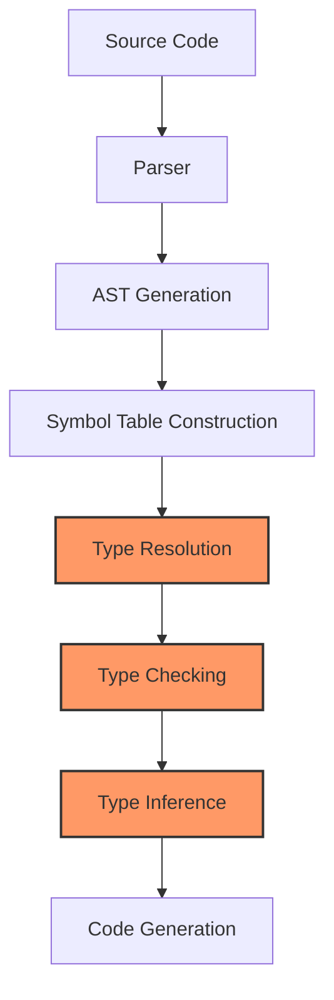

 # Native Type System

This section covers the design and implementation of Jac's native type system. Instead of relying on external type checkers like mypy, Jac now implements its own fully integrated type checking system that's designed to work seamlessly with the language's unique features.

## Overview

The Jac native type system provides comprehensive static type checking throughout the compilation process. It's designed to catch type errors early while supporting Jac's specific constructs like walkers, nodes, edges, and abilities.

## Key Features

- **Progressive Type Resolution**: Types are resolved during multiple compiler passes, enabling complex type relationships to be properly validated
- **Full Type Inference**: Variables can be implicitly typed based on their usage and initialization
- **Gradual Typing**: Optional type annotations allow for flexibility while still providing type safety where specified
- **Object-Oriented Type Checking**: Robust support for inheritance, interfaces, and polymorphism
- **Data-Spatial Type Extensions**: Special handling for Jac-specific constructs like walkers, nodes, and edges

## Documentation Structure

- [**Type System Architecture**](architecture.md): Core design of the type system
- [**Type Representation**](type_representation.md): How types are represented internally
- [**Type Resolution**](type_resolution.md): The process of determining and validating types
- [**Type Rules**](type_rules.md): Formal rules for type checking in Jac
- [**Type Inference**](type_inference.md): How types are inferred when not explicitly specified
- [**Integration with Compiler**](compiler_integration.md): How the type system integrates with the compiler passes