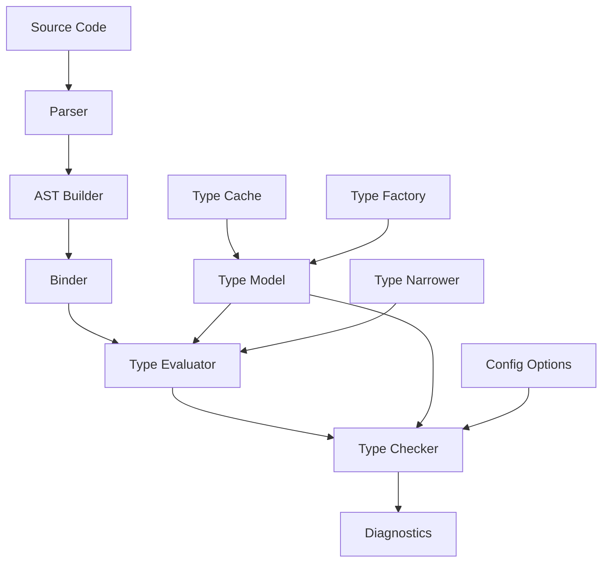
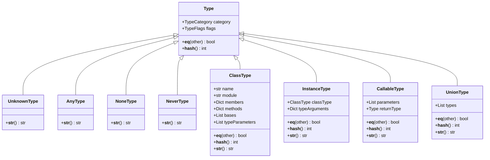
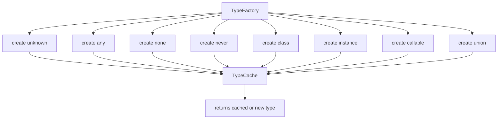
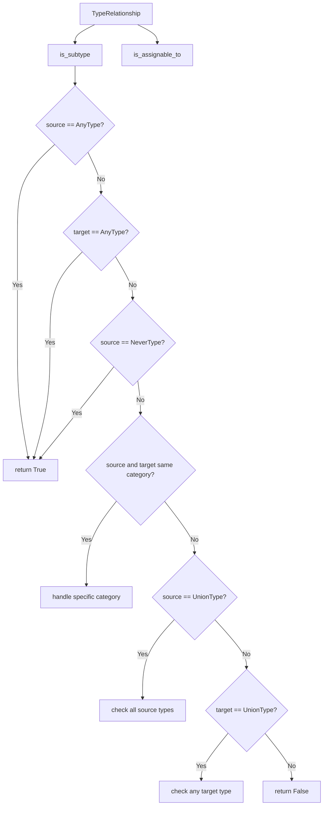
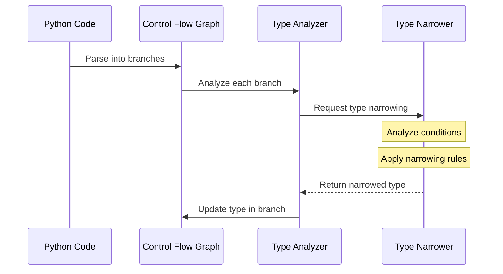
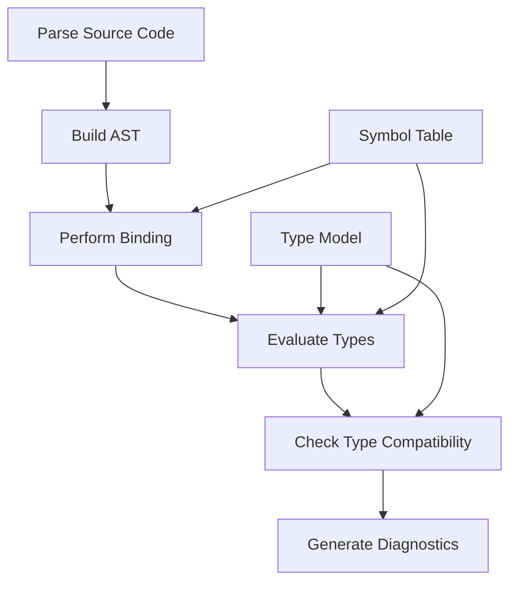

# Python Type Checker Architecture: A Pyright-Inspired Approach

## Table of Contents

- [Introduction](#introduction)
- [System Overview](#system-overview)
- [Project Structure](#project-structure)
- [Core Components](#core-components)
  - [Type Model](#type-model)
  - [Type Factory](#type-factory)
  - [Type Relationships](#type-relationships)
  - [Type Narrowing](#type-narrowing)
- [Flow and Integration](#flow-and-integration)
  - [Type Checking Process](#type-checking-process)
  - [Parser Integration](#parser-integration)
  - [Performance Optimizations](#performance-optimizations)
- [Advanced Features](#advanced-features)
  - [Protocol Support](#protocol-support)
  - [Type Guards](#type-guards)
  - [Structural Types](#structural-types)
- [Implementation Guide](#implementation-guide)
  - [Getting Started](#getting-started)
  - [Key Algorithms](#key-algorithms)
  - [Testing Strategy](#testing-strategy)
- [Comparison with Other Type Checkers](#comparison-with-other-type-checkers)
- [Conclusion](#conclusion)

## Introduction

This document outlines the architecture and implementation details for a Python type checker that adopts Pyright's efficient approach to type checking, while being implemented in Python. Pyright, originally written in TypeScript, is known for its performance and scalability with large codebases. This architecture aims to bring those benefits to a pure Python implementation.

The key innovations of this approach include:

1. An efficient type representation system with aggressive caching
2. Sophisticated type narrowing based on control flow analysis
3. High-performance algorithms for type compatibility checking
4. Memory-efficient data structures for representing the type system

## System Overview



The system follows a pipeline architecture where source code flows through various stages of analysis, with the type model serving as the foundation for all type-related operations.

## Project Structure

The project is organized into the following directory structure:

```
python-typecheck/
├── src/
│   ├── __init__.py
│   ├── main.py                    # Entry point for the type checker
│   ├── analyzer/                  # Core analysis components
│   │   ├── __init__.py
│   │   ├── analyzer.py            # Main analyzer
│   │   ├── binding.py             # Name binding
│   │   ├── symbolTable.py         # Symbol table
│   │   ├── typeEvaluator.py       # Type evaluation
│   │   ├── typeGuard.py           # Type guard analysis
│   │   └── typeNarrowing.py       # Type narrowing
│   ├── core/                      # Core infrastructure
│   │   ├── __init__.py
│   │   ├── configOptions.py       # Configuration
│   │   ├── diagnostics.py         # Error reporting
│   │   ├── fileSystem.py          # File system abstraction
│   │   └── host.py                # Host environment interface
│   ├── parser/                    # Parsing components
│   │   ├── __init__.py
│   │   ├── parser.py              # Python parser
│   │   ├── tokenizer.py           # Tokenizer
│   │   └── astBuilder.py          # AST construction
│   ├── typechecker/               # Type checking
│   │   ├── __init__.py
│   │   ├── checker.py             # Type checking logic
│   │   ├── assignmentChecker.py   # Assignment validation
│   │   ├── callChecker.py         # Function call checking
│   │   ├── unionChecker.py        # Union type handling
│   │   └── protocolChecker.py     # Protocol checking
│   ├── typemodel/                 # Type system model
│   │   ├── __init__.py
│   │   ├── types.py               # Core type classes
│   │   ├── typeFactory.py         # Type creation factory
│   │   ├── typeCache.py           # Type caching
│   │   ├── typeUnion.py           # Union type implementation
│   │   ├── typeIntersection.py    # Intersection type
│   │   ├── callable.py            # Callable type
│   │   └── subtypeRelation.py     # Subtyping relationships
│   └── commands/                  # Commands
│       ├── __init__.py
│       ├── commandProcessor.py    # Command processing
│       └── lspServer.py           # LSP implementation
├── tests/                         # Test suite
│   ├── __init__.py
│   ├── test_typecheck.py
│   ├── test_narrowing.py
│   └── samples/                   # Test code samples
└── scripts/                       # Utility scripts
    ├── build.py
    └── benchmark.py
```

## Core Components

### Type Model

The type model is the foundation of the entire type checker. It defines how types are represented, compared, and manipulated.



#### Implementation of the Base Type Class

```python
class Type:
    """Base class for all type objects."""
    
    def __init__(self, category: TypeCategory):
        self.category = category
        self.flags = TypeFlags.NONE
        
    def __eq__(self, other: object) -> bool:
        if not isinstance(other, Type):
            return False
        return self.category == other.category
    
    def __hash__(self) -> int:
        return hash(self.category)
```

The `Type` class serves as the base for all type representations. It includes:

- A `category` field that identifies the kind of type (class, instance, union, etc.)
- A `flags` field for additional type properties
- Equality and hash methods for efficient comparisons and storage in collections

#### Implementation of Class and Instance Types

Class and instance types are fundamental to object-oriented languages like Python:

```python
class ClassType(Type):
    """Represents a class type."""
    
    def __init__(self, name: str, module: Optional[str] = None):
        super().__init__(TypeCategory.CLASS)
        self.flags |= TypeFlags.CLASS
        self.name = name
        self.module = module
        self.members: Dict[str, Type] = {}
        self.methods: Dict[str, CallableType] = {}
        self.bases: List[ClassType] = []
        self.type_parameters: List[TypeVar] = []
        
    def __eq__(self, other: object) -> bool:
        if not isinstance(other, ClassType):
            return False
        return (
            self.name == other.name and 
            self.module == other.module
        )
    
    def __hash__(self) -> int:
        return hash((self.category, self.name, self.module))
    
    def __str__(self) -> str:
        if self.module:
            return f"{self.module}.{self.name}"
        return self.name


class InstanceType(Type):
    """Represents an instance of a class."""
    
    def __init__(self, class_type: ClassType):
        super().__init__(TypeCategory.INSTANCE)
        self.flags |= TypeFlags.INSTANCE
        self.class_type = class_type
        self.type_arguments: Dict[str, Type] = {}
        
    def __eq__(self, other: object) -> bool:
        if not isinstance(other, InstanceType):
            return False
        return self.class_type == other.class_type
    
    def __hash__(self) -> int:
        return hash((self.category, self.class_type))
    
    def __str__(self) -> str:
        if not self.type_arguments:
            return str(self.class_type)
        
        args = ", ".join(str(arg) for arg in self.type_arguments.values())
        return f"{self.class_type}[{args}]"
```

Key points:
- `ClassType` represents the type of a class itself
- `InstanceType` represents an instance of a class
- Both implement proper equality and hash methods for efficient comparison
- Type arguments for generic types are stored in the `type_arguments` dictionary

### Type Factory

The TypeFactory implements the Factory pattern for creating type objects, ensuring consistent creation and caching:



#### Implementation of Type Factory

```python
class TypeFactory:
    """
    Factory class for creating type objects. Ensures all types are created
    through the cache for memory efficiency.
    """
    
    @staticmethod
    def unknown() -> UnknownType:
        return TypeCache.get_instance().unknown_type
    
    @staticmethod
    def any() -> AnyType:
        return TypeCache.get_instance().any_type
    
    @staticmethod
    def none() -> NoneType:
        return TypeCache.get_instance().none_type
    
    @staticmethod
    def never() -> NeverType:
        return TypeCache.get_instance().never_type
    
    @staticmethod
    def class_type(name: str, module: Optional[str] = None) -> ClassType:
        if module is None and name in ["int", "float", "str", "bool", "bytes", "object"]:
            return TypeCache.get_instance().get_builtin_type(name)
        
        return ClassType(name, module)
    
    @staticmethod
    def instance_type(class_type: ClassType) -> InstanceType:
        return InstanceType(class_type)
    
    @staticmethod
    def callable(parameters: List[ParameterType], return_type: Type) -> CallableType:
        return TypeCache.get_instance().get_callable_type(parameters, return_type)
    
    @staticmethod
    def union(types: List[Type]) -> Type:
        # Filter out duplicates
        unique_types = []
        seen_types = set()
        
        for t in types:
            # Handle nested unions - flatten them
            if isinstance(t, UnionType):
                for nested_type in t.types:
                    if id(nested_type) not in seen_types:
                        unique_types.append(nested_type)
                        seen_types.add(id(nested_type))
            else:
                if id(t) not in seen_types:
                    unique_types.append(t)
                    seen_types.add(id(t))
        
        # Special cases for union simplification
        if len(unique_types) == 0:
            return TypeFactory.never()
        
        if len(unique_types) == 1:
            return unique_types[0]
        
        # If Any is in the union, the result is Any
        if any(isinstance(t, AnyType) for t in unique_types):
            return TypeFactory.any()
        
        # Create the union through the cache
        return TypeCache.get_instance().get_union_type(unique_types)
```

Key features:
- Provides static methods for creating all types
- Delegates to TypeCache for efficient storage
- Implements special case handling for types like unions
- Performs normalization (e.g., flattening nested unions)

### Type Cache

The TypeCache is crucial for memory efficiency, ensuring that identical types share the same object:

```python
class TypeCache:
    """
    Centralized cache for type objects to avoid creating duplicate 
    instances of the same type. This is key to memory efficiency.
    """
    
    _instance = None
    
    @classmethod
    def get_instance(cls) -> TypeCache:
        if cls._instance is None:
            cls._instance = TypeCache()
        return cls._instance
    
    def __init__(self):
        # Cache for built-in types
        self._builtin_types: Dict[str, Type] = {}
        
        # Cache for union types (using frozensets of type IDs as keys)
        self._union_types: Dict[frozenset, UnionType] = {}
        
        # Cache for callable types
        self._callable_types: Dict[Tuple[Tuple, Type], CallableType] = {}
        
        # Singleton types
        self.unknown_type = UnknownType()
        self.any_type = AnyType()
        self.none_type = NoneType()
        self.never_type = NeverType()
        
        # Initialize common built-in types
        self._initialize_builtin_types()
    
    def _initialize_builtin_types(self) -> None:
        """Initialize cache with common built-in types."""
        builtin_names = ["int", "float", "str", "bool", "bytes", "object"]
        for name in builtin_names:
            self._builtin_types[name] = ClassType(name)
    
    def get_builtin_type(self, name: str) -> Type:
        """Get a cached built-in type or create a new one."""
        if name in self._builtin_types:
            return self._builtin_types[name]
        
        # Create a new built-in type and cache it
        new_type = ClassType(name)
        self._builtin_types[name] = new_type
        return new_type
    
    def get_union_type(self, types: List[Type]) -> UnionType:
        """Get a cached union type or create a new one."""
        # Remove duplicates and normalize
        unique_types = list(set(types))
        
        # Sort by category to ensure consistent ordering
        unique_types.sort(key=lambda t: t.category.value)
        
        # Create a frozenset as the cache key
        key = frozenset(id(t) for t in unique_types)
        
        if key in self._union_types:
            return self._union_types[key]
        
        # Create a new union type and cache it
        new_union = UnionType(unique_types)
        self._union_types[key] = new_union
        return new_union
```

Key points:
- Implements the Singleton pattern to ensure a single cache instance
- Maintains separate caches for different type categories
- Uses ID-based caching for complex types like unions
- Pre-initializes common built-in types for efficiency

### Type Relationships

Type relationships determine compatibility between types:



#### Implementation of Type Relationships

```python
class TypeRelationship:
    """
    Class that handles type relationships like subtyping, assignability, etc.
    This is a key part of Pyright's efficient type checking.
    """
    
    @staticmethod
    def is_subtype(source: Type, target: Type) -> bool:
        """
        Determines if source is a subtype of target.
        This is a simplified version of the actual implementation.
        """
        # Any type is compatible with any other type (both ways)
        if isinstance(source, AnyType) or isinstance(target, AnyType):
            return True
        
        # Never type is a subtype of any type
        if isinstance(source, NeverType):
            return True
        
        # Any type is a supertype of Never
        if isinstance(target, NeverType):
            return False
        
        # None is a subtype of Optional[X]
        if isinstance(source, NoneType) and isinstance(target, UnionType):
            # Check if target is Optional[X] (i.e., a union containing None)
            return any(isinstance(t, NoneType) for t in target.types)
        
        # Same type categories - delegate to specific type checks
        if source.category == target.category:
            if isinstance(source, UnionType) and isinstance(target, UnionType):
                # Every type in source must be a subtype of target
                return all(
                    any(TypeRelationship.is_subtype(s, t) for t in target.types)
                    for s in source.types
                )
            
            if isinstance(source, ClassType) and isinstance(target, ClassType):
                # Check class hierarchy
                if source == target:
                    return True
                
                # Check base classes recursively
                for base in source.bases:
                    if TypeRelationship.is_subtype(base, target):
                        return True
                
                return False
            
            if isinstance(source, InstanceType) and isinstance(target, InstanceType):
                # Delegate to class type check
                return TypeRelationship.is_subtype(source.class_type, target.class_type)
            
            if isinstance(source, CallableType) and isinstance(target, CallableType):
                # Check callable compatibility (contravariant in args, covariant in return)
                # Return type must be a subtype
                if not TypeRelationship.is_subtype(source.return_type, target.return_type):
                    return False
                
                # Parameters must be compatible (contravariant)
                # This is a simplified check, the real one would be more complex
                if len(source.parameters) != len(target.parameters):
                    return False
                
                for s_param, t_param in zip(source.parameters, target.parameters):
                    if not TypeRelationship.is_subtype(t_param.type, s_param.type):
                        return False
                
                return True
        
        # Union type as source - each component must be a subtype of target
        if isinstance(source, UnionType):
            return all(TypeRelationship.is_subtype(t, target) for t in source.types)
        
        # Union type as target - source must be a subtype of at least one component
        if isinstance(target, UnionType):
            return any(TypeRelationship.is_subtype(source, t) for t in target.types)
        
        # Different type categories that aren't explicitly handled are not compatible
        return False
```

Key principles:
- `Any` type is compatible with everything
- `Never` type is a subtype of everything
- Union types follow logical set operations
- Class types follow inheritance hierarchies
- Callable types follow the standard variance rules (contravariant in parameters, covariant in return types)

### Type Narrowing

Type narrowing is one of Pyright's most powerful features, allowing the type checker to refine types based on control flow:



#### Implementation of Type Narrowing

```python
class TypeNarrower:
    """
    Class that handles type narrowing based on control flow analysis.
    This is a key differentiator of Pyright's approach.
    """
    
    @staticmethod
    def narrow_type_from_isinstance(original_type: Type, class_type: ClassType) -> Type:
        """Narrows a type based on an isinstance check."""
        # If the original type is Any, narrow to the specified class type
        if isinstance(original_type, AnyType):
            return TypeFactory.instance_type(class_type)
            
        # If the original type is already the same class type, no narrowing needed
        if (isinstance(original_type, InstanceType) and 
            original_type.class_type == class_type):
            return original_type
        
        # If the original type is a union, filter the union
        if isinstance(original_type, UnionType):
            # Keep only types that are subtypes of the specified class
            narrowed_types = []
            for t in original_type.types:
                if TypeRelationship.is_subtype(t, TypeFactory.instance_type(class_type)):
                    narrowed_types.append(t)
            
            if not narrowed_types:
                # No compatible types in the union, should be impossible
                return TypeFactory.never()
            
            return TypeFactory.union(narrowed_types)
        
        # Check if the original type is compatible with the class type
        if TypeRelationship.is_subtype(original_type, TypeFactory.instance_type(class_type)):
            return original_type
        
        # If not compatible, this branch is unreachable
        return TypeFactory.never()
    
    @staticmethod
    def narrow_type_from_truth(original_type: Type, is_truthy: bool) -> Type:
        """Narrows a type based on a truthiness check."""
        # If the original type is Any, no narrowing possible based just on truthiness
        if isinstance(original_type, AnyType):
            return original_type
        
        # If the original type is a union containing None, remove None when truthy
        if isinstance(original_type, UnionType) and is_truthy:
            # Filter out None from the union
            narrowed_types = [t for t in original_type.types if not isinstance(t, NoneType)]
            
            if not narrowed_types:
                # If nothing is left, this should be impossible
                return TypeFactory.never()
            
            return TypeFactory.union(narrowed_types)
        
        # If checking for falsy and the type is a union, we might be able to narrow
        if isinstance(original_type, UnionType) and not is_truthy:
            # This could be complex in real implementation
            # In a full implementation, we would look at types that can be falsy
            # For simplicity, we're just returning the original type
            return original_type
        
        return original_type
```

Key narrowing strategies:
- Type narrowing based on `isinstance` checks
- Type narrowing based on truthiness checks
- Narrowing union types by filtering components
- Identifying unreachable code branches with `Never` type

## Flow and Integration

### Type Checking Process

The overall type checking process involves several stages:



#### Implementation of the Main Analyzer

```python
class Analyzer:
    """
    Main analyzer class that orchestrates the type checking process.
    """
    
    def __init__(self, config_options: ConfigOptions):
        self.config_options = config_options
        self.file_system = FileSystem()
        self.diagnostics = DiagnosticCollection()
        self.symbol_table = SymbolTable()
        self.type_cache = TypeCache.get_instance()
        
    def analyze_file(self, file_path: str) -> List[Diagnostic]:
        """Analyze a single file and return diagnostics."""
        # Read the file
        try:
            file_content = self.file_system.read_file(file_path)
        except Exception as e:
            self.diagnostics.add(
                Diagnostic(f"Could not read file: {str(e)}", DiagnosticSeverity.ERROR)
            )
            return self.diagnostics.get_diagnostics()
        
        # Parse the file
        parser = Parser()
        try:
            ast = parser.parse(file_content)
        except Exception as e:
            self.diagnostics.add(
                Diagnostic(f"Could not parse file: {str(e)}", DiagnosticSeverity.ERROR)
            )
            return self.diagnostics.get_diagnostics()
        
        # Bind names
        binder = Binder(self.symbol_table)
        binder.bind_ast(ast)
        
        # Evaluate types
        evaluator = TypeEvaluator(self.symbol_table, self.type_cache)
        evaluator.evaluate_ast(ast)
        
        # Check types
        checker = Checker(self.symbol_table, self.diagnostics, self.config_options)
        checker.check_ast(ast)
        
        return self.diagnostics.get_diagnostics()
    
    def analyze_project(self, project_root: str) -> Dict[str, List[Diagnostic]]:
        """Analyze all Python files in a project."""
        python_files = self.file_system.find_files(project_root, "*.py")
        
        results = {}
        for file_path in python_files:
            diagnostics = self.analyze_file(file_path)
            results[file_path] = diagnostics
        
        return results
```

The `Analyzer` class:
- Initializes the necessary components
- Provides methods for analyzing individual files or entire projects
- Orchestrates the flow through parsing, binding, evaluation, and checking
- Collects and returns diagnostics

### Parser Integration

For parsing Python code, you have two main options:

1. Use Python's built-in `ast` module
2. Use a more powerful parser like `libcst` or `parso`

Using Python's built-in `ast` module:

```python
import ast
from typing import Dict, List, Optional, Any

class Parser:
    """Parser that uses Python's built-in ast module."""
    
    def parse(self, source_code: str) -> ast.Module:
        """Parse Python source code into an AST."""
        try:
            tree = ast.parse(source_code)
            return tree
        except SyntaxError as e:
            # Convert Python's SyntaxError into our own error format
            raise ParseError(
                message=str(e),
                line=e.lineno,
                column=e.offset,
                source=e.text
            )
    
    def parse_file(self, file_path: str) -> ast.Module:
        """Parse a Python file into an AST."""
        with open(file_path, "r", encoding="utf-8") as f:
            source_code = f.read()
        return self.parse(source_code)
```

### Type Evaluator Implementation

The type evaluator determines the types of expressions in Python code:

```python
class TypeEvaluator:
    """
    Evaluates the types of expressions in Python code.
    """
    
    def __init__(self, symbol_table: SymbolTable, type_cache: TypeCache):
        self.symbol_table = symbol_table
        self.type_cache = type_cache
        self.type_factory = TypeFactory
        self.current_scope = None
        self.type_narrower = TypeNarrower()
    
    def evaluate_ast(self, node: ast.AST) -> None:
        """Evaluate types for an entire AST."""
        # Visit the AST
        self.visit(node)
    
    def visit(self, node: ast.AST) -> Optional[Type]:
        """Visit an AST node and determine its type."""
        # Dispatch to the appropriate method based on node type
        method_name = f"visit_{type(node).__name__}"
        visitor = getattr(self, method_name, self.visit_unknown)
        return visitor(node)
    
    def visit_unknown(self, node: ast.AST) -> Type:
        """Handle unknown node types."""
        # Default to Any for unknown nodes
        return self.type_factory.any()
    
    def visit_Name(self, node: ast.Name) -> Type:
        """Determine the type of a name."""
        # Look up the name in the symbol table
        symbol = self.symbol_table.lookup(node.id, self.current_scope)
        if not symbol:
            # If the name isn't found, return Unknown
            return self.type_factory.unknown()
        
        return symbol.type
    
    def visit_Call(self, node: ast.Call) -> Type:
        """Determine the type of a function call."""
        # Evaluate the type of the function being called
        func_type = self.visit(node.func)
        
        # If it's not a callable, return Any
        if not isinstance(func_type, CallableType):
            return self.type_factory.any()
        
        # Evaluate the types of the arguments
        arg_types = [self.visit(arg) for arg in node.args]
        
        # Check if the arguments match the parameters
        # (This would be more complex in a real implementation)
        
        # Return the return type of the function
        return func_type.return_type
    
    def visit_BinOp(self, node: ast.BinOp) -> Type:
        """Determine the type of a binary operation."""
        # Evaluate the types of the left and right operands
        left_type = self.visit(node.left)
        right_type = self.visit(node.right)
        
        # Determine the result type based on the operation and operand types
        # (This would be more complex in a real implementation)
        
        # For simplicity, just return Any for now
        return self.type_factory.any()
    
    def visit_If(self, node: ast.If) -> None:
        """Evaluate types in an if statement, with narrowing."""
        # Evaluate the condition
        _ = self.visit(node.test)
        
        # Create a new scope for the true branch
        true_scope = Scope(parent=self.current_scope)
        old_scope = self.current_scope
        self.current_scope = true_scope
        
        # Apply type narrowing based on the condition
        # (This would involve analyzing the condition to determine what types can be narrowed)
        
        # Visit the true branch
        for stmt in node.body:
            self.visit(stmt)
        
        # Restore the scope and create a new one for the false branch
        self.current_scope = old_scope
        false_scope = Scope(parent=self.current_scope)
        self.current_scope = false_scope
        
        # Visit the false branch
        for stmt in node.orelse:
            self.visit(stmt)
        
        # Restore the original scope
        self.current_scope = old_scope
```

The `TypeEvaluator` class:
- Traverses the AST to determine types
- Uses the visitor pattern to handle different node types
- Manages scope for variables
- Applies type narrowing in conditional branches

## Advanced Features

### Protocol Support

Protocols are a key feature of Python's typing system, allowing for structural typing:

```python
class ProtocolType(ClassType):
    """Represents a Protocol type for structural typing."""
    
    def __init__(self, name: str, module: Optional[str] = None):
        super().__init__(name, module)
        self.flags |= TypeFlags.PROTOCOL
    
    def is_compatible_with(self, other: Type) -> bool:
        """Check if another type is compatible with this protocol."""
        # If the other type is Any, it's compatible
        if isinstance(other, AnyType):
            return True
        
        # If the other type is a class, check if it implements all required methods
        if isinstance(other, ClassType) or isinstance(other, InstanceType):
            class_type = other if isinstance(other, ClassType) else other.class_type
            
            # Check all methods in the protocol
            for method_name, protocol_method in self.methods.items():
                # If the class doesn't have the method, it's not compatible
                if method_name not in class_type.methods:
                    return False
                
                # If the method signatures aren't compatible, it's not compatible
                class_method = class_type.methods[method_name]
                if not TypeRelationship.is_subtype(class_method, protocol_method):
                    return False
            
            # All methods are compatible
            return True
        
        return False
```

### Type Guards

Type guards are functions that perform runtime type checking:

```python
class TypeGuard:
    """Analyzes and applies type guards."""
    
    @staticmethod
    def analyze_isinstance_check(
        node: ast.Call, 
        symbol_table: SymbolTable,
        current_scope: Scope
    ) -> Optional[Tuple[str, Type]]:
        """
        Analyze an isinstance check and return the narrowed type.
        Returns a tuple of (variable_name, narrowed_type) if successful,
        or None if not an isinstance check.
        """
        # Check if this is an isinstance call
        if not (
            isinstance(node.func, ast.Name) and 
            node.func.id == "isinstance" and 
            len(node.args) == 2
        ):
            return None
        
        # Get the variable name
        if not isinstance(node.args[0], ast.Name):
            return None
        
        var_name = node.args[0].id
        
        # Get the type being checked against
        type_arg = node.args[1]
        
        # Handle simple class checks
        if isinstance(type_arg, ast.Name):
            class_name = type_arg.id
            class_symbol = symbol_table.lookup(class_name, current_scope)
            
            if class_symbol and isinstance(class_symbol.type, ClassType):
                # Look up the variable's current type
                var_symbol = symbol_table.lookup(var_name, current_scope)
                if not var_symbol:
                    return None
                
                # Narrow the type
                narrowed_type = TypeNarrower.narrow_type_from_isinstance(
                    var_symbol.type, 
                    class_symbol.type
                )
                
                return (var_name, narrowed_type)
        
        return None
```

### Function Type Inference

Inferring the types of functions without annotations:

```python
class FunctionInferrer:
    """Infers types for functions without complete annotations."""
    
    def __init__(self, symbol_table: SymbolTable, type_factory: TypeFactory):
        self.symbol_table = symbol_table
        self.type_factory = type_factory
    
    def infer_function_type(self, node: ast.FunctionDef, scope: Scope) -> CallableType:
        """Infer the type of a function based on its body and usage."""
        # Start with parameters from annotations
        parameters = []
        for arg in node.args.args:
            param_name = arg.arg
            param_type = self.type_factory.any()
            
            # Check for annotation
            if arg.annotation:
                # Evaluate the annotation
                param_type = self.evaluate_annotation(arg.annotation, scope)
            
            parameters.append(ParameterType(param_name, param_type))
        
        # Check for return annotation
        return_type = self.type_factory.any()
        if node.returns:
            return_type = self.evaluate_annotation(node.returns, scope)
        
        # Create a basic callable type
        callable_type = self.type_factory.callable(parameters, return_type)
        
        # Refine based on function body (more complex in real implementation)
        # This would involve analyzing the function body to infer return types
        
        return callable_type
    
    def evaluate_annotation(self, annotation: ast.expr, scope: Scope) -> Type:
        """Evaluate a type annotation."""
        # Handle simple name annotations
        if isinstance(annotation, ast.Name):
            annotation_name = annotation.id
            symbol = self.symbol_table.lookup(annotation_name, scope)
            
            if symbol and isinstance(symbol.type, ClassType):
                return self.type_factory.instance_type(symbol.type)
        
        # Handle subscripts like List[int]
        if isinstance(annotation, ast.Subscript):
            # This would be more complex in a real implementation
            pass
        
        # Default to Any for unknown annotations
        return self.type_factory.any()
```

## Implementation Guide

### Getting Started

To begin implementing this type checker:

1. **Set up the project structure** as outlined above
2. **Implement the core type model** first
3. **Add the parser integration** using Python's built-in `ast` module
4. **Implement the binder and symbol table**
5. **Build the type evaluator**
6. **Add the type checker**
7. **Implement diagnostics reporting**

### Key Algorithms

Some of the most important algorithms in the type checker:

#### Subtyping Algorithm

```python
def is_subtype(source: Type, target: Type, visited: Set[Tuple[Type, Type]] = None) -> bool:
    """
    Determine if source is a subtype of target.
    The visited set prevents infinite recursion with recursive types.
    """
    if visited is None:
        visited = set()
    
    # Check for cycles in recursive types
    pair = (id(source), id(target))
    if pair in visited:
        return True  # Assume true for recursive types
    
    visited.add(pair)
    
    try:
        # Any type is compatible with any other type
        if isinstance(source, AnyType) or isinstance(target, AnyType):
            return True
        
        # Never type is a subtype of any type
        if isinstance(source, NeverType):
            return True
        
        # Any type is a supertype of Never
        if isinstance(target, NeverType):
            return False
        
        # Same type categories
        if source.category == target.category:
            # Handle specific type category checks
            # ...
        
        # Type categories don't match, but special cases might apply
        # ...
        
        # Default to false for incompatible types
        return False
    
    finally:
        # Clean up the visited set
        visited.remove(pair)
```

#### Type Narrowing with Flow Sensitivity

```python
def narrow_types_in_condition(
    condition: ast.expr, 
    original_types: Dict[str, Type],
    true_branch: bool
) -> Dict[str, Type]:
    """Narrow types based on a condition expression."""
    narrowed_types = original_types.copy()
    
    # Check for isinstance() calls
    if (isinstance(condition, ast.Call) and 
        isinstance(condition.func, ast.Name) and 
        condition.func.id == "isinstance" and 
        len(condition.args) == 2):
        
        # Get the variable name
        if isinstance(condition.args[0], ast.Name):
            var_name = condition.args[0].id
            
            # Only narrow if we know the variable's type
            if var_name in narrowed_types:
                original_type = narrowed_types[var_name]
                
                # Get the class being checked against
                # (This would be more complex in reality)
                class_type = None  # Determine from condition.args[1]
                
                if class_type:
                    # Apply narrowing
                    if true_branch:
                        narrowed_types[var_name] = TypeNarrower.narrow_type_from_isinstance(
                            original_type, class_type
                        )
                    else:
                        # Negative narrowing is more complex
                        pass
    
    # Check for truthiness checks
    if isinstance(condition, ast.Name):
        var_name = condition.id
        
        # Only narrow if we know the variable's type
        if var_name in narrowed_types:
            original_type = narrowed_types[var_name]
            
            # Apply truthiness narrowing
            narrowed_types[var_name] = TypeNarrower.narrow_type_from_truth(
                original_type, is_truthy=true_branch
            )
    
    return narrowed_types
```

### Testing Strategy

Implement testing at multiple levels:

1. **Unit tests** for individual components
2. **Integration tests** for the type checking pipeline
3. **Sample code tests** with known type errors and correct behavior

```python
def test_type_narrowing():
    """Test the type narrowing functionality."""
    # Create a factory and narrower
    factory = TypeFactory
    narrower = TypeNarrower()
    
    # Create test types
    int_class = factory.class_type("int")
    str_class = factory.class_type("str")
    int_instance = factory.instance_type(int_class)
    str_instance = factory.instance_type(str_class)
    
    # Create a union type
    union_type = factory.union([int_instance, str_instance])
    
    # Test narrowing with isinstance
    narrowed_type = narrower.narrow_type_from_isinstance(union_type, int_class)
    
    # Check that the type was narrowed correctly
    assert isinstance(narrowed_type, InstanceType)
    assert narrowed_type.class_type == int_class
```

## Comparison with Other Type Checkers

This table compares our type checker with existing Python type checkers:

| Feature | Our Type Checker | mypy | pyright |
|---------|-----------------|------|---------|
| Implementation Language | Python | Python | TypeScript |
| Type Representation | Object-based with caching | Structural | Object-based with caching |
| Type Narrowing | Sophisticated flow-sensitive | Basic | Sophisticated flow-sensitive |
| Performance | Optimized for large codebases | Good for small-medium | Excellent for large codebases |
| Protocol Support | Full structural typing | Nominal with limited structural | Full structural typing |
| Type Inference | Context-aware | Limited | Context-aware |
| Memory Efficiency | High (uses caching) | Medium | High (uses caching) |
| Incremental Checking | Yes | Yes | Yes |

## Conclusion

This document outlines the architecture and implementation details for a Python type checker inspired by Pyright's efficient approach. By adopting Pyright's type representation system, aggressive caching, and sophisticated type narrowing, but implementing it in Python, we can create a type checker that combines the performance advantages of Pyright with the ease of development and integration that comes from using Python.

The key innovations in this approach include:

1. An efficient object-based type representation system
2. Aggressive type caching to minimize memory usage
3. Sophisticated flow-sensitive type narrowing
4. Full support for structural typing through protocols
5. Context-aware type inference

Next steps for implementation would involve developing the core type model, followed by the parser integration, symbol table, type evaluator, and checker components. With proper attention to performance optimization techniques in Python, this architecture can provide an excellent foundation for a high-performance Python type checker.