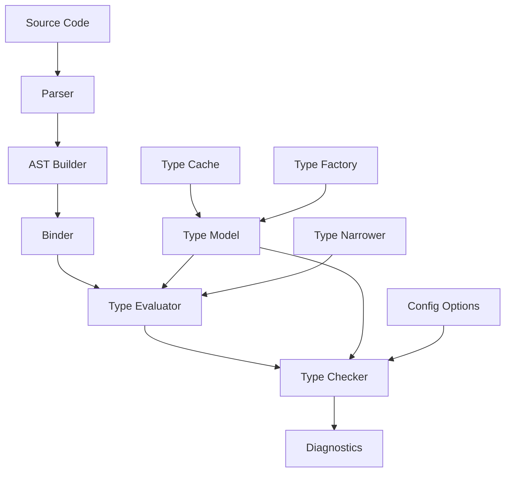
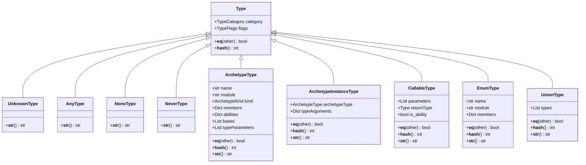
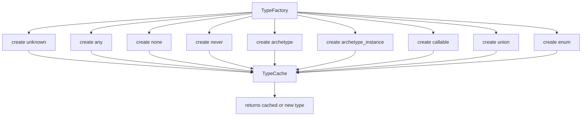
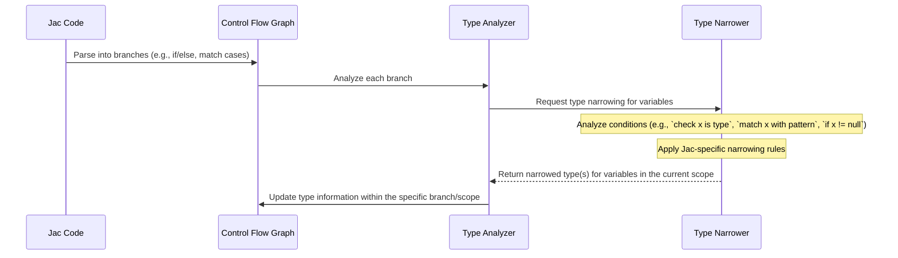

# Jac Type Checker Architecture: A Pyright-Inspired Approach

## Table of Contents

- [Introduction](#introduction)
- [System Overview](#system-overview)
- [Project Structure](#project-structure)
- [Core Components](#core-components)
  - [Type Model](#type-model)
  - [Type Factory](#type-factory)
  - [Type Relationships](#type-relationships)
  - [Type Narrowing](#type-narrowing)
- [Flow and Integration](#flow-and-integration)
  - [Type Checking Process for Jac](#type-checking-process-for-jac)
  - [Parser Integration for Jac](#parser-integration-for-jac)
  - [Type Evaluator Implementation for Jac](#type-evaluator-implementation-for-jac)
- [Advanced Features](#advanced-features)
  - [Protocol Support](#protocol-support)
  - [Type Guards](#type-guards)
  - [Structural Types](#structural-types)
- [Implementation Guide](#implementation-guide)
  - [Getting Started](#getting-started)
  - [Key Algorithms](#key-algorithms)
  - [Testing Strategy](#testing-strategy)
- [Comparison with Other Type Checkers](#comparison-with-other-type-checkers)
- [Conclusion](#conclusion)

## Introduction

This document outlines the architecture and implementation details for a Jac type checker that adopts Pyright's efficient approach to type checking, while being implemented in Python (as the Jac compiler itself is). Pyright, originally written in TypeScript, is known for its performance and scalability with large codebases. This architecture aims to bring those benefits to a Jac implementation.

The key innovations of this approach include:

1. An efficient type representation system with aggressive caching
2. Sophisticated type narrowing based on control flow analysis (adapted for Jac's control flow constructs)
3. High-performance algorithms for type compatibility checking
4. Memory-efficient data structures for representing the type system for Jac

## System Overview



The system follows a pipeline architecture where Jac source code flows through various stages of analysis, with the type model serving as the foundation for all type-related operations.

## Project Structure

The type checker components will be integrated into the existing Jac compiler structure, primarily within the `jaclang/compiler/` directory. New modules will be added, and existing ones might be augmented. Here's a proposed structure for the type checking additions:

```
jaclang/
├── compiler/
│   ├── __init__.py
│   ├── jac.lark                 # Jac grammar
│   ├── parser.py                # Existing parser
│   ├── ...                      # Other existing compiler files
│   ├── typemodel/               # NEW: Type system model (inspired by Pyright)
│   │   ├── __init__.py
│   │   ├── types.py             # Core type classes for Jac (ArchetypeType, InstanceType, CallableType, etc.)
│   │   ├── type_factory.py      # Type creation factory
│   │   ├── type_cache.py        # Type caching
│   │   ├── type_relations.py    # Subtyping, assignability, etc.
│   │   └── builtin_types.py     # Definitions for Jac's built-in types
│   ├── passes/
│   │   ├── __init__.py
│   │   ├── ...                  # Existing passes
│   │   ├── type_check_pass.py   # NEW: Main pass for type checking
│   │   ├── sym_tab_pass.py      # Possible existing or new pass for symbol table construction
│   │   └── ...
│   ├── analysis/                # NEW or Augmented: For deeper semantic analysis
│   │   ├── __init__.py
│   │   ├── symbol_table.py      # Symbol table (might exist or be enhanced)
│   │   ├── type_evaluator.py    # Type evaluation for Jac expressions
│   │   ├── type_narrower.py     # Type narrowing logic for Jac
│   │   └── ...
│   └── utils/                   # Utility functions
│       ├── __init__.py
│       ├── diagnostics.py       # Error and warning reporting (might exist or be enhanced)
│       └── ...
└── ...
tests/
├── compiler/
│   ├── __init__.py
│   ├── test_type_checker.py   # NEW: Tests for the type checker
│   ├── test_type_narrowing.py # NEW: Tests for type narrowing
│   └── samples/               # Jac code samples for testing
    └── ...
```

This structure aims to integrate the type checker smoothly into the Jac compiler's pass-based architecture.

## Core Components

### Type Model

The type model is the foundation of the entire type checker. It defines how Jac types are represented, compared, and manipulated.



#### Implementation of the Base Type Class

```python
from enum import Enum, auto
from typing import Dict, List, Optional, Set, Tuple # Assuming these are needed

class TypeCategory(Enum):
    UNKNOWN = auto()
    ANY = auto()
    NONE = auto() # For Jac's null
    NEVER = auto()
    Archetype = auto() # For Jac archetypes
    Archetype_INSTANCE = auto()
    CALLABLE = auto() # For Jac abilities/functions
    ENUM = auto()
    UNION = auto()
    # ... other categories as needed

class TypeFlags(Enum): # Using Enum for flags for clarity, can be bitflags too
    NONE = 0
    # Example flags, to be defined based on Jac's needs
    IS_ABSTRACT = auto()
    IS_STATIC = auto()
    IS_READONLY = auto()
    # ... other flags

class Type:
    """Base class for all Jac type objects."""

    def __init__(self, category: TypeCategory):
        self.category = category
        self.flags: Set[TypeFlags] = {TypeFlags.NONE} # Using a set for flags

    def __eq__(self, other: object) -> bool:
        if not isinstance(other, Type):
            return False
        return self.category == other.category

    def __hash__(self) -> int:
        return hash(self.category)
```

The `Type` class serves as the base for all type representations. It includes:

- A `category` field that identifies the kind of type (archetype, instance, union, enum, etc.)
- A `flags` field for additional type properties (e.g., static, abstract - needs Jac-specific definition)
- Equality and hash methods for efficient comparisons and storage in collections

#### Implementation of Archetype and Instance Types

Archetype and instance types are fundamental to Jac's object-oriented and agent-based features:

```python
class ArchetypeKind(Enum):
    OBJECT = auto()
    NODE = auto()
    EDGE = auto()
    WALKER = auto()
    CLASS = auto() # Generic class-like archetype
    ENUM_CLASS = auto() # The class for an Enum

class ArchetypeType(Type):
    """Represents a Jac archetype (object, node, edge, walker, class)."""

    def __init__(self, name: str, kind: ArchetypeKind, module: Optional[str] = None):
        super().__init__(TypeCategory.Archetype)
        self.name = name
        self.kind = kind
        self.module = module
        self.members: Dict[str, Type] = {} # For 'has' variables
        self.abilities: Dict[str, CallableType] = {} # For 'can' abilities/methods
        self.bases: List[ArchetypeType] = []
        self.type_parameters: List[Type] = [] # Placeholder for future generics

    def __eq__(self, other: object) -> bool:
        if not isinstance(other, ArchetypeType):
            return False
        return (
            super().__eq__(other) and # Check base category
            self.name == other.name and
            self.kind == other.kind and
            self.module == other.module
        )

    def __hash__(self) -> int:
        return hash((self.category, self.name, self.kind, self.module))

    def __str__(self) -> str:
        prefix = self.kind.name.lower()
        if self.module:
            return f"{self.module}.{prefix}::{self.name}"
        return f"{prefix}::{self.name}"


class ArchetypeInstanceType(Type):
    """Represents an instance of a Jac archetype."""

    def __init__(self, archetype_type: ArchetypeType):
        super().__init__(TypeCategory.Archetype_INSTANCE)
        self.archetype_type = archetype_type
        self.type_arguments: Dict[str, Type] = {} # Placeholder for future generics

    def __eq__(self, other: object) -> bool:
        if not isinstance(other, ArchetypeInstanceType):
            return False
        return super().__eq__(other) and self.archetype_type == other.archetype_type # Compare archetype_type for equality

    def __hash__(self) -> int:
        return hash((self.category, self.archetype_type))

    def __str__(self) -> str:
        if not self.type_arguments:
            return str(self.archetype_type)

        args = ", ".join(str(arg) for arg in self.type_arguments.values())
        # Jac might not have generic syntax yet, this is forward-looking
        return f"{self.archetype_type}[{args}]"

# Placeholder for EnumType, which could inherit from `ArchetypeType` or be distinct
class EnumType(ArchetypeType): # Enums can be thought of as a special kind of archetype
    """Represents a Jac enumeration type."""
    def __init__(self, name: str, module: Optional[str] = None):
        super().__init__(name, ArchetypeKind.ENUM_CLASS, module)
        self.category = TypeCategory.ENUM # Override category
        self.enum_members: Dict[str, Type] = {} # Enum members often have an implicit or explicit value type

    # __eq__, __hash__, __str__ would be inherited or specialized if needed
```

Key points:
- `ArchetypeType` represents the type of an archetype itself (object, node, etc.)
- `ArchetypeInstanceType` represents an instance of an archetype.
- Both implement proper equality and hash methods for efficient comparison.
- `ArchetypeKind` distinguishes between different kinds of archetypes.
- Placeholder for `EnumType`, which could inherit from `ArchetypeType` or be distinct.
- Type arguments for generic types are included as a placeholder for future Jac features.

### Type Factory

The TypeFactory implements the Factory pattern for creating Jac type objects, ensuring consistent creation and caching:



#### Implementation of Type Factory

```python
class TypeFactory:
    """
    Factory class for creating Jac type objects. Ensures all types are created
    through the cache for memory efficiency.
    """

    @staticmethod
    def unknown() -> UnknownType:
        return TypeCache.get_instance().unknown_type

    @staticmethod
    def any() -> AnyType:
        return TypeCache.get_instance().any_type

    @staticmethod
    def none() -> NoneType: # Corresponds to Jac's 'null'
        return TypeCache.get_instance().none_type

    @staticmethod
    def never() -> NeverType:
        return TypeCache.get_instance().never_type

    @staticmethod
    def archetype_type(name: str, kind: ArchetypeKind, module: Optional[str] = None) -> ArchetypeType:
        # Jac's core built-in types (int, float, str, bool, bytes) might be handled here
        # or treated as special archetypes if they have methods/abilities.
        # For example, if "str" is a built-in archetype:
        if module is None and name in ["int", "float", "str", "bool", "bytes", "object"]: # TODO: Define Jac built-ins
            # This assumes built-ins are cached as ArchetypeTypes
            cached_builtin = TypeCache.get_instance().get_builtin_archetype(name)
            if cached_builtin: # Ensure it has the correct kind, or handle appropriately
                return cached_builtin

        return ArchetypeType(name, kind, module)

    @staticmethod
    def archetype_instance_type(archetype_type: ArchetypeType) -> ArchetypeInstanceType:
        return ArchetypeInstanceType(archetype_type)

    @staticmethod
    def enum_type(name: str, module: Optional[str] = None) -> EnumType:
        # Enums might also be cached if they are frequently reused or have a predefined structure
        return EnumType(name, module)

    @staticmethod
    def callable_type(parameters: List[Tuple[str, Type]], return_type: Type, is_ability: bool = False) -> CallableType:
        # Parameters could be a list of (name, type) tuples or more complex Parameter objects
        # The TypeCache would handle caching of callable types based on signature
        return TypeCache.get_instance().get_callable_type(parameters, return_type, is_ability)

    @staticmethod
    def union(types: List[Type]) -> Type:
        # Filter out duplicates
        unique_types = []
        seen_types: Set[int] = set() # Use set of ids for seen types

        for t in types:
            # Handle nested unions - flatten them
            if isinstance(t, UnionType):
                for nested_type in t.types:
                    # Using id() for seen_types check to handle object identity directly
                    if id(nested_type) not in seen_types:
                        unique_types.append(nested_type)
                        seen_types.add(id(nested_type))
            else:
                if id(t) not in seen_types:
                    unique_types.append(t)
                    seen_types.add(id(t))

        # Special cases for union simplification
        if len(unique_types) == 0:
            return TypeFactory.never()

        if len(unique_types) == 1:
            return unique_types[0]

        # If Any is in the union, the result is Any
        if any(isinstance(t, AnyType) for t in unique_types):
            return TypeFactory.any()

        # If NoneType (Jac null) is present, and other non-None types, it forms an Optional-like union.
        # Further simplification rules can be added (e.g., int | int = int)

        # Create the union through the cache
        return TypeCache.get_instance().get_union_type(unique_types)
```

Key features:
- Provides static methods for creating all fundamental Jac types.
- Delegates to `TypeCache` for efficient storage and reuse of type objects.
- Implements special case handling for types like unions (e.g., flattening, Any propagation).
- Performs normalization (e.g., flattening nested unions).
- `archetype_type` can handle creation of both user-defined and potentially built-in archetypes.
- `callable_type` adapted for Jac's abilities/functions.

### Type Cache

The TypeCache is crucial for memory efficiency, ensuring that identical Jac types share the same object instance:

```python
class TypeCache:
    """
    Centralized cache for Jac type objects to avoid creating duplicate
    instances of the same type. This is key to memory efficiency.
    """

    _instance = None

    @classmethod
    def get_instance(cls) -> 'TypeCache': # Forward reference for TypeCache
        if cls._instance is None:
            cls._instance = TypeCache()
        return cls._instance

    def __init__(self):
        if TypeCache._instance is not None:
            raise RuntimeError("TypeCache is a singleton, use get_instance()")
        # Cache for built-in archetype-like types (int, str, etc.)
        self._builtin_archetypes: Dict[str, ArchetypeType] = {}

        # Cache for user-defined ArchetypeTypes (keyed by module and name)
        self._archetype_types: Dict[Tuple[Optional[str], str], ArchetypeType] = {}

        # Cache for EnumTypes (keyed by module and name)
        self._enum_types: Dict[Tuple[Optional[str], str], EnumType] = {}

        # Cache for union types (using frozensets of type IDs as keys)
        self._union_types: Dict[frozenset[int], UnionType] = {}

        # Cache for callable types (keyed by a tuple representing their signature)
        # Signature: (param_types_tuple, return_type_id, is_ability_bool)
        self._callable_types: Dict[Tuple[Tuple[int, ...], int, bool], CallableType] = {}

        # Singleton types
        self.unknown_type = UnknownType()
        self.any_type = AnyType()
        self.none_type = NoneType() # Jac's null
        self.never_type = NeverType()

        # Initialize common built-in types for Jac
        self._initialize_builtin_jac_types()

    def _initialize_builtin_jac_types(self) -> None:
        """Initialize cache with common Jac built-in types."""
        # Jac's primitive types. These are often represented as archetypes.
        # The ArchetypeKind for these would be specific, e.g., ArchetypeKind.BUILTIN_PRIMITIVE
        # or they can use existing kinds if they behave like them (e.g. ArchetypeKind.CLASS for string methods)
        builtin_names_kinds = {
            "int": ArchetypeKind.CLASS, # Assuming int has some 'class-like' properties or for consistency
            "float": ArchetypeKind.CLASS,
            "str": ArchetypeKind.CLASS,
            "bool": ArchetypeKind.CLASS,
            "bytes": ArchetypeKind.CLASS,
            "list": ArchetypeKind.CLASS, # If list is a built-in generic type
            "dict": ArchetypeKind.CLASS, # If dict is a built-in generic type
            "type": ArchetypeKind.CLASS, # The type of types themselves
            "object": ArchetypeKind.CLASS # A potential base object type for Jac archetypes
        }
        for name, kind in builtin_names_kinds.items():
            # Create as ArchetypeType for now. Details of their members/abilities would be defined elsewhere.
            self._builtin_archetypes[name] = ArchetypeType(name, kind, module="builtin")

        # `null` is represented by NoneType, `any` by AnyType, etc.

    def get_builtin_archetype(self, name: str) -> Optional[ArchetypeType]:
        """Get a cached built-in Jac archetype-like type."""
        return self._builtin_archetypes.get(name)

    def get_archetype_type(self, name: str, kind: ArchetypeKind, module: Optional[str] = None) -> ArchetypeType:
        key = (module, name)
        if key in self._archetype_types:
            # TODO: Add consistency check for 'kind' if an archetype is re-requested with a different kind
            return self._archetype_types[key]

        new_arch_type = ArchetypeType(name, kind, module)
        self._archetype_types[key] = new_arch_type
        return new_arch_type

    def get_enum_type(self, name: str, module: Optional[str] = None) -> EnumType:
        key = (module, name)
        if key in self._enum_types:
            return self._enum_types[key]

        new_enum_type = EnumType(name, module)
        self._enum_types[key] = new_enum_type
        return new_enum_type

    def get_union_type(self, types: List[Type]) -> UnionType:
        """Get a cached union type or create a new one."""
        # Remove duplicates and normalize (e.g. Any | T = Any, T | Never = T)
        # Simplified: Actual implementation would handle more cases
        unique_types_list = list(dict.fromkeys(types)) # Preserves order, removes duplicates

        if not unique_types_list:
            return self.never_type # Or handle as error
        if len(unique_types_list) == 1:
            # This step was in TypeFactory.union, ensure it's consistent or primarily here.
            # return unique_types_list[0] # This line might be problematic if factory handles it.
            pass # Let the factory decide if it returns the single type or a UnionType of one

        # Sort by category and then by a stable attribute (e.g., hash or string form) to ensure consistent key ordering
        # This is crucial for cache key stability.
        unique_types_list.sort(key=lambda t: (t.category.value, str(t))) # Example sorting

        # Create a frozenset of type IDs as the cache key
        # Using id() assumes type objects are immutable once created and cached for this to be safe
        key = frozenset(id(t) for t in unique_types_list)

        if key in self._union_types:
            return self._union_types[key]

        new_union = UnionType(unique_types_list)
        self._union_types[key] = new_union
        return new_union

    def get_callable_type(self, parameters: List[Tuple[str, Type]], return_type: Type, is_ability: bool) -> CallableType:
        """Get a cached callable type or create a new one."""
        # Create a stable cache key. Parameter names usually don't affect signature for caching.
        # Param types are important, their order, and the return type.
        param_type_ids = tuple(id(ptype) for _, ptype in parameters)
        key = (param_type_ids, id(return_type), is_ability)

        if key in self._callable_types:
            return self._callable_types[key]

        # Create ParameterType objects if your CallableType expects them
        # For now, assuming CallableType constructor can handle List[Tuple[str, Type]] or similar
        new_callable = CallableType(parameters, return_type, is_ability=is_ability)
        self._callable_types[key] = new_callable
        return new_callable
```

Key points:
- Implements the Singleton pattern to ensure a single cache instance for all Jac types.
- Maintains separate caches for different Jac type categories (built-ins, archetypes, enums, unions, callables).
- Uses ID-based caching for complex types like unions and callables to ensure canonical representation.
- Pre-initializes common built-in Jac types (like `int`, `str`, `bool`, `null` via `NoneType`) for efficiency.
- Provides getter methods that first check the cache before creating a new type instance.

### Type Relationships

Type relationships determine compatibility between Jac types. Key operations include checking for subtyping (`is_subtype`) and assignability (`is_assignable_to`).

```mermaid
graph TD
    A[TypeRelationship] --> B[is_subtype]
    A --> C[is_assignable_to]
    %% Often similar to is_subtype but can have nuances

    B --> D{source == AnyType?}
    D -->|Yes| E[return True]
    D -->|No| F{target == AnyType?}
    F -->|Yes| E
    F -->|No| G{source == NeverType?}
    G -->|Yes| E
    G -->|No| H{source and target same category?}
    H -->|Yes| I[handle specific Jac category (Archetype, Enum, Callable)]
    H -->|No| J{source == UnionType?}
    J -->|Yes| K[check all source types against target]
    J -->|No| L{target == UnionType?}
    L -->|Yes| M[check source against any target type]
    L -->|No| N[Handle NoneType (Jac null) assignability, e.g., to Optional-like unions]
    N --> O[return False]
    %% Default
```

#### Implementation of Type Relationships for Jac

```python
class TypeRelationship:
    """
    Class that handles Jac type relationships like subtyping, assignability, etc.
    This is a key part of an efficient type checking system.
    """

    @staticmethod
    def is_subtype(source: Type, target: Type) -> bool:
        """
        Determines if source is a subtype of target in Jac.
        This is a foundational version; a full implementation would be more complex,
        especially with generics, protocols, etc.
        """
        # Any type is compatible with any other type (both ways)
        if isinstance(source, AnyType) or isinstance(target, AnyType):
            return True

        # Never type is a subtype of any type
        if isinstance(source, NeverType):
            return True

        # Nothing is a subtype of Never (except Never itself, handled above)
        if isinstance(target, NeverType):
            return False

        # Jac's null (NoneType) handling
        if isinstance(source, NoneType):
            if isinstance(target, NoneType): # null is a subtype of null
                return True
            if isinstance(target, UnionType): # null is a subtype of Union{T, null}
                return any(isinstance(t, NoneType) for t in target.types)
            # Add rules if specific archetypes are inherently nullable in Jac
            # Otherwise, null is not a subtype of a non-union, non-NoneType type.
            return False

        # Same type categories - delegate to specific Jac type checks
        if source.category == target.category:
            if isinstance(source, UnionType) and isinstance(target, UnionType): # Should be handled by Union specific rules or below
                # Every type in source union must be a subtype of at least one type in target union (more complex check needed)
                # Simplified: For S = U(s1,s2), T = U(t1,t2), is_subtype(S,T) if for all si, exists tj such that is_subtype(si, tj)
                # This is not quite right. is_subtype(A|B, C|D) iff is_subtype(A,C|D) and is_subtype(B,C|D)
                # For now, defer to general union rules below.
                pass # Fall through to general union handling

            if isinstance(source, ArchetypeType) and isinstance(target, ArchetypeType):
                # Check archetype hierarchy (including kind compatibility if relevant in Jac)
                if source == target: # Same archetype definition
                    return True

                # Check base archetypes recursively
                # This needs a cycle detection mechanism for robust implementation
                # For now, simple recursive check:
                for base in source.bases:
                    if TypeRelationship.is_subtype(base, target):
                        return True
                # TODO: Consider Jac-specific rules for ArchetypeKind compatibility (e.g. node vs object)
                return False

            if isinstance(source, ArchetypeInstanceType) and isinstance(target, ArchetypeInstanceType):
                # Delegate to ArchetypeType check, ignoring generics for now
                # With generics, type arguments would need to be checked based on variance
                return TypeRelationship.is_subtype(source.archetype_type, target.archetype_type)

            if isinstance(source, EnumType) and isinstance(target, EnumType):
                return source == target # Enums are typically subtypes of themselves only

            if isinstance(source, CallableType) and isinstance(target, CallableType):
                # Check Jac callable compatibility (contravariant in args, covariant in return)
                # Differentiate between abilities and functions if their subtyping rules differ
                if source.is_ability != target.is_ability: # Assuming abilities and functions are not directly interchangeable unless specified
                    # This rule might be too strict; depends on Jac semantics
                    pass # For now, allow if signatures match, further Jac rules might apply

                # Return type must be a subtype (covariant)
                if not TypeRelationship.is_subtype(source.return_type, target.return_type):
                    return False

                # Parameters must be compatible (contravariant)
                if len(source.parameters) != len(target.parameters):
                    return False # Arity mismatch

                for s_param, t_param in zip(source.parameters, target.parameters):
                    # Jac param representation: (_, s_param_type) = s_param ; (_, t_param_type) = t_param
                    s_param_type = s_param[1] # Assuming (name, type) tuple
                    t_param_type = t_param[1] # Assuming (name, type) tuple
                    if not TypeRelationship.is_subtype(t_param_type, s_param_type): # Contravariance
                        return False
                return True

        # Union type as source - each component of source must be a subtype of target
        if isinstance(source, UnionType):
            return all(TypeRelationship.is_subtype(t, target) for t in source.types)

        # Union type as target - source must be a subtype of at least one component of target
        if isinstance(target, UnionType):
            return any(TypeRelationship.is_subtype(source, t) for t in target.types)

        # Different type categories that aren't explicitly handled are not compatible
        # e.g. ArchetypeInstanceType is not a subtype of CallableType unless special rules apply
        return False

    @staticmethod
    def is_assignable_to(source: Type, target: Type) -> bool:
        """
        Determines if a value of 'source' type can be assigned to a variable of 'target' type in Jac.
        Often, this is the same as is_subtype, but can differ (e.g. with variance, or specific language rules).
        For now, let's assume it's largely similar to is_subtype for Jac.
        """
        # Basic assignability is often subtyping
        if TypeRelationship.is_subtype(source, target):
            return True

        # Special assignability rules for Jac could be added here
        # e.g. assigning an int literal to a float variable might be allowed even if int is not strictly a subtype of float
        # For now, no additional rules beyond subtyping.

        return False
```

Key principles for Jac type relationships:
- `Any` type is compatible with everything.
- `Never` type is a subtype of everything.
- `NoneType` (Jac `null`) handling for unions (representing optional types) and direct nullability.
- Union types follow logical set operations for subtyping.
- `ArchetypeType`s follow inheritance hierarchies defined by `bases`. Compatibility between different `ArchetypeKind`s needs definition based on Jac semantics.
- `CallableType`s (Jac abilities/functions) follow standard variance rules: contravariant in parameters, covariant in return types.
- `EnumType`s are generally only compatible with themselves.
- `is_assignable_to` can extend `is_subtype` with Jac-specific assignment rules if needed.

### Type Narrowing

Type narrowing is a powerful feature, allowing the Jac type checker to refine types based on control flow analysis. This is particularly important for Jac's `match` statements and conditional logic.



#### Implementation of Type Narrowing for Jac

```python
class TypeNarrower:
    """
    Class that handles type narrowing for Jac based on control flow analysis.
    This will be crucial for Jac features like `match` statements and `check` expressions.
    """

    @staticmethod
    def narrow_type_from_check(original_type: Type, asserted_type: Type, is_positive_check: bool = True) -> Type:
        """Narrows a type based on a Jac `check expr is type_expr` or similar assertion.
        `is_positive_check` is True if the assertion is `expr is type`, False if `expr is not type` (or equivalent).
        """
        # If the original type is Any, narrow to the asserted type if positive check
        if isinstance(original_type, AnyType):
            return asserted_type if is_positive_check else TypeFactory.any() # Or a more refined 'not asserted_type' if possible

        if is_positive_check:
            # If original_type is already a subtype of asserted_type, no change (or return original_type)
            if TypeRelationship.is_subtype(original_type, asserted_type):
                return original_type # Or potentially asserted_type if it's more specific and a subtype

            # If asserted_type is a subtype of original_type, then the new type is asserted_type
            if TypeRelationship.is_subtype(asserted_type, original_type):
                return asserted_type

            # If original_type is a union, filter the union
            if isinstance(original_type, UnionType):
                narrowed_types = [t for t in original_type.types if TypeRelationship.is_subtype(t, asserted_type)]
                if not narrowed_types:
                    return TypeFactory.never() # This branch is unreachable if assertion holds
                return TypeFactory.union(narrowed_types)

            # If no direct subtype relation but they could overlap (e.g. protocol check)
            # This needs more sophisticated logic, potentially an intersection type or just asserted_type if valid
            # For now, if they are not related by subtyping, a positive check might mean this path is dead (Never) or it's the asserted_type.
            # This depends on Jac's exact semantics for `check`.
            # A safe bet if original and asserted are compatible might be asserted_type.
            if TypeRelationship.is_subtype(original_type, asserted_type) or TypeRelationship.is_subtype(asserted_type, original_type): # Simplified check for some relation
                return asserted_type
            return TypeFactory.never() # If no clear path to reconcile, assume check makes path unreachable or type is asserted_type

        else: # Negative check (e.g., expr is not TypeX)
            if isinstance(original_type, UnionType):
                # Remove types that are subtypes of asserted_type from the union
                narrowed_types = [t for t in original_type.types if not TypeRelationship.is_subtype(t, asserted_type)]
                if not narrowed_types:
                    return TypeFactory.never()
                return TypeFactory.union(narrowed_types)

            # If original_type is a subtype of asserted_type, then this path means it's Never
            if TypeRelationship.is_subtype(original_type, asserted_type):
                return TypeFactory.never()

            return original_type # Cannot narrow further with this negative check

    @staticmethod
    def narrow_type_from_truthiness(original_type: Type, is_truthy_branch: bool) -> Type:
        """Narrows a type based on a truthiness check in Jac (e.g., in an `if some_var:` context)."""
        if isinstance(original_type, AnyType):
            return original_type # Cannot narrow Any based on truthiness alone

        if isinstance(original_type, UnionType):
            if is_truthy_branch:
                # Remove NoneType (Jac null) and other falsy types if defined for Jac (e.g. empty string, 0 for numbers)
                # For simplicity, just removing NoneType here.
                narrowed_types = [t for t in original_type.types if not isinstance(t, NoneType)]
                # TODO: Add rules for other Jac-specific falsy types (e.g. empty collections if they are falsy)
                if not narrowed_types:
                    return TypeFactory.never() # e.g. if original_type was just NoneType
                return TypeFactory.union(narrowed_types)
            else: # is_falsy_branch
                # If original type could be NoneType, and we are in falsy branch, it *could* be NoneType
                # Or it could be another falsy value (empty string, 0, etc.)
                # A full implementation would identify all types in the union that *can* be falsy.
                # If NoneType is the only falsy type in the union, narrow to NoneType.
                has_none = any(isinstance(t, NoneType) for t in original_type.types)
                # This is a simplification: if null is possible, and it's a falsy branch, what remains?
                # It could be *only* null, or other falsy values. If only null, narrow to null.
                # If other types in union could also be falsy (e.g. int 0, empty str), it's more complex.
                # For now, if None is present, and it's a falsy branch, we can't definitively say it *is* None unless other types are guaranteed truthy.
                # A safe bet is to return the original type unless more specific rules can apply.
                if has_none and all(not isinstance(t, NoneType) or True for t in original_type.types): # Simplified: if None is one of options.
                    # If we want to narrow to NoneType, we need to ensure other parts of union are not falsy.
                    # Example: Union[int, NoneType]. If false, could be 0 or None. Not just None.
                    # If only NoneType makes it falsy, then it is NoneType.
                    potential_falsy = [t for t in original_type.types if isinstance(t, NoneType) or TypeRelationship.is_subtype(t,TypeFactory.archetype_instance_type(TypeFactory.archetype_type("int",ArchetypeKind.CLASS))) ] # placeholder for actual falsy check
                    if len(potential_falsy) == 1 and isinstance(potential_falsy[0], NoneType): # if None is the only way it can be false from the union members
                        return TypeFactory.none()
                return original_type # Return original, too complex to simplify generally here

        # Single type (not union)
        if not is_truthy_branch: # Falsy branch
            # If original_type itself can be falsy (e.g. int, str, bool which can be 0, "", False)
            # or if it's NoneType
            if isinstance(original_type, NoneType): # if it is None, and branch is falsy, it remains None.
                return original_type
            # If it is bool and it's False. This is tricky without knowing if it *is* bool.
            # Jac needs defined truthy/falsy rules for its types.
            # For now, if it is not a union and in a falsy branch, we cannot easily narrow it further to Never unless the type is always truthy.
            # Example: if `obj: MyObject` and `if not obj:`, if MyObject instances are always truthy, then this is Never.
            pass # Needs more rules

        return original_type

    @staticmethod
    def narrow_type_from_null_check(original_type: Type, is_null: bool) -> Type:
        """Narrows a type based on a null check (e.g., `if var is null` or `if var is not null`)."""
        if isinstance(original_type, AnyType):
            return TypeFactory.none() if is_null else TypeFactory.any() # If any is null, it becomes null. If not null, remains any.

        if isinstance(original_type, UnionType):
            if is_null: # Variable is null
                if any(isinstance(t, NoneType) for t in original_type.types):
                    return TypeFactory.none() # If null is a possibility, it must be null
                else:
                    return TypeFactory.never() # Original type couldn't be null, so this path is dead
            else: # Variable is not null
                narrowed_types = [t for t in original_type.types if not isinstance(t, NoneType)]
                if not narrowed_types:
                    return TypeFactory.never() # Should not happen if original union was valid (e.g. not just NoneType)
                return TypeFactory.union(narrowed_types)
        else: # Not a UnionType
            if is_null: # Variable is null
                return TypeFactory.none() if isinstance(original_type, NoneType) or TypeRelationship.is_subtype(TypeFactory.none(), original_type) else TypeFactory.never()
            else: # Variable is not null
                return TypeFactory.never() if isinstance(original_type, NoneType) else original_type
```

Key Jac narrowing strategies:
- Type narrowing based on Jac's `check expression is type_expression` (or equivalent assertion/matching mechanism).
- Type narrowing based on truthiness checks in conditional statements (`if`, `while`, etc.), considering Jac's definition of truthy/falsy values.
- Type narrowing based on `null` checks (e.g., `if var is null` or `if var is not null`).
- Narrowing union types by filtering components based on the condition.
- Identifying unreachable code branches by narrowing a type to `Never`.
- **Match statement narrowing**: Jac's `match` statement will be a primary driver for type narrowing. Each `case` pattern will provide strong type information for the matched variable within that case's scope.

## Flow and Integration

### Type Checking Process for Jac

The overall type checking process for Jac will integrate into its existing compiler passes. It involves several stages:

```mermaid
graph TB
    A[Parse Jac Source Code] --> B[Build Jac AST]
    B --> C[Symbol Table Construction (Sema Pass)]
    C --> D[Evaluate Types (within TypeCheckPass or separate pass)]
    D --> E[Check Type Compatibility & Rules (TypeCheckPass)]
    E --> F[Generate Diagnostics]

    G[Jac Type Model] --> D
    G --> E
    H[Symbol Table] --> C
    H --> D
    H --> E
```

#### Implementation of the Main Type Checking Pass for Jac

In Jac, the main analyzer will likely be implemented as a compiler pass (e.g., `TypeCheckPass`) that runs after parsing and symbol table construction.

```python
# Example structure for a Jac TypeCheckPass
# This would reside in jaclang/compiler/passes/type_check_pass.py

from jaclang.compiler.passes.uni_pass import UniPass
# Assume other necessary imports for Jac AST nodes, SymbolTable, Type Model, Diagnostics, etc.
# from jaclang.compiler.absyntree import AstNode (or specific node types)
# from ..analysis.symbol_table import SymbolTable
# from ..typemodel.types import Type, ArchetypeType, CallableType # etc.
# from ..typemodel.type_factory import TypeFactory
# from ..analysis.type_evaluator import TypeEvaluator
# from ..analysis.type_narrower import TypeNarrower
# from ..utils.diagnostics import Diagnostic, DiagnosticSeverity, DiagnosticCollection

class TypeCheckPass(UniPass):
    """
    Jac Type Checker Pass. Relies on a symbol table already being populated
    (e.g., by a preceding SymTabPass or during the same pass if integrated).
    """

    def __init__(self, ir: AstNode, sym_tab: SymbolTable, diag: DiagnosticCollection, config_options=None):
        super().__init__(ir=ir) # Initialize UniPass, ir is the AST root
        self.sym_tab = sym_tab
        self.diag = diag
        self.type_cache = TypeCache.get_instance()
        self.type_factory = TypeFactory # Static methods, no instance needed typically
        # config_options could hold type system strictness flags, etc.
        self.config_options = config_options or {}
        self.type_evaluator = TypeEvaluator(self.sym_tab, self.type_cache, self.diag, self.type_factory)
        self.type_checker_core = TypeCheckerCore(self.sym_tab, self.diag, self.type_cache, self.type_factory, self.config_options)

    def enter_node(self, node: AstNode):
        # Entry point for visiting each node if using a visitor pattern inherited from UniPass
        # Type evaluation and checking can happen on specific nodes or primarily on exit
        pass

    def exit_node(self, node: AstNode):
        # Main logic for type checking often happens on node exit, after children are processed.
        # This depends on the specific AST node type.

        # Example: Check assignment statements
        if isinstance(node, AssignmentStmt): # Replace with actual Jac AST node for assignment
            target_type = self.type_evaluator.get_type(node.target) # Get type of assignment target
            value_type = self.type_evaluator.get_type(node.value)   # Get type of assigned value
            self.type_checker_core.check_assignment(value_type, target_type, node) # Pass node for error reporting location

        # Example: Check function/ability calls
        elif isinstance(node, CallExpr): # Replace with actual Jac AST node for calls
            # ... logic to get callable type and argument types ...
            # self.type_checker_core.check_call(callable_type, arg_types, node)
            pass

        # Example: Check function/ability definitions for return type consistency
        elif isinstance(node, FunctionDef): # Replace with actual Jac AST node for function/ability def
            # declared_return_type = self.type_evaluator.get_type_from_annotation(node.return_annotation)
            # inferred_return_type = self.type_evaluator.infer_return_type_from_body(node.body)
            # self.type_checker_core.check_return_types(inferred_return_type, declared_return_type, node)
            pass

        # ... other checks for various Jac AST nodes ...

    # The `run` method might be inherited from UniPass or overridden.
    # def run(self) -> AstNode:
    #     self.traverse(self.ir) # UniPass might provide traverse
    #     return self.ir

# Placeholder for TypeCheckerCore which would contain the actual checking logic (e.g. check_assignment)
class TypeCheckerCore:
    def __init__(self, sym_tab, diag, type_cache, type_factory, config_options):
        self.sym_tab = sym_tab
        self.diag = diag
        self.type_cache = type_cache
        self.type_factory = type_factory
        self.config_options = config_options

    def check_assignment(self, value_type: Type, target_type: Type, error_node: AstNode) -> None:
        if not TypeRelationship.is_assignable_to(value_type, target_type):
            self.diag.add(
                Diagnostic(f"Cannot assign type '{value_type}' to '{target_type}'.",
                           DiagnosticSeverity.ERROR, error_node.loc)
            )
    # ... other checking methods: check_call, check_binary_op, etc.


# The Analyzer class from the original doc is effectively distributed into:
# 1. The Jac Parser (already exists)
# 2. SymbolTable pass/logic (may exist or need enhancement)
# 3. TypeCheckPass (this class)
# 4. TypeEvaluator (called by TypeCheckPass)
```

The `TypeCheckPass` would:
- Traverse the Jac AST.
- Use the `SymbolTable` to resolve names to their declarations and types.
- Use the `TypeEvaluator` to determine the types of expressions.
- Use the `TypeCheckerCore` (or similar helper) with `TypeRelationship` to validate type compatibility for assignments, operations, calls, etc.
- Generate `Diagnostics` (errors/warnings) for type mismatches.

### Parser Integration for Jac

Jac already has its own parser (defined by `jac.lark` and implemented in `jaclang.compiler.parser`). The type checker will consume the AST generated by this existing parser. No new parser needs to be built for type checking itself, but the AST structure must be understood by the type checking passes.

```python
# This section is informational, as Jac's parser is pre-existing.
# Example of how Jac parsing might be invoked (conceptual):
# from jaclang.compiler.parser import JacParser
# from jaclang.compiler.absyntree import AstNode

# source_code = \"\"
# walker my_walker {
#     has name: str = \"Jacy\";
#     can greet with entry {
#         std.out(f\"Hello, {self.name}\");
#     }
# }
# \"\"\"
#
# def parse_jac_code(source_code: str, file_path: Optional[str] = None) -> Optional[AstNode]:
#     parser_instance = JacParser(mod_path="", input_file="", source_string=source_code)
#     ast_root = parser_instance.ir # Access the intermediate representation (AST)
#     if parser_instance.errors:
#         for error in parser_instance.errors:
#             print(f"Parse Error: {error}") # Handle errors appropriately
#         return None
#     return ast_root

# The type checker would receive `ast_root` after this stage.
```

### Jac Type Evaluator Implementation

The type evaluator is responsible for determining the types of expressions and other AST nodes within the Jac code. It will heavily rely on the `SymbolTable`.

```python
# Resides in jaclang/compiler/analysis/type_evaluator.py

# from jaclang.compiler.absyntree import AstNode # Base AST node
# from .symbol_table import SymbolTable, Symbol
# from ..typemodel.types import Type, CallableType, ArchetypeType, ArchetypeInstanceType, AnyType, UnknownType, NoneType
# from ..typemodel.type_factory import TypeFactory
# from ..typemodel.type_cache import TypeCache
# from ..utils.diagnostics import DiagnosticCollection
# from .type_narrower import TypeNarrower

class TypeEvaluator:
    """
    Evaluates the types of expressions and other relevant nodes in Jac code.
    Operates in conjunction with a SymbolTable and TypeNarrower.
    """

    def __init__(self, sym_tab: SymbolTable, type_cache: TypeCache, diag: DiagnosticCollection, type_factory: TypeFactory):
        self.sym_tab = sym_tab
        self.type_cache = type_cache
        self.diag = diag # For reporting errors during type evaluation if necessary
        self.type_factory = type_factory
        self.type_narrower = TypeNarrower() # Can be used for context-sensitive type evaluation
        self.current_scope_uid: Optional[str] = None # UID of the current symbol table scope

    def get_type(self, node: AstNode) -> Type:
        """Main method to get the type of an AST node."""
        # Dispatch to specific visitor methods based on Jac AST node type
        # This would use a visitor pattern, e.g., self.visit(node)
        # For simplicity, a direct mapping or if/isinstance chain:

        if isinstance(node, NameAtom): # Example: Jac variable name or archetype name
            return self._visit_name(node)
        elif isinstance(node, LiteralAtom): # Example: Jac int, float, str, bool, null literals
            return self._visit_literal(node)
        elif isinstance(node, BinaryExpr): # Example: +, -, *, /, and, or, etc.
            return self._visit_binary_expr(node)
        elif isinstance(node, CallExpr): # Example: func_call(), ability_call()
            return self._visit_call_expr(node)
        elif isinstance(node, AtomTrailer): # Example: x.y, x[y]
             return self._visit_atom_trailer(node)
        # ... many other Jac expression types ...

        # For nodes whose type isn't directly evaluated or is complex (e.g., statements)
        # this method might return a placeholder or raise an error.
        # It might be better to have evaluate_expression_type(node) instead of a generic get_type.
        self.diag.add_warning(f"Type evaluation not implemented for Jac AST node: {type(node).__name__}", node.loc)
        return self.type_factory.unknown() # Default to Unknown or Any for unhandled nodes

    def _visit_name(self, node: NameAtom) -> Type: # Replace NameAtom with Jac's AST name node
        """Determine the type of a name (variable, archetype, etc.)."""
        name_str = node.value # Assuming node has a .value or .name attribute
        symbol = self.sym_tab.lookup(name_str, scope_uid=self.current_scope_uid)
        if not symbol:
            self.diag.add_error(f"Name '{name_str}' not found.", node.loc)
            return self.type_factory.unknown()

        # TODO: Type narrowing might influence the symbol's perceived type here
        # narrowed_type = self.type_narrower.get_narrowed_type(symbol, self.current_control_flow_context)
        # if narrowed_type: return narrowed_type

        return symbol.type if symbol.type else self.type_factory.unknown() # Symbol should have a type

    def _visit_literal(self, node: LiteralAtom) -> Type: # Replace LiteralAtom with Jac's literal node
        # Based on Jac token types (INT, FLOAT, STRING, BOOL_TRUE/FALSE, NULL)
        if node.is_int: return self.type_factory.archetype_instance_type(self.type_cache.get_builtin_archetype("int"))
        if node.is_float: return self.type_factory.archetype_instance_type(self.type_cache.get_builtin_archetype("float"))
        if node.is_string: return self.type_factory.archetype_instance_type(self.type_cache.get_builtin_archetype("str"))
        if node.is_bool: return self.type_factory.archetype_instance_type(self.type_cache.get_builtin_archetype("bool"))
        if node.is_null: return self.type_factory.none()
        # if node.is_bytes: return self.type_factory.archetype_instance_type(self.type_cache.get_builtin_archetype("bytes"))
        return self.type_factory.unknown()

    def _visit_binary_expr(self, node: BinaryExpr) -> Type:
        left_type = self.get_type(node.left)
        right_type = self.get_type(node.right)
        op = node.op.value # Assuming op has a value like '+', '-', 'and'

        # TODO: Implement operator type resolution based on Jac's rules
        # This would involve checking for overloaded operators (dunder methods if Jac has them) or predefined operator rules.
        # e.g., int + int -> int; str + str -> str; int + float -> float
        # For now, a placeholder:
        if isinstance(left_type, AnyType) or isinstance(right_type, AnyType):
            return self.type_factory.any()
        if op == '+':
            if TypeRelationship.is_subtype(left_type, self.type_cache.get_builtin_archetype("int")) and \
               TypeRelationship.is_subtype(right_type, self.type_cache.get_builtin_archetype("int")):\n                return self.type_cache.get_builtin_archetype("int")
            # ... other + rules
        # ... other operators ...
        self.diag.add_error(f"Operator '{op}' not supported for types '{left_type}' and '{right_type}'.", node.loc)
        return self.type_factory.unknown()

    def _visit_call_expr(self, node: CallExpr) -> Type:
        # Callee could be a name, or something more complex like obj.method
        callee_type = self.get_type(node.callee)

        if not isinstance(callee_type, CallableType):
            # Could be an archetype instantiation (constructor call)
            if isinstance(callee_type, ArchetypeType):
                # This is an archetype constructor call, e.g. Node(), MyObject()
                # Type check constructor arguments against __init__ if defined, or member initializers
                # For now, return an instance of the archetype
                return self.type_factory.archetype_instance_type(callee_type)

```

## Implementation Guide

### Getting Started

To begin implementing this type checker:

1. **Set up the project structure** as outlined above
2. **Implement the core type model** first
3. **Add the parser integration** using Python's built-in `ast` module
4. **Implement the binder and symbol table**
5. **Build the type evaluator**
6. **Add the type checker**
7. **Implement diagnostics reporting**

### Key Algorithms

Some of the most important algorithms in the type checker:

#### Subtyping Algorithm

```python
def is_subtype(source: Type, target: Type, visited: Set[Tuple[Type, Type]] = None) -> bool:
    """
    Determine if source is a subtype of target.
    The visited set prevents infinite recursion with recursive types.
    """
    if visited is None:
        visited = set()

    # Check for cycles in recursive types
    pair = (id(source), id(target))
    if pair in visited:
        return True  # Assume true for recursive types

    visited.add(pair)

    try:
        # Any type is compatible with any other type
        if isinstance(source, AnyType) or isinstance(target, AnyType):
            return True

        # Never type is a subtype of any type
        if isinstance(source, NeverType):
            return True

        # Any type is a supertype of Never
        if isinstance(target, NeverType):
            return False

        # Same type categories
        if source.category == target.category:
            # Handle specific type category checks
            # ...

        # Type categories don't match, but special cases might apply
        # ...

        # Default to false for incompatible types
        return False

    finally:
        # Clean up the visited set
        visited.remove(pair)
```

#### Type Narrowing with Flow Sensitivity

```python
def narrow_types_in_condition(
    condition: ast.expr,
    original_types: Dict[str, Type],
    true_branch: bool
) -> Dict[str, Type]:
    """Narrow types based on a condition expression."""
    narrowed_types = original_types.copy()

    # Check for isinstance() calls
    if (isinstance(condition, ast.Call) and
        isinstance(condition.func, ast.Name) and
        condition.func.id == "isinstance" and
        len(condition.args) == 2):

        # Get the variable name
        if isinstance(condition.args[0], ast.Name):
            var_name = condition.args[0].id

            # Only narrow if we know the variable's type
            if var_name in narrowed_types:
                original_type = narrowed_types[var_name]

                # Get the class being checked against
                # (This would be more complex in reality)
                class_type = None  # Determine from condition.args[1]

                if class_type:
                    # Apply narrowing
                    if true_branch:
                        narrowed_types[var_name] = TypeNarrower.narrow_type_from_isinstance(
                            original_type, class_type
                        )
                    else:
                        # Negative narrowing is more complex
                        pass

    # Check for truthiness checks
    if isinstance(condition, ast.Name):
        var_name = condition.id

        # Only narrow if we know the variable's type
        if var_name in narrowed_types:
            original_type = narrowed_types[var_name]

            # Apply truthiness narrowing
            narrowed_types[var_name] = TypeNarrower.narrow_type_from_truth(
                original_type, is_truthy=true_branch
            )

    return narrowed_types
```

### Testing Strategy

Implement testing at multiple levels:

1. **Unit tests** for individual components
2. **Integration tests** for the type checking pipeline
3. **Sample code tests** with known type errors and correct behavior

```python
def test_type_narrowing():
    """Test the type narrowing functionality."""
    # Create a factory and narrower
    factory = TypeFactory
    narrower = TypeNarrower()

    # Create test types
    int_class = factory.class_type("int")
    str_class = factory.class_type("str")
    int_instance = factory.instance_type(int_class)
    str_instance = factory.instance_type(str_class)

    # Create a union type
    union_type = factory.union([int_instance, str_instance])

    # Test narrowing with isinstance
    narrowed_type = narrower.narrow_type_from_isinstance(union_type, int_class)

    # Check that the type was narrowed correctly
    assert isinstance(narrowed_type, InstanceType)
    assert narrowed_type.class_type == int_class
```

## Comparison with Other Type Checkers

This table compares our type checker with existing Python type checkers:

| Feature | Our Type Checker | mypy | pyright |
|---------|-----------------|------|---------|
| Implementation Language | Python | Python | TypeScript |
| Type Representation | Object-based with caching | Structural | Object-based with caching |
| Type Narrowing | Sophisticated flow-sensitive | Basic | Sophisticated flow-sensitive |
| Performance | Optimized for large codebases | Good for small-medium | Excellent for large codebases |
| Protocol Support | Full structural typing | Nominal with limited structural | Full structural typing |
| Type Inference | Context-aware | Limited | Context-aware |
| Memory Efficiency | High (uses caching) | Medium | High (uses caching) |
| Incremental Checking | Yes | Yes | Yes |

## Conclusion

This document outlines the architecture and implementation details for a Jac type checker inspired by Pyright's efficient approach. By adopting Pyright's type representation system, aggressive caching, and sophisticated type narrowing, but implementing it in Python, we can create a type checker that combines the performance advantages of Pyright with the ease of development and integration that comes from using Python.

The key innovations in this approach include:

1. An efficient object-based type representation system
2. Aggressive type caching to minimize memory usage
3. Sophisticated flow-sensitive type narrowing
4. Full support for structural typing through protocols
5. Context-aware type inference

Next steps for implementation would involve developing the core type model, followed by the parser integration, symbol table, type evaluator, and checker components. With proper attention to performance optimization techniques in Python, this architecture can provide an excellent foundation for a high-performance Python type checker.

## Advanced Features

### Protocol Support (Structural Typing) for Jac

While Jac may not have an explicit `protocol` keyword like Python, its type system can still support structural typing. This means an archetype could be considered compatible with an expected structure if it possesses the necessary members (`has` variables) and abilities (`can` declarations) with compatible signatures, regardless of nominal inheritance.

```python
# This is a conceptual adaptation. Jac might not have a separate ProtocolType.
# Instead, structural compatibility can be checked directly against ArchetypeType or an ad-hoc structure.

class HypotheticalJacProtocol:
    """Represents a structural interface for Jac type checking."""
    def __init__(self, name: str, required_members: Dict[str, Type], required_abilities: Dict[str, CallableType]):
        self.name = name
        self.required_members = required_members
        self.required_abilities = required_abilities

    def is_structurally_compatible(self, arch_instance_type: ArchetypeInstanceType) -> bool:
        """Check if an archetype instance structurally conforms to this protocol."""
        arch_type = arch_instance_type.archetype_type

        # Check required members (variables from 'has' statements)
        for member_name, expected_member_type in self.required_members.items():
            if member_name not in arch_type.members:
                return False # Missing required member
            actual_member_type = arch_type.members[member_name]
            if not TypeRelationship.is_subtype(actual_member_type, expected_member_type):
                return False # Member type mismatch

        # Check required abilities (from 'can' statements)
        for ability_name, expected_ability_type in self.required_abilities.items():
            if ability_name not in arch_type.abilities:
                return False # Missing required ability
            actual_ability_type = arch_type.abilities[ability_name]
            # Callable subtyping checks if signatures are compatible
            if not TypeRelationship.is_subtype(actual_ability_type, expected_ability_type):
                return False # Ability signature mismatch

        return True

# In practice, instead of a HypotheticalJacProtocol class, the TypeRelationship.is_subtype
# or is_assignable_to could be augmented to perform these structural checks when a
# target type is, for example, an abstract archetype with only ability signatures.
```

Jac's `KW_ABSTRACT` modifier for abilities/archetypes could define implicit protocols. An archetype with abstract abilities would require implementers to provide concrete versions, forming a structural contract.

### Type Guards in Jac

Jac can leverage several mechanisms for type guards, which inform the type checker about type refinements within specific code blocks:

1.  **`check <expression> is <type_expression>`:** (Assuming `check` serves this role or a similar construct exists) This directly asserts the type of an expression, allowing the `TypeNarrower` to refine the type in the subsequent scope if the check passes.

    ```jac
    obj: SomeArchetype | OtherArchetype | null;

    check obj is SomeArchetype; // Type of obj is narrowed to SomeArchetype here
    // obj.some_arch_method(); // Safe to call

    if check obj is not null {
        // obj is narrowed to SomeArchetype | OtherArchetype here
    }
    ```

2.  **`match` statements:** Jac's `match` statement with patterns is a powerful form of type guard. Each `case` branch that successfully matches a pattern will narrow the type of the matched variable(s) according to the pattern.

    ```jac
    message: Any;
    match message {
        case str_val: str => {
            // Here, str_val is known to be of type 'str'
            std.out(str_val.to_upper());
        }
        case int_val: int => {
            // Here, int_val is known to be of type 'int'
            std.out(int_val + 5);
        }
        case my_node: MyNodeArchetype => {
            // Here, my_node is known to be of type MyNodeArchetype
            my_node.node_specific_ability();
        }
    }
    ```

3.  **Null checks:** Explicit checks for `null` (e.g., `if item is null` or `if item is not null`) will narrow types by removing or confirming `NoneType` from unions.

```python
# Adapting the TypeGuard class concept for Jac
# Much of this logic would be integrated into TypeNarrower and TypeEvaluator when processing
# Jac's `check` statements, `match` patterns, or conditional expressions.

class JacTypeGuardAnalyzer:
    """Analyzes Jac constructs that act as type guards."""

    @staticmethod
    def analyze_check_statement(
        check_node: CheckStmt, # Hypothetical Jac AST node for 'check ... is ...'
        type_evaluator: TypeEvaluator,
        current_scope_uid: str # For symbol lookup
    ) -> Optional[Tuple[Symbol, Type]]: # (Symbol being narrowed, narrowed_type)
        """
        Analyzes a Jac 'check target_expr is type_expr' statement.
        Returns the symbol for target_expr and its narrowed type if successful.
        """
        # 1. Get the symbol for target_expr (e.g., if it's a simple Name)
        target_expr_node = check_node.target_expr
        target_symbol = None
        original_type = None

        if isinstance(target_expr_node, NameAtom): # Jac's name node
            target_symbol = type_evaluator.sym_tab.lookup(target_expr_node.value, scope_uid=current_scope_uid)
            if not target_symbol or not target_symbol.type:
                return None # Cannot analyze if symbol or its type is unknown
            original_type = target_symbol.type
        else:
            # If target_expr is more complex, its type needs to be evaluated first.
            # Narrowing might only apply if target_expr is a simple variable name.
            original_type = type_evaluator.get_type(target_expr_node)
            # For complex expressions, narrowing might not directly update a symbol but affect temporary type info.
            # This example focuses on simple variable narrowing.
            return None # Simplification: only narrowing simple names for now

        # 2. Evaluate the type_expr to a Type object
        asserted_type_node = check_node.type_expr
        asserted_type = type_evaluator.get_type_from_annotation(asserted_type_node) # Assumes a method to resolve type expr to Type

        if isinstance(asserted_type, UnknownType) or isinstance(asserted_type, AnyType):
            return None # Cannot meaningfully narrow with Any/Unknown

        # 3. Use TypeNarrower to get the refined type
        # Assume check_node has a flag like `is_positive_check` (for `is` vs `is not`)
        is_positive = not check_node.is_negated # Hypothetical attribute
        narrowed_type = TypeNarrower.narrow_type_from_check(original_type, asserted_type, is_positive_check=is_positive)

        if narrowed_type and not isinstance(narrowed_type, NeverType):
            # The symbol's type can be considered `narrowed_type` in the subsequent scope.
            # The actual update of the symbol's type for scope management is handled by the calling pass.
            return (target_symbol, narrowed_type)

        return None

    # Similar analysis methods could be designed for `match` statement patterns.
```

### Jac Ability/Function Type Inference

Inferring types for Jac abilities and functions without complete type annotations is a valuable feature for developer convenience. The inferrer would analyze the body of the callable to deduce parameter and return types.

```python
# Resides in jaclang/compiler/analysis/type_inferrer.py (or similar)

class JacCallableInferrer:
    """Infers types for Jac abilities and functions if annotations are missing or partial."""

    def __init__(self, type_evaluator: TypeEvaluator, type_factory: TypeFactory, sym_tab: SymbolTable):
        self.type_evaluator = type_evaluator
        self.type_factory = type_factory
        self.sym_tab = sym_tab # Needed for context

    def infer_callable_type(self, callable_node: AbilityOrFunctionDefNode, current_scope_uid: str) -> CallableType:
        """Infers the type of a Jac ability or function based on its signature annotations and body."""
        # callable_node would be Jac's AST node for `can ...` or `def ...`

        # 1. Start with types from annotations (if any)
        parameters = []
        for param_node in callable_node.signature.params: # Hypothetical AST structure
            param_name = param_node.name.value
            param_type = self.type_factory.any() # Default if no annotation
            if param_node.type_tag:
                # Evaluate the type from the Jac type annotation
                param_type = self.type_evaluator.get_type_from_annotation(param_node.type_tag.tag, current_scope_uid)
            parameters.append((param_name, param_type))

        declared_return_type = self.type_factory.any()
        if callable_node.signature.return_type_tag:
            declared_return_type = self.type_evaluator.get_type_from_annotation(callable_node.signature.return_type_tag.tag, current_scope_uid)

        # 2. Infer return type from body if no return annotation (or to verify annotation)
        # This requires evaluating all return statements within the callable's body.
        # Create a new scope for the callable's body for inference.
        # callable_scope_uid = self.sym_tab.get_scope_for_node(callable_node).uid

        # For simplicity, assume type_evaluator has a method for this.
        # This is a complex process involving control flow analysis.
        # inferred_return_type = self.type_evaluator.infer_return_type_from_body(callable_node.body, callable_scope_uid)

        # For now, we prioritize the declared return type if present.
        # A full implementation might create a union of all returned types if no annotation.
        final_return_type = declared_return_type # Simplification
        # if isinstance(declared_return_type, AnyType) and not isinstance(inferred_return_type, AnyType):
        #    final_return_type = inferred_return_type

        # 3. Infer parameter types based on usage within the body (very advanced)
        # E.g., if `param + 1` is seen, `param` might be inferred as `int` or `float`.
        # This is often iterative and complex. For now, we rely on annotations or default to Any.

        is_ability = callable_node.is_ability_decl # Hypothetical flag on AST node
        return self.type_factory.callable_type(parameters, final_return_type, is_ability=is_ability)

    # `get_type_from_annotation` would be part of TypeEvaluator or a shared utility
    # def evaluate_jac_annotation(self, annotation_node: AstNode, current_scope_uid: str) -> Type:
    #     # ... logic to convert Jac AST type expression (e.g., NameAtom like 'str',
    #     # ArchetypeTypeNode, or future ListType[ElementType]) into a Type object ...
    #     # This would use sym_tab.lookup for names, and type_factory.
    #     if isinstance(annotation_node, NameAtom):
    #         type_name = annotation_node.value
    #         # Check built-ins first
    #         builtin_arch = self.type_evaluator.type_cache.get_builtin_archetype(type_name)
    #         if builtin_arch:
    #             return self.type_factory.archetype_instance_type(builtin_arch) # e.g., str -> instance of str archetype
    #
    #         # Look up in symbol table (for user-defined archetypes, enums)
    #         symbol = self.sym_tab.lookup(type_name, scope_uid=current_scope_uid)
    #         if symbol and isinstance(symbol.type, (ArchetypeType, EnumType)):
    #             if isinstance(symbol.type, ArchetypeType):
    #                 return self.type_factory.archetype_instance_type(symbol.type) # User-defined archetype
    #             return symbol.type # EnumType
    #         return self.type_factory.unknown() # Or Any, or error
    #     # TODO: Handle more complex annotations if Jac supports them (e.g. generics, unions in syntax)
    #     return self.type_factory.unknown()

```