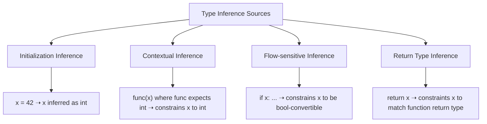
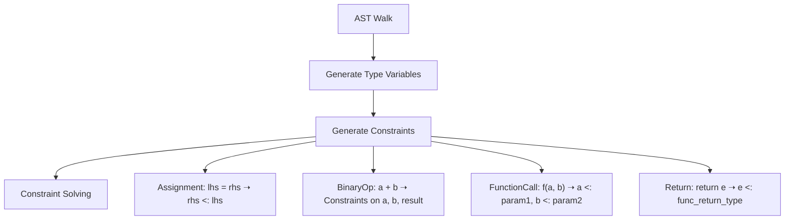
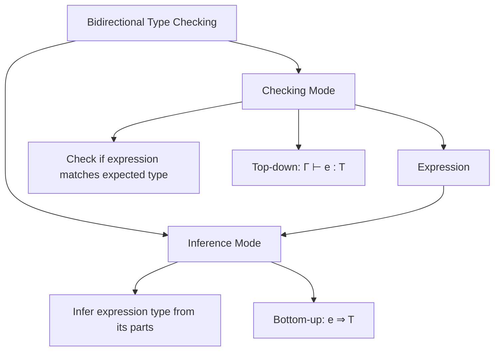

# Type Inference

This document describes the type inference system in Jac, which allows the compiler to automatically determine the types of expressions and variables without explicit annotations.

## Motivation

Type inference provides the best of both worlds: the safety of a statically typed language with the concise syntax of a dynamically typed language. In Jac, type inference helps:

- Reduce verbosity and boilerplate code
- Make code more readable while maintaining type safety
- Avoid redundant type annotations when types are obvious

## Basic Principles

Type inference in Jac follows these core principles:

1. **Local Inference**: Types are inferred from local context, like initialization expressions
2. **Bidirectional Propagation**: Types can flow both from expressions to variables and from expected contexts to expressions
3. **Progressive Refinement**: Types are refined as more information becomes available during compilation
4. **Defaulting Rules**: When inference is ambiguous, sensible defaults are chosen

## Inference Mechanisms



### Initialization Inference

The simplest form of inference occurs for local variables with initializers:

```jac
x = 42;         // x is inferred as int
y = 3.14;       // y is inferred as float
z = "hello";    // z is inferred as str
items = [];     // items is inferred as list[any]
```

For collections, the element type is inferred from the elements:

```jac
nums = [1, 2, 3];           // nums is inferred as list[int]
mixed = [1, "two", 3.0];    // mixed is inferred as list[int|str|float]
pairs = {"a": 1, "b": 2};   // pairs is inferred as dict[str, int]
```

### Contextual Inference

Types can be inferred from how variables are used:

```jac
def process(items: list[int]) -> int:
    return sum(items);

// x is inferred to be list[int] from the context of the function call
x = [];
process(x);  // Constrains x to list[int]
```

### Flow-sensitive Inference

Types can be refined based on control flow:

```jac
x = get_value();  // Initial type might be Any or a union type

if isinstance(x, str):
    // Within this block, x is known to be a str
    print(x.upper());
else:
    // Here, x's type excludes str
    // ...
```

### Return Type Inference

For functions without explicit return types, the return type is inferred:

```jac
can multiply(a: int, b: int) {
    return a * b;  // Return type inferred as int
}
```

## The Inference Algorithm

Type inference works in several phases:

### 1. Collection Phase

In this phase, the compiler:
- Identifies all variables and expressions
- Records explicit type annotations
- Creates placeholder types for variables without annotations
- Generates type variables for generic type parameters

### 2. Constraint Generation Phase

The compiler analyzes expressions and statements to generate constraints:



Example constraints:
- Assignment: `x = e` generates `typeof(e) <: typeof(x)`
- Binary operation: `a + b` generates type constraints based on operation rules
- Function call: `f(a, b)` generates `typeof(a) <: typeof(param1)`, `typeof(b) <: typeof(param2)`

### 3. Constraint Solving Phase

The constraint solver attempts to find the most specific types that satisfy all constraints. This typically involves:

1. Constructing a constraint graph
2. Applying constraint propagation
3. Resolving type variables to concrete types
4. Defaulting remaining ambiguous types

```python
# Simplified constraint solving algorithm
def solve_constraints(constraints, type_vars):
    changed = True
    while changed:
        changed = False
        for constraint in constraints:
            # Apply constraint propagation rules
            result = apply_constraint(constraint, type_vars)
            if result:
                changed = True

    # Apply defaulting rules for any remaining ambiguous types
    for var in type_vars:
        if is_ambiguous(var):
            type_vars[var] = default_type_for(var)
```

### 4. Type Application Phase

Finally, the inferred types are attached to AST nodes and made available to the type checker and code generator.

## Handling Special Cases

### Type Inference for Containers

For containers, inference considers both the variable declaration and element types:

```jac
// Inferred as list[int]
x = [1, 2, 3];

// Inferred as list[int|str]
y = [1, "two", 3];

// If z is annotated, this constrains the elements:
z: list[float] = [];  // z must contain floats
```

### Generic Function Type Inference

For generic functions, type parameters are inferred from arguments:

```jac
can first_item<T>(items: list[T]) -> T {
    return items[0];
}

// T inferred as int
x = first_item([1, 2, 3]);

// T inferred as str
y = first_item(["a", "b", "c"]);
```

### Inference with Union Types

Union types are inferred when needed:

```jac
if condition:
    x = 42;
else:
    x = "hello";

// x is inferred as int|str
```

## Bidirectional Type Checking

Jac uses bidirectional type checking, which combines:

- **Type inference**: Determining the type of an expression bottom-up
- **Type checking**: Verifying an expression against an expected type top-down



Example:

```jac
// In checking mode: x's type known to be int
x: int = ...;

// In inference mode: expression's type calculated
calc_result = complex_expression();

// Bidirectional: x's type constrains the expression
x = some_expression();
```

## Handling Ambiguity

When type inference is ambiguous, Jac applies defaulting rules:

- Empty collections default to element type `any`
- Numeric literals without context default to `int`
- When multiple valid types exist, the most specific common supertype is chosen

## Interaction with Gradual Typing

Jac supports gradual typing, where some parts of the program have explicit types while others rely on inference:

```jac
// Explicitly typed
x: int = 42;

// Inferred
y = x + 10;

// Partially explicit (list of ints)
z: list[int] = [];
```

## Error Handling in Type Inference

When inference encounters conflicting constraints, it produces clear error messages:

```
test.jac:10:12 - Type Error
Cannot infer consistent type for variable 'x'
Conflicting constraints:
  - x must be int (from assignment at line 5)
  - x must be str (from function call at line 10)
```

## Performance Considerations

Type inference can be computationally expensive. To maintain good compiler performance:

1. **Incremental Inference**: Only re-infer types for code that has changed
2. **Caching**: Cache inference results for common expressions
3. **Early Stopping**: Stop inference when sufficient information is available
4. **Constraint Simplification**: Simplify constraint sets before solving