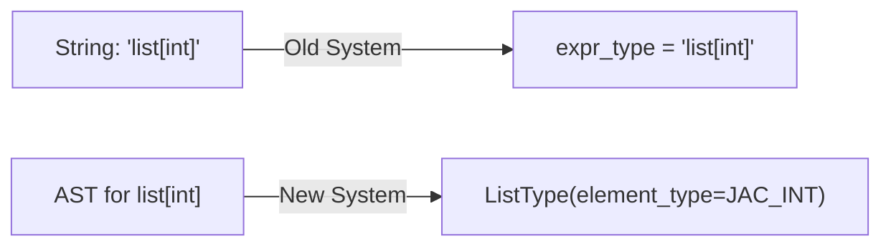
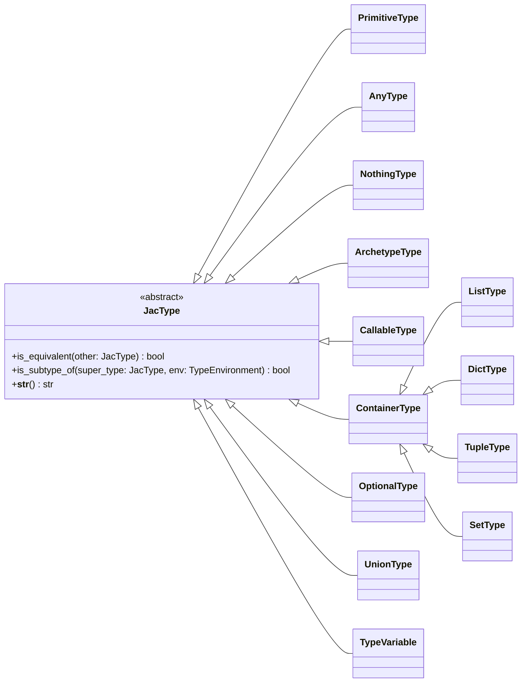
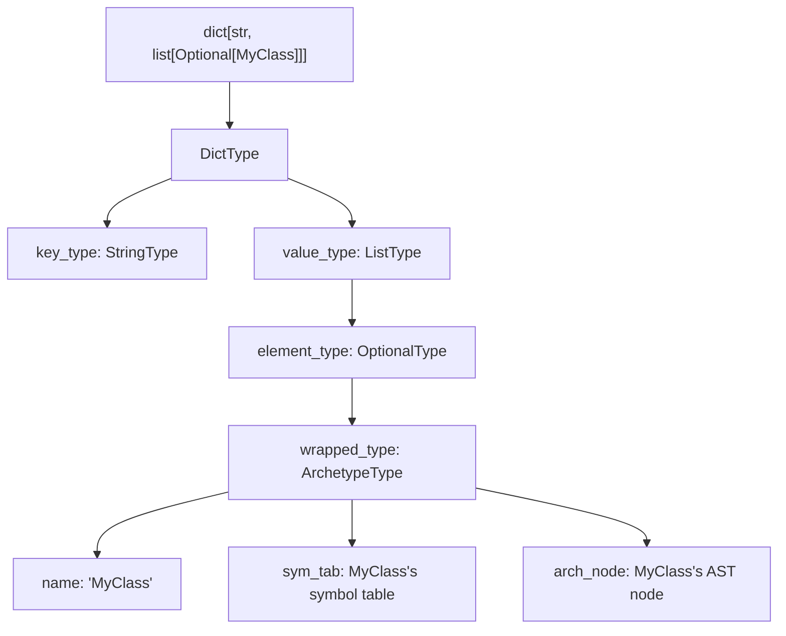

# Type Representation

This document details how types are represented internally in Jac's native type system.

## From Strings to Objects

In the previous implementation, types were primarily represented as strings (e.g., `"int"`, `"list[str]"`, `"MyCustomType"`). The new system replaces these with a rich hierarchy of type objects.



## The Type Hierarchy

The foundation of the type system is the abstract `JacType` class, which defines the interface for all type objects.



## Core Type Classes

### PrimitiveType

Represents Jac's primitive types like `int`, `float`, `str`, `bool`, and `bytes`.

```python
class PrimitiveType(JacType):
    def __init__(self, name: str):
        self.name = name  # e.g., "int", "float", "str"
```

### ArchetypeType

Represents Jac archetypes (objects, nodes, edges, walkers) and enums.

```python
class ArchetypeType(JacType):
    def __init__(self, name: str, sym_tab: UniScopeNode, arch_node: Archetype):
        self.name = name  # Fully qualified name
        self.sym_tab = sym_tab  # Symbol table of the archetype
        self.arch_node = arch_node  # AST node for the archetype definition
```

This type maintains connections to both the symbol table and AST node of the archetype, enabling member lookups and inheritance resolution.

### CallableType

Represents abilities, functions, and lambdas.

```python
class CallableType(JacType):
    def __init__(self, param_types: list[JacType], return_type: JacType, name: Optional[str] = None):
        self.param_types = param_types
        self.return_type = return_type
        self.name = name  # Optional name of the callable
```

### Container Types

A family of types for collections:

```python
class ListType(ContainerType):
    def __init__(self, element_type: JacType):
        self.element_type = element_type

class DictType(ContainerType):
    def __init__(self, key_type: JacType, value_type: JacType):
        self.key_type = key_type
        self.value_type = value_type

class TupleType(ContainerType):
    def __init__(self, item_types: Sequence[JacType], homogeneous_type: Optional[JacType] = None):
        self.item_types = tuple(item_types)  # For heterogeneous tuples
        self.homogeneous_type = homogeneous_type  # For tuple[T, ...]
```

### Type Operators

Types that combine or modify other types:

```python
class OptionalType(JacType):
    def __init__(self, wrapped_type: JacType):
        self.wrapped_type = wrapped_type

class UnionType(JacType):
    def __init__(self, types: Sequence[JacType]):
        self.member_types = frozenset(self._normalize_union(types))
```

### Special Types

```python
class AnyType(JacType):
    """Represents the 'any' type."""
    pass

class NothingType(JacType):
    """Represents the type for functions not returning a value."""
    pass

class TypeVariable(JacType):
    """Represents a type variable for generics."""
    def __init__(self, name: str, scope_id: int):
        self.name = name
        self.scope_id = scope_id  # Disambiguates type vars with same name
```

## Type Operations

### Type Equivalence

The `is_equivalent` method determines if two types are equivalent:

```python
# In ListType
def is_equivalent(self, other: JacType) -> bool:
    return (isinstance(other, ListType) and
            self.element_type.is_equivalent(other.element_type))

# In ArchetypeType (nominal typing)
def is_equivalent(self, other: JacType) -> bool:
    return isinstance(other, ArchetypeType) and self.name == other.name
```

Different types have different equivalence rules:
- **Nominal equivalence** for archetypes (based on name)
- **Structural equivalence** for containers and callables (based on structure)

### Subtyping Relationships

The `is_subtype_of` method determines if one type can be used where another is expected:

```python
# In ArchetypeType
def is_subtype_of(self, super_type: JacType, env: TypeEnvironment) -> bool:
    if self.is_equivalent(super_type):
        return True
    if isinstance(super_type, AnyType):
        return True
    if isinstance(super_type, ArchetypeType):
        # Check inheritance chain
        for base in env.get_base_types(self):
            if base.is_equivalent(super_type) or base.is_subtype_of(super_type, env):
                return True
    return False
```

Subtyping relationships follow these principles:
- A type is always a subtype of itself
- A type is always a subtype of `any`
- For archetypes, subtyping follows the inheritance hierarchy
- For containers, variance rules apply (e.g., covariance for lists)
- For callables, parameter types are contravariant and return types are covariant

## Singletons for Common Types

For efficiency, common types are pre-instantiated:

```python
JAC_INT = PrimitiveType("int")
JAC_FLOAT = PrimitiveType("float")
JAC_STRING = PrimitiveType("str")
JAC_BOOL = PrimitiveType("bool")
JAC_BYTES = PrimitiveType("bytes")
JAC_NULL = NothingType()
JAC_ANY = AnyType()
JAC_NOTHING = NothingType()
```

## Integration with AST

Type information is stored directly on AST nodes:

```python
class Expr(UniNode):
    # ...
    def __init__(self):
        # ...
        self.jac_type: Optional[JacType] = None
```

This allows type information to be easily accessed during code generation and other compiler passes.

## String Representation

For error messages and debugging, types provide string representations:

```python
# In ListType
def __str__(self) -> str:
    return f"list[{str(self.element_type)}]"

# In CallableType
def __str__(self) -> str:
    params_str = ", ".join(str(p) for p in self.param_types)
    return f"({params_str}) -> {str(self.return_type)}"
```

## Example: Complex Type Representation

Let's look at how a complex type is represented:

