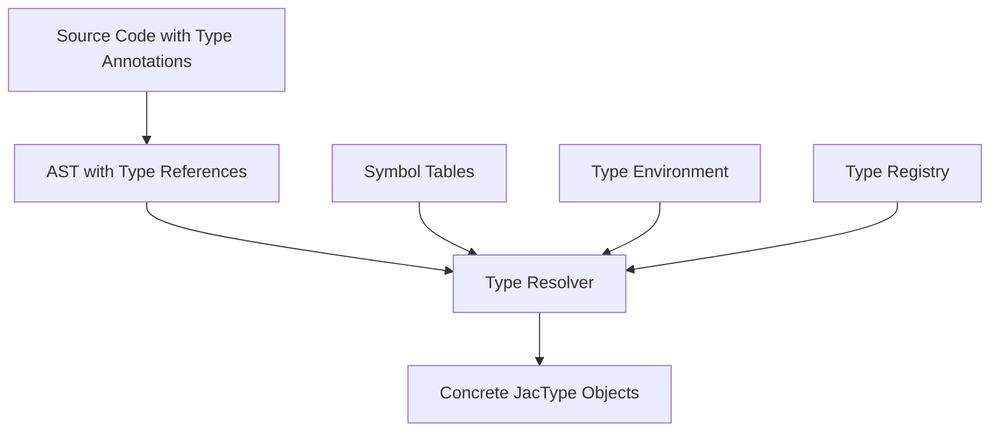
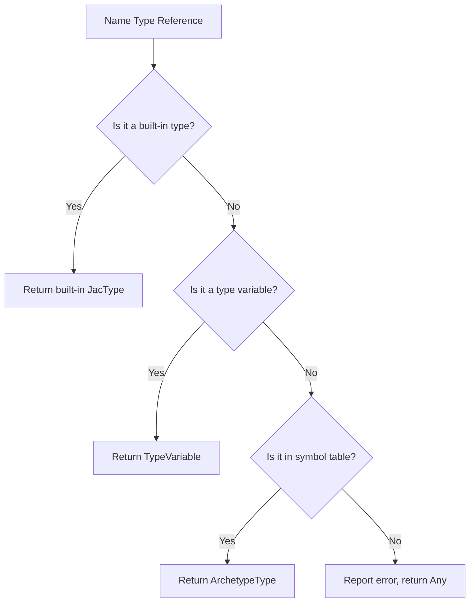
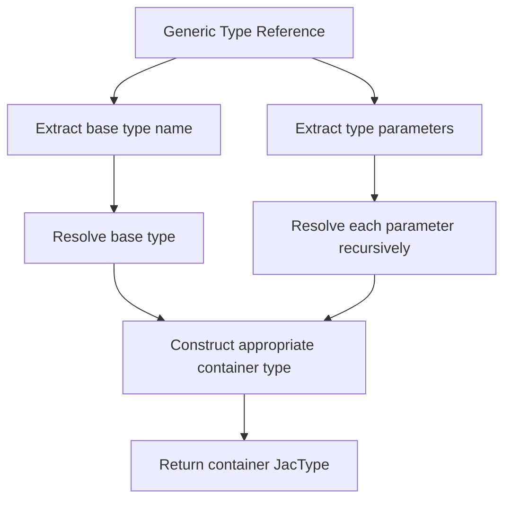
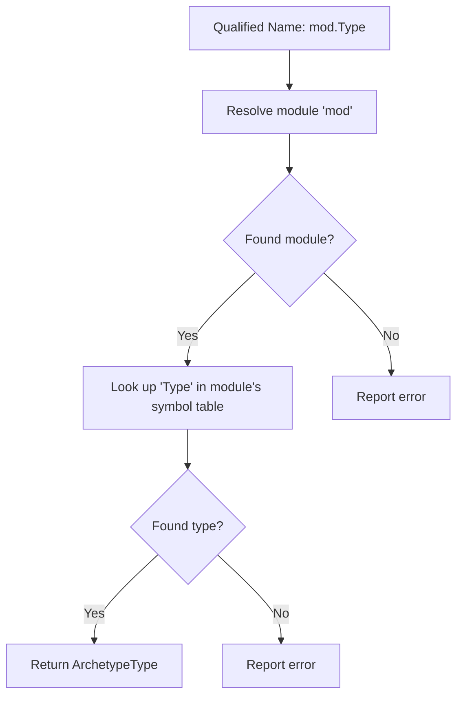
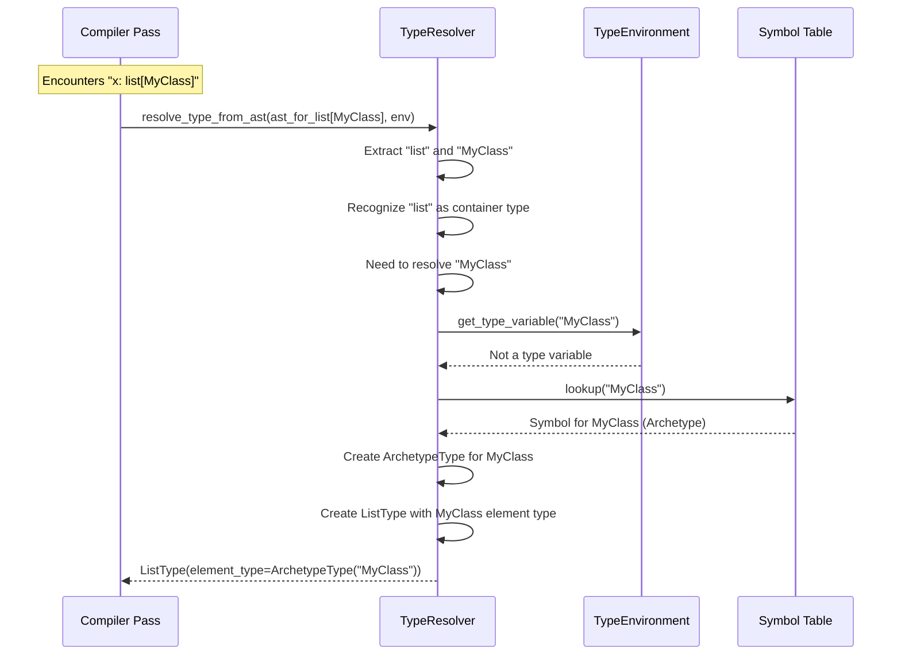

# Type Resolution

This document explains how the Jac compiler resolves types from source code, transforming type annotations and expressions into concrete type representations.

## The Resolution Process

Type resolution is the process of converting syntactic representations of types (such as annotations in source code) into the JacType objects used by the compiler.



## The Type Resolver

The Type Resolver is a central component that handles type resolution:

```python
class TypeResolver:
    def __init__(self, error_reporter: callable):
        self.error_reporter = error_reporter

    def resolve_type_from_ast(self, ast_node: uni.Expr, env: TypeEnvironment) -> JacType:
        """Main entry point to resolve a JacType from an AST expression."""
        # Logic to handle different AST node types
```

## Sources of Type Information

The Type Resolver works with several different sources of type information:

1. **Explicit Type Annotations**:
   - Variable declarations: `x: int = 5`
   - Parameter types: `can do_something(name: str, count: int)`
   - Return types: `can calculate() -> float`

2. **Type Hints in Doc Strings**:
   - Documentation comments can specify types: `@param name: The user's name`

3. **Imported Types**:
   - Types defined in other modules: `from geometry import Point`

4. **Built-in Types**:
   - Primitive types (`int`, `str`, etc.)
   - Container types (`list`, `dict`, etc.)

## Resolution Logic

### Simple Name Resolution

For simple type names like `int` or `MyClass`:



```python
def _resolve_name_type(self, name_node: uni.Name, env: TypeEnvironment) -> JacType:
    name_str = name_node.value

    # Check built-in primitives
    if name_str in TYPE_NAME_TO_JAC_TYPE_MAP:
        return TYPE_NAME_TO_JAC_TYPE_MAP[name_str]

    # Check for type variables in scope
    type_var = env.get_type_variable(name_str)
    if type_var:
        return type_var

    # Look up in symbol table
    sym_tab_entry = env.current_scope.sym_tab_scope.lookup(name_str)
    if sym_tab_entry and sym_tab_entry.decl.name_of and isinstance(sym_tab_entry.decl.name_of, uni.Archetype):
        arch_node = sym_tab_entry.decl.name_of
        return ArchetypeType(name_str, arch_node.sym_tab, arch_node)

    # Not found, report error
    self.error_reporter(JacErrorCode.TYPE_ERROR_NAME_NOT_FOUND,
                        args={"name": name_str},
                        node_override=name_node)
    return JAC_ANY
```

### Generic Type Resolution

For types with parameters like `list[int]` or `dict[str, float]`:



```python
# For a case like list[int]
if base_name == "list" and isinstance(ast_node.right, uni.IndexSlice):
    type_args_ast = ast_node.right.idx_value.items
    if len(type_args_ast) == 1:
        element_type = self.resolve_type_from_ast(type_args_ast[0], env)
        return ListType(element_type)
    else:
        self.error_reporter(JacErrorCode.TYPE_ERROR_WRONG_GENERIC_ARGS,
                           args={"type_name": "list", "expected": 1, "actual": len(type_args_ast)},
                           node_override=ast_node)
        return ListType(JAC_ANY)  # Fallback
```

### Union Type Resolution

For union types like `int | str`:

```python
if isinstance(ast_node, uni.BinaryExpr) and ast_node.op.name == uni.Tok.PIPE:
    left_type = self.resolve_type_from_ast(ast_node.left, env)
    right_type = self.resolve_type_from_ast(ast_node.right, env)
    return UnionType([left_type, right_type])
```

### Callable Type Resolution

For callable types (ability signatures):

```python
if isinstance(ast_node, uni.AbilityTypeHint):
    param_types = [self.resolve_type_from_ast(param, env)
                   for param in ast_node.param_types.items]
    return_type = (self.resolve_type_from_ast(ast_node.return_type, env)
                   if ast_node.return_type else JAC_NOTHING)
    return CallableType(param_types, return_type)
```

## Handling Archetypes

Jac's archetypes (node, edge, object, walker) require special handling:

1. **Resolving the Archetype Definition**:
   - Locate the archetype's definition in the symbol table
   - Create an ArchetypeType with references to the symbol table and AST node

2. **Member Access Type Resolution**:
   - When resolving expressions like `obj.field`, use the archetype's symbol table

3. **Method Resolution**:
   - When resolving method calls, find abilities in the archetype's symbol table

## Qualified Name Resolution

For types referenced through modules or nested namespaces:



## Type Resolution Caching

For performance, resolved types are cached:

```python
# Inside TypeEnvironment
def get_node_type(self, ast_node_id: int) -> Optional[JacType]:
    return self.node_to_type_map.get(ast_node_id)

def set_node_type(self, ast_node_id: int, jac_type: JacType) -> None:
    self.node_to_type_map[ast_node_id] = jac_type
```

## Error Handling

The resolver reports errors through the error reporting system:

```python
self.error_reporter(JacErrorCode.TYPE_ERROR_NAME_NOT_FOUND,
                   args={"name": name_str},
                   node_override=name_node)
```

Common error scenarios:
- Type name not found
- Wrong number of type parameters
- Invalid use of type (e.g., trying to use a non-generic type as generic)
- Circular type references

## Integration with Compiler Passes

The Type Resolver is used in several compiler passes:

1. **Type Annotation Resolution Pass**:
   - After symbol table construction
   - Resolves explicit type annotations

2. **Type Inference Pass**:
   - Infers types from initializers and usage
   - May call the resolver to resolve known types

3. **Type Checking Pass**:
   - Uses resolved types to validate operations
   - May call the resolver for complex expressions

## Example Resolution Flow

