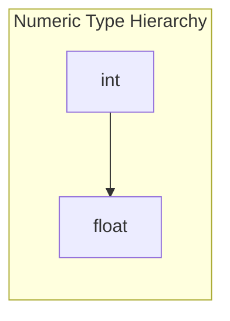
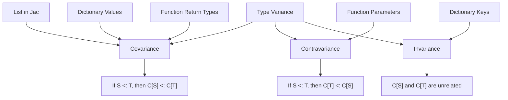
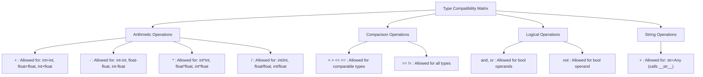

# Type Rules

This document defines the formal type checking rules for the Jac language.

## Introduction to Type Rules

Type rules specify how to determine the types of expressions and how to validate operations. They form the foundation of the type checker's decision-making process.

Each rule specifies:
1. The language construct being checked
2. The conditions that must be met for the construct to be well-typed
3. The resulting type of the expression (if applicable)

## Notation

We'll use a formal notation similar to type inference rules in programming language theory:

```
Premises
--------------
Conclusion
```

Where:
- **Premises** are the conditions that must be true for the rule to apply
- **Conclusion** is what we can conclude when the premises are satisfied

We'll also use the following notation:
- Γ (Gamma): The typing environment/context
- e : T: Expression e has type T
- S <: T: Type S is a subtype of T

## Core Rules

### Literals

```
--------------
Γ ⊢ IntLiteral : int

--------------
Γ ⊢ FloatLiteral : float

--------------
Γ ⊢ StringLiteral : str

--------------
Γ ⊢ BoolLiteral : bool

--------------
Γ ⊢ null : Any
```

### Variables

```
x: T ∈ Γ
--------------
Γ ⊢ x : T
```

A variable x has type T if the environment Γ contains the binding x: T.

### Assignment

```
Γ ⊢ e : S    Γ ⊢ x : T    S <: T
---------------------------------
Γ ⊢ x = e : T
```

An assignment is valid if the type of the expression is a subtype of the variable's type.

### Binary Operations

#### Arithmetic Operations

```
Γ ⊢ e1 : T1    Γ ⊢ e2 : T2    T1, T2 ∈ {int, float}
---------------------------------------------------------
Γ ⊢ e1 + e2 : lub(T1, T2)    // Similarly for -, *, /
```

Where `lub` is the least upper bound (e.g., `lub(int, float) = float`).



#### String Concatenation

```
Γ ⊢ e1 : str    Γ ⊢ e2 : T    T has __str__
----------------------------------------
Γ ⊢ e1 + e2 : str
```

#### Comparison Operations

```
Γ ⊢ e1 : T1    Γ ⊢ e2 : T2    T1 and T2 are comparable
------------------------------------------------------
Γ ⊢ e1 < e2 : bool    // Similarly for >, <=, >=
```

```
Γ ⊢ e1 : T1    Γ ⊢ e2 : T2
--------------------------
Γ ⊢ e1 == e2 : bool    // Similarly for !=
```

#### Logical Operations

```
Γ ⊢ e1 : bool    Γ ⊢ e2 : bool
----------------------------
Γ ⊢ e1 and e2 : bool    // Similarly for or
```

```
Γ ⊢ e : bool
-----------
Γ ⊢ not e : bool
```

### Function/Ability Calls

```
Γ ⊢ f : (P1, P2, ..., Pn) -> R
Γ ⊢ e1 : T1    Γ ⊢ e2 : T2    ...    Γ ⊢ en : Tn
T1 <: P1    T2 <: P2    ...    Tn <: Pn
------------------------------------------
Γ ⊢ f(e1, e2, ..., en) : R
```

A function call is valid if each argument's type is a subtype of the corresponding parameter type.

### Member Access

```
Γ ⊢ e : T    member m with type M exists in T
-------------------------------------------
Γ ⊢ e.m : M
```

### Control Flow

#### If Statement/Expression

```
Γ ⊢ cond : bool    Γ ⊢ then_expr : T1    Γ ⊢ else_expr : T2
----------------------------------------------------------
Γ ⊢ if cond then then_expr else else_expr : lub(T1, T2)
```

#### For Loop

```
Γ ⊢ iterable : Iterable[T]    Γ, item: T ⊢ body
------------------------------------------
Γ ⊢ for item in iterable: body
```

## Jac-Specific Rules

### Archetypes and Inheritance

```
A inherits from B    B inherits from C
------------------------------------
A <: B    B <: C    A <: C
```

### Walker Rules

```
W is a walker    N is a node
--------------------------
Γ ⊢ W.take→N : N
```

```
Γ ⊢ w : Walker    Γ ⊢ n : Node    w.can_visit(n)
----------------------------------------------
Γ ⊢ w.visit(n)
```

### Node/Edge Creation

```
N is a node archetype    Γ ⊢ args match N.init parameters
------------------------------------------------------
Γ ⊢ spawn N(args) : N
```

### Graph Operations

```
Γ ⊢ n1 : N1    Γ ⊢ n2 : N2    Γ ⊢ e : E
N1, N2 are node types    E is edge type
-------------------------------------
Γ ⊢ n1 -[e]-> n2
```

## Container Types

### List Operations

```
Γ ⊢ list : list[T]    Γ ⊢ index : int
------------------------------------
Γ ⊢ list[index] : T
```

```
Γ ⊢ list1 : list[T1]    Γ ⊢ list2 : list[T2]
-------------------------------------------
Γ ⊢ list1 + list2 : list[lub(T1, T2)]
```

### Dictionary Operations

```
Γ ⊢ dict : dict[K, V]    Γ ⊢ key : K'    K' <: K
---------------------------------------------
Γ ⊢ dict[key] : V
```

## Variance Rules

### For Container Types



- **List**: Covariant in element type
  ```
  S <: T
  --------
  list[S] <: list[T]
  ```

- **Dictionary**: Invariant in keys, covariant in values
  ```
  K1 == K2    V1 <: V2
  ------------------
  dict[K1, V1] <: dict[K2, V2]
  ```

- **Tuple**: Covariant in element types
  ```
  S1 <: T1    S2 <: T2    ...    Sn <: Tn
  ---------------------------------------
  tuple[S1, S2, ..., Sn] <: tuple[T1, T2, ..., Tn]
  ```

### For Function Types

- **Function/Ability**: Contravariant in parameters, covariant in return type
  ```
  T1 <: S1    T2 <: S2    ...    Tn <: Sn    R1 <: R2
  ---------------------------------------------------
  (S1, S2, ..., Sn) -> R1 <: (T1, T2, ..., Tn) -> R2
  ```

## Error Reporting

When a type rule is violated, the type checker reports an error with:

1. **Location**: The source code location where the error occurred
2. **Rule Violated**: Which type rule was broken
3. **Expected vs. Actual**: The expected type and the actual type found
4. **Suggestion**: If possible, a suggestion for how to fix the error

Example error:
```
test.jac:42:15 - Type Error
Cannot assign value of type 'str' to variable of type 'int'
  x: int = "hello";  // Type mismatch
            ^~~~~~
Consider using int("hello") to convert the string to an integer
```

## Type Compatibility Matrix

The following table summarizes which operations are allowed between different types:

