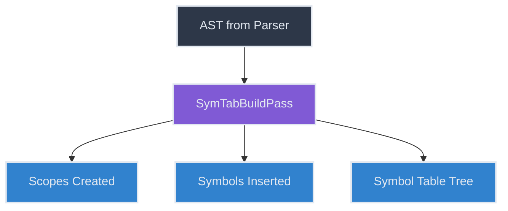
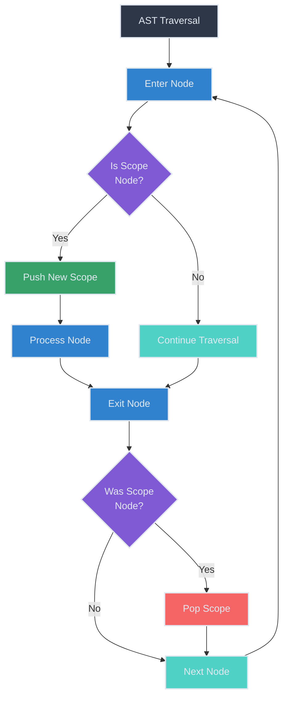
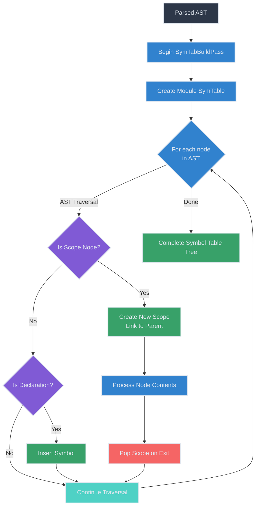
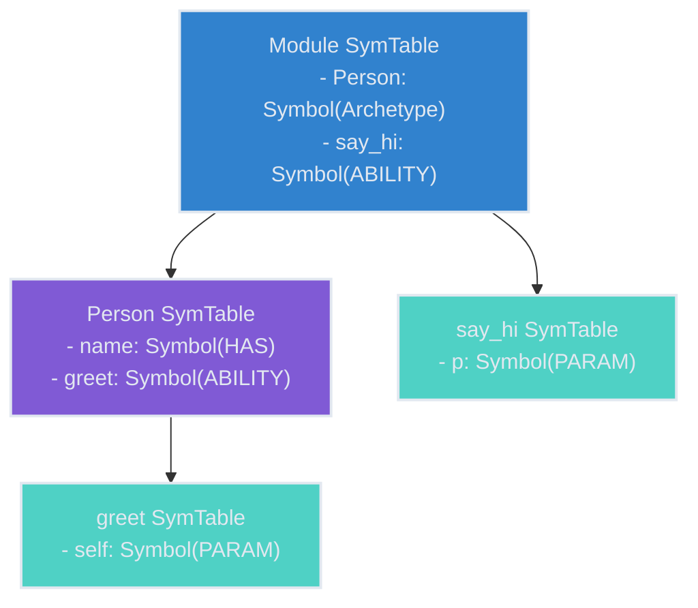

# Symbol Table Building

The symbol table building process is one of the first major steps in Jaclang's compilation pipeline. This document explains how symbol tables are constructed during the compilation process through the `SymTabBuildPass`.

## The SymTabBuildPass

The `SymTabBuildPass` is a compiler pass responsible for creating the initial structure of symbol tables and populating them with symbols from declarations. It traverses the Abstract Syntax Tree (AST) and creates a symbol table for each scope in the program.



## Key Mechanisms

### Scope Stack Management

The `SymTabBuildPass` maintains a stack of symbol tables to track the current scope during traversal:

```python
def before_pass(self) -> None:
    """Before pass."""
    self.cur_sym_tab: list[UniScopeNode] = []

def push_scope_and_link(self, key_node: uni.UniScopeNode) -> None:
    """Push scope."""
    if not len(self.cur_sym_tab):
        self.cur_sym_tab.append(key_node)
    else:
        self.cur_sym_tab.append(self.cur_scope.link_kid_scope(key_node=key_node))

def pop_scope(self) -> UniScopeNode:
    """Pop scope."""
    return self.cur_sym_tab.pop()

@property
def cur_scope(self) -> UniScopeNode:
    """Return current scope."""
    return self.cur_sym_tab[-1]
```

This stack-based approach allows the pass to:
1. Create nested scopes that mirror the program's scope structure
2. Link child scopes to their parent scopes
3. Ensure symbols are inserted into the correct scope

### Scope Creation

The pass creates a new scope for every construct that introduces a scope in the language:



Scopes are created for:
- Modules
- Archetypes (object, node, edge, walker)
- Abilities (methods and functions)
- Control structures (if, for, while, etc.)
- Block statements
- Lambda expressions
- Comprehensions

For example, here's how scopes are created for archetypes:

```python
def enter_archetype(self, node: uni.Archetype) -> None:
    self.push_scope_and_link(node)
    assert node.parent_scope is not None
    node.parent_scope.def_insert(node, access_spec=node, single_decl="archetype")

def exit_archetype(self, node: uni.Archetype) -> None:
    self.pop_scope()
```

### Symbol Insertion

As the pass traverses the AST, it inserts symbols into the current scope for various declarations:

```mermaid
sequenceDiagram
    participant AST as AST Node
    participant Pass as SymTabBuildPass
    participant Scope as Current Scope
    participant Symbol as Symbol

    AST->>Pass: Process declaration
    Pass->>Scope: def_insert(node, access_spec, single_decl)
    Scope->>Scope: insert(node, access_spec, single, force_overwrite)
    Scope->>Symbol: Create Symbol
    Symbol->>AST: Set node.sym reference
    Scope->>Scope: Update names_in_scope

    style AST fill:#2d3748,stroke:#e2e8f0,stroke-width:2px,color:#e2e8f0
    style Pass fill:#805ad5,stroke:#e2e8f0,stroke-width:2px,color:#e2e8f0
    style Scope fill:#3182ce,stroke:#e2e8f0,stroke-width:2px,color:#e2e8f0
    style Symbol fill:#38a169,stroke:#e2e8f0,stroke-width:2px,color:#e2e8f0
```

Symbols are inserted for:
- Global variables
- Import statements
- Archetype declarations
- Ability (method and function) declarations
- Parameters
- Has variables
- Enum declarations

For example, here's how global variables are processed:

```python
def exit_global_vars(self, node: uni.GlobalVars) -> None:
    for i in self.get_all_sub_nodes(node, uni.Assignment):
        for j in i.target.items:
            if isinstance(j, uni.AstSymbolNode):
                j.sym_tab.def_insert(j, access_spec=node, single_decl="global var")
            else:
                self.ice("Expected name type for globabl vars")
```

### Special Symbol Handling

The pass also handles special symbols that have implicit definitions:

```python
def enter_ability(self, node: uni.Ability) -> None:
    self.push_scope_and_link(node)
    assert node.parent_scope is not None
    node.parent_scope.def_insert(node, access_spec=node, single_decl="ability")
    if node.is_method:
        node.sym_tab.def_insert(uni.Name.gen_stub_from_node(node, "self"))
        node.sym_tab.def_insert(
            uni.Name.gen_stub_from_node(
                node, "super", set_name_of=node.owner_method
            )
        )
```

In this example, `self` and `super` are automatically inserted for methods.

## Symbol Table Building Flow

The overall flow of the symbol table building process is as follows:



## Symbol Resolution in SymTabBuildPass

During this phase, resolution of symbols is not yet complete. The pass only:

1. Creates the symbol table structure
2. Inserts symbols from declarations
3. Establishes parent-child relationships between scopes

Subsequent passes will:
- Link symbol uses to their declarations (DefUsePass)
- Connect symbol tables across module boundaries (SymTabLinkPass)
- Validate symbol references and perform type checking

## Example: Building Symbol Tables for a Simple Program

Consider this example Jac program:

```jac
node Person {
    has name: str;

    can greet {
        print("Hello, " + self.name);
    }
}

can say_hi(p: Person) {
    p.greet();
}
```

Here's how the `SymTabBuildPass` would process this program:

1. Create a module symbol table
2. Encounter `node Person` → Create a new scope, insert "Person" in the module scope
3. Encounter `has name` → Insert "name" in the Person scope
4. Encounter `can greet` → Create a new scope, insert "greet" in the Person scope
5. Inside `greet`, insert implicit "self" symbol
6. Exit `greet` scope → Pop scope
7. Exit `Person` scope → Pop scope
8. Encounter `can say_hi` → Create a new scope, insert "say_hi" in the module scope
9. Encounter parameter `p` → Insert "p" in the say_hi scope
10. Exit `say_hi` scope → Pop scope

The resulting symbol table structure:



## Conclusion

The `SymTabBuildPass` is a foundational component of Jaclang's compilation pipeline. It creates the symbol table structure that subsequent passes will use for name resolution, type checking, and code generation.

Understanding this pass is essential for:
- Adding new language constructs that introduce scopes
- Modifying symbol handling behavior
- Debugging symbol resolution issues
- Implementing new semantic analyses that depend on symbol tables