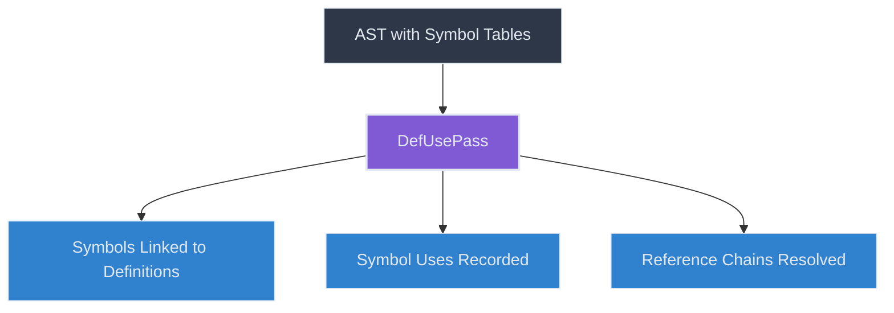
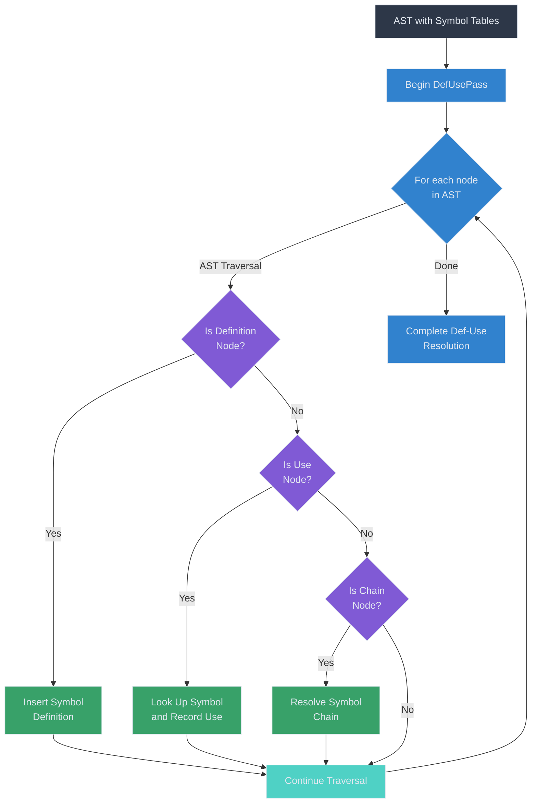
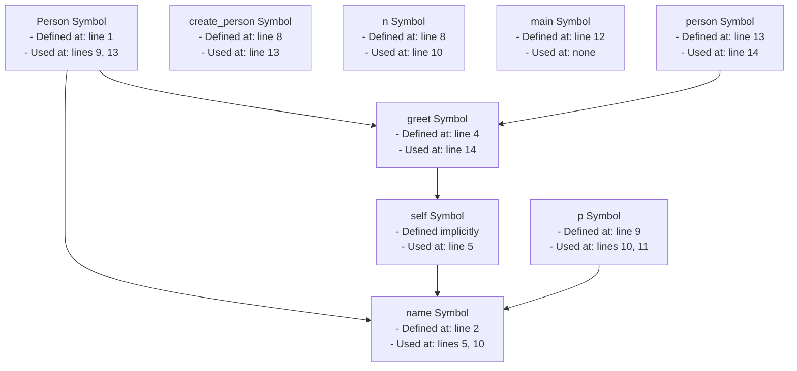

# Symbol Definition and Use

After the initial symbol table structure is built by the `SymTabBuildPass`, the `DefUsePass` takes over to establish connections between symbol definitions and their uses throughout the code. This pass is critical for name resolution and type checking, as it tracks where symbols are defined and where they are used.

## The DefUsePass

The `DefUsePass` processes the AST to:

1. Insert additional symbol definitions that weren't captured in the `SymTabBuildPass`
2. Connect symbol uses to their corresponding definitions
3. Handle chained references (e.g., `object.attribute.method()`)



## Key Mechanisms

### Definition Tracking

The `DefUsePass` identifies and processes additional symbol definitions that weren't handled by the `SymTabBuildPass`, including:

- Variables in assignments
- Loop variables in for loops
- Member variables in attribute chains
- Variables in destructuring operations
- Has variables in archetypes

For example, here's how assignments are handled:

```python
def enter_assignment(self, node: uni.Assignment) -> None:
    for i in node.target.items:
        if isinstance(i, uni.AtomTrailer):
            i.sym_tab.chain_def_insert(i.as_attr_list)
        elif isinstance(i, uni.AstSymbolNode):
            i.sym_tab.def_insert(i)
        else:
            self.log_error("Assignment target not valid")
```

This code processes each assignment target and inserts the appropriate symbols into the symbol table.

### Use Resolution

The pass connects uses of symbols to their definitions by finding the relevant symbol in the symbol table and updating both the use and the symbol:

```python
def use_lookup(
    self,
    node: AstSymbolNode,
    sym_table: Optional[UniScopeNode] = None,
) -> Optional[Symbol]:
    """Link to symbol."""
    if node.sym:
        return node.sym
    if not sym_table:
        sym_table = node.sym_tab
    if sym_table:
        lookup = sym_table.lookup(name=node.sym_name, deep=True)
        lookup.add_use(node.name_spec) if lookup else None
    return node.sym
```

This method:
1. Looks up the symbol by name in the symbol table
2. If found, adds the current node as a use of that symbol
3. Returns the symbol (or None if not found)

The pass applies this resolution to all symbol references:

```python
def enter_name(self, node: uni.Name) -> None:
    if not isinstance(node.parent, uni.AtomTrailer):
        node.sym_tab.use_lookup(node)
```

### Chain Resolution

One of the most powerful features of the `DefUsePass` is its ability to resolve chains of references, such as member access expressions (e.g., `object.attribute.method()`):

```python
def chain_use_lookup(self, node_list: Sequence[AstSymbolNode]) -> None:
    """Link chain of containing names to symbol."""
    if not node_list:
        return
    cur_sym_tab: UniScopeNode | None = node_list[0].sym_tab
    for i in node_list:
        if cur_sym_tab is None:
            break
        lookup = self.use_lookup(i, sym_table=cur_sym_tab)
        if lookup:
            cur_sym_tab = lookup.decl.sym_tab

            # check if the symbol table name is not the same as symbol name
            # then try to find a child scope with the same name
            # This is used to get the scope in case of
            #      import math;
            #      b = math.floor(1.7);
            if cur_sym_tab.nix_name != i.sym_name:
                t = cur_sym_tab.find_scope(i.sym_name)
                if t:
                    cur_sym_tab = t
        else:
            cur_sym_tab = None
```

This method:
1. Starts from the leftmost element of the chain
2. Resolves each element in the chain sequentially
3. Updates the symbol table context for the next element based on the current element's type
4. Handles special cases like module imports

The process is triggered for all atom trailers (expressions with member access):

```python
def enter_atom_trailer(self, node: uni.AtomTrailer) -> None:
    chain = node.as_attr_list
    node.sym_tab.chain_use_lookup(chain)
```

## Def-Use Resolution Flow

The overall flow of the def-use resolution process:



## Handling Special Cases

### Archetype Inheritance

The `DefUsePass` also handles archetype inheritance by adding inherited symbols to the archetype's symbol table:

```python
def enter_archetype(self, node: uni.Archetype) -> None:
    node.sym_tab.inherit_baseclasses_sym(node)

    def inform_from_walker(node: uni.UniNode) -> None:
        for i in (
            node.get_all_sub_nodes(uni.VisitStmt)
            + node.get_all_sub_nodes(uni.IgnoreStmt)
            + node.get_all_sub_nodes(uni.DisengageStmt)
            + node.get_all_sub_nodes(uni.EdgeOpRef)
        ):
            i.from_walker = True

    if node.arch_type.name == Tok.KW_WALKER:
        inform_from_walker(node)
        for i in self.get_all_sub_nodes(node, uni.Ability):
            if isinstance(i.body, uni.AbilityDef):
                inform_from_walker(i.body)
```

This ensures that symbols from base classes are available in the derived class's symbol table.

### Context Setting for Python Compilation

The pass sets the appropriate Python AST context for symbols, which is important for the later Python code generation:

```python
def enter_delete_stmt(self, node: uni.DeleteStmt) -> None:
    for i in node.py_ast_targets:
        if isinstance(i, uni.AtomTrailer):
            i.as_attr_list[-1].name_spec.py_ctx_func = ast3.Del
        elif isinstance(i, uni.AstSymbolNode):
            i.name_spec.py_ctx_func = ast3.Del
        else:
            self.log_error("Delete target not valid")
```

In this example, symbols in a delete statement are marked with the Python `Del` context.

## Example: Def-Use Resolution

To understand how the `DefUsePass` works in practice, consider this code example:

```jac
node Person {
    has name: str;

    can greet {
        print("Hello, " + self.name);
    }
}

can create_person(n: str) -> Person {
    p = Person();
    p.name = n;
    return p;
}

can main {
    person = create_person("Alice");
    person.greet();
}
```

Here's how the `DefUsePass` processes this code:

1. `Person` is already in the symbol table from `SymTabBuildPass`
2. Inside `greet`, `self` is already in the symbol table, but `self.name` needs resolution:
   - `self` is looked up, found, and marked as used
   - The symbol table of `self` (Person) is checked for `name`
   - `name` is found, and this use is recorded in the `name` symbol

3. Inside `create_person`, `n` is already in the symbol table
4. For `p = Person()`:
   - `Person` is looked up, found, and marked as used
   - `p` is inserted as a new symbol definition

5. For `p.name = n`:
   - `p` is looked up, found, and marked as used
   - The symbol table of `p` (Person) is checked for `name`
   - `name` is found, and this use is recorded
   - `n` is looked up, found, and marked as used

6. Inside `main`, for `person = create_person("Alice")`:
   - `create_person` is looked up, found, and marked as used
   - `person` is inserted as a new symbol definition

7. For `person.greet()`:
   - `person` is looked up, found, and marked as used
   - The symbol table of `person` (Person) is checked for `greet`
   - `greet` is found, and this use is recorded

The resulting def-use information looks like this:



## Conclusion

The `DefUsePass` is critical for establishing the connections between symbol definitions and uses throughout the code. These connections enable:

- Accurate name resolution
- Type checking and inference
- Code refactoring tools
- Usage analysis
- Dead code detection

By tracking where symbols are defined and used, the compiler can validate references, detect errors, and generate correct code. The def-use information also serves as a foundation for later passes like type checking and optimization.