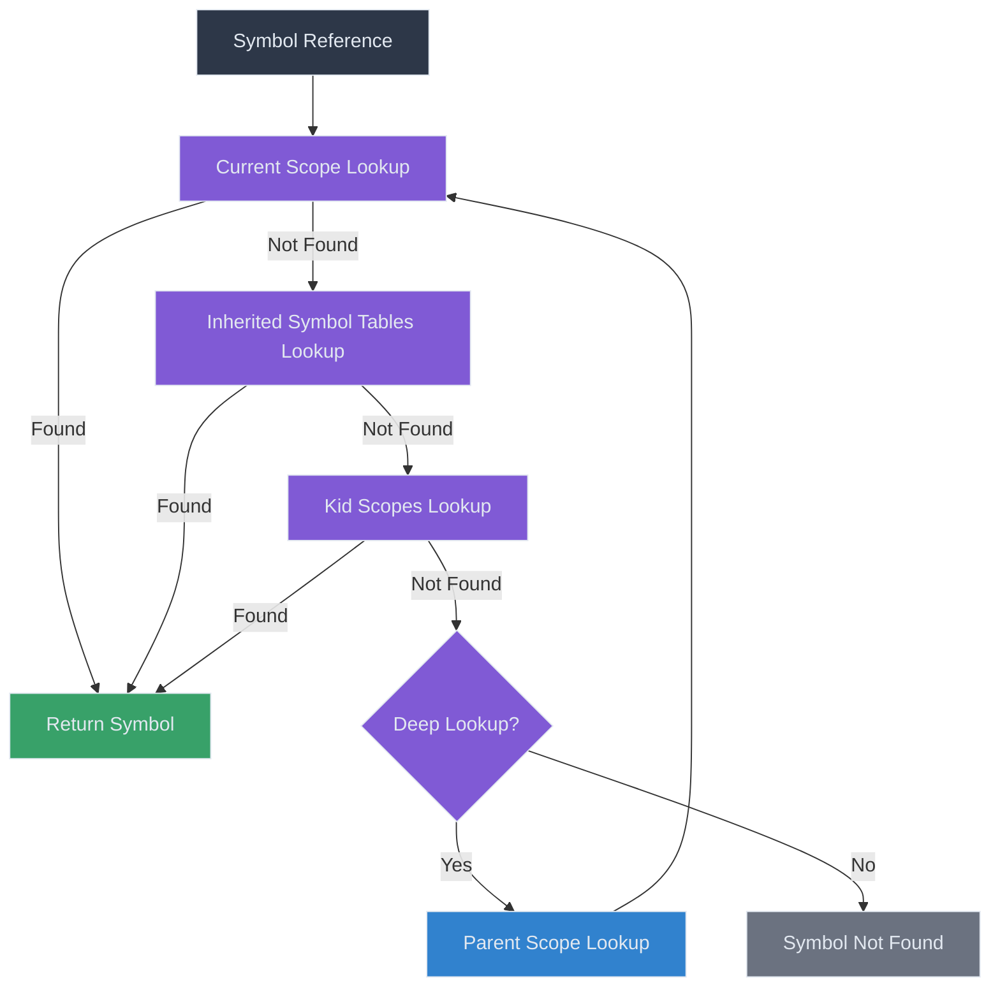
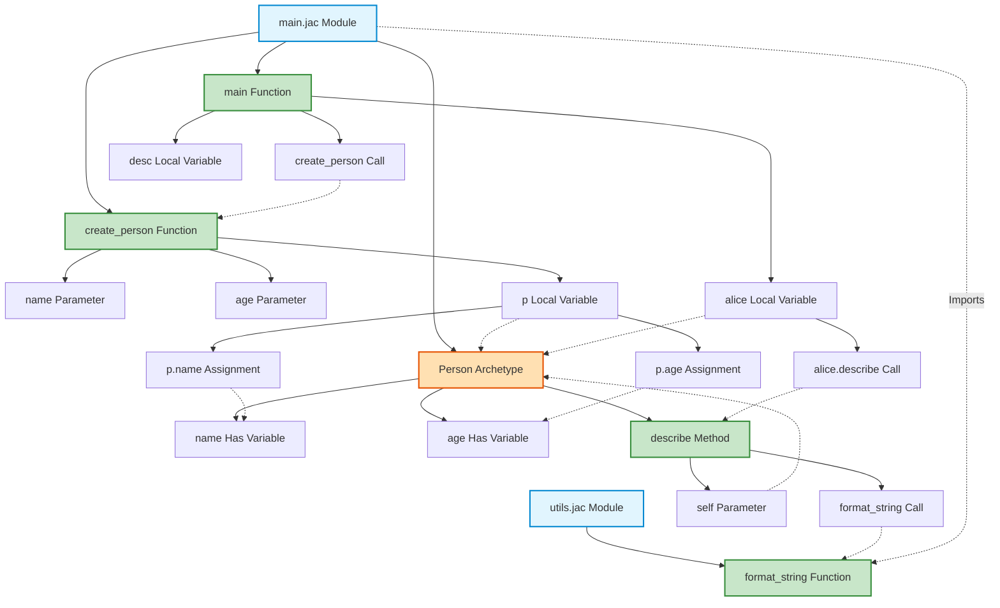

# Symbol Resolution in Practice

After the symbol tables are built, populated with definitions, and linked across modules, the compiler uses them to resolve symbol references throughout the code. This document provides practical examples of how symbol resolution works in various scenarios.

## The Symbol Resolution Process

Symbol resolution in Jaclang involves several key steps:



The lookup algorithm tries to find symbols in this order:
1. In the current scope's `names_in_scope`
2. In the `inherited_scope` (from imports or inheritance)
3. In the `kid_scope` (for entire module imports)
4. In parent scopes (if `deep=True`)

## Common Resolution Scenarios

Let's examine how symbol resolution works in various common scenarios.

### Local Variable Resolution

```jac
can greeting(name: str) {
    message = "Hello, " + name + "!";
    print(message);
}
```

Resolution steps for `message` in `print(message)`:
1. Look up `message` in the `greeting` function's scope
2. Find it in `names_in_scope` as a local variable
3. Record this use of `message`

Resolution steps for `name` in `"Hello, " + name + "!"`:
1. Look up `name` in the `greeting` function's scope
2. Find it in `names_in_scope` as a parameter
3. Record this use of `name`

### Member Access Resolution

```jac
node Person {
    has name: str;

    can greet {
        print("Hello, my name is " + self.name);
    }
}
```

Resolution steps for `self.name`:
1. Look up `self` in the `greet` method's scope
2. Find it in `names_in_scope` as an implicit parameter
3. Get the symbol table associated with `self` (the `Person` archetype's symbol table)
4. Look up `name` in the `Person` symbol table
5. Find it in `names_in_scope` as a "has" variable
6. Record this use of `name`

### Cross-Module Resolution

Given these files:

**utils.jac**:
```jac
can format_name(first: str, last: str) -> str {
    return first + " " + last;
}
```

**main.jac**:
```jac
import utils;

can main {
    full_name = utils.format_name("John", "Doe");
    print(full_name);
}
```

Resolution steps for `utils.format_name`:
1. Look up `utils` in the `main` module's scope
2. Find it in `kid_scope` as an imported module (added by `SymTabLinkPass`)
3. Look up `format_name` in the `utils` module's symbol table
4. Find it in `names_in_scope` as a function
5. Record this use of `format_name`

### Selective Import Resolution

Given these files:

**math.jac**:
```jac
can add(a: int, b: int) -> int {
    return a + b;
}

can subtract(a: int, b: int) -> int {
    return a - b;
}
```

**calculator.jac**:
```jac
import math with add;

can calculate(x: int, y: int) -> int {
    return add(x, y);  // Works
    // return subtract(x, y);  // Would fail - not imported
}
```

Resolution steps for `add`:
1. Look up `add` in the `calculate` function's scope
2. Not found, continue to module scope
3. Look up `add` in the `calculator` module's scope
4. Not found in `names_in_scope`
5. Check `inherited_scope` (set up by `SymTabLinkPass`)
6. Find `add` in the `InheritedSymbolTable` that references `math`
7. Record this use of `add`

If `subtract` were uncommented, resolution would fail at step 6 since it's not in the list of imported symbols.

### Nested Scopes Resolution

```jac
can outer() {
    x = 10;

    can inner() {
        y = x + 5;  // Accessing outer scope
        return y;
    }

    return inner();
}
```

Resolution steps for `x` in `y = x + 5`:
1. Look up `x` in the `inner` function's scope
2. Not found in `names_in_scope`
3. Check parent scope (`outer` function)
4. Find `x` in `outer`'s `names_in_scope`
5. Record this use of `x`

### Object-Oriented Method Resolution

```jac
node Vehicle {
    has wheels: int = 4;

    can drive {
        print("Driving a vehicle with " + self.wheels + " wheels");
    }
}

node Car:Vehicle {
    has brand: str;

    can drive {
        super.drive();
        print("It's a " + self.brand);
    }
}
```

Resolution steps for `super.drive()` in `Car.drive`:
1. Look up `super` in the `Car.drive` method's scope
2. Find it in `names_in_scope` as an implicit variable
3. Get the symbol table associated with `super` (the `Vehicle` archetype's symbol table)
4. Look up `drive` in the `Vehicle` symbol table
5. Find it in `names_in_scope` as a method
6. Record this use of `drive`

Resolution steps for `self.brand` in `Car.drive`:
1. Look up `self` in the `Car.drive` method's scope
2. Find it in `names_in_scope` as an implicit parameter
3. Get the symbol table associated with `self` (the `Car` archetype's symbol table)
4. Look up `brand` in the `Car` symbol table
5. Find it in `names_in_scope` as a "has" variable
6. Record this use of `brand`

### Import with Alias Resolution

```jac
import utils as u;

can demo() {
    result = u.helper();
}
```

Resolution steps for `u.helper()`:
1. Look up `u` in the module scope
2. Find it in `names_in_scope` as an alias (defined through import)
3. Get the symbol table associated with `u` (the `utils` module's symbol table)
4. Look up `helper` in the `utils` symbol table
5. Find it in `names_in_scope` as a function
6. Record this use of `helper`

## Complex Resolution Scenarios

### Multi-Level Member Access

```jac
node Address {
    has city: str;
}

node Person {
    has name: str;
    has addr: Address;

    can print_city {
        print(self.addr.city);
    }
}
```

Resolution steps for `self.addr.city`:
1. Look up `self` in the `print_city` method's scope
2. Find it in `names_in_scope` as an implicit parameter
3. Get the symbol table associated with `self` (the `Person` archetype's symbol table)
4. Look up `addr` in the `Person` symbol table
5. Find it in `names_in_scope` as a "has" variable
6. Determine the type of `addr` is `Address`
7. Get the symbol table associated with `Address`
8. Look up `city` in the `Address` symbol table
9. Find it in `names_in_scope` as a "has" variable
10. Record these uses of `addr` and `city`

### Inheritance and Shadow Variables

```jac
node Base {
    has x: int = 10;

    can method {
        print(self.x);
    }
}

node Derived:Base {
    has x: int = 20;  // Shadows Base.x

    can test {
        self.method();  // Prints 20, not 10
    }
}
```

Resolution steps for `self.method()` in `test`:
1. Look up `self` in the `test` method's scope
2. Find it in `names_in_scope` as an implicit parameter
3. Get the symbol table associated with `self` (the `Derived` archetype's symbol table)
4. Look up `method` in the `Derived` symbol table
5. Not found in `names_in_scope`
6. Inherited from `Base`, find it in base class
7. Record this use of `method`

Resolution steps for `self.x` in `method` when called from `Derived`:
1. Look up `self` in the `method` method's scope
2. Find it in `names_in_scope` as an implicit parameter
3. The actual object is a `Derived` instance
4. Get the symbol table associated with `Derived`
5. Look up `x` in the `Derived` symbol table
6. Find it in `names_in_scope` as a "has" variable
7. Record this use of `x`

### Import Conflicts Resolution

**math.jac**:
```jac
can calculate(x: int) -> int {
    return x * 2;
}
```

**stats.jac**:
```jac
can calculate(x: int) -> float {
    return x / 2.0;
}
```

**main.jac**:
```jac
import math with calculate as math_calc;
import stats with calculate as stats_calc;

can test(x: int) {
    a = math_calc(x);
    b = stats_calc(x);
    return a + b;
}
```

Resolution steps for `math_calc`:
1. Look up `math_calc` in the `test` function's scope
2. Not found, continue to module scope
3. Look up `math_calc` in the `main` module's scope
4. Found in `names_in_scope` as an alias for `math.calculate`
5. The symbol points to `calculate` in the `math` module
6. Record this use of `math_calc`

Similarly for `stats_calc`, but the alias points to `calculate` in the `stats` module.

## Visualization of Symbol Resolution in a Complete Program

Let's visualize the symbol resolution for a complete program:

```jac
import utils with format_string;

node Person {
    has name: str;
    has age: int;

    can describe {
        return format_string("Name: {}, Age: {}", [self.name, self.age]);
    }
}

can create_person(name: str, age: int) -> Person {
    p = Person();
    p.name = name;
    p.age = age;
    return p;
}

can main {
    alice = create_person("Alice", 30);
    desc = alice.describe();
    print(desc);
}
```

Symbol resolution visualization:



Dotted lines represent symbol resolution links, showing how each reference is resolved to its definition.

## Conclusion

Symbol resolution is a complex but essential part of the compilation process in Jaclang. Understanding how it works in different contexts helps when:

- Debugging name resolution issues
- Implementing new language features
- Understanding how imports and inheritance interact
- Optimizing compiler performance

The combination of well-structured symbol tables and a thorough lookup algorithm ensures that symbols are correctly resolved throughout the program, enabling accurate type checking and code generation.