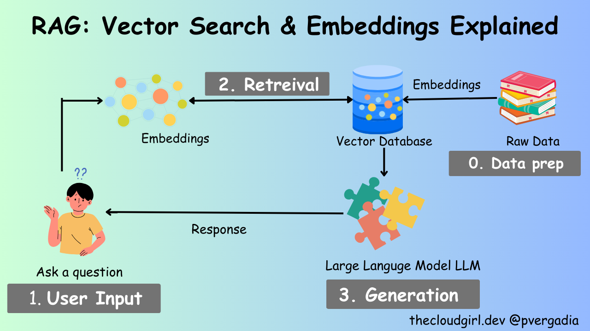

# Building a RAG Chatbot with Jac Cloud and Streamlit (Part 2/3)

Now that we have a jac application served up, let's build a simple chatbot using Retrieval Augmented Generation (RAG) with Jac Cloud and Streamlit as our frontend interface.

### Preparation / Installation

There are a couple of additional dependenices we need here

```bash
pip install mtllm==0.3.2 jac-streamlit==0.0.3 langchain==0.1.16 langchain_community==0.0.34 chromadb==0.5.0 pypdf==4.2.0
```

## Building a Streamlit Interface

Before we begin building out our chatbot, let's first build a simple GUI to interact with the chatbot. Streamlit offers several Chat elements, enabling you to build Graphical User Interfaces (GUIs) for conversational agents or chatbots. Leveraging session state along with these elements allows you to construct anything from a basic chatbot to a more advanced, ChatGPT-like experience using purely Python code.

Luckily for us, jaclang has a plugin for streamlit that allows us to build web applications with streamlit using jaclang. In this part of the tutorial, we will build a frontend for our conversational agent using streamlit. You can find more information about the `jac-streamlit` plugin [here](https://github.com/Jaseci-Labs/jaclang/blob/main/support/plugins/streamlit/README.md).

First, let's create a new file called `client.jac`. This file will contain the code for the frontend chat interface.

We start by importing the necessary modules in Jac:

- `streamlit` (for frontend UI components)
- `requests` (for making API calls)

```jac
import streamlit as st;
import requests;
```

- `streamlit` will handle the user interface (UI) of the chatbot.
- `requests` will handle API calls to our backend.

Now let's define a function bootstrap_frontend, which accepts a token for authentication and builds the chat interface.

```jac
can bootstrap_frontend (token: str) {
    st.write("Welcome to your Demo Agent!");

    # Initialize chat history
    if "messages" not in st.session_state {
        st.session_state.messages = [];
    }
}
```

- `st.write()` adds a welcome message to the app.
- `st.session_state` is used to persist data across user interactions. Here, we're using it to store the chat history (`messages`).

Now, let's update the function such that when the page reloads or updates, the previous chat messages are reloaded from `st.session_state.messages`. Add the following to `bootstrap_frontend`

```jac
    for message in st.session_state.messages {
        with st.chat_message(message["role"]) {
            st.markdown(message["content"]);
        }
    }
```

- This block loops through the stored messages in the session state.
- For each message, we use `st.chat_message()` to display the message by its role (either `"user"` or `"assistant"`).

Next, let's capture user input using `st.chat_input()`. This is where users can type their message to the chatbot.

```jac
    if prompt := st.chat_input("What is up?") {
        # Add user message to chat history
        st.session_state.messages.append({"role": "user", "content": prompt});

        # Display user message in chat message container
        with st.chat_message("user") {
            st.markdown(prompt);
        }
    }
```

- `st.chat_input()` waits for the user to type a message and submit it.
- Once the user submits a message, it's appended to the session state's message history and immediately displayed on the screen.

Now we handle the interaction with the backend server. After the user submits a message, the assistant responds. This involves sending the user's message to the backend, receiving a response from the backend and displaying it.

Add the following to `bootstrap_frontend`.

```jac
    if prompt := st.chat_input("What is up?") {
        # Add user message to chat history
        st.session_state.messages.append({"role": "user", "content": prompt});

        # Display user message in chat message container
        with st.chat_message("user") {
            st.markdown(prompt);
        }

        # Display assistant response in chat message container
        with st.chat_message("assistant") {

            # Call walker API
            response = requests.post("http://localhost:8000/walker/interact", json={"message": prompt, "session_id": "123"},
                headers={"Authorization": f"Bearer {token}"}
            );

            if response.status_code == 200 {
                response = response.json();
                print(response);
                st.write(response["reports"][0]["response"]);

                # Add assistant response to chat history
                st.session_state.messages.append({"role": "assistant", "content": response["reports"][0]["response"]});
            }
        }
    }
```

- The user's input (`prompt`) is sent to the backend using a POST request to the `/walker/interact` endpoint.
- The `interact` walker, as we created in the last chapter, just returns `Hello World!` for now. This will change as we build out our chatbot.
  - `message` and `session_id` are not yet utilized at this point. They will come into play later in this chapter.
- The response from the backend is then displayed using `st.write()`, and the assistant's message is stored in the session state.

Lastly, we'll define the entry point of `client.jac`. Think `main` function of a python program. We authenticates the user and retrieves the token needed for the `bootstrap_frontend` function.

```jac
with entry {

    INSTANCE_URL = "http://localhost:8000";
    TEST_USER_EMAIL = "test@mail.com";
    TEST_USER_PASSWORD = "password";

    response = requests.post(
        f"{INSTANCE_URL}/user/login",
        json={"email": TEST_USER_EMAIL, "password": TEST_USER_PASSWORD}
    );

    if response.status_code != 200 {
        # Try registering the user if login fails
        response = requests.post(
            f"{INSTANCE_URL}/user/register",
            json={
                "email": TEST_USER_EMAIL,
                "password": TEST_USER_PASSWORD
            }
        );
        assert response.status_code == 201;

        response = requests.post(
            f"{INSTANCE_URL}/user/login",
            json={"email": TEST_USER_EMAIL, "password": TEST_USER_PASSWORD}
        );
        assert response.status_code == 200;
    }

    token = response.json()["token"];

    print("Token:", token);

    bootstrap_frontend(token);
}
```

In the entry block:

- First, we define the backend URL and test user credentials.
- We attempt to log the user in. If login fails, we register the user and then log them in.
- Once logged in, the token is extracted and printed.
- Finally, `bootstrap_frontend(token)` is called with the obtained token.

Now you can run the frontend using the following command:

```bash
jac streamlit client.jac
```

If your server is still running, you can chat with your assistant using the streamlit interface. The response will only be "Hello, world!" for now, but we will update it to be a fully working chatbot next.

Now let's move on to building the RAG module.

## What is Retrieval Augmented Generation?

Retrieval Augmented Generation is a technique that combines the benefits of retrieval-based and generative conversational AI models. In a retrieval-based model, the model retrieves semantically similar content based on the input. In a generative model, the model generates a response from scratch based on the input. Retrieval Augmented Generation combines these two concepts by first retrieving a set of candidate responses / relevant content and then generating a response based on the retrieved candidates.


## Building a Retrieval Augmented Generation Module

In this part we'll be building a simple Retrieval Augmented Generation module using jaclang and adding it to our application. We will use a simple embedding-based retrieval model to retrieve candidate responses and a generative model to generate the final response. Embeddings are vector representations of words or sentences that capture semantic information. We will use the Ollama embeddings model to generate embeddings for the documents and the Chroma vector store to store the embeddings.



### Adding the Retrieval Module

First, let's add a file called `rag.jac` to our project. This file will contain the code for the Retrieval Augmented Generation module.

Jac allows you to import Python libraries, making it easy to integrate existing libraries such as langchain, langchain_community, and more. In this RAG engine, we need document loaders, text splitters, embedding functions, and vector stores.

```jac
import os;
import from langchain_community.document_loaders {PyPDFDirectoryLoader}
import from langchain_text_splitters {RecursiveCharacterTextSplitter}
import from langchain.schema.document {Document}
import from langchain_community.embeddings.ollama {OllamaEmbeddings}
import from langchain_community.vectorstores.chroma {Chroma}
```

- `PyPDFDirectoryLoader` is used to load documents from a directory.
- `RecursiveCharacterTextSplitter` is used to split the documents into chunks.
- `OllamaEmbeddings` is used to generate embeddings from document chunks.
- `Chroma` is our vector store for storing the embeddings.

Now let's define the `rag_engine` object that will handle the retrieval and generation of responses. The object will have two properties: `file_path` for the location of documents and `chroma_path` for the location of the vector store.

```jac
obj RagEngine {
    has file_path: str = "docs";
    has chroma_path: str = "chroma";
}
```

Note: `obj` works similarly as dataclasses in Python.

We will now build out this `RagEngine` object by adding relevant abilities. Abilities, as annotated by the `can` keyword, are analogus to member methods of a Python class. The `can` abilities in the following code snippets shoudld be added inside the `RagEngine` object scope.

The object will have a `postinit` method that runs automatically upon initialization, loading documents, splitting them into chunks, and adding them to the vector database (Chroma). `postinit` works similarly to the `__post_init__` in Python dataclasses.

```jac
    can postinit {
        documents: list = self.load_documents();
        chunks: list = self.split_documents(documents);
        self.add_to_chroma(chunks);
    }
```

- The `load_documents` method loads the documents from the specified directory.
- The `split_documents` method splits the documents into chunks.
- The `add_to_chroma` method adds the chunks to the Chroma vector store.

Let's define the `load_documents` method and the `split_documents` method.

```jac
    can load_documents {
        document_loader = PyPDFDirectoryLoader(self.file_path);
        return document_loader.load();
    }

    can split_documents(documents: list[Document]) {
        text_splitter = RecursiveCharacterTextSplitter(chunk_size=800,
        chunk_overlap=80,
        length_function=len,
        is_separator_regex=False);
        return text_splitter.split_documents(documents);
    }
```

- The `load_documents` method loads the documents from the specified directory using the `PyPDFDirectoryLoader` class.
- The `split_documents` method splits the documents into chunks using the `RecursiveCharacterTextSplitter` class. This ensures that documents are broken down into manageable chunks for better embedding and retrieval performance.

Next, let's define the `get_embedding_function` method. The `get_embedding_function` ability uses the `OllamaEmbeddings `model to create embeddings for the document chunks. These embeddings are crucial for semantic search in the vector database.

```jac
    can get_embedding_function {
        embeddings = OllamaEmbeddings(model='nomic-embed-text');
        return embeddings;
    }
```

Now, each chunk of text needs a unique identifier to ensure that it can be referenced in the vector store. The `add_chunk_id` ability assigns IDs to each chunk, using the format `Page Source:Page Number:Chunk Index`.

```jac
    can add_chunk_id(chunks: str) {
        last_page_id = None;
        current_chunk_index = 0;

        for chunk in chunks {
            source = chunk.metadata.get('source');
            page = chunk.metadata.get('page');
            current_page_id = f'{source}:{page}';

            if current_page_id == last_page_id {
                current_chunk_index +=1;
            } else {
                current_chunk_index = 0;
            }

            chunk_id = f'{current_page_id}:{current_chunk_index}';
            last_page_id = current_page_id;

            chunk.metadata['id'] = chunk_id;
        }

        return chunks;
    }
```

Once the documents are split and chunk IDs are assigned, we add them to the Chroma vector database. The `add_to_chroma` ability checks for existing documents in the database and only adds new chunks to avoid duplication.

```jac
    can add_to_chroma(chunks: list[Document]) {
        db = Chroma(persist_directory=self.chroma_path, embedding_function=self.get_embedding_function());
        chunks_with_ids = self.add_chunk_id(chunks);

        existing_items = db.get(include=[]);
        existing_ids = set(existing_items['ids']);

        new_chunks = [];
        for chunk in chunks_with_ids {
            if chunk.metadata['id'] not in existing_ids {
                new_chunks.append(chunk);
            }
        }

        if len(new_chunks) {
            print('adding new documents');
            new_chunk_ids = [chunk.metadata['id'] for chunk in new_chunks];
            db.add_documents(new_chunks, ids=new_chunk_ids);
        } else {
            print('no new documents to add');
        }
    }
```

Next, the `get_from_chroma` ability takes a query and returns the most relevant chunks based on similarity search. This is the core of retrieval-augmented generation, as the engine fetches chunks that are semantically similar to the query.

```jac
    can get_from_chroma(query: str,chunck_nos: int=5) {
        db = Chroma(
            persist_directory=self.chroma_path,
            embedding_function=self.get_embedding_function()
        );
        results = db.similarity_search_with_score(query,k=chunck_nos);
        return results;
    }
```

To summarize, we define an object called `RagEngine` with two properties: `file_path` and `chroma_path`. The `file_path` property specifies the path to the directory containing the documents we want to retrieve responses from. The `chroma_path` property specifies the path to the directory containing the pre-trained embeddings. We will use these embeddings to retrieve candidate responses.

We define a few methods to load the documents, split them into chunks, and add them to the Chroma vector store. We also define a method to retrieve candidate responses based on a query. Let's break down the code:

- The `load_documents` method loads the documents from the specified directory using the `PyPDFDirectoryLoader` class.
- The `split_documents` method splits the documents into chunks using the `RecursiveCharacterTextSplitter` class from the `langchain_text_splitters` module.
- The `get_embedding_function` method initializes the Ollama embeddings model.
- The `add_chunk_id` method generates unique IDs for the chunks based on the source and page number.
- The `add_to_chroma` method adds the chunks to the Chroma vector store.
- The `get_from_chroma` method retrieves candidate responses based on a query from the Chroma vector store.

### Setting up Ollama Embeddings

Before we can use the Ollama embeddings model, we need to set it up. You can download the Ollama from the [Ollama website](https://ollama.com/). Once you have downloaded Ollama, you download your desired model by runnnig the following command:

```bash
ollama pull nomic-embed-text
```

This will download the `nomic-embed-text` model to your local machine.

Next, you can make this model available for inference by running the following command:

```bash
ollama serve
```

### Adding your documents

You can add your documents to the `docs` directory. The documents should be in PDF format. You can add as many documents as you want to the directory. We've included a sample document [here](docs/clinical_medicine.pdf) for you to test with. Create a new directory called `docs` in the root of your project and add your documents to this directory.

### Setting up your LLM

Here we are going to use one of the key features of jaclang called [MTLLM](https://jaseci-labs.github.io/mtllm/), or Meaning-typed LLM. MTTLM facilitates the integration of generative AI models, specifically Large Language Models (LLMs) into programming at the language level.

We will create a new server code so delete the existing code in `server.jac` that we created in the last chapter and start from scratch and add the following.

```jac
import from mtllm.llms {OpenAI}

glob llm = OpenAI(model_name='gpt-4o');
```

Here we use the OpenAI model gpt-4o as our Large Language Model (LLM). To use OpenAI you will need an API key. You can get an API key by signing up on the OpenAI website [here](https://platform.openai.com/). Once you have your API key, you can set it as an environment variable:

```bash
export OPENAI_API_KEY=""
```

Using OpenAI is not required. You can replace this with any other LLM you want to use. For example, you can also you any Ollama generative model as your LLM. When using Ollama make sure you have the model downloaded and serving on your local machine by running the following command:

```bash
ollama pull llama3.1
```

This will download the `llama3.1` model to your local machine and make it available for inference when you run the `ollama serve` command. If you want use Ollama replace your import statement with the following:

```jac
import from mtllm.llms {Ollama}

glob llm = Ollama(model_name='llama3.1');
```

Now that you have your LLM ready let's create a simple walker that uses the RAG module and MTLLM to generate responses to user queries. First, let's declare the global variables for MTLLM and the RAG engine.

```jac
import from rag {RagEngine}
glob rag_engine:RagEngine = RagEngine();
```

- `llm`: This an MTLLM instance of the model utilized by jaclang whenever we make `by llm()` abilities. Here we are using OpenAI's GPT-4 model.
- `rag_engine`: This is an instance of the `RagEngine` object for document retrieval and processing.

Next, let's define a node called `Session` that stores the chat history and status of the session. The session node also has an ability called `llm_chat` that uses the MTLLM model to generate responses based on the chat history, agent role, and context. If you've ever worked with graphs before, you should be familiar with nodes and edges. Nodes are entities that store data, while edges are connections between nodes that represent relationships. In this case, `Session` is node in our graph that stores the chat history and status of the session.

```jac
node Session {
    has id: str;
    has chat_history: list[dict];
    has status: int = 1;

    can 'Respond to message using chat_history as context and agent_role as the goal of the agent'
    llm_chat(
        message:'current message':str,
        chat_history: 'chat history':list[dict],
        agent_role:'role of the agent responding':str,
        context:'retrieved context from documents':list
    ) -> 'response':str by llm();
}
```

**Attributes:**

- `id`: A unique session identifier.
- `chat_history`: Stores the conversation history.
- `status`: Tracks the state of the session.
- `llm_chat` ability: Takes the current message, chat history, agent role, and retrieved document context as inputs. This ability uses the LLM to generate a response based on these inputs. All without the need for any prompt engineering!! Wow!

Next we'll define the `interact` walker that initializes a session and generates responses to user queries. Let's briefly discuss what a walker is and does. In a nutshell, a walker is a mechanism for traversing the graph. It moves from node to node, executing abilities and interacting with the data stored in the nodes. In this case, the `interact` walker is responsible for handling user interactions and generating responses. This is one of the key componets of jaclang that makes it so powerful! Super cool right? 🤯

```jac
walker interact {
    has message: str;
    has session_id: str;

    can init_session with `root entry {
         visit [-->](`?Session)(?id == self.session_id) else {
            session_node = here ++> Session(id=self.session_id, chat_history=[], status=1);
            print("Session Node Created");

            visit session_node;
        }
    }
}
```

**Attributes:**

- `message`: The user's message.
- `session_id`: The unique session identifier.
- `init_session` ability: Initializes a session based on the session ID. If the session does not exist, it creates a new session node. Note that this ability is triggered on `root entry`. In every graph, there is a special node called `root` that serves as the starting point for the graph. A walker can be spawned on and traverse to any node in the graph. It does **NOT** have to start at the root node, but it can be spawned on the root node to start the traversal.

Now, let's define the `chat` ability which once the session is initialized, will handle interactions with the user and the document retrieval system.

Add the following ability inside the scope of `interact` walker.

```jac
    can chat with Session entry {
        here.chat_history.append({"role": "user", "content": self.message});
        data = rag_engine.get_from_chroma(query=self.message);
        response = here.llm_chat(
            message=self.message,
            chat_history=here.chat_history,
            agent_role="You are a conversation agent designed to help users with their queries based on the documents provided",
            context=data
        );

        here.chat_history.append({"role": "assistant", "content": response});

        report {"response": response};
    }
```

**Logic flow:**

- The user's message is added to the chat history.
- The RAG engine retrieves candidate responses based on the user's message.
- The MTLLM model generates a response based on the user's message, chat history, agent role, and retrieved context.
- The assistant's response is added to the chat history.
- The response is reported back to the frontend. Here we are the using the special `report` keyword. This is one of the key feature of jac-cloud and operates a bit like a return statement but it does not stop the execution of the walker. It simply add whatever is reported to the response object that is sent back to the frontend. Isn't that cool? 🤩

To summarize:

- We define a `Session` node that stores the chat history and status of the session. The session node also has an ability called `llm_chat` that uses the MTLLM model to generate responses based on the chat history, agent role, and context.
- We define a `interact` walker that initializes a session and generates responses to user queries. The walker uses the `rag_engine` object to retrieve candidate responses and the `llm_chat` ability to generate the final response.

You can now serve this code using Jac Cloud by running the following command:

```bash
DATABASE_HOST=mongodb://localhost:27017/?replicaSet=my-rs jac serve server.jac
```

Now you can test out your chatbot using the client we created earlier. The chatbot will retrieve candidate responses from the documents and generate the final response using the MTLLM model. Ask any question related to the documents you added to the `docs` directory and see how the chatbot responds.

You can also try testing out the updated endpoint using the swagger UI at `http://localhost:8000/docs` or using the following curl command:

```bash
curl -X POST http://localhost:8000/walkers/interact -d '{"message": "I am having major back pain, what can i do", "session_id": "123"} -H "Authorization: Bearer <TOKEN>"
```

Remember to replace `<TOKEN>` with the access token you saved. Note you might need to re-login to get an updated token if the token has expired or the server has been restarted since.

In the next part of the tutorial, we will enhance the chatbot by adding dialogue routing capabilities. We will direct the conversation to the appropriate dialogue model based on the user's input.
