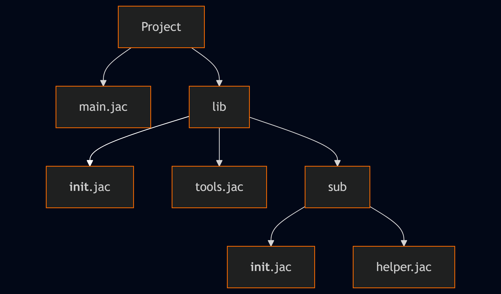
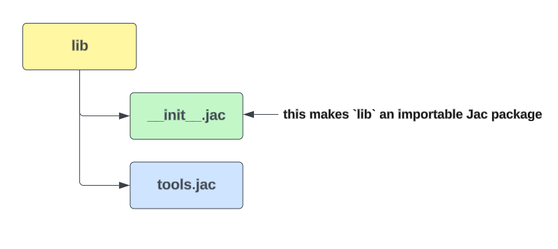

# Jaclang Package & Import System

Jaclang features a modular package system that helps organize code across multiple files and folders, enhancing reusability, clean design, and scalability. Similar to Python, Jac packages are directories containing an `__init__.jac` file that defines what is exposed when the package is imported. This structure allows developers to group related code logically and control the public interface of the package, making it easier to manage larger projects efficiently.

## Folder structure



## File Description

1.Main.jac file

- This is the **entry point** to the project.

```Jac linenums="1"
import from library { tool_func }
import from library.sub { help_func }

with entry {
    print('Main Execution:\n') ;
    print('Calling from tools.jac...') ;
    print('Tool says:', tool_func()) ;
    print('\nCalling from helper.jac...') ;
    print('Helper says:', help_func()) ;
}
```

2.library/__init_.jac

This file initializes the `library` package, exposing the `tool_func` function and sub-package `sub`.

```Jac linenums="1"
import from .tools { tool_func }
```

3.library/tools.jac

A utility function implementation.

```Jac linenums="1"
def tool_func() {
    return 'Tool function executed';
}
```

4.library/sub/__init_.jac

Used to expose functionality from the sub-package. Defines or re-exports `help_func`.

```Jac linenums="1"
import from .helper { help_func }
```

5.library/sub/helper.jac

Alternatively, we can define `help_func` here and import it into the `__init__.jac`

```Jac linenums="1"
def help_func() {
    return 'Helper function called';
}
```

## How Cross-Module Access works in Jaclang

Jaclang allows importing functions, variables, or objects from other modules using `absolute` or `relative` import paths.

1.Absolute Imports

```Jac linenums="1"
import from library.tools { tool_func }
import from library.sub.helper { help_func }
```

Absolute imports specify the complete path to a module starting from the root of the project. They are useful for clearly indicating where a module is located within the overall folder structure and remain consistent regardless of the location of the importing file.

2.Relative Imports

```Jac linenums="1"
import from .tools { tool_func }
import from ..library { sub }
```

Relative imports use dots `(. or ..)` to indicate location relative to the current file.

- **Single dot (.)** - Current directory/module (`import from .tools {tool_func}`)
- **Double dot (..)** - parent directory (`import from ..library {sub}`)
- **Package.mod** - Absolute import path from the root of the project (`import from library.sub { help_func }`)

## How __init__.jac works in Jaclang

In Jaclang, the `__init__.jac` file plays a crucial role by defining the public interface of a package. It determines which parts of the package are exposed and accessible when the package is imported, helping manage and organize code effectively within modular structures.

1.Marks a Directory as a Jac Package

The `__init__.jac` file marks a directory as a Jac package and defines what is exposed when importing it. When Jaclang finds a folder with an `__init__.jac` file, it treats that folder as a package, allowing it to be used for imports rather than just a regular directory. Without this file, Jac won’t recognize the folder as a package properly, which can cause import issues and limit modular code organization.



2.Allows Selective Exports of functionality

The `__init__.jac` file can **import specific functions, classes, or modules** from within the package and make them available for use when the package is imported.

```Jac linenums="1"
import from .tools { tool_func } # expose tool_func
import from .sub.helper { help_func }
```

In this abstraction helps to:

- Hide internal logic
- Make refactoring easier.

3.Enables Grouping and Organizing of Modules

We can structure projects into meaningful subdirectories and use `__init__.jac` files at different levels to expose only what you need.

```Jac linenums="1"
import from .tools { tool_func }
import from .sub.helper { help_func }  # Explicitly import from submodule helper.jac
```

- `library/__init__.jac` can import from `tools.jac` and `sub/__init__.jac`
- `sub/__init__.jac` can import from `helper.jac`