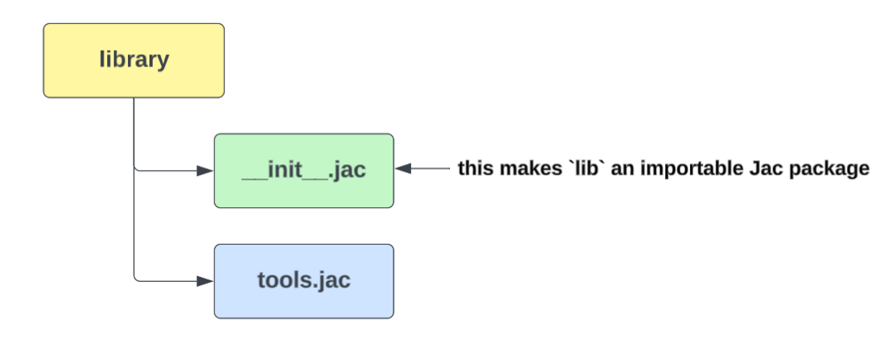

# Jaclang Package & Import System

Jaclang supports a modular package system, allowing you to organize Jac code across multiple files and folders. This promotes reusability, clean design, and scalability.Jac packages are directories containing an `__init__.jac` file to define what’s exposed during import.

## Folder structure


## File Description

1.Main.jac file

- This is the **entry point** to the project.

```Jac linenums="1"
import from library.tools { tool_func }
import from library.sub.helper { help_func }

with entry {
    print('Main Execution:\n') ;
    print('Calling from tools.jac...') ;
    print('Tool says:', tool_func()) ;
    print('\nCalling from helper.jac...') ;
    print('Helper says:', help_func()) ;
}
```

2.library/__init_.jac

This file initializes the `library` package, exposing the `tool_func` function and sub-package `sub`.

```Jac linenums="1"
import from .tools { tool_func }
```

3.library/tools.jac

A utility function implementation.

```Jac linenums="1"
def tool_func() {
    return 'Tool function executed';
}
```

4.library/sub/__init_.jac

Used to expose functionality from the sub-package. Defines or re-exports `help_func`.

```Jac linenums="1"
import from .helper { help_func }
```

5.library/sub/helper.jac

Alternatively, we can define `help_func` here and import it into the `__init__.jac`

```Jac linenums="1"
def help_func() {
    return 'Helper function called';
}
```

## How Cross-Module Access works in Jaclang

Jaclang allows importing functions, variables, or objects from other modules using `absolute` or `relative` import paths.

1.Absolute Imports

```Jac linenums="1"
import from library.tools { tool_func }
import from library.sub.helper { help_func }
```

Absolute imports specify the complete path to a module starting from the root of the project. They are useful for clearly indicating where a module is located within the overall folder structure and remain consistent regardless of the location of the importing file.

- **Package.mod** - Absolute import path from the root of the project (`import from library.sub { help_func }`)

2.Relative Imports

```Jac linenums="1"
import from .tools { tool_func }
import from ..library { sub }
```

Relative imports use dots `(. or ..)` to indicate location relative to the current file.

- **Single dot (.)** - Current directory/module (`import from .tools {tool_func}`)
- **Double dot (..)** - parent directory (`import from ..library {sub}`)

## How __init__.jac works in Jaclang

In Jaclang, this is also important. The significance of it is explained below.

1.Marks a Directory as a Jac Package

When Jaclang finds a folder with a file named `__init__.jac`, it considers that folder as a package. This tells the Jac interpreter that the folder can be used for imports, not just as a normal directory.



Without this `__init__.jac ` file , jaclang will not allow direct imports from the  folder.

2.Allows Selective Exports of functionality

The `__init__.jac` file can **import specific functions, classes, or modules** from within the package and make them available for use when the package is imported.

```Jac linenums="1"
import from .tools { tool_func } # expose tool_func
import from .sub.helper { help_func }
```

In this abstraction helps to:

- Hide internal logic
- Make refactoring easier.

3.Enables Grouping and Organizing of Modules

We can structure projects into meaningful subdirectories and use `__init__.jac` files at different levels to expose only what you need.

```Jac linenums="1"
import from .tools { tool_func }
import from .sub.helper { help_func }  # Explicitly import from submodule helper.jac
```

- `library/__init__.jac` can import from `tools.jac` and `sub/__init__.jac`
- `sub/__init__.jac` can import from `helper.jac`