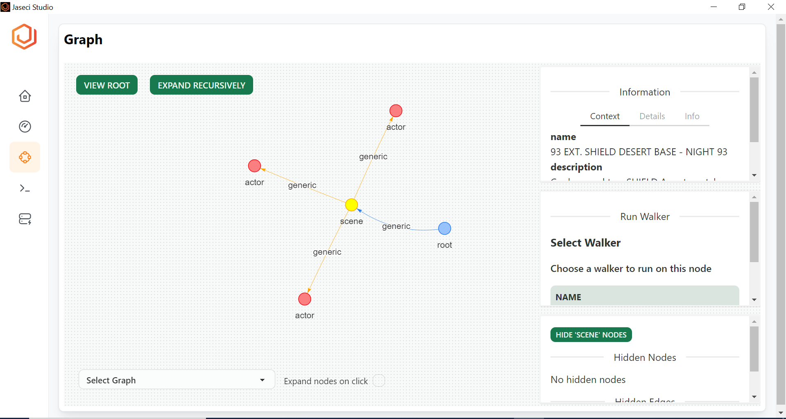
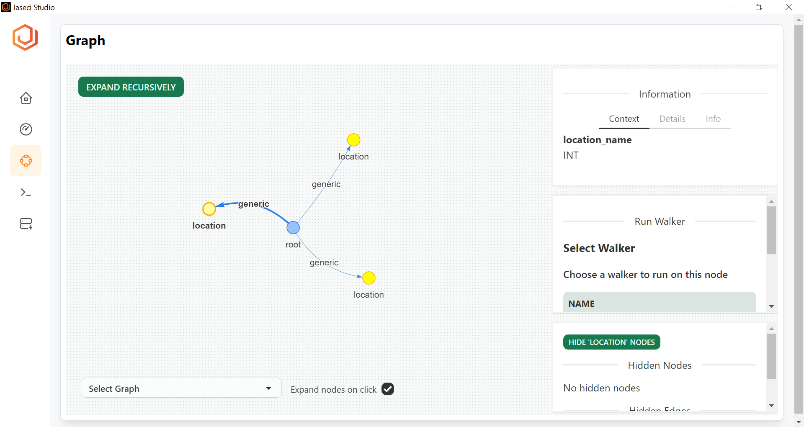
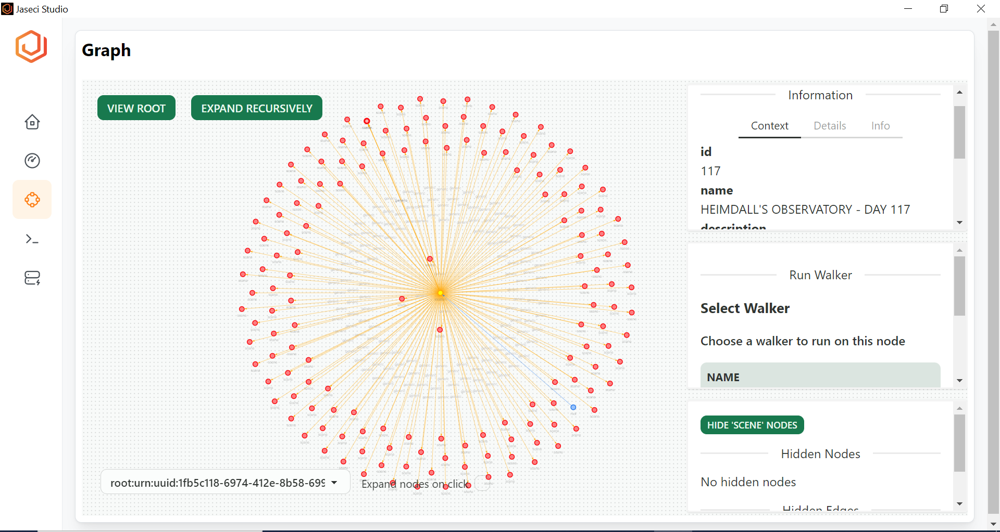

# Map the movie data in to a Graph.

The one and only data structure used Jaseci is Graph. So first let's map the movie script in to a graph. Movie script is saved in a `json` file, and the basic structure of the movie script is as follows;

## 1. Exploring the data

```json

{"scene_1 name" : ["scene_1 description", {"actor_1 name": "[actor_1 dialodues]", "actor_2 name": "[actor_2 dilogue]"}],

"scene_2 name": "scene_2 description",
}
```

Sample from the movie script;

```json
{
    "1 EXT. PUENTE ANTIGUO, NEW MEXICO - NIGHT 1": "A main street extends before us in this one-horse town, set amid endless flat, arid scrubland. A large SUV slowly moves down the street and heads out of town.",
    "2 EXT. SUV - NIGHT 2": [
        "The SUV sits parked in the desert. Suddenly, the roof panels of the SUV FOLD OPEN. The underside of the panels house a variety of hand-built ASTRONOMICAL DEVICES, which now point at the sky. JANE FOSTER (late 20's) pops her head through the roof. She positions a MAGNETOMETER, so its monitor calibrates with the constellations above. It appears to be cobbled together from spare parts of other devices.",
        {
            "JANE": [
                "Hurry! We hear a loud BANG followed by muffled CURSING from below. Jane offers a hand down to ERIK SELVIG (60) who emerges as well, rubbing his head. JANE (CONT'D) Oh-- watch your head.",
                "It's a little different each time. Once it looked like, I don't know, melted stars, pooling in a corner of the sky. But last week it was a rolling rainbow ribbon--",
            ],
            "SELVIG": [
                "Thanks. So what's this anomaly of yours supposed to look like?",
                "(GENTLY TEASING) Racing round Orion? I've always said you should have been a poet. Jane reigns in her excitement. She tries for dignity. 4th BLUE REVISIONS 03-26-10 1A.",
                "(re: the gloves) I recognize those. Think how proud he'd be to see you now. Jane's grin fades to a sad smile.",
                "For what?"
            ]
        }
    ],
    "3 INT. SUV - NIGHT 3": [
        "The SUV is bathed in the glow of high-tech monitoring equipment and laptops, some looking like they're held together with duct tape. Jane opens a well-worn NOTEBOOK of handwritten notes and calculations. Selvig watches the frustrated Jane with sympathy.",
        {
            "JANE": [
                "The anomalies are always precipitated by geomagnetic storms. She shows him a complicated CHART she's drawn in the book, tracking occurrences and patterns. I just don't understand. Something catches Darcy's eye out the driver's side mirror. She adjusts it. In the distance",
            ],
            "DARCY": [
                "Jane? Jane SHUSHES her, leafs through her notes. The bottle of champagne begins to vibrate.",
                "The champagne bottle starts to RATTLE noisily now as it shakes more violently, pressure building up inside it, when the cork EXPLODES out of it. Champagne goes spewing everywhere -- over equipment, over Jane. DARCY (CONT'D) Jane?",
            ],
            "SELVIG": [
                "That's your subtle aurora?!"
            ]
        }
    ],
    "4 EXT. DESERT - MOMENTS LATER 4": "The roof panels still open, the SUV races towards the strange event, Jane, amazed by the sight, stands with half her body out the roof, taking video of the light storm before them. The SUV hits a bump. Jane nearly flies out. Selvig grabs her, yanks her back in.",
    "5 INT. SUV 5": [
        "Jane grins, thrilled, pumped with adrenaline.",
        {
            "JANE": [
                "Isn't this great?! A thought strikes her. JANE (CONT'D) You're seeing it too, right? I'm not crazy?"
            ],
            "SELVIG": [
                "That's debateable. Put your seat belt on! 4th BLUE REVISIONS 03-26-10 3A. The SUV lurches."
            ]
        }
    ]
}
```

## 2. Creating nodes
So, lets dive into the code;

first we will need to have two types of nodes in this graph, `scenes` and `actors` in addition to `root` node.  lets define those nodes in jac.

```jac
node root;

node scene{
    has name;
    has description;
}

node actor{
    has name;
    has dialogue;
}
```

As you can see in the above code the `scene` type nodes has two variable called `name` and `description`. we can declare variables in `jac` with the `has` key word. Similarly the `actor` type nodes has two variables called `name` and `dialogue`. now let's build the graph by connecting these nodes by edges and assigning variables to them.

## 3. Building the initial graph
To build the graph we are creating the build_graph walker. To get more clear picture about Jaseci walkers and for some example programs using walkers concept go to [here](../../docs/development/abstractions/walkers).

```jac
walker build_graph{

    can file.load_json;

    #loading the movie data to the movie variable.
    has movie = file.load_json("movie_data.json");

    #looping through movie dictionery.
    for movie_scene in movie {
        scene_name = movie_scene;
        content = movie[movie_scene];

        if content.type == str:
            description = content;
            scene = spawn here ++> node::scene(name=scene_name, description=description);

        if content.type == list:
            if content[0].type == str:
                description = content[0];
            scene = spawn here ++> node::scene(name=scene_name, description=description);

            if content[1].type == dict:
                for actor in content[1]{
                    name = actor;
                    dialogue = content[1][actor];
                        spawn scene ++>node::actor(name=name, dialogue=dialogue);
                    }
        }
}
```

In the above block;

- `file.load_json` action is using to load the `json` file from the local directory. here the name of the `json` file is `movie_data.json`.
- In the line starts with `has movie`, asigns the movie data to the `movie` variable.
- Here, the `movie_data` is a dictionary object that includes details on the movie scenes in each entry.
- I won't go into great detail on "for" and "if" syntax in Jaseci because it just like other programming languages do.
- `scene = spawn here ++> node::scene(name=scene_name, description=description);` line is to spawn the scene node from the root node. In this code the `here` key word refers to the node we are currently in, in this case we are currently in the root node. And while spawning the scene nodes we are setting variables `name` and `description`.
- `spawn scene ++>node::actor(name=name, dialogue=dialogue);` line is o spawn the actor nodes from scene code. Similar to above this node also asigning values to variables `name` and `dialogue`.

Now lets setup init walker to wrap these lines of code together.

```jac
walker init{
    root{
         spawn here walker::build_graph;
    }
}
```

Save all these code in a file and name it to `movie.jac`. To run this code in jsctl run

```
jac run movie.jac
```

If everything is fine then you will see the output as follows;

```
jaseci > jac run movie.jac
{
  "success": true,
  "report": [],
  "final_node": "urn:uuid:1c75b708-06ed-45a8-a2ee-88a94a3c33da",
  "yielded": false
}
```

To view the graph structure in terminal you can run

```
jac dot movie.jac
```
Since the graph is more complecated and huge you won't be able to illustrate the final look of the graph in the terminal. So, We are going to open the graph in Jaseci Studio in next steps.

## 4. Bringing the graph into Jaseci Studio

First let's build the jac program we created with following command.

```
jac build movie.jac
```

If the aforementioned command was successful, you will notice a new file named `movie.jir` is generated in your current working directory.

Let's register our jac program with Sentinel with following command.

```
sentinel register movie.jir -set_active true -mode ir
```
You will see the following output if the registering is successfull.

```
jaseci > sentinel register movie.jir -set_active true -mode ir
[
  {
    "version": null,
    "name": "movie.jir",
    "kind": "generic",
    "jid": "urn:uuid:5b991fcd-037f-42d5-a81c-18ffdee29789",
    "j_timestamp": "2023-02-09T12:16:56.198160",
    "j_type": "sentinel",
    "code_sig": "c365a87b6c0fc87a6d37a7ef05d35cc2"
  },
  {
    "name": "root",
    "kind": "node",
    "jid": "urn:uuid:2cd39d7d-1749-4d91-aa37-319ec44fc4ca",
    "j_timestamp": "2023-02-09T12:16:56.198332",
    "j_type": "graph",
    "context": {}
  }
]
```


> **Note**
> Sentinel is the overseer of walkers, nodes and edges. It is the abstraction Jaseci uses to encapsulate compiled walkers and architype nodes and edges. The key operation with respesct to sentinel is "register" a sentinel. You can think of registering a sentinel as a compiling your jac program. The walkers of a given sentinel can then be invoked and run on arbitrary nodes of any graph.
>
> Three things are happening with above sentinel command:
>
> 1.  We registered the jir we compiled earlier to new sentinel. This means this new sentinel now has access to all of our walkers, nodes and edges. -mode ir option speciifes a jir program is registered instead of a jac program.
>
> 2. With -set_active true we set this new sentinel to be the active sentinel. In other words, this sentinel is the default one to be used when requests hit the Jac APIs, if no specific sentinels are specified.
>
> 3. Sentinel register has automatically creates a new graph (if no currently active graph) and run the init walker on that graph. This behavior can be customized with the options -auto_run and -auto_create_graph.

After registering the sentinel run one of the following two commands to get the sentinel ID.

```
sentinel get
```
or

```
sentinel list
```

The output will look something like this.

```
jaseci > sentinel get
{
  "version": null,
  "name": "summerization.jir",
  "kind": "generic",
  "jid": "urn:uuid:f710c843-f284-4782-9bfe-c50710d4907f",
  "j_timestamp": "2023-02-09T08:38:48.319842",
  "j_type": "sentinel",
  "code_sig": "42d0fb5666951a2784554fed01993853"
}
```

> **Note**
>
> `sentinel get` returns the information about the current active sentinel, while `sentinel list` returns all available sentinels for the user.
>

The `jid` field is the ID for the sentinel. (`jid` stands for jaseci ID). So, now you got the Jaseci ID, and sentinal got registered now you can update it's jac program with following command.

```
sentinel set -snt JID -mode ir movie.jir
```

If it success, you'll get a output that looks like this:

```
jaseci > sentinel set -snt urn:uuid:f710c843-f284-4782-9bfe-c50710d4907f -mode ir movie.jir
{
  "response": "sentinel:generic:summerization.jir:urn:uuid:f710c843-f284-4782-9bfe-c50710d4907f registered and active!",
  "success": true
}
```
From this point you'll have to setup Jaseci Server, and Jaseci Studio Up and running. If you not installed them yet. Go to [this section](/preparation) and install it before going to next steps.

Now you have to log in the Jaseci Server from `jsctl` terminal with the credentials you have created while you creating super user. run the following in `jsctl` terminal.

```
login http://localhost:8000/
```
It will ask you for your username and password. You will see the following after a successful login.

```
jaseci > login http://localhost:8000/
Username: admin@jaseci.org
Password: admin
Login successful!
```

> **Note**
>
> Notice the @ symbol in front of the @jaseci > command line prompt. This indicates that your jsctl session is now logged into a jsserv instance, while jaseci > indicates it is in a local session.
>

While logged into the jsserv instance, you can register a sentinel on it with sentinel register command, just like how you were running it before in the local jsctl session

```
sentinel register movie.jir -set_active true -mode ir
```

Now open the Jaseci Studio and logging with the credentials as instructed [here](/preparation)

Goto the graph tab in the left side bar and select the `uuid` from the Select Graph drop down. You will see a beautifull output like this.


Click on the yellow color nodes and see ho actors and scene are connected.

The image below shows one instance of a scene node.



## 5. Ading Advance Features to the Graph

In order to get a clearer idea of the movie script, let's now add more features to the graph which we already created.

- The scene node contains three tags: "EXT," "INT," and "EXT./INT." The EXT tag denotes external scenes, whilst the INT tag denotes interior scenes.
- Moreover, the scene names contain an ID (an integer number) at the start of the name.

Lets reflect these information in the graph.

- Add another `node` called location;

```
node location{
    has location_name;
}
```
- Add ID attribute to the scene `node`;

```
node scene{
    has id;
    has name;
    has description;
}
```
- Add an `edge` to connect actors to scene `node`.

```
edge acts;
```

- Update build_graph `walker`.

```
walker build_graph{
    can file.load_json;
    has movie = file.load_json("movie_data_sam.json");

    location_ext = spawn here ++> node::location(location_name="EXT");
    location_int = spawn here ++> node::location(location_name="INT");
    location_ext_int = spawn here ++> node::location(location_name="INT and EXT");

    for movie_scene in movie {
        _scene_name = movie_scene;
        content = movie[movie_scene];

        scene_tag = _scene_name.str::split(" ")[1];
        scene_id = _scene_name.str::split(" ")[0];
        scene_name = _scene_name.str::split("T.")[-1];

        if content.type == str:
            description = content;
            if scene_tag == "EXT.":
                scene = spawn location_ext ++> node::scene(id=scene_id, name=scene_name, description=description);
            elif scene_tag == "INT.":
                scene = spawn location_int ++> node::scene(id=scene_id, name=scene_name, description=description);
            else:
                scene = spawn location_ext_int ++> node::scene(id=scene_id, name=scene_name, description=description);

        if content.type == list:
            if content[0].type == str:
                description = content[0];
            if scene_tag == "EXT.":
                scene = spawn location_ext ++> node::scene(id=scene_id, name=scene_name, description=description);
            elif scene_tag == "INT.":
                scene = spawn location_int ++> node::scene(id=scene_id, name=scene_name, description=description);
            else:
                scene = spawn location_ext_int ++> node::scene(id=scene_id, name=scene_name, description=description);

            if content[1].type == dict:
                for _actor in content[1]{
                        name = _actor;
                        dialogue = content[1][_actor];

                        spawn scene +[acts]+>node::actor(name=name,dialogue=dialogue);
                    }
        }
  ```

1. Here we are first spawning the location nodes from the roots node.
2. `scene_id = _scene_name.str::split(" ")[0];` is to extract the scene ID from the scene name.
3. `scene_tag = _scene_name.str::split(" ")[1];` is to extract the scene tag from the scene name.
4. After these steps spawning scene nodes from the location node based on the scene tag.

Let's save these updated codes and refresh the graph in the Jaseci Studio.

Since we updated the code we have to build the code again using following code inside the`jsctl` terminal.

```
jac build movie.jac
```

Login in to the Jaseci server again and delete the existing graph created and recreate a empty graph using the following commands.

```
graph delete active:graph
graph create -set_active true
```

Run the sentinel register command;

```
sentinel register -set_active true -mode ir movie.jir
```
Login to the Jaseci Studio and view the refreshed graph. If everything is fine you should see a output similar to this;

This is how the initial view of the graph;



Example of location node;




