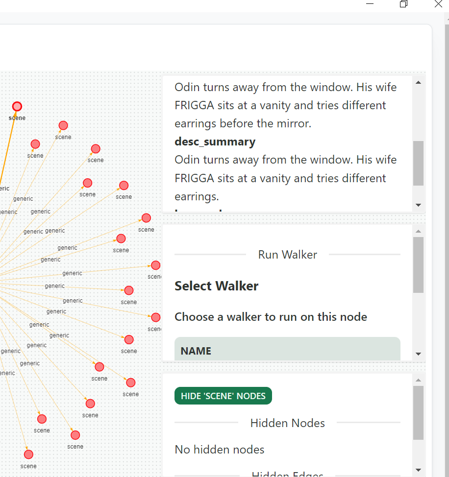
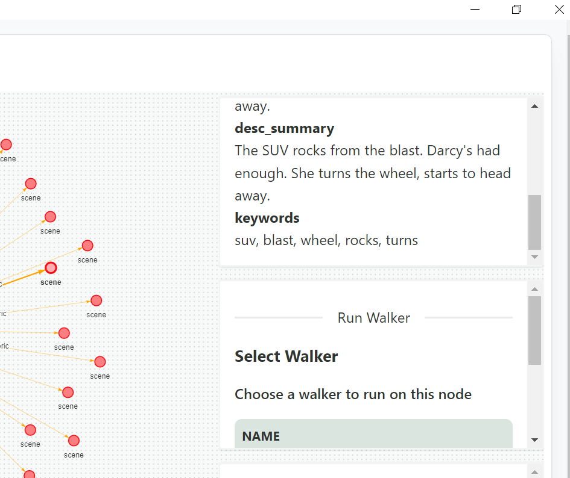

# Advance information extraction from Scene Descriptions

We created a graph from the movie script data in the previous part. You may have noticed that some movie scene descriptions are rather lengthy and take a while to read. How simple it would be if we could summarize that lengthy phaseges and extract keywords from each text phrases. Yes, that is what we will accomplish in this section.

## Retriving Summery of Text

For this section we are using jaseci NLP features. To get summaries Jaseci has several modules already implemented, but here for demonstration purpose we will be using the `jac_nlp.bart_sum` the **BART summarizer**. For all other available Jaseci summarization modules refer to [here](../../category/summerization-models)

### 1. Installing Jac NLP summarization module

Before get started you have to install `jac_nlp.bart_sum` using the following command.

```
pip install jac_nlp[bart_sum]
```

### 2. Updating the scene node to set summary of descriptions

In this section we are going to modify the code which we were used in previous section. You may notices in the previous section the scene node had only two variables `name` and `description`. Since here we are going to extract description summary we are creating another variable in scene node to store the scene description. see the modification we have done to the `scene node`.

```jac
node scene{
    has name;
    has description;
    has desc_summary;

    can set_summary with summarizer entry{
        here.desc_summary = visitor.summary;
    }
}
```

Also we have added Jaseci `ability` here. to know more about jaseci abilities go to [here](../../docs/development/abstractions/abilities)..


### 3. Creating the summarizer walker.

Now lets going to create the summarizer walker.

```jac
walker summarizer {
    can bart_sum.summarize;
    has text;
    has summary;

    summary = bart_sum.summarize(text, 20);
}
```

- `can bart_sum.summarize` this is the action we are using to summarize text features.
-  in `summery = bart_sum.summarize(text, 20)` line we are calling the jaseci `bart_sum.summerize` action. the `text` variable has declared by yet not assigned a value to. We are going to get that value from the `scene node`.


### 4. Wrapping things up with the init walker

Now lets connect all together with the `init` walker.

> **Note**
>
> Here if you are doing all these changes `movie.jac` file then you have to update the `init` walker. Otherwise you can save `summarizer` walker in a separate jac file. Then you have to import the updated `build_graph` walker from the `movie.jac`. Add `import * with './build graph.jac';` at the beginning of a new jac file to import it.
>
>


```jac
walker init{
    root{
         spawn here walker::build_graph;
         take-->;
    }

    location{
        take-->;
    }

    scene{
        spawn here walker::summarizer(text=here.description);
        take -->;
    }
}

```

- `spawn here walker::build_graph` spawning the graph from the root node.
- `take-->` traverse starts from the root node.
- `spawn here walker::summarizer(text=here.description);` This line is the most important part in this code. This creates the summary using the summarize walker. `here.description` is to get the description from the current `scene` node.
- `take -->node::scene;` this take keyword command walkers to traverse around the graph. here the speciality is this command says walkers to traverse only in `scene` nodes. For more details about traversing of walkers please refer to [here](../../docs/development/abstractions/walkers).


Save all these changes and load the `bart_sum` module before run the code in `jsctl` terminal.

### 5. Viewing the Graph in Jaseci Studio

Import the `bart_sum` action and run the `summerization.jac` file.

```
actions load module jac_nlp.bart_sum
jac run summarization.jac
```
If everything is fine you will see a output similar to this.

```
jaseci > jac run summarization.jac
{
  "success": true,
  "report": [],
  "final_node": "urn:uuid:1c75b708-06ed-45a8-a2ee-88a94a3c33da",
  "yielded": false
}
```

To be amazed by the graph view and the read the summaries you have to register the new jac program in the jaseci server.

Steps to lunch the new program in Jaseci Studio;

**Step 1:** Build the jac file
```
jac build summarization.jac
```

**Step 2:** Sentinel register the `jir`   file.
```
sentinel register summarization.jir -set_active true -mode ir
```

**Step 3:** Get the sentinel ID (`jid`)

```
sentinel get
```

or

```
sentinel list
```

**Step 3:** Sentinel Set

```
sentinel set -snt JID -mode ir summarization.jir
```

**Step 4:** Start and login to the server

**Step 5:** sentinel register in server
```
sentinel register summarization.jir -set_active true -mode ir
```

**Step 5:** Start the Jaseci Studio and view the graph



## Extracting Keywords from Text.

### 1. Installing Jac NLP Topic Modeling module

In this section we are going to generate for the scene description. Jaseci `jac_nlp.topic_ext` module has amazing feature to extract most relevant keywords for a given text phrase with zero training required.

Before get started you have to install `jac_nlp.topic_ext` using the following command.

```
pip install jac_nlp[topic_ext]
```

### 2. Updating the scene node to set keywords

Similar to the previous one, here we are updating the scene node to store and set keywords.


```jac
node scene{
    has id;
    has name;
    has description;
    has desc_summary;
    has keywords;

    can set_summary with summarizer entry{
        here.desc_summary = visitor.summery;
    }

    can set_keywords with keyword_generator entry{
        here.keywords = visitor.keywords;
    }

}
```

### 3. Creating the keyword generation walker.

Let's create a separate walker for keyword generation.

```jac
walker keyword_generator{
    can topic_ext.keyword_extraction;
    has text;

    has keywords = topic_ext.keyword_extraction(sentence=text, n_words = 5, min_tokens = 1, max_tokens=1);
}
```

### 4. Updating the init

Similar to the summarizer walker we are calling the `keyword_generator` walker inside the scene node.

```jac
walker init{
    root{
         spawn here walker::build_graph;
         take-->;
    }

    location{
        take-->;
    }

    scene{
        spawn here walker::summarizer(text=here.description);
        spawn here walker::keyword_generator(text=here.description);
        take -->;
    }
}
```

### 5. Viewing the Graph in Jaseci Studio

Now refresh the graph in Jaseci Studio.

