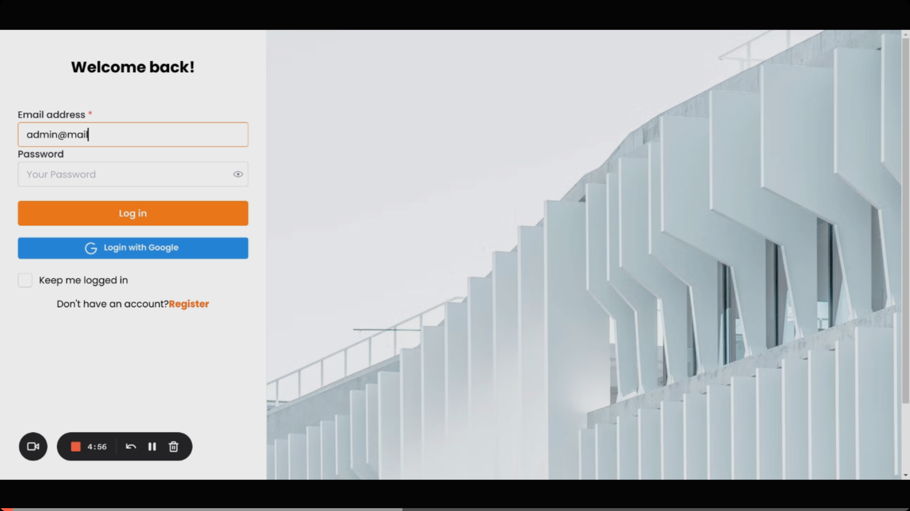
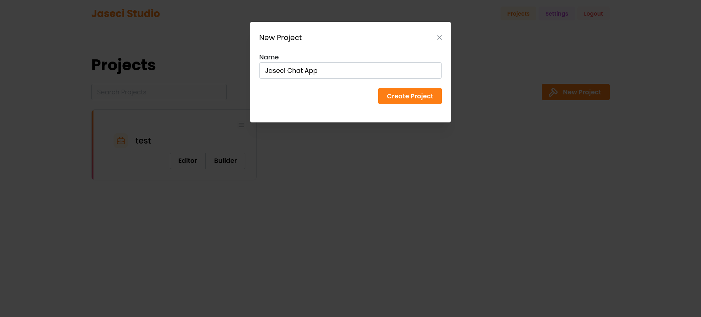
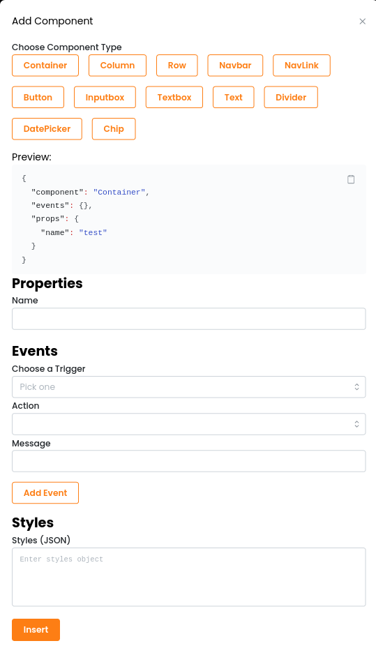
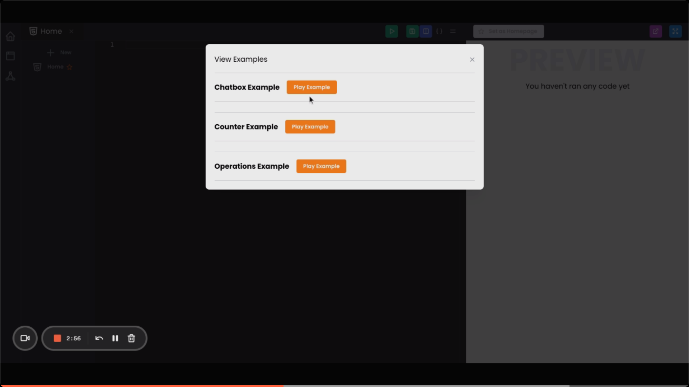

# Jaseci Studio

## Overview
Jaseci Studio is being built to be a full-featured IDE for Jaseci where developers can manage development projects, rapidly build user interfaces with our WYSIWYG editor as well as code up and deploy your JAC apps with full integration and support. For now, Jaseci Studio allows you to easily weild our very own Jaseci Webkit language via a WYSIWYG editor or directly via an editor. 

Our Jaseci Webkit language is a JSON-based representation of a variety of UI components, events and states which render as web-based user interfaces capable of consuming the Jaseci API. With our Jaseci UI Kit library, you can author Jaseci Webkit components right in your JAC code! That's right, we've also made it so that you can write front-end and back-end code within a single codebase!

Get started with Jaseci Studio by following the guide below.

## Create Account
Register on Jaseci Studio [here](/) . Once you register you can then log in and be taken to the dashboard.

## Create Project
Create you first project by selecting the create Project button on the top right.

Name your Project then click create.
[pic of creation button](../../../support/guide/assets/Studio-NewProject.png)

## Which tool to use
You will have two choices to create your frontend : 
- The Editor , this is where you write either the Json code to create frontend or JAC code to bring components together to create your frontend. 

- The Builder,  this is a drag and drop option to create your Frontend.It is simpler than the Editor for person without the technical experience.
 
## Editor

Create you page by selecting the `+ New` button on the Editor Page. 

## View Or JAC

### View

Add components for your Page in the Editor. You can learn more about Components [here](./components.md).
The Top menu has a few butttons . In order you have the `Run` button , this runs  the JSON code , The `save` buttton which saves your work , `Preview View` , this is to open and close the Preview Section , `{ }` , these curly braces are used to beautify the JSON code and the `menu` button , this opens a drop down that contains Components , Examples which you can add and a import and Export Project.

### Menu 
The Drop menu when selected gives 3 Options .They are :
- Components , You can various components to your editor to assist in your Frontend Developemnt.

- examples , Add finished Frontend which you can then customise. 

- Import/Export , Import or Export your JSON or JAC code.

