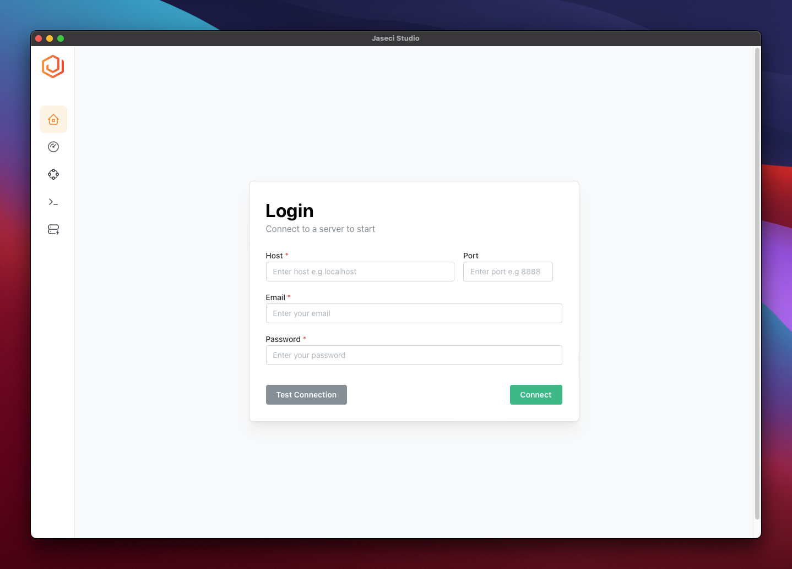

# Preparation

- [Preparation](#preparation)
    - [**1. Installing Jaseci**](#1-installing-jaseci)
    - [**1. Installing Jaseci Server**](#1-installing-jaseci-server)
    - [**2. Installing Jaseci Studio**](#2-installing-jaseci-studio)

### **1. Installing Jaseci**
Before getting started you have to install Jaseci latest version. Jaseci requeres python 3.10 or later version. We prefer you to create a fresh python environment using conda or any other virtual environment packaging to try out codes in this codelab. A complete Jaseci installation guide is
[here](../../../docs/docs/getting-started/installation.md)

After successfull installation of Jaseci run the help command,

```
jsctl --help
```

`jsctl` stands for the Jaseci Command Line Interface.
If the command above displays the help menu for `jsctl`, then you have successfully installed jaseci.

### **1. Installing Jaseci Server**

Install Jaseci Server Using following commands.

```
pip install jaseci-serv
```

Before getting start to use jaseci server, a few commands are required to set up the database.
```
jsserv makemigrations base
jsserv makemigrations
jsserv migrate
```
The above commands essentially initializes the database schemas. We will also need an admin user so we can log into the jaseci server. To create an admin user, run

```
jsserv createsuperuser
```

And follow the command line prompts to create a super user. For the purpose of this demostration, we are going to use the following credentials:

```
Email: admin@jaseci.org
Password: JaseciAdmin
```
Then launch the jaseci server with

```
jsserv runserver
```

You should see an output that looks like the following if everything is fine.

```
$ jsserv runserver
Watching for file changes with StatReloader
Performing system checks...
System check identified no issues (0 silenced).
October 24, 2022 - 18:27:14
Django version 3.2.15, using settings 'jaseci_serv.jaseci_serv.settings'
Starting development server at http://127.0.0.1:8000/
Quit the server with CONTROL-C.
```
### **2. Installing Jaseci Studio**

You can find the Jaseci Studio Binery that is relevant to your operating system [here](https://github.com/Jaseci-Labs/jaseci/releases/tag/v1.4.0.8).

Once we have the application installed and launch it, you'll see a login screen similar to this.



There you have to enter the server endpoint in the host and port fields. And also enter the login credentials which you created with jaseci server setup. To verify the information click on the "Test Connection". If there is an error, check that your server is still running and ensure that there is no typo in any of the fields.

Click connect once you have verified that all is good.


