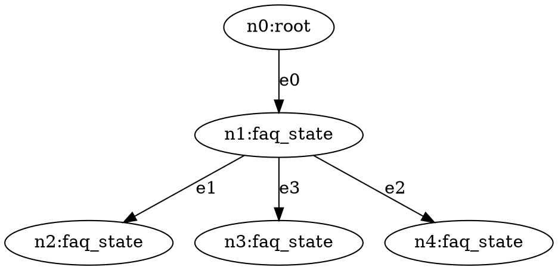
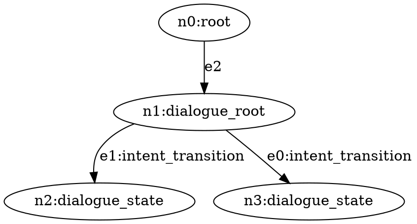

# Build a Conversational AI System with Jaseci

In this tutorial, you are going to learn how to build a state-of-the-art conversational AI system with Jaseci and the Jac language.
You will learn the basics of Jaseci, training state-of-the-art AI models, and everything in between, in order to create an end-to-end fully-functional conversational AI system.

Excited? Hell yeah! Let's jump in.

## Preparation

To install jaseci, run in your development environment

```
pip install jaseci
```

To test the installation is successful, run

```
jsctl -- help
```

`jsctl` stands for the Jaseci Command Line Interface.
If the command above displays the help menu for `jsctl`, then you have succssfully installed jaseci.

> **Note**
>
> Take a look and get familiarized with these commands while you are at it. `jsctl` will be frequently used throughout this journey.

## Background

A few essential concepts to get familiar with.

### Graph, nodes, edges

Link to bible sections.

### Walker

Link to bible sections.

# Automated FAQ answering chatbot

Our conversational AI system will consists of multiple components.
To start, we are going to build a chatbot that can answer FAQ questions without any custom training, using zeroshot NLP models.
At the end of this section, you will have a chatbot that, when given a question, searches in its knowledge base the most relevant answer and return that answer.

The use case here is a Tesla FAQ chatbot.
We will be using the list of FAQs from https://www.tesla.com/en_SG/support/faq.

> **Note**
>
> This architecture works for any FAQ topics and use case. Feel free to pick another product/website/company's FAQ if you'd like!

## Define the Nodes

We have 3 different type of nodes:

- `root`: This is the root node of the graph. It is a built-in node type and each graph has one root node only.
- `faq_root`: This is the entry point of the FAQ handler. We will make the decision on the most relevant answer at this node.
- `faq_state`: This node represents a FAQ entry. It contains a candidate answer from the knowledge base.

Now let's define the custom node types.

```js
node faq_root;
node faq_state {
    has question;
    has answer;
}
```

The `has` keyword defines nodes variables. In this case, each `faq_state` has a `question` and `answer`.

> **Warning**
>
> The `root` node does not need explicit definition. It is a built-in node type. Avoid using `root` as a custom node type.

## Build the Graph

For this FAQ chatbot, we will build a graph like illustrated here:


The idea here is that we will decide which FAQ entry is the most relevant to the incoming question at the `faq_root` node and then we will traverse to that node to fetch the corresponding answer.

To define this graph architecture:

```js
// Static graph definition
graph faq {
    has anchor faq_root;
    spawn {
        // Spawning the nodes
        faq_root = spawn node::faq_root;
        faq_answer_1 = spawn node::faq_state(
            question="How do I configure my order?",
            answer="To configure your order, log into your Tesla account."
        );
        faq_answer_2 = spawn node::faq_state(
            question="How do I order a tesla",
            answer="Visit our design studio to place your order."
        );
        faq_answer_3 = spawn node::faq_state(
            question="Can I request a test drive",
            answer="Yes. You must be a minimum of 25 years of age."
        );

        // Connecting the nodes together
        faq_root --> faq_answer_1;
        faq_root --> faq_answer_2;
        faq_root --> faq_answer_3;
    }
}
```

Let's break down this piece of code.

We observe two uses of the `spawn` keyword. To spawn a node of a specific type, use the `spawn` keyword for:

```js
faq_answer_1 = spawn node::faq_state(
    question="How do I configure my order?",
    answer="To configure your order, log into your Tesla account.",
);
```

In the above example, we just spawned a `faq_state` node called `faq_answer_1` and initialized its `question` and `answer` variables.

> **Note**
>
> The `spawn` keyword can be used in this style to spawn many different jaseci objects, such as nodes, graphs and walkers.

The second usage of `spawn` is with the graph:

```js
graph faq {
    has anchor faq_root;
    spawn {
       ...
    }
}
```

In this context, the `spawn` designates a code block with programmatic functionality to spawn a subgraph for which the root node of that spawned graph will be the `has anchor faq_root`.

In this block:

- We spawn 4 nodes, one of the type `faq_root` and three are of the type `faq_state`.
- We connect each of the faq answer state to the faq root with `faq_root --> faq_answer_*`.
- We set the `faq_root` as the anchor node of the graph. As we will later see, spawning a graph will return its anchor node.

> **Warning**
>
> An anchor node is required for every graph block. It must be assigned inside the spawn block of the graph definition.

## Initialize the Graph

Similar to nodes, in order to create the graph, we will use the `spawn` keyword.

```js
walker init {
    root {
        spawn here --> graph::faq;
    }
}
```

This is the first walker we have introduced so let's break it down.

- The walker is called `init`.
- It contains logic specifically for the `root` node, meaning that the code inside the `root {}` block will run **only** on the `root` node. This syntax applies for any node types, as you will see very soon. Every Jac program starts with a single root node, though as you will later learn, a walker can be executed on any node though root is default if none is specified.
- `spawn here --> graph::faq` creates an instance of the `faq` graph and connect its anchor node to `here` which is the node the walker is currently on.

> **Note**
>
> `init` can be viewed as similar to `main` in python. It is the default walker to run when no specific walkers are specified for a `jac run` command.
>
> `here` is a very powerful keyword. It always evaluates to the specific node the walker is currently on. You will be using `here` a lot throughout this tutorial.

## Run the `init` Walker

Now, let's run the init walker to initialize the graph.
First put all the above code snippet in a single jac file and name it `main.jac`, including

- nodes defintion
- graph definition
- init walker

Run `jsctl` to get into the jaseci shell environment:

```bash
jsctl
```

Inside the `jsctl` shell,

```bash
jaseci > jac dot main.jac
```

This command runs the `init` walker of the `main.jac` program and prints the state of its graph in DOT format after the walker has finished.
[The DOT language](https://graphviz.org/doc/info/lang.html) is a popular graph description language widely used for representing complex graphs.

The output should look something like this




> **Note**
>
> We are not going to cover the DOT syntax. There are many resources online if you are interested, e.g., https://graphviz.org/doc/info/lang.html

> **Note**
>
> There are tools available to render a graph in DOT format. For example, https://dreampuf.github.io/GraphvizOnline has as WSIWYG editor to render dot graph in real time.

Congratulations! You have just created your first functional jac program!

## Ask the Question

Alright, we have initialized the graph.
Now it's time to create the code for the question-answering.
We will start with a simple string matching for the answer selection algorithm.
For this, we will create a new walker called `ask`.

```js
walker ask {
    has question;
    root {
        question = std.input("AMA > ");
        take --> node::faq_root;
    }
    faq_root {
        take --> node::faq_state(question==question);
    }
    faq_state {:
        std.out(here.answer);
    }
}
```

This walker is more complex than the `init` one and introduces a few new concepts so let's break it down!

- Similar to nodes, walker can also contain `has` variables. They define variables of the walker. They can also be passed as parameters when calling the walker.
- `std.input` and `std.out` read and write to the command line.
- This walker has logic for three types of node: `root`, `faq_root` and `faq_state`.
  - `root`: It simply traverse to the `faq_root` node.
  - `faq_root`: This is where the answer selection algorithm is. We will find the most relevant `faq_state` and then traverse to that node via a `take` statement. In this code snippet, we are using a very simple (and limited) string matching approach to try to match the predefined FAQ question with the user question.
  - `faq_state`: Print the answer to the terminal

Before we run this walker, we are going to update the `init` walker to speed up our development process

```js
walker init {
    root {
        spawn here --> graph::faq;
        spawn here walker::ask;
    }
}
```

This serves as a shorthand so that we can initialize the graph and ask question in one command.

> **Note**
>
> This demonstrates how one walker can spawn another walker using the `spawn` keyword.

Time to run the walker!

```bash
jaseci > jac run main.jac
```

`jac run` functions very similarly to `jac dot`, with the only difference being that it doesn't return the graph in DOT format.
Try giving it one of the three questions we have predefined and it should respond with the corresponding answer.

## Introducing Universal Sentence Encoder

Now, obviously, what we have now is not very "AI" and we need to fix that.
We are using the Universal Sentence Encoder QA model as the answer selection algorithm.
Universal Sentence Encoder is a language encoder model that is pre-trained on large corpus of natural language data and have been shown to be effective in many NLP tasks.
In our application, we are using it for zero-shot question-answering, i.e. no custom training required.

Jaseci has a set of built-in libraries or packages that are called Jaseci actions.
These actions cover a wide-range of state-of-the-art AI models across many different NLP tasks.
These actions are packaged in a python module called `jaseci_kit`.

To install `jaseci_kit`:

```bash
pip install jaseci_kit
```

Now we load the action we need into our jaseci environment

```bash
jaseci > actions load module jaseci_kit.use_qa
```

Let's update our walker logic to use the USE QA model:

```js
walker ask {
    has question;
    root {
        question = std.input(">");
        take --> node::faq_root;
    }
    faq_root {
        answers = -->.answer;
        best_answer = use.qa_classify(
            text = question,
            classes = answers
        );
        take --> node::faq_state(answer==best_answer["match"]);
    }
    faq_state {
        std.out(here.answer);
    }
}
```

Even though there are only 5 lines of new code, there are many interesting aspects so let's break it down!

- `-->.answer` collects the `answer` variable of all of the nodes that are connected to `here`/`faq_root` with a `-->` connection.
- `use.qa_classify` is one of the action supported by the USE QA action set. It takes in a question and a list of candidate answers and return the most relevant one.

Now let's run this new walker and you can now ask questions that are relevant to the answers beyond just the predefined ones.

## Scale it Out

So far we have created a FAQ bot that is capble of provide answer in three topics.
To make this useful beyond just a prototype, we are now going to expand its database of answers.
Instead of manually spawning and connecting a node for each FAQ entry, we are going to write a walker that automatically expand our graph:

```js
walker ingest_faq {
    has kb_file;
    root: take --> node::faq_root;
    faq_root {
        kb = file.load_json(kb_file);
        for faq in kb {
            answer = faq["answer"];
            spawn here --> node::faq_state(answer=answer);
        }
    }
}
```

An example knowledge base file look like this

```json
[
  {
    "question": "I have a Model 3 reservation, how do I configure my order?",
    "answer": "To configure your order, log into your Tesla Account and select manage on your existing reservation to configure your Tesla. Your original USD deposit has now been converted to SGD."
  },
  {
    "question": "How do I order a Tesla?",
    "answer": "Visit our Design Studio to explore our latest options and place your order. The purchase price and estimated delivery date will change based on your configuration."
  },
  {
    "question": "Can I request a Test Drive?",
    "answer": "Yes, you can request for a test drive. Please note that drivers must be a minimum of 25 years of age and not exceeding 65 years of age, hold a full driving license with over 2 years of driving experience. Insurance conditions relating to your specific status must be reviewed and accepted prior to the test drive."
  }
]
```

Save the above json in a file named `tesla_faq.json` and make it is in the same location as `main.jac`.
Let's now update the `init` walker.
Because we are going to use the `ingest_faq` walker to generate the graph, we won't need the static graph definition.

```js
walker init {
    root {
        spawn here --> node::faq_root;
        spawn here walker::ingest_faq(kb_file="tesla_faq.json");
        spawn here walker::ask;
    }
}
```

What we are doing here is

- Spawn a `faq_root` node
- Run the `ingest_faq` walker to create the neccessary `faq_state` nodes based on the question-answer entires in the `tesla_faq.json` file.
- Launch the `ask` walker

Let's run the program one more time and test it out!

```bash
jaseci > jac run main.jac
```

> **Note**
>
> Try more varied questions. Now we have a longer answer with more rich information, it has a higher coverage of information that will be able to answer more questions.

> **Note**
>
> If you are feeling adventurous, try downloading the complete list of entires on the Tesla FAQ page and use it to create a production-level FAQ bot. See if you can push the model to its limit!

# Next up!


Here is a preview on what's next to come in this journey!

On the right is the architecture diagram of the complete system we are going to build. Here are the major components:

- Zero-shot FAQ (what we have built so far).
- Action-oriented Multi-turn Dialogue System.
- Training and inference with an intent classification model.
- Training and inference with an entity extraction model.
- Testing.
- Deploying your Jac application to a production environment.
- Training data collection and curation.


# A Multi-turn Action-oriented Dialogue System
## Introduction
In the previous section, we built a FAQ chabot.
It can search in a knowledge base of answers and find the most relevant one to a user's question.
While ths covers many diverse topics, certain user request can not be satisfied by a single answer.
For example, you might be looking to open a new bank account which requires mulitple different pieces of information about you.
Or, you might be making a reservation at a restaurant which requires information such as date, time and size of your group.
We refer to these as action-oriented conversational AI requests, as they often lead to a certain action or objective.

When interacting with a real human agent to accomplish this type of action-oriented requests, the interaction can get messy and unscripted and it also varies from person to person.
Again, use the restaurant reservation as an example, one migh prefer to follow the guidance of the agent and provide one piece of information at a time, while others might prefer to provide all the neccessary information in one sentence at the beginning of the interaction.

Therefore, in order to build a robust and flexible conversational AI to mimic a real human agent to support these types of messy action-oriented requests, we are going to need an architecture that is different than the single-turn FAQ.

And that is what we are going to build in this section -- a multi-turn action-oriented dialogue system.

> **Warning**
>
> Start a new jac file (`dialogue.jac`) before moving fowrard. We will keep this program separate from the FAQ one we built. But, KEEP the FAQ jac file around, we will integrate these two systems into one unified conversational AI system later.

## State Graph
Let's first go over the graph architecture for the dialogue system.
We will be building a state graph.
In a state graph, each node is a conversational state, which represent a possible user state during a dialgoue.
The state nodes are connected with transition edges, which encode the condition required to hop from one state to another state.
The conditions are often based on the user's input.

## Define the State Nodes
We will start by defining the node types.

```js
node dialogue_root;

node dialogue_state {
    has name;
    has response;
}
```
Here we have a `dialogue_root` as the entry point to the dialogue system and multiple `dialogue_state` nodes representing the conversational states.
These nodes will be connected with a new type of edge `intent_transition`.

## Custom Edges
```js
edge intent_transition {
    has intent;
}
```
This is the first custom edge we have introduced.
In jac, just like nodes, you can define custom edge type and edges can also have `has` variables.

In this case, we created an edge for intent transition. This is a state transition that will be triggered conditioned on its intent being detected from the user's input question.

> **Note**
>
> Custom edge type and variables enable us to encode information into edges in addition to nodes. This is crucial for building a robust and flexible graph.

## Build the graph
Let's build the first graph for the dialogue system.

```js
graph dialogue_system {
    has anchor dialogue_root;
    spawn {
        dialogue_root = spawn node::dialogue_root;
        test_drive_state = spawn node::dialogue_state(
            name = "test_drive",
            response = "Your test drive is scheduled for Jan 1st, 2023."
        );
        how_to_order_state = spawn node::dialogue_state (
            name = "how_to_order",
            response = "You can order a Tesla through our design studio."
        );

        dialogue_root -[intent_transition(intent="test drive")]-> test_drive_state;
        dialogue_root -[intent_transition(intent="order a tesla")]-> how_to_order_state;
    }
}
```
We have already covered the syntax for graph definition, such as the `anchor` node and the `spawn` block in the previous section.
Refer to the FAQ graph definition step if you need a refresher.

We have a new language syntax here `dialogue_root -[intent_transition(intent="test drive")]-> test_drive_state;`.
Let's break this down!
* If you recall, we have used a similar but simpler syntax to connect two nodes with an edge `faq_root --> faq_state;`. This connect `faq_root` to `faq_state` with a **generic** edge pointing to `faq_state`;
* In `dialogue_root -[intent_transition(intent="test drive")]-> test_drive_state;`, we are connecting the two states with a **custom** edge of the type `intent_transition`.
* In addition, we are initializing the variable `intent` of the edge to be `test drive`.

To summarize, with this graph, a user will start at the dialogue root state when they first start the conversation.
Then based on the user's question and its intent, we will

## Initialize the graph
Let's create an `init` walker to for this new jac program.
```js
walker init {
    root {
        spawn here --> graph::dialogue_system;
    }
}
```
Put all the code so far in a new file and name it `dialogue.jac`.

Let's initialize the graph and visualize it.
```bash
jaseci > jac dot dialogue.jac
```



## Build the Walker Logic
Let's now start building the walker to interact with this dialogue system.
```js
walker talk {
    has question;
    root {
        question = std.input("> ");
        take --> node::dialogue_root;
    }
    dialogue_root {
        take -[intent_transition(intent==question)]-> node::dialogue_state;
    }
    dialogue_state {
        std.out(here.response);
    }
}
```
Similar to the first walker we built for the FAQ system, we are starting with a simple string matching algorithm.
Let's update the init walker to include this walker.

```js
walker init {
    root {
        spawn here --> graph::dialogue_system;
        spawn here walker::talk;
    }
}
```
Try out the following interactions

```bash
$ jsctl jac run dialogue.jac
> test drive
Your test drive is scheduled for Jan 1st, 2023.
{
  "success": true,
  "report": [],
  "final_node": "urn:uuid:9b8d9e1e-d7fb-4e6e-ae86-7ef7c7ad28a7",
  "yielded": false
}
```
and
```bash
$ jsctl jac run dialogue.jac
> order a tesla
You can order a Tesla through our design studio.
{
  "success": true,
  "report": [],
  "final_node": "urn:uuid:168590aa-d579-4f22-afe7-da75ab7eefa3",
  "yielded": false
}
```
What is happening here is based on the user's question, we are traversing the corresponding dialogue state and then return the response of that state.
For now, we are just matching the incoming question with the intent label as a simple algorithm, which we will now replace with an AI model.

> **Note**
>
> Notice we are running `jsctl` commands directly from the terminal without first entering the jaseci shell? Any `jsctl` commands can be launched directly from the terminal by just prepending it with `jsctl`. Try it with the other `jsctl` comamnds we have encountered so far, such as `jac dot`.

## Intent classificaiton with Bi-encoder
Let's introduce an intent classification AI model.
Intent Classification is the task of detecting and assigning one of a list of pre-defined intents to a given piece of text, to summarize what the text is conveying or asking.
It's one of the fundamental tasks in Natural Language Processing (NLP) with broad applications in many areas.

There are many models that have been proposed and applied to intent classification.
For this tutorial, we are going to use a Bi-Encoder model.
A Bi-encoder model has two transformer-based encoders that each encodes the input text and candidate intent labels into embedding vectors and then the model compare the similarity between the embedding vectors to find the most relevant/fitting intent label.

> **Note**
>
> If you don't fully understand the Bi-encoder model yet, do not worry! We will provide the neccessary code and tooling for you to wield this model as a black box. But, if you are interested, here is a paper for you to read up on it https://arxiv.org/pdf/1908.10084.pdf!

Now let's train the model.
We have created a jac program and sample training data for this.
They are in the `code` directory next to this tutorial.
Copy `bi_enc.jac` and `clf_train_1.json` to your working directory.

Let's first load the Bi-encoder action library into Jaseci.
```bash
$ jsctl
jaseci > actions load module jaseci_kit.bi_enc
```
* Link to example training data file to a github link or shared google drive.
```js
jaseci > jac run bi_enc.jac -walk train -ctx \"{\"train_file\": \"clf_train_1.json\"}"
```
This new jac run

* Explain `-wlk` and `-ctx`


```bash
EXPECTED TRAINING OUTPUT
```
* Mention that the model needs to be saved with `save_model`

Use infer to test the model after training
```js
> jaseci jac run biencoder.jac -wlk infer -ctx {}
```
```bash
Expected output
```

## Integrating the intent classification model in the walker logic
```js
walker ask {
    // update the code to use biencoder for inference
}
```

Run the new walker

## Introduce multi-turn dialogue
* Some actions will require multiple turns to finish. Just like if you are talking to a person
* We will expand the test_drive capability to a multi-turn dialogue
* Explain slots/entities and how they are used in dialogue system
* Give examples of messy language and give information in different order.
* We need to update our graph architecture

* Show new graph diagram, with new states (update, confirmation, confirmed, cancelled) and entity transition
* Explain the graph

## Build the multi-turn dialogue graph

```js
edge entity_transition {
    has entities;
}
```
NOTE: is there a better way to match entities here? Need both lists to be sorted.

Expand the graph with new states and transitions
```js
graph dialogue_system {
    has anchor dialogue_root;
    spawn {

    }
}
```
* show DOT visualization

## Update the walker to navigate the multi-turn dialogue graph
```js
walker ask {
    take -[entity_transition]-> else {
        take -[intent_transition]-> else {

        }
    }
}
```
* With simple string matching as the entity extraction algorithm.

## Introduce entity extraction AI model
* Similar to biencoder, give them the jac file and teach them how to train the model as a black box

Load action
```bash
jaseci > actions load module jaseci_kit.ent_ext
```

NER training jac program
```js
node ner {

}
walker train {

}

walker infer {

}
```
* Provide example training data file

Train the model
```bash
jaseci > walker run ner.jac -wlk train -ctx {}
```

Test the model
```js
jaseci > walker run ner.jac -wlk infer -ctx {}
```

## Integrate the NER model with walker logic

Update the walker code to use the NER action
```js
walker ask {

}
```

Run the walker again, now with both AI model in place.

Congratulations! You now have a fully functional multi-turn dialogue system.

# Inheritance in Jaseci
* A quick section/module explaining how inheritance work in jaseci and jac

# Unifying the two conversational AI systems
* FAQ and Dialogue system, while relying on different AI models, share many of the same development and processing pattern.
* NLU to analyze the question and NLG to compose a repsonse.
* Add diagram to demonstrate the shared pattern.
* We are going to use inheritance to unify the two system and simplify our logic

* Explain the inheritance relationship
* cai_state --> va_state --> individual dialogue states
* cai_state --> faq_state --> individual FAQ answer states

Introduce the cai_state parent node
```js
node cai_state {

}
```
* Introduce node abilities
* data spatial programming concept and principles

## Update dialogue system program with inheritance
```js
node dialogue_state:cai_state {
    can nlu {
    }
    can nlg {

    }
    can classify_intent {

    }
    can extract_entities {

    }
}
```
* Overwrites abilities from cai_state
* Move logic from walker into node abilities

Then each dialogue state will inherit from `dialogue_state` and specify custom logic for that state
```js
node collect_info:dialogue_state {

}
node confirmation:dialogue_state {

}
node
node
node
```

Let's update the graph for dialogue system
```js
graph dialogue_system {
    // updated graph with new inheritance structure
}
```

Now that we have updated our node following the principle of data spacial programming, let's see what our walker logic now looks like
```js
walker ask {
    // Updated and simplified with most of the code moved to node abilities
}
```

Let's run the new walker with the new graph. It should work just like before.

## Update the FAQ program with the new inheritance structure
```js
node faq_state:cai_state {

}
```

Update the graph
```
graph faq {
    // updated graph with new inheritance structure
}
```

Update the faq walker
```js
walker ask_faq {

}
```
Let's run the new walker with the new grpah.

# Combining FAQ and Dialogue into one system
Now that we have unified the data structure, let's see how we can combine these two into one unified conversational AI system.
The unified code architecture makes this much easier than before.

* We will add an intent to the dialogue system to direct requests to FAQ
* Add diagram here

Update the graph with both sides linked
```js
graph conv_ai {
    has anchor cai_root;
    graph {
        // Connect dialogue system to cai_root
        // Connect FAQ to cai_root
    }
}
```

We are also going to unify the two walkers.

```js
walker talk {
    // Final form of the talk walker
}
```
* Explain the state tracking logic of the walker.
* It generalizes to both faq_state and dialogue_state.

We also need to update the `init` walker;
```js
walker init {

}
```

## Multi-file Jac Program
We have a new challenge, our jac program consists of multiple jac files now.
We will compile them into one program in the format of `jir`.

Let's create a `main.jac`
<h5 a><strong><code>main.jac</code></strong></h5>

```js
import {*} with "./faq.jac";
import {*} with "./dialogue.jac";
...
```

To compile a multi-file jac program,
```bash
jaseci > jac build main.jac
```

A `main.jir` should be generated.
To run a walker from a jir file,
```bash
jaseci > jac run main.jir -wlk WALKER_NAME -ctx {}
```

> **Note**
>
> The jir format is what you will use to deploy your jac program to a production jaseci instance.

## Initialize the Latest Graph
Use jac dot on the jir file to initialize the graph.

## Update the intent classifier model
Add data for the new I have questions intent

Run the walker and try it out

# From prototype --> production application
## Introducing yield
Explain yield
Update the walker with yield
```js
walker talk {
    // Update this with yield
}
```

## Adding test cases
Introduce jac tests
```js
test ""
```

## Deploying your application to remote jaseci instance
introduce jsserv

introduce sentinel.

introduce jac APIs

Walkthrough process of deploying application to remote jaseci instance

```bash
sentinel register
walker init
call the walker API
```

# Improve your AI model

Data collection and curation principles and best practices

Crowdsource


