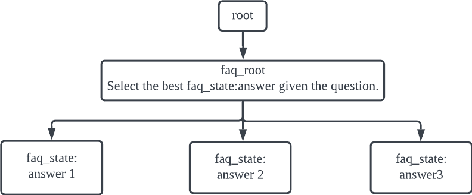
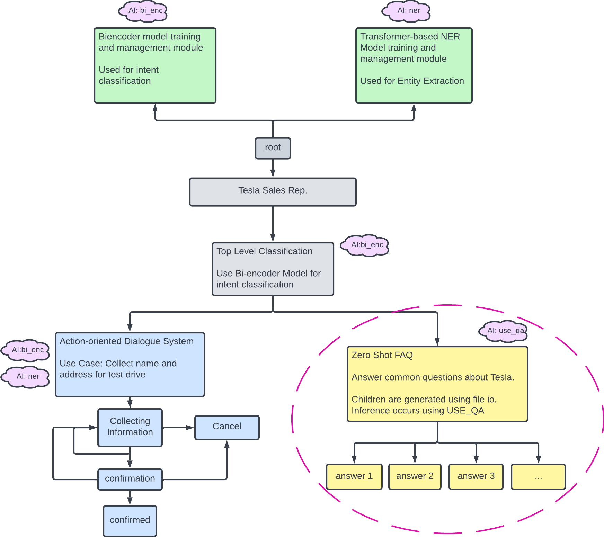

# Automated FAQ answering chatbot

Our conversational AI system will consist of multiple components.
To start, we are going to build a chatbot that can answer FAQ questions without any custom training, using powerful zero-shot NLP models.
At the end of this section, you will have a chatbot that, when given a question, searches in its knowledge base for the most relevant answer and returns that answer.

The chatbot we'll build here is a Tesla FAQ chatbot.
We will be using the list of FAQs from https://www.tesla.com/en_SG/support/faq.

> **Note**
>
> This architecture works for any FAQ topics and use cases. Feel free to pick another product/website/company's FAQ if you'd like!

## Define the Nodes

We have 3 different types of nodes:

- `root`: This is the root node of the graph. It is a built-in node type and each graph has one root node only.
- `faq_root`: This is the entry point of the FAQ handler. We will make the decision on the most relevant answer at this node.
- `faq_state`: This node represents a FAQ entry. It contains a candidate answer from the knowledge base.

To start, let's create a new jac file and name it `faq.jac` and we will be putting the code in this section in this file.

Now let's define the custom node types.

```jac
node faq_root;
node faq_state {
    has question;
    has answer;
}
```

The `has` keyword defines a node's variables. In this case, each `faq_state` has a `question` and `answer`.

> **Important**
>
> The `root` node does not need explicit definition. It is a built-in node type. Avoid using `root` as a custom node type.

## Build the Graph

For this FAQ chatbot, we will build a graph as illustrated here:



The idea here is that we will decide which FAQ entry is the most relevant to the incoming question at the `faq_root` node and then we will traverse to that node to fetch the corresponding answer.

To define this graph architecture:

```jac
// Static graph definition
graph faq {
    has anchor faq_root;
    spawn {
        // Spawning the nodes
        faq_root = spawn node::faq_root;
        faq_answer_1 = spawn node::faq_state(
            question="How do I configure my order?",
            answer="To configure your order, log into your Tesla account."
        );
        faq_answer_2 = spawn node::faq_state(
            question="How do I order a tesla",
            answer="Visit our design studio to place your order."
        );
        faq_answer_3 = spawn node::faq_state(
            question="Can I request a test drive",
            answer="Yes. You must be a minimum of 25 years of age."
        );

        // Connecting the nodes together
        faq_root ++> faq_answer_1;
        faq_root ++> faq_answer_2;
        faq_root ++> faq_answer_3;
    }
}
```

Let's break down this piece of code.

We observe two uses of the `spawn` keyword. To spawn a node of a specific type, use the `spawn` keyword for:

```jac
faq_answer_1 = spawn node::faq_state(
    question="How do I configure my order?",
    answer="To configure your order, log into your Tesla account.",
);
```

In the above example, we just spawned a `faq_state` node called `faq_answer_1` and initialized its `question` and `answer` variables.

> **Note**
>
> The `spawn` keyword can be used in this style to spawn many different jaseci objects, such as nodes, graphs and walkers.

The second usage of `spawn` is with the graph:

```jac
graph faq {
    has anchor faq_root;
    spawn {
       ...
    }
}
```

In this context, the `spawn` designates a code block with programmatic functionality to spawn a subgraph for which the root node of that spawned graph will be the `has anchor faq_root`.

In this block:

- We spawn 4 nodes, one of the type `faq_root` and three of the type `faq_state`.
- We connect each of the faq answer states to the faq root with `faq_root ++> faq_answer_*`.
- We set the `faq_root` as the anchor node of the graph. As we will later see, spawning a graph will return its anchor node.

> **Warning**
>
> An anchor node is required for every graph block. It must be assigned inside the spawn block of the graph definition.

> **Warning**
>
> In jaseci 1.4 or later, creating an edge uses the syntax `++>` and referencing an edge uses `-->`.

## Initialize the Graph

Similar to nodes, in order to create the graph, we will use the `spawn` keyword.

```jac
walker init {
    root {
        spawn here ++> graph::faq;
    }
}
```

This is the first walker we have introduced, so let's break it down.

- The walker is called `init`.
- It contains logic specifically for the `root` node, meaning that the code inside the `root {}` block will run **only** on the `root` node. This syntax applies for any node types, as you will see very soon. Every Jac program starts with a single root node, but as you will later learn, a walker can be executed on any node, though the root is used by default if none is specified.
- `spawn here ++> graph::faq` creates an instance of the `faq` graph and connects its anchor node to `here`, which is the node the walker is currently on.

> **Note**
>
> `init` can be viewed as similar to `main` in Python. It is the default walker to run when no specific walkers are specified for a `jac run` command.
>
> `here` is a very powerful keyword. It always evaluates to the specific node the walker is currently on. You will be using `here` a lot throughout this tutorial.

## Run the `init` Walker

Now, let's run the init walker to initialize the graph.

Run `jsctl` to get into the jaseci shell environment:

```bash
jsctl
```

Inside the `jsctl` shell,

```bash
jaseci > jac dot faq.jac
```

This command runs the `init` walker of the `faq.jac` program and prints the state of its graph in DOT format after the walker has finished.
[The DOT language](https://graphviz.org/doc/info/lang.html) is a popular graph description language widely used for representing complex graphs.

The output should look something like this


> **Note**
>
> We are not going to cover the DOT syntax. There are many resources online if you are interested, e.g., https://graphviz.org/doc/info/lang.html

> **Note**
>
> There are tools available to render a graph in DOT format. For example, https://dreampuf.github.io/GraphvizOnline has a WSIWYG editor to render dot graph in real time.

Congratulations! You have just created your first functional jac program!

## Ask the Question

Alright, we have initialized the graph.
Now it's time to create the code for the question-answering.
We will start with a simple string matching for the answer selection algorithm.
For this, we will create a new walker called `ask`.

```jac
walker ask {
    has question;
    root {
        question = std.input("AMA > ");
        take --> node::faq_root;
    }
    faq_root {
        take --> node::faq_state(question==question);
    }
    faq_state {:
        std.out(here.answer);
    }
}
```

This walker is more complex than the `init` one and introduces a few new concepts so let's break it down!

- Similar to nodes, walkers can also contain `has` variables. They define variables of the walker. They can also be passed as parameters when calling the walker.
- `std.input` and `std.out` read and write to the command line respectively.
- This walker has logic for three types of node: `root`, `faq_root` and `faq_state`.
  - `root`: It simply traverses to the `faq_root` node.
  - `faq_root`: This is where the answer selection algorithm is. We will find the most relevant `faq_state` and then traverse to that node via a `take` statement. In this code snippet, we are using a very simple (and limited) string matching approach to try to match the predefined FAQ question with the user question.
  - `faq_state`: Print the answer to the terminal.

Before we run this walker, we are going to update the `init` walker to speed up our development process

```jac
walker init {
    root {
        spawn here ++> graph::faq;
        spawn here walker::ask;
    }
}
```

This serves as a shorthand so that we can initialize the graph and ask a question in one command.

> **Note**
>
> This demonstrates how one walker can spawn another walker using the `spawn` keyword.

Time to run the walker!

```bash
jaseci > jac run faq.jac
```

`jac run` functions very similarly to `jac dot`, with the only difference being that it doesn't return the graph in DOT format.
Try giving it one of the three questions we have predefined and it should respond with the corresponding answer.

## Introducing Universal Sentence Encoder

Now, obviously, what we have now is not very "AI" and we need to fix that.
We are going to use the Universal Sentence Encoder QA model as the answer selection algorithm.
Universal Sentence Encoder is a language encoder model that is pre-trained on a large corpus of natural language data and has been shown to be effective in many NLP tasks.
In our application, we are using it for zero-shot question-answering, i.e. no custom training required.

Jaseci has a set of built-in libraries or packages that are called Jaseci actions.
These actions cover a wide-range of state-of-the-art AI models across many different NLP tasks.
There are few packages named   `jac_nlp`, `jac_vision`, `jac_speech` and `jac_misc` for NLP, vision, speech and miscellaneous tasks respectively.
The `jac_nlp` package contains the Universal Sentence Encoder QA model that we are going to use, as well as Bi Encoder and Transformer based NER models that will come up later in this guide.

To install `jac_nlp`:

```bash
pip install jac_nlp[use_qa, bi_enc, tfm_ner] # This will install the models which we need for this example
```
But if you want to install all the models in `jac_nlp`:

```bash
pip install jac_nlp[all] # This will install all the models in jac_nlp
```

> **Note**
>
> We recently implemented a new organizational structure to `jaseci_ai_kit` to accomodate more and larger models being introduced to the suite. If you started this guide prior to January 24th, 2023, you might have installed the python package `jaseci_ai_kit`. This has been replaced with four separate packages, `jac_nlp`, `jac_speech`, `jac_vision` and `jac_misc`. You can continue to use the `jaseci_ai_kit` you have installed as it will still function and work with your existing code. Just replace `jac_nlp` with `jaseci_ai_kit` throughout this guide. They will be noted as well. If you are just starting this guide, we recommend instaling the new packages (i.e. `jac_nlp`).

Now we load the action we need into our jaseci environment

```bash
jaseci > actions load module jac_nlp.use_qa
```

> **Note**
>
> If you are on the older `jaseci_ai_kit` python package, replace `jac_nlp.use_qa` with `jaseci_ai_kit.use_qa`.

Let's update our walker logic to use the USE QA model:

```jac
walker ask {
    can use.qa_classify;
    has question;
    root {
        question = std.input(">");
        take --> node::faq_root;
    }
    faq_root {
        answers = -->.answer;
        best_answer = use.qa_classify(
            text = question,
            classes = answers
        );
        take --> node::faq_state(answer==best_answer["match"]);
    }
    faq_state {
        std.out(here.answer);
    }
}
```

Even though there are only 5 lines of new code, there are many interesting aspects, so let's break it down!

- `-->.answer` collects the `answer` variable of all of the nodes that are connected to `here`/`faq_root` with a `-->` connection.
- `use.qa_classify` is one of the action supported by the USE QA action set. It takes in a question and a list of candidate answers and return the most relevant one.

Now let's run this new updated walker and you can now ask questions that are relevant to the answers beyond just the predefined ones.

## Scale it Out

So far we have created a FAQ bot that is capable of providing answer in three topics.
To make this useful beyond just a prototype, we are now going to expand its database of answers.
Instead of manually spawning and connecting a node for each FAQ entry, we are going to write a walker that automatically expands our graph:

```jac
walker ingest_faq {
    has kb_file;
    root: take --> node::faq_root;
    faq_root {
        kb = file.load_json(kb_file);
        for faq in kb {
            answer = faq["answer"];
            spawn here ++> node::faq_state(answer=answer);
        }
    }
}
```

An example knowledge base file look like this

```json
[
  {
    "question": "I have a Model 3 reservation, how do I configure my order?",
    "answer": "To configure your order, log into your Tesla Account and select manage on your existing reservation to configure your Tesla. Your original USD deposit has now been converted to SGD."
  },
  {
    "question": "How do I order a Tesla?",
    "answer": "Visit our Design Studio to explore our latest options and place your order. The purchase price and estimated delivery date will change based on your configuration."
  },
  {
    "question": "Can I request a Test Drive?",
    "answer": "Yes, you can request for a test drive. Please note that drivers must be a minimum of 25 years of age and not exceeding 65 years of age, hold a full driving license with over 2 years of driving experience. Insurance conditions relating to your specific status must be reviewed and accepted prior to the test drive."
  }
]
```

Save the above json in a file named `tesla_faq.json` and make sure it is in the same location as `faq.jac`.
Let's now update the `init` walker.

```jac
walker init {
    root {
        spawn here ++> node::faq_root;
        spawn here walker::ingest_faq(kb_file="tesla_faq.json");
        spawn here walker::ask;
    }
}
```
> *Note*
>
> Even though we are trying to initializing the graph using the init walker here, let's keep the original static graph definition (`graph faq`) and not delete it from the code, as it will be needed later on in this guide.

What we are doing here is

- Spawning a `faq_root` node
- Running the `ingest_faq` walker to create the neccessary `faq_state` nodes based on the question-answer entries in the `tesla_faq.json` file.
- Launching the `ask` walker

Let's run the program one more time and test it out!

```bash
jaseci > jac run faq.jac
```

> **Note**
>
> Try more varied questions. Now we have a longer answer with more rich information, it has a higher coverage of information that will be able to answer more questions.

> **Note**
>
> If you are feeling adventurous, try downloading the complete list of entires on the Tesla FAQ page and use it to create a production-level FAQ bot. See if you can push the model to its limit!

# Next up!



Here is a preview on what's next to come in this journey!

On the right is the architecture diagram of the complete system we are going to build. Here are the major components:

- Zero-shot FAQ (what we have built so far).
- Action-oriented Multi-turn Dialogue System.
- Training and inference with an intent classification model.
- Training and inference with an entity extraction model.
- Testing.
- Deploying your Jac application to a production environment.
- Training data collection and curation.

