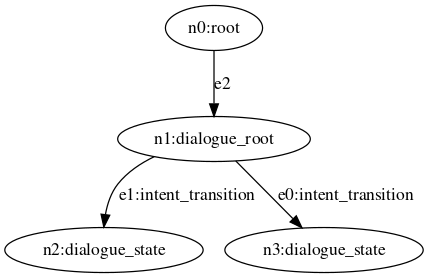

# A Multi-turn Action-oriented Dialogue System
## Introduction
In the previous section, we built a FAQ chabot.
It can search in a knowledge base of answers and find the most relevant one to a user's question.
While ths covers many diverse topics, certain user request can not be satisfied by a single answer.
For example, you might be looking to open a new bank account which requires mulitple different pieces of information about you.
Or, you might be making a reservation at a restaurant which requires information such as date, time and size of your group.
We refer to these as action-oriented conversational AI requests, as they often lead to a certain action or objective.

When interacting with a real human agent to accomplish this type of action-oriented requests, the interaction can get messy and unscripted and it also varies from person to person.
Again, use the restaurant reservation as an example, one migh prefer to follow the guidance of the agent and provide one piece of information at a time, while others might prefer to provide all the neccessary information in one sentence at the beginning of the interaction.

Therefore, in order to build a robust and flexible conversational AI to mimic a real human agent to support these types of messy action-oriented requests, we are going to need an architecture that is different than the single-turn FAQ.

And that is what we are going to build in this section -- a multi-turn action-oriented dialogue system.

> **Warning**
>
> Create a new jac file (`dialogue.jac`) before moving forward. We will keep this program separate from the FAQ one we built. But, KEEP the FAQ jac file around, we will integrate these two systems into one unified conversational AI system later.

## State Graph
Let's first go over the graph architecture for the dialogue system.
We will be building a state graph.
In a state graph, each node is a conversational state, which represents a possible user state during a dialgoue.
The state nodes are connected with transition edges, which encode the condition required to hop from one state to another state.
The conditions are often based on the user's input.

## Define the State Nodes
We will start by defining the node types.

```jac
node dialogue_root;

node dialogue_state {
    has name;
    has response;
}
```
Here we have a `dialogue_root` as the entry point to the dialogue system and multiple `dialogue_state` nodes representing the conversational states.
These nodes will be connected with a new type of edge `intent_transition`.

## Custom Edges
```jac
edge intent_transition {
    has intent;
}
```
This is the first custom edge we have introduced.
In jac, just like nodes, you can define custom edge types. Edges are also allowed `has` variables.

In this case, we created an edge for intent transition. This is a state transition that will be triggered conditioned on its intent being detected from the user's input question.

> **Note**
>
> Custom edge type and variables enable us to encode information into edges in addition to nodes. This is crucial for building a robust and flexible graph.

## Build the graph
Let's build the first graph for the dialogue system.

```jac
graph dialogue_system {
    has anchor dialogue_root;
    spawn {
        dialogue_root = spawn node::dialogue_root;
        test_drive_state = spawn node::dialogue_state(
            name = "test_drive",
            response = "Your test drive is scheduled for Jan 1st, 2023."
        );
        how_to_order_state = spawn node::dialogue_state (
            name = "how_to_order",
            response = "You can order a Tesla through our design studio."
        );

        dialogue_root -[intent_transition(intent="test drive")]-> test_drive_state;
        dialogue_root -[intent_transition(intent="order a tesla")]-> how_to_order_state;
    }
}
```
We have already covered the syntax for graph definition, such as the `anchor` node and the `spawn` block in the previous section.
Refer to the FAQ graph definition step if you need a refresher.

We have a new language syntax here `dialogue_root -[intent_transition(intent="test drive")]-> test_drive_state;`.
Let's break this down!
* If you recall, we have used a similar but simpler syntax to connect two nodes with an edge `faq_root --> faq_state;`. This connect `faq_root` to `faq_state` with a **generic** edge pointing to `faq_state`;
* In `dialogue_root -[intent_transition(intent="test drive")]-> test_drive_state;`, we are connecting the two states with a **custom** edge of the type `intent_transition`.
* In addition, we are initializing the variable `intent` of the edge to be `test drive`.

To summarize, with this graph, a user will start at the dialogue root state when they first start the conversation.
Then based on the user's question and its intent, we will move to the corresponding `test_drive` or `how_to_order` dialogue state node.

## Initialize the graph
Let's create an `init` walker to for this new jac program.
```jac
walker init {
    root {
        spawn here --> graph::dialogue_system;
    }
}
```
Put all the code so far in a new file and name it `dialogue.jac`.

Let's initialize the graph and visualize it.
```bash
jaseci > jac dot dialogue.jac
```



## Build the Walker Logic
Let's now start building the walker to interact with this dialogue system.
```jac
walker talk {
    has question;
    root {
        question = std.input("> ");
        take --> node::dialogue_root;
    }
    dialogue_root {
        take -[intent_transition(intent==question)]-> node::dialogue_state;
    }
    dialogue_state {
        std.out(here.response);
    }
}
```
Similar to the first walker we built for the FAQ system, we are starting with a simple string matching algorithm.
Let's update the init walker to include this walker.

```jac
walker init {
    root {
        spawn here --> graph::dialogue_system;
        spawn here walker::talk;
    }
}
```
Try out the following interactions

```bash
$ jsctl jac run dialogue.jac
> test drive
Your test drive is scheduled for Jan 1st, 2023.
{
  "success": true,
  "report": [],
  "final_node": "urn:uuid:9b8d9e1e-d7fb-4e6e-ae86-7ef7c7ad28a7",
  "yielded": false
}
```
and
```bash
$ jsctl jac run dialogue.jac
> order a tesla
You can order a Tesla through our design studio.
{
  "success": true,
  "report": [],
  "final_node": "urn:uuid:168590aa-d579-4f22-afe7-da75ab7eefa3",
  "yielded": false
}
```
What is happening here is based on the user's question, we are traversing the corresponding dialogue state and then return the response of that state.
For now, we are just matching the incoming question with the intent label as a simple algorithm, which we will now replace with an AI model.

> **Note**
>
> Notice we are running `jsctl` commands directly from the terminal without first entering the jaseci shell? Any `jsctl` commands can be launched directly from the terminal by just prepending it with `jsctl`. Try it with the other `jsctl` comamnds we have encountered so far, such as `jac dot`.

## Intent classificaiton with Bi-encoder
Let's introduce an intent classification AI model.
Intent Classification is the task of detecting and assigning an intent to a given piece of text from a list of pre-defined intents, to summarize what the text is conveying or asking.
It's one of the fundamental tasks in Natural Language Processing (NLP) with broad applications in many areas.

There are many models that have been proposed and applied to intent classification.
For this tutorial, we are going to use a Bi-Encoder model.
A Bi-encoder model has two transformer-based encoders that each encodes the input text and candidate intent labels into embedding vectors and then the model compare the similarity between the embedding vectors to find the most relevant/fitting intent label.

> **Note**
>
> If you don't fully understand the Bi-encoder model yet, do not worry! We will provide the neccessary code and tooling for you to wield this model as a black box. But, if you are interested, here is a paper for you to read up on it https://arxiv.org/pdf/1908.10084.pdf!

Now let's train the model.
We have created a jac program and sample training data for this.
They are in the `code` directory next to this tutorial.
Copy `bi_enc.jac` and `clf_train_1.json` to your working directory.

Let's first load the Bi-encoder action library into Jaseci.
```bash
$ jsctl
jaseci > actions load module jaseci_ai_kit.bi_enc
```
We have provided an example training file that contains some starting point training data for the two intents, `test drive` and `order a tesla`.

```jac
jaseci > jac run bi_enc.jac -walk train -ctx "{\"train_file\": \"clf_train_1.json\"}"
```
We are still using `jac run` but as you have noticed, this time we are using some new arguments. So let's break it down.
* `-walk` specifies the name of the walker to run. By default, it runs the `init` walker.
* `-ctx` stands for `context`. This lets us provide input parameters to the walker. The input parameters are defined as `has` variables in the walker.

> **Warning**
>
> `-ctx` expects a json string that contains a dictionary of parameters and their values. Since we are running this on the command line, you will need to escape the quotation marks `"` properly for it to be a valid json string. Pay close attention to the example here `-ctx "{\"train_file\": \"clf_train_1.json\"}"` and use this as a reference.

You should see an output block that looks like the following repeating many times on your screen:
```bash
...
Epoch : 5
loss : 0.10562849541505177
LR : 0.0009854014598540146
...
```
Each training epoch, the above output will print with the training loss and learning rate at that epoch.
By default, the model is trained for 50 epochs.

If the training successfully finishes, you should see `"success": true` at the end.

Now that the model has finished training, let's try it out!
You can use the `infer` walker to play with the model and test it out! `infer` is short for inference, which means using a trained model to run prediction on a given input.

```bash
jaseci > jac run bi_enc.jac -walk infer -ctx "{\"labels\": [\"test drive\", \"order a tesla\"]}"
```

Similar to training, we are using `jac run` to specifically invoke the `infer` walker and provide it with custom parameters.
The custom paremeter is the list of candidate intent labels, which are `test drive` and `order a tesla` in this case, as these were the intents the model was trained on.

```bash
jaseci > jac run bi_enc.jac -walk infer -ctx "{\"labels\": [\"test drive\", \"order a tesla\"]}"
Enter input text (Ctrl-C to exit)> i want to order a tesla
{"label": "order a tesla", "score": 9.812651595405981}
Enter input text (Ctrl-C to exit)> i want to test drive
{"label": "test drive", "score": 6.931458692617463}
Enter input text (Ctrl-C to exit)>
```
In the output here, `label` is the predicted intent label and `score` is the score assigned by the model to that intent.

> **Note**
>
> One of the advantage of the bi-encoder model is that candidate intent labels can be dynamically defined at inference time, post training. This enables us to create custom contextual classifiers situationally from a single trained model. We will leverage this later as our dialogue system becomes more complex.

Congratulations! You just trained your first intent classifier, easy as that.

The trained model is kept in memory and active until they are explicitly saved with `save_model`. To save the trained model to a location of your choosing, run

```bash
jaseci > jac run bi_enc.jac -walk save_model -ctx "{\"model_path\": \"dialogue_intent_model\"}"
```
Similarly, you can load a saved model with `load_model`

```bash
jaseci > jac run bi_enc.jac -walk load_model -ctx "{\"model_path\": \"dialogue_intent_model\"}"
```

Always remember to save your trained models!

> **Warning**
>
> `save_model` works with relative path. When a relative model path is specified, it will save the model at the location relative to **location of where you run jsctl**. Note that until the model is saved, the trained weights will stay in memory, which means that it will not persisit between `jsctl` session. So once you have a trained model you like, make sure to save them so you can load them back in the next jsctl session.

## Integrate the Intent Classifier
Now let's update our walker to use the trained intent classifier.
```jac
walker talk {
    has question;
    can bi_enc.infer;
    root {
        question = std.input("> ");
        take --> node::dialogue_root;
    }
    dialogue_root {
        intent_labels = -[intent_transition]->.edge.intent;
        predicted_intent = bi_enc.infer(
            contexts = [question],
            candidates = intent_labels,
            context_type = "text",
            candidate_type = "text"
        )[0]["predicted"]["label"];
        take -[intent_transition(intent==predicted_intent)]-> node::dialogue_state;
    }
    dialogue_state {
        std.out(here.response);
    }
}
```
`intent_labels = -[intent_transition]->.edge.intent` collects the `intent` variables of all the outgoing `intent_transition` edges. This represents the list of candidate intent labels for this state.

Try playing with different questions, such as
```bash
$ jsctl
jaseci > jac run dialogue.jac
> hey yo, I heard tesla cars are great, how do i get one?
You can order a Tesla through our design studio.
{
  "success": true,
  "report": [],
  "final_node": "urn:uuid:af667fdf-c2b0-4443-9ccd-7312bc4c66c4",
  "yielded": false
}
```

## Making Our Dialogue System Multi-turn
Dialogues in real life have many turn of interaction.
Our dialogue system should also support that to provide a human-like conversational experinece.
In this section, we are going to take the dialogue system to the next level and create a multi-turn dialogue experience.

Before we do that we need to introduce two new concepts in Jac: node abilities and inheritance.

### Node Abilities
Node abilities are code that encoded as part of each node type.
They often contain logic that read, write and generally manipulate the variables and states of the nodes.
Node abilities are defined with the `can` keyword inside the definition of nodes, for example, in the code below, `get_plate_number` is an ability of the `vehicle` node.
```jac
node vehicle {
    has plate_numer;
    can get_plate_numer {
        report here.plate_number;
    }
}
```
To learn more about node abilities, refer to the relevant sections of the Jaseci Bible.
> **Note**
>
> Node abilities look and function similarly to member functions in object-oriented programming (OOP). However, there is a key difference in the concepts. Node abilities are the key concept in data-spatial programming, where the logic should stay close to its working set data in terms of the programming syntax.

### Inheritance
Jac supports inheritance for nodes and edges.
Node variables (defined with `has`) and node abilities (defined with `can`) are inherited and can be overwritten by children nodes.

Here is an example:
```jac
node vehicle {
    has plate_number;
    can get_plate_number {
        report here.plate_number;
    }
}

node car:vehicle {
    has plate_number = "RAC001";
}

node bus:vehicle {
    has plate_number = "SUB002";
}
```
To learn more about inheritance in Jac, refer to the relevant sections of the Jaseci Bible.


## Build the Multi-turn Dialogue Graph
Now that we have learnt about node abilities and node inheritance, let's put these new concepts to use to build a new graph for the multi-turn dialogue system

There are multiple parts to this so let's break it down one by one

### Dialogue State Specific Logic
With the node abilities and node inheritance, we will now introduce state specific logic.
Take a look at how the `dialogue_root` node definition has changed.

```jac
node dialogue_state {
    can bi_enc.infer;
    can tfm_ner.extract_entity;

    can classify_intent {
        intent_labels = -[intent_transition]->.edge.intent;
        visitor.wlk_ctx["intent"] = bi_enc.infer(
            contexts = [visitor.question],
            candidates = intent_labels,
            context_type = "text",
            candidate_type = "text"
        )[0]["predicted"]["label"];
    }

    can extract_entities {
        // Entity extraction logic will be added a bit later on.
    }

    can init_wlk_ctx {
        new_wlk_ctx = {
            "intent": null,
            "entities": {},
            "prev_state": null,
            "next_state": null,
            "respond": false
        };
        if ("entities" in visitor.wlk_ctx) {
            // Carry over extracted entities from previous interaction
            new_wlk_ctx["entities"] = visitor.wlk_ctx["entities"];
        }
        visitor.wlk_ctx = new_wlk_ctx;
    }
    can nlu {}
    can process {
        if (visitor.wlk_ctx["prev_state"]): visitor.wlk_ctx["respond"] = true;
        else {
            visitor.wlk_ctx["next_state"] = net.root();
            visitor.wlk_ctx["prev_state"] = here;
        }
    }
    can nlg {}
}

node dialogue_root:dialogue_state {
    has name = "dialogue_root";
    can nlu {
        ::classify_intent;
    }
    can process {
        visitor.wlk_ctx["next_state"] = (-[intent_transition(intent==visitor.wlk_ctx["intent"])]->)[0];
    }
    can nlg {
        visitor.response = "Sorry I can't handle that just yet. Anything else I can help you with?";
    }
}
```
There are many interesting things going on in these ~30 lines of code so let's break it down!
* The `dialogue_state` node is the parent node and it is similar to a virtual class in OOP. It defines the variables and abilities of the nodes but the details of the abilities will be specified in the inheriting children nodes.
* In this case, `dialogue_state` has 4 node abilities:
    * `can nlu`: NLU stands for Natural Language Understanding. This ability will analyze user's incoming requset and apply AI models.
    * `can process`: This ability uses the NLU results and figure out the next dialogue state the walker should go to.
    * `can nlg`: NLG stands for Natural Language Generation. This abilitiy will compose response to the user, often based on the results from `nlu`.
    * `can classify_intent`: an ability to handle intent classification. This is the same intent classification logic that has been copied over from the walker.
    * `can extract_entities`: a new ability with a new AI model -- entity extraction. We will cover that just in a little bit (read on!).
* Between these four node abilities, `classify_intent` and `extract_entities` have concrete logic defined while `nlu` and `nlg` are "virtual node abilities", which will be specified in each of the inheriting children.
* For example, `dialogue_root` inherit from `dialogue_state` and overwrites `nlu` and `nlg`:
    * for `nlu`, it invokes intent classification because it needs to decide what's the intent of the user (test drive vs order a tesla).
    * for `nlg`, it just has a general fall-back response in case the system can't handle user's ask.
* **New Syntax**: `visitor` is the walker that is "visiting" the node. And through `visitor.*`, the node abilities can access and update the context of the walker. In this case, the node abilities are updating the `response` variable in the walker's context so that the walker can return the response to its caller, as well as the `wlk_ctx` variable that will contain various walker context as the walker traverse the graph.
    * the `init_wlk_ctx` ability initializes the `wlk_ctx` variable for each new question.

In this new node architecture, each dialogue state will have its own node type, specifying their state-specific logic in `nlu`, `nlg` and `process`.
Let's take a look!

```jac
node how_to_order_state:dialogue_state {
    has name = "how_to_order";
    can nlg {
        visitor.response = "You can order a Tesla through our design studio";
    }
}

node test_drive_state:dialogue_state {
    has name = "test_drive";
    can nlu {
        if (!visitor.wlk_ctx["intent"]): ::classify_intent;
        ::extract_entities;
    }
    can process {
        // Check entity transition
        required_entities = -[entity_transition]->.edge[0].context["entities"];
        if (vector.sort_by_key(visitor.wlk_ctx["entities"].d::keys) == vector.sort_by_key(required_entities)) {
            visitor.wlk_ctx["next_state"] = -[entity_transition]->[0];
            visitor.wlk_ctx["prev_state"] = here;
        } elif (visitor.wlk_ctx["prev_state"] and !visitor.wlk_ctx["prev_state"].context["name"] in ["test_drive", "td_confirmation"]){
            next_state = -[intent_transition(intent==visitor.wlk_ctx["intent"])]->;
            if (next_state.length > 0 and visitor.wlk_ctx["intent"] != "no") {
                visitor.wlk_ctx["next_state"] = next_state[0];
                visitor.wlk_ctx["prev_state"] = here;
            } else {
                visitor.wlk_ctx["respond"] = true;
            }
        } else {
            visitor.wlk_ctx["respond"] = true;
        }
    }
    can nlg {
        if ("name" in visitor.wlk_ctx["entities"] and "address" not in visitor.wlk_ctx["entities"]):
            visitor.response = "What is your address?";
        elif ("address" in visitor.wlk_ctx["entities"] and "name" not in visitor.wlk_ctx["entities"]):
            visitor.response = "What is your name?";
        else:
            visitor.response = "To set you up with a test drive, we will need your name and address.";
    }
}

node td_confirmation:dialogue_state {
    has name = "test_drive_confirmation";
    can nlu {
        if (!visitor.wlk_ctx["intent"]): ::classify_intent;
    }
    can process {
        if (visitor.wlk_ctx["prev_state"]): visitor.wlk_ctx["respond"] = true;
        else {
            visitor.wlk_ctx["next_state"] = -[intent_transition(intent==visitor.wlk_ctx["intent"])]->[0];
            visitor.wlk_ctx["prev_state"] = here;
        }
    }
    can nlg {
        visitor.response =
            "Can you confirm your name to be " + visitor.wlk_ctx["entities"]["name"][0] + " and your address as " + visitor.wlk_ctx["entities"]["address"][0] + "?";
    }
}

node td_confirmed:dialogue_state {
    has name = "test_drive_confirmed";
    can nlg {
        visitor.response = "You are all set for a Tesla test drive!";
    }
}

node td_canceled:dialogue_state {
    has name = "test_drive_canceled";
    can nlg {
        visitor.response = "No worries. We look forward to hearing from you in the future!";
    }
}
```

* Each dialogue state now has its own node type, all inheriting from the same generic `dialogue_state` node type.
* We have 4 dialogue states here for the test drive capability:
    * `test_drive`: This is the main state of the test drive intent. It is responsible for collecting the neccessary information from the user.
    * `test_drive_confirmation`: Ths is the state for user to confirm the information they have provided are correct and is ready to actually schedule the test drive.
    * `test_drive_confirmed`: This is the state after the user has confirmed.
    * `test_drive_canceled`: User has decided, in the middle of the dialogue, to cancel their request to schedule a test drive.
* The `process` ability contains the logic that defines the conversational flow of the dialogue system. It uses the data in `wlk_ctx` and assign a `next_state` which will be used by the walker in a `take` statement, as you will see in a just a little bit.
* **New Syntax**: The code in `test_drive_state`'s ability demonstrates jac support for list and dictionary. To access the list and dictionary-specific functions, first cast the variable with `.l`/`.list` for list and `.d`/`.dict` for dictionaries, then proceed with `:` to access the built-in functions for list and dictioinaries. For more on jac's built-in types, refer to the relevant sections of the Jaseci Bible.
    * Specifically in this case, we are comparing the list of entities of the `entity_transition` edge with the list of entities that have been extracted by the walker and the AI model (stored in `wlk_ctx["entities]`). Since there can be multiple entities required and they can be extracted in arbitrary order, we are sorting and then comparing here.

* **New Syntax**: `-[entity_transition]->.edge` shows how to access the edge variable. Consider `-[entity_transition]->` as a filter. It returns all valid nodes that are connected to the implicit `here` via an `entity_transition`. On its own, it will return all the qualified nodes. When followed by `.edge`, it will return the set of edges that are connected to the qualified nodes.

You might notice that some states do not have a `process` ability.
These are states that do not have any outgoing transitions, which we refer to as leaf nodes.
If these nodes are reached, they indicate that a dialogue has been completed end to end.
The next state for these node will be returning to the root node so that the next dialogue can start fresh.
To facilitate this, we will add the following logic to the `process` ability of the **parent `dialogue_state` node** so that by default, any nodes inheriting it will follow this rule.
```jac
node dialogue_state {
...
    can process {
        if (visitor.wlk_ctx["prev_state"]): visitor.wlk_ctx["respond"] = true;
        else {
            visitor.wlk_ctx["next_state"] = net.root();
            visitor.wlk_ctx["prev_state"] = here;
        }
    }
...
}
```

> **Note**
>
> Pay attention to the 4 dialogue states here. This pattern of `main` -> `confirmation` -> `confirmed` -> `canceled` is a very common conversational state graph design pattern and can apply to many topics, e.g., make a restaurant reservation and opening a new bank account. Essentially, almost any action-oriented requests can leverage this conversational pattern. Keep this in mind!

### Entity Extraction
Previously, we have introduced intent classification and how it helps to build a dialogue system.
We now introduce the second key AI models, that is specifically important for a multi-turn dialogue system, that is entity/slot extraction.

Entity extraction is a NLP task that focuses on extracting words or phrases of interests, or entities, from a given piece of text.
Entity extraction, sometimes also referred to as Named Entity Recognition (NER), is useful in many domains, including information retrieval and conversational AI.
We are going to use a transformer-based entity extraction model for this exercise.

Let's first take a look at how we are going to use an entity model in our program.
Then we will work on training an entity model.

First, we introduce a new type of transition:
```jac
edge entity_transition {
    has entities;
}
```
Recall the `intent_transition` that will trigger if the intent is the one that is being predicted.
Similarly, the idea behind an `entity_transition` is that we will traverse this transition if all the specified entities have been fulfilled, i.e., they have been extracted from user's inputs.

With the `entity_transition`, let's update our graph
```jac
graph dialogue_system {
    has anchor dialogue_root;
    spawn {
        dialogue_root = spawn node::dialogue_root;
        test_drive_state = spawn node::test_drive_state;
        td_confirmation = spawn node::td_confirmation;
        td_confirmed = spawn node::td_confirmed;
        td_canceled = spawn node::td_canceled;

        how_to_order_state = spawn node::how_to_order_state;

        dialogue_root -[intent_transition(intent="test drive")]-> test_drive_state;
        test_drive_state -[intent_transition(intent="cancel")]-> td_canceled;
        test_drive_state -[entity_transition(entities=["name", "address"])]-> td_confirmation;
        test_drive_state -[intent_transition(intent="provide name or address")]-> test_drive_state;
        td_confirmation - [intent_transition(intent="yes")]-> td_confirmed;
        td_confirmation - [intent_transition(intent="no")]-> test_drive_state;
        td_confirmation - [intent_transition(intent="cancel")]-> td_canceled;

        dialogue_root -[intent_transition(intent="order a tesla")]-> how_to_order_state;
    }
}
```
Your graph should look something like this!


## Update the Walker for Multi-turn Dialogue
Let's now turn our focus to the walker logic

```jac
walker talk {
    has question;
    has wlk_ctx = {};
    has response;
    root {
        take --> node::dialogue_root;
    }
    dialogue_state {
        if (!question) {
            question = std.input("Question (Ctrl-C to exit)> ");
            here::init_wlk_ctx;
        }
        here::nlu;
        here::process;
        if (visitor.wlk_ctx["respond"]) {
            here::nlg;
            std.out(response);
            question = null;
            take here;
        } else {
            take visitor.wlk_ctx["next_state"] else: take here;
        }
    }
}
```

The walker logic looks very different now. Let's break it down!
* First off, because the intent classification logic is now a node ability, the walker logic has become simpler and, more importantly, more focused on graph traversal logic without the detailed (and occasionally convoluted) logic required to process to interact with an AI model.
* **New Syntax**: `here::nlu` and `here::nlg` invokes the node abilities. `here` can be subtitied with any node variables, not just the one the walker is currently on.

Now that we have explained some of the new language syntax here, let's go over the overall logic of this walker.
For a new question from the user, the walker will
1. analyze the question (`here:nlu`) to identify its intent (`predicted_intent`) and/or extract its entities (`extracted_entities`).
2. based on the NLU results, it will traverse the dialogue state graph (the two `take` statements) to a new dialogue state
3. at this new dialogue state, it will perform NLU, specific to that state (recall that `nlu` is a node ability that varies from node to node) and repeat step 2
4. if the walker can not make any state traversal anymore (`take ... else {}`), it will construct a response (`here::nlg`) using the information it has gathered so far (the walker's context) and return that response to the user.

If this still sounds fuzzy, don't worry! Let's use a real dialogue as an example to illustrate this.
```bash
Turn #1:
    User: hey i want to schedule a test drive
    Tesla AI: To set you up with a test drive, we will need your name and address.

Turn #2:
    User: my name is Elon and I live at 123 Main Street
    Tesla AI: Can you confirm your name to be Elon and your address as 123 Main Street?

Turn #3:
    User: Yup! that is correct
    Tesla AI: You are all set for a Tesla test drive!
```
At turn #1,
* The walker starts at `dialogue_root`.
* The `nlu` at `dialogue_root` is called and classify the intent to be `test drive`.
* There is an `intent_transition(test_drive)` connecting `dialogue_root` to `test_drive_state` so the walker `takes` itself to `test_drive_state` .
* We are now at `test_drive_state`, its `nlu` requires `entity_extraction` which will look for `name` and `address` entities. In this case, neither is provided by the user.
* As a result, the walker can no longer traverse based on the `take` rules and thus construct a response based on the `nlg` logic at the `test_drive_state`.

At turn #2,
* The walker starts at `test_drive_state`, picking up where it left off.
* `nlu` at `test_drive_state` perform intent classification and entity extractions. This time it will pick up both name and address.
* As a result, the first `take` statement finds a qualified path and take that path to the `td_confirmation` node.
* At `td_confirmation`, no valid take path exists so a response is returned.

> **Note**
>
> Turn #3 works similiarly as turn #1. See if you can figure out how the walker reacts at turn #3 yourself!

## Train an Entity Extraction Model
Let's now train an entity extraction model!
We are using a transformer-based token classification model.

First, we need to load the actions. The action set is called `tfm_ner` (`tfm` stands for transformer).
```bash
jaseci > actions load module jaseci_ai_kit.tfm_ner
```
> **Warning**
>
> If you installed `jaseci_ai_kit` prior to September 5th, 2022, please upgrade via `pip install --upgrade jaseci_ai_kit`. There has been an update to the module that you will need for remainder of this exercise. You can check your installed version via `pip show jaseci_ai_kit`. You need to be on version 1.3.4.6 or higher.

Similar to Bi-encoder, we have provided a jac program to train and inference with this model, as well as an example training dataset.
Go into the `code/` directory and copy `tfm_ner.jac` and `ner_train.json` to your working directory.
We are training the model to detect two entities, `name` and `address`, for the test drive use case.

Let's quickly go over the training data format.
```json
[
    "sure my name is [tony stark](name) and i live at [10880 malibu point california](address)",
    "my name is [jason](name)"
]
```
The training data is a json list of strings, each of which is a training example.
`[]` indicate the entitiy text while the `()` following it defines the entity type.
So in the example above, we have two entities, `name:tony stark` and `address: 10880 malibu point california`.


To train the model, run
```bash
jaseci > jac run tfm_ner.jac -walk train -ctx "{\"train_file\": \"ner_train.json\"}"
```
After the model is finished training, you can play with the model using the `infer` walker
```jac
jaseci > jac run tfm_ner.jac -walk infer
```
For example,
```bash
jaseci > jac run tfm_ner.jac -walk infer
Enter input text (Ctrl-C to exit)> my name is jason
[{"entity_text": "jason", "entity_value": "name", "conf_score": 0.5514775514602661, "start_pos": 11, "end_pos": 16}]
```
The output of this model is a list of dictionaries, each of which is one detected entitiy.
For each detected entity, `entity_value` is the type of entity, so in this case either `name` or `address`;
and `entity_text` is the detected text from the input for this entity, so in this case the user's name or their address.

Remember to save the trained model to a location of your choosing, run
```bash
jaseci > jac run tfm_ner.jac -walk save_model -ctx "{\"model_path\": \"tfm_ner_model\"}"
```

> **Warning**
>
> If you are uploading your code to GitHub, make sure to exclude the tfm_ner_model folder as it is too large and you will not be able to push your changes. If you still wish to push this file, you must use Git Large File Storage (Git LFS).

Let's now update the node ability to use the entity model.
```jac
node dialogue_state {
    ...
    can extract_entities {
        res = tfm_ner.extract_entity(visitor.question);
        for ent in res {
            ent_type = ent["entity_value"];
            ent_text = ent["entity_text"];
            if (!(ent_type in visitor.wlk_ctx["entities"])){
                visitor.wlk_ctx["entities"][ent_type] = [];
            }
            visitor.wlk_ctx["entities"][ent_type].l::append(ent_text);
        }
    }
    ...
}
```

There is one last update we need to do before this is fully functional.
Because we have more dialogue states and a more complex graph, we need to update our classifier to include the new intents.
We have provided an example training dataset at `code/clf_train_2.json`.
Re-train the bi-encoder model with this dataset.

> **Note**
>
> Refer to previous code snippets if you need a reminder on how to train the bi-encoder classifier model.

> **Note**
>
> Remember to save your new entity extraction model!

Now try running the walker again with `jac run dialogue.jac`!

Congratulations! You now have a fully functional multi-turn dialogue system that can handle test drive requests!

