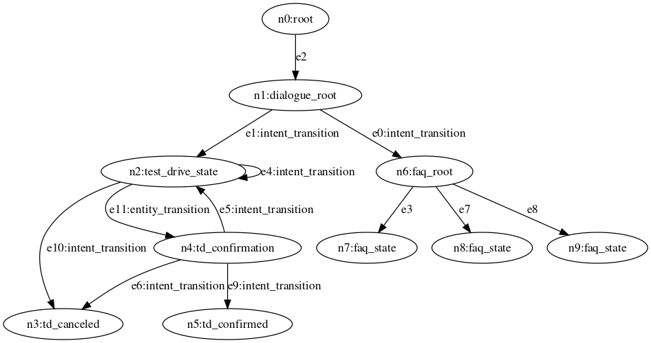

# Unify the Dialogue and FAQ Systems
So far, we have built two separate conversational AI systems, a FAQ system that automatically scales with the available question-answer pairs and a multi-turn action-oriented dialogue system that can handle complex requests.
These two systems serve different use cases and can be combined to a single system to provide a flexible and robust conversational AI experience.
In this section, we are going to unify these two systems into one coherent conversational AI system.

While these two systems rely on different AI models, they share many of the same logic flow.
They both follow the general steps of first analyizing user's question with NLU AI models, make decision on the next conversational state to be and then construct and return a response to the user.
Leveraging this shared pattern, we will first unify the node architecture of the two systems with a single parent node type, `cai_state` (`cai` is short of conversational AI).

```jac
node cai_state {
    has name;
    can init_wlk_ctx {
        new_wlk_ctx = {
            "intent": null,
            "entities": {},
            "prev_state": null,
            "next_state": null,
            "respond": false
        };
        if ("entities" in visitor.wlk_ctx) {
            // Carry over extracted entities from previous interaction
            new_wlk_ctx["entities"] = visitor.wlk_ctx["entities"];
        }
        visitor.wlk_ctx = new_wlk_ctx;
    }
    can nlu {}
    can process {
        if (visitor.wlk_ctx["prev_state"]): visitor.wlk_ctx["respond"] = true;
        else {
            visitor.wlk_ctx["next_state"] = net.root();
            visitor.wlk_ctx["prev_state"] = here;
        }
    }
    can nlg {}
}
```
Note that the logic for `init_wlk_ctx` and the default `process` logic have been hoisted up into `cai_state` as they are shared by the dialogue system and FAQ system.
You can remove these two abilities from `dialogue_state` node, as it will be inheriting them from `cai_state` now.

We then update the definition of `dialogue_state` in `dialogue.jac` to inherit from `cai_state`:
```jac
node dialogue_state:cai_state{
    // Rest of dialogue_state code remain the same
}
```

Before we move on, we will take a quick detour to introduce multi-file jac program and how import works in jac.

## Multi-file Jac Program and Import
Jac's support for multi-file is quite simple.
You can import object definitions from one jac file to another with the `import` keyword.
With `import {*} with "./code.jac"`, everything from `code.jac` will be imported, which can include nodes, edges, graph and walker definition.
Alternaitvely, you can import specific objects with `import {node::state} with "./code.jac"`.

To compile a multi-file Jac program, you will need one jac file that serves as the entry point of the program.
This file need to import all the neccessary components of the program.
Chained importing is supported.

Once you have the main jac file (let's call it `main.jac`), you will need to compile it and its imports into a single `.jir` file.
`jir` here stands for Jac Intermediate Representation.
To compile a jac file, use the `jac build` command
```jac
jaseci > jac build main.jac
```
If the compilation is successful, a `.jir` file with the same name will be generated (in this case, `main.jir`).
`jir` file can be used with `jac run` or `jac dot` the same way as the `jac` source code file.

> **Note**
>
> The `jir` format is what you will use to deploy your jac program to a production jaseci instance.


## Unify FAQ + Dialogue Code
For `faq_state`, we need to now define the `nlu` and `nlg` node abilities for FAQ.
So let's update the following in `faq.jac`


First, `faq_root`
```jac
node faq_root:cai_state {
    can use.qa_classify;
    can nlu {
        if (!visitor.wlk_ctx["prev_state"]) {
            answers = -->.answer;
            best_answer = use.qa_classify(
                text = visitor.question,
                classes = answers
            );
            visitor.wlk_ctx["intent"] = best_answer["match"];
        }
    }
    can process {
        if (visitor.wlk_ctx["prev_state"]): visitor.wlk_ctx["respond"] = true;
        else {
            for n in --> {
                if (n.context["answer"] == visitor.wlk_ctx["intent"]){
                    visitor.wlk_ctx["next_state"] = n;
                    break;
                }
            }
            visitor.wlk_ctx["prev_state"] = here;
        }
    }
    can nlg {
        visitor.response = "I can answer a variety of FAQs related to Tesla. What can I help you with?";
    }
}
```
At this point, if you have been following this journey along, this code should be relatively easy to understand.
Let's quickly break it down.
* For FAQ, the `nlu` logic uses the USE QA model to find the most relevant answer. Here we are re-using the `intent` field in the walker context to save the matched answer. You can also opt to create another field dedicated to FAQ NLU result.
* For the traversal logic, this is very similar to the previous FAQ logic, i.e. find the `faq_state` node connected to here that contains the most relevant answer.
* `for n in -->` iterates through all the nodes connected with an outgoing edge from the current node. You can use `.context` on any node variables to access its variables.

And the logic for the `faq_state` that contains the answer is relatively simple;
```jac
node faq_state:cai_state {
    has question;
    has answer;
    can nlg {
        visitor.response = here.answer;
    }
}
```

With these new nodes created, let's update our graph definition.
We have renamed our graph to be `tesla_ai` and the `dialogue.jac` file to `tesla_ai.jac`.

```jac
graph tesla_ai {
    has anchor dialogue_root;
    spawn {
        dialogue_root = spawn node::dialogue_root;
        test_drive_state = spawn node::test_drive_state;
        td_confirmation = spawn node::td_confirmation;
        td_confirmed = spawn node::td_confirmed;
        td_canceled = spawn node::td_canceled;

        dialogue_root -[intent_transition(intent="test drive")]-> test_drive_state;
        test_drive_state -[intent_transition(intent="cancel")]-> td_canceled;
        test_drive_state -[entity_transition(entities=["name", "address"])]-> td_confirmation;
        test_drive_state -[intent_transition(intent="provide name or address")]-> test_drive_state;
        td_confirmation - [intent_transition(intent="yes")]-> td_confirmed;
        td_confirmation - [intent_transition(intent="no")]-> test_drive_state;
        td_confirmation - [intent_transition(intent="cancel")]-> td_canceled;

        faq_root = spawn graph::faq;
        dialogue_root -[intent_transition(intent="i have a question")]-> faq_root;
    }
}
```
One thing worth pointing out here is that we are spawning a graph inside a graph spawn block.

Our graph should now looks like this!



Here comes the biggest benefit of our unified node architecture -- the exact same walker logic can be shared to traverse both systems.
The only change we need to make is to change from `dialogue_state` to `cai_state` to apply the walker logic to a more generalized set of nodes.
```jac
walker talk {
    ...
    root {
        take --> node::dialogue_root;
    }
    cai_state {
        if (!question) {
            question = std.input("Question (Ctrl-C to exit)> ");
            here::init_wlk_ctx;
        }
        ...
    }
}
```

Update the graph name in the `init` walker as well.
```jac
walker init {
    root {
        spawn here ++> graph::tesla_ai;
        spawn here walker::talk;
    }
}
```

To compile the program,
```jac
jaseci > jac build tesla_ai.jac
```
As mentioned before, if the compiliation succeedd, a `tesla_ai.jir` will be generated.

> **Note**
>
> Run into issues at this build step? First check if all the imports are set up correctly.

Running a `jir` is just like running a `jac` file
```jac
jaseci > jac run tesla_ai.jir
```

One last step, since we introduce a new intent `i have a questions`, we need to update our classifier model again.
This time, use the `clf_train_3.json` example training data.

> **Note**
> Make sure so save your model again so you can return to it in a new seesion!

The model is trained? Great! Now run the jir and try questions like "I have some tesla related questions" then following with FAQ questioins!

Congratulations! You have created a single conversational AI system that is capable of answering FAQs and perform complex multi-step actions.
