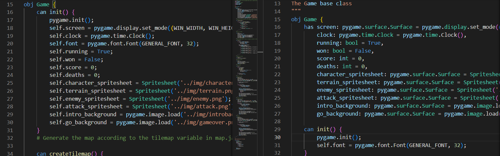

# Converting a python Role Playing Game to ```Jaclang```

This document is to serve as a discription for each RPG implementations which were done iteratively to visualize the changes made when converting to Jaclang.

> An in depth tutorial is available [here](./RPG_DSP_journey.md).

## Pure Python implementation : [python_impl](./python_impl/)

This is a role playing game built using the pygame library in the python language. The game is inspired by a game tutorial available on _YouTube_ available [here](<https://www.youtube.com/playlist?list=PLkkm3wcQHjT7gn81Wn-e78cAyhwBW3FIc>).

## Pylang or Jacthon? : [jac_impl_1](./jac_impl/jac_impl_1/)

This is the first implementation of the python RPG in Jaclang. In this implementation the python code is one-to-one mapped into Jaclang.


Here there are no significant changes are required for the code structure other than the Jaclang syntax.

## Less Py more Jac : [jac_impl_2](./jac_impl/jac_impl_2/)

In this iteration of the jac implementation for the RPG, some of the unique features of Jaclang, such as ```has``` variables, were explored. This feature allows for definitions of fields which will self initialize with an auto generated ```init```. Another change made was that ```init``` functions has been completely removed from the codebase which means only auto generated initialization functions are used using ```has``` variables. However, as there are requirements to run some initialization operations ```postinit``` function is used which will run at the end of the auto generated ```init```. Furthermore, previously dynamically typed variables has been updated with type annotations.



## Jactastic Wonderland : [jac_impl_3](./jac_impl/jac_impl_3/)

This is where we brought out the big guns. Jaclang has a feature where a function definition and its implementation can be coded at two different locations, as long as the .jac files are included on the execution code. This feature allows a cleaner function definition which can make sense without looking at their tedious implementations. Here is a small example of the feature.


## Data-Spatial Programming! : [jac_impl_4](./jac_impl/jac_impl_4/)

This implementation is the BOMB! This is the first ever game written in a data-spatial architecture where each level is a node on a graph while the game itself is a walker, traversing on the graph.


Without making significant changes to the existing codebase in [jac_impl_3](./jac_impl/jac_impl_3/) a new DSP.jac file is introduces which includes the data-spatial architecture and runtime logic.

## LLM Generating Maps! : [jac_impl_5](./jac_impl/jac_impl_5/)

If the previous version was the BOMB this implementation would be an ICBM. This is a replica of [jac_impl_4](./jac_impl/jac_impl_4/) with an addition AI based map generation feature. This simple game is the world's first game having procedurally generated maps using LLMs based on previous gameplays. This specific implementation requires an OpenAI API key to operate which will generate playable maps using 'gpt-4'. But you can use any model that are [available to use with jac-lang](https://www.jac-lang.org//learn/with_llm/).

## Refined Map Generation! : [jac_impl_6](./jac_impl/jac_impl_6/)

The previous implementation introduced the usage of LLMs to generate each level map. How the LLM implementation is somewhat trivial, and straightforward, which will not be the case of a robust map generator. This is a replica of [jac_impl_5](./jac_impl/jac_impl_5/) with a reimagined version of the map generation feature. In this case we are not generating the entire map, but generated map configurations which allows a symbolic function to generate the map. This new approach is an object-oriented approach which is less prone to generate unplayable maps. Additionally, this version does not utilize any assistance with semstrings, which are optional in mtllm.
